# Python


## 环境配置

虚拟环境：

```shell
# 创建虚拟环境
python3 -m venv venv
# 激活虚拟环境
source venv/bin/activate
```

**说明：**通过虚拟的运行环境，可以保证每个python项目都在一个相对独立隔离的运行环境中运行，项目之间互不影响。


## 数据类型

**常见的基础数据类型**

`int` 

`float` 

`str` 

`bool` 

`NoneType`

说明：通过`type()`可以获取数据的类型


## **字符串格式化**

通过%占位符的形式完成字符串和变量的快速拼接

```python
name = "Watson"
age = 18
print("大家好，我是 %s，我今年 %s" % (name,age))
```

也可以通过f的形式来完成快速格式化

```python
print(f"大家好，我是{name}, 我今年{age}")
```


## for循环

for-in语法

```python
num = [1,2,3,4,5,6]
for s in num:
    print(s)
```


for-range语法

```python
# 用法1: range(end) -> 从0开始获取，直到end前
for s in range(100):	# 打印0-99	
	print(s)
    
# 用法2: range(start,end) 左开右闭
for s in range(0,100)   # 打印0-99
	print(s)

# 用法3: range(start,end,step)
for s in range(0,100,2)
	print(s)
```


## 数据容器

### list

有序容器，索引访问，元素可重复，可以修改

```python
list1 = [1,2,3,4,5]
```


**列表的常见方法：**

| 方法        | 作用                                                   | 样例               |
| ----------- | ------------------------------------------------------ | ------------------ |
| `append()`  | 在列表的尾部追加元素                                   | `s.append(10086)`  |
| `insert()`  | 在指定索引前，插入该元素                               | `s.insert(0,92)`   |
| `remove()`  | 移除列表中第一个匹配到的值                             | `s.remove(75)`     |
| `pop()`     | 删除列表中指定索引位置的元素(如未指定，默认删最后一个) | `s.pop(2)/s.pop()` |
| `sort()`    | 对列表进行排序(列表元素的数据类型一致，才可以进行排序) | `s.sort()`         |
| `reserve()` | 反转列表元素                                           | `s.reverse()`      |


### str

有序容器，索引访问，不可修改

```python
s = "hello-python"
```


**字符串的常用方法：**

| 方法              | 作用                                       | 样例                     |
| ----------------- | ------------------------------------------ | ------------------------ |
| `find()`          | 查找子串第一次出现的索引位置，找不到返回-1 | `s.find('Python')`       |
| `count()`         | 统计子串出现的次数                         | `s.count('H')`           |
| `upper()/lower()` | 切换大小写                                 | `s.upper()/s.lower()`    |
| `split()`         | 按照指定分隔符分割成列表                   | `s.split(' ')`           |
| `strip()`         | 去除字符串两端的空白字符/指定字符          | `s.strip()/s.strip('*')` |
| `replace()`       | 将字符串中的指定子串替换为新的子串         | `s.replace('H','C')`     |
| `startswith()`    | 检查字符串是否以指定子串开头，返回布尔值   | `s.startswith('P')`      |


### tuple

有序容器，索引访问，元素可重复，不可修改(元组一旦定义完成，不可修改)

```python
t1 = (1,2,3,4,5,6,7)
t2 = (1,)	# 单元素的元组后面要加逗号
#定义空元组
t2 = ()	
t3 = tuple()
```


**元组的查询方法：**

| 方法    | 作用                                 | 样例          |
| ------- | ------------------------------------ | ------------- |
| count() | 统计指定元素的数量                   | `t1.count(7)` |
| index() | 获取指定元素的索引，如果不存在将报错 | `t1.index(7)` |


**组包和解包**

组包(Packing)：将多个值合并到一个容器(列表，元组)中

```python
# 定义元组，组包
t1 = (5,7,9,1)
t2 = 5,7,9,1
```

解包(Unpacking)：将容器(元组，列表)解开成独立的元素，分别赋值给多个变量

```python
# 基础解包
a,b,c,d = t1

# 扩展解包
x, *y, z = t2 # x为5，y为[7,9]，z为1
```


### set

无序容器，不可重复，可修改

```python
s1 = {1,2,3,4,5}

# 定义空集合
s2 = set() 
```


**集合的常见方法：**

| 方法             | 作用                       | 样例                  |
| ---------------- | -------------------------- | --------------------- |
| `add(..)`        | 添加元素                   | `s1.add('t')`         |
| `remove(..)`     | 移除指定元素(不存在将报错) | `s1.remove('t')`      |
| `pop()`          | 随机删除元素并返回         | `e = s1.pop()`        |
| `clear()`        | 清空集合                   | `s1.clear()`          |
| `difference`     | 差集                       | `s1.defference(s2)`   |
| `union()`        | 并集                       | `s1.union(s2)`        |
| `intersection()` | 交集                       | `s1.intersection(s2)` |


**为什么要用集合？**

**场景：**在业务中，需要定义一个变量，来批量存储用户的手机号(唯一的)？

list和tuple可以吗？不能，因为它们是可以存储重复元素的。

这时候使用set，set会自动去重，存储不重复的元素。


### dict

字典容器存储的是键值对类型的数据，key不能重复，可修改

key必须得是不可变类型(str, int, float, tuple)，不能是list, set, dict

```python
dict1 = {"watson":100,"yummi":99}

# 定义空字典
dict2 = {}
dict2 = dict()

# 根据key获取value
score = dict1["watson"]
```


**字典的增删改查操作：**

| 方法                | 作用                                  | 样例                          |
| ------------------- | ------------------------------------- | ----------------------------- |
| `pop(key)`          | 删除指定的key，并返回该key对应的value | `score = dict1.pop("watson")` |
| `del 字典名称[key]` | 删除字典中指定的键值对                | `del dict1["watson"]`         |
| `keys()`            | 获取所有的key                         | `dict1.keys()`                |
| `values()`          | 获取所有的value                       | `dict1.values()`              |
| `items()`           | 获取所有的键值对                      | `dict1.items()`               |


## 函数

**定义与调用：**

```python
def circle_area(r):
    area = 3.14 * r ** 2
    return area

# 调用
area = circle_area(5)
```


**函数说明文档：**

```python
# 定义一个函数，根据半径，计算圆的周长，面积
def circle_area_len(r):
    """
    该函数用于根据圆的半径，计算面积和周长
    :param r: 圆的半径
    :return: 圆的面积 , 圆的周长
    """
    return 3.14*r*r, 2*r*3.14
```


**global关键字**

global关键字用于明确告诉python解释器，在函数中要使用全局变量，使得可以再函数内部修改全局变量的值。

```python
num1 = 1
def fun1():
    global num1 
    num1 = 100	# 如果这里不声明global，则这行代码会被认为创建了一个叫num1的局部变量
    print(num1)

fun1()		# 100
print(num1) # 100
```


**不定长参数**

不定长参数分为位置类型和关键字类型

```python
def calc_data(*args, **kwargs):
    min_data = min(args) 			# 取最小值
    max_data = max(args) 			# 取最大值
    avg_data = sum(args)/len(args)	# 取平均值
	
    if kwargs.get('round') is not None:
        avg_data = round(avg_data, kwargs.get('round'))

    if kwargs.get('print'):
        print(f"min:{min_data}, max:{max_data}")
    
    return min_data, max_data, avg_data

# 调用函数
calc_data(1,2,3,4,5,6,7,8,round=3,print=True)
```


**函数作为参数**

```python
def add(x,y):
    return x + y

def subtract(x,y):
    return x - y

def calc(x,y,oper):
    return oper(x,y)

result = calc(10,20,add)	# add作为函数参数传入
print(result)
```


**匿名函数(lambda表达式)**

匿名函数指的是没有名称的函数，需要lambda表达式来声明函数，可以简化简单函数的编写(单行表达式)。

语法：`lambda 参数列表 : 函数体`

```python
# 需求：完成如下列表的排序操作，按照每个元素的字符个数，从小到大排序
data_list = ["C++", "C", "Python", "Jack", "PHP", "Java", "Go", "JavaScript", "Rust"]
print(data_list)

data_list.sort(key=lambda item : len(item))
print(data_list)
```


**递归**

```python
# 计算n的阶乘
def factorial(n):
    if n == 1:
    	return 1
    return n * factorial(n-1)
```


**类型注解**

类型注解是一种语法特性，用于明确标识变量，函数参数和返回值的数据类型，增加可维护性。

```python
# 定义变量
a: int = 695
score: float = 98.5

names: list[str] = ["A","C","E"]
goods: tuple[str,int,int] = ("phone", 5999, 1)

# 参数和返回值注解
def calc(scores: list[int]) -> float:
    return sum(scores) / len(scores)
```


## 模块和包


### 模块

**模块：**单个`.py`文件就是一个模块(module)，里面包含普通变量，函数，类

**功能：**模块里面装的所有东西，都叫成员/功能。

文件名叫什么，模块名就叫什么


**导入模块：**

| 导入形式                    | 代码样例                             | 调用方式        | 调用样例                 |
| --------------------------- | ------------------------------------ | --------------- | ------------------------ |
| `import 模块名`             | `import random, os`                  | `模块名.功能名` | `random.randint(10,100)` |
| `from 模块名 import 功能名` | `from random import randint, choice` | `功能名`        | `randint(10,100)`        |
| `from 模块名 import *`      | `from random import *`               | `功能名`        | `randint(10,100)`        |

如果导入的是模块，调用的时候就要`模块名.功能名`

如果导入的是功能，直接调用`功能名`


### **特殊变量**

`__name__`：Python中的内置变量，表示当前模块的名字

- 直接运行当前模块，`__name__`的值为`"__main__"`
- 当该模块被导入时，`__name__`的值就是模块名


`__name__`有什么用？

可以用作测试函数

```python
# 执行当前文件，则会执行如下代码；如果被当做模块导入，如下代码则不会执行
def some_func():
    print('---')
    
if __name__ == '__main__':
    some_func()
```


### 包

本质就是一  个**文件夹**，该文件夹中可以包含多个python模块，文件夹下还包含了一个`__init__.py`

作用：模块文件较多时，用来管理多个模块(包的本质也是一个模块)


**包的导入方式：**

| 导入形式                         | 调用方式             |
| -------------------------------- | -------------------- |
| `import 包名.模块名`             | `包名.模块名.功能名` |
| `from 包名 import 模块名`        | `模块名.功能名`      |
| `from 包名 import *`             | `模块名.功能名`      |
| `from 包名.模块名 import 功能名` | `功能名`             |
| `from 包名.模块名 import *`      | `功能名`             |


## 异常

语法格式：

```python
try:
    可能出现异常的业务代码1
    可能出现异常的业务代码1
    ...
except [异常类型 as 变量名]:
    出现异常时的预案
finally:
    不管是否出现异常，都会执行的代码
```


样例：

```python
try:
    print("================")
    print(my_name)
    print("================")
except Exception as e:
    print("程序运行报错,错误信息: ", e)
finally:
    print("释放资源~")
```


**异常的传递：**

异常传递就是在函数调用中层层上报的过程，直到有人处理它，或者程序崩溃。


## 面向对象


### **定义类**

```python
class Car:
    # 类属性
    wheel = 4
    tax_rate = 0.1
    
    def __init__(self, c_brand, c_name, c_price):
        self.brand = c_brand
        self.name = c_name
        self.price = c_price
        
    # 实例方法
    def run(self):
        print(f"{self.brand} {self.name} 正在高速行驶")
        
# 创建对象
c1 = Car("BMW","X5",500000)
print(c1.__dict__)	# 会将对象中的所有属性以字典的形式输出
c1.run()
```


### 封装

约定：在属性名/方法名前加双下划线

```python
def __init__(self, c_brand, c_name, c_price, c_owner):
        self.brand = c_brand
        self.name = c_name
        self.price = c_price
        self.__owner = c_owner

# 创建对象
c1 = Car("BMW","X5",500000,"Watson")
```


### 继承


```python
class Car:
    def __init__(self, c_brand, c_name, c_price):
        self.brand = c_brand
        self.name = c_name
        self.price = c_price
        
    def start(self):
        print(f'{self.brand} {self.name} 正在行驶...')
        
    def charge(self):
        print(f'{self.brand} {self.name} 正在补充燃料...')

# 定义子类
class FuelCar(Car):
    # 重写父类方法
    def charge(self):
        print(f'{self.brand} {self.name} 正在加油...')

# 定义子类
class EVCar(Car):
    # 重写父类方法
    def charge(self):
        print(f'{self.brand} {self.name} 正在充电...')

if __name__ == '__main__':
    c1 = FuelCar("BMW", "X5", 500000)
    c1.start()
    c1.charge()
```


### 多态

```python
def handle_charge(car: Car):	# 参数类型声明，指定的是父类型
    car.charge()
```


鸭子类型：python中，关注的是对象的行为(它有什么方法)，而不是对象的类型(他是什么类)。

```python
class Dog:
    def __init__(self,age,name):
        self.age = age
        self.name = name 
        
    def swimming(self):
        print(f'{self.age}岁的{self.name}正在游泳...')
        
class Duck:
    def __init__(self,age,name):
        self.age = age
        self.name = name 
        
    def swimming(self):
        print(f'{self.age}岁的{self.name}正在游泳...')
        
class Pig:
    def __init__(self,age,name):
        self.age = age
        self.name = name 
        
    def swimming(self):
        print(f'{self.age}岁的{self.name}正在游泳...')

def go_swimming(duck):
    duck.swimming()
    
if __name__ == '__main__':
    go_swimming(Dog("旺财",4))
    go_swimming(Duck("唐老鸭",2))
    go_swimming(Pig("佩奇",3))
```


## 多线程与回调函数

我们将函数A作为参数传递给函数B，并在函数B通过该参数调用函数A，从而实现对执行结果的处理，比如下载完成后调用回调函数用于反馈下载结果。

下面使用python来实现多线程下载小说：

```python
import threading	# python线程库
import requests		# HTTP请求库

class Download:
    # 1.download方法接收下载的url和回调函数callback作为参数，然后输出当前的线程id和下载的url
    def download(self, url, callback):
        print(f'thread : {threading.get_ident()} start downloading: {url}')
        
        # 2.接着调用requests请求数据，
        response = requests.get(url)	# 阻塞IO
        response.encoding = 'utf-8'
        
        # 3.最后将url和数据文本通过回调函数传递出去
        callback(url, response.text)

    # 1.start_doanload方法同样接收下载的url和回调函数callback作为参数
    def start_download(self, url, callback):
        # 2.然后在函数里新建一个线程thread来运行目标函数download，并将url和callback作为参数传递
        thread = threading.Thread(target=self.download, args=(url, callback))
        # 3.启动线程
        thread.start()

# 定义一个回调函数，用于处理/展示下载完成的数据        
def download_finish_callback(url, result):
    print(f'{url}download completed, total:{len(result)} words, content: {result[:5]}...')

def main():
    d = Download()	# 实例化对象
    # 分别调用下载小说，并将download_finish_callback作为回调函数使用
    d.start_download('http://localhost:8000/novel1.txt', download_finish_callback)
    d.start_download('http://localhost:8000/novel2.txt', download_finish_callback)
    d.start_download('http://localhost:8000/novel3.txt', download_finish_callback)

if __name__ == '__main__':
    main()
```


**思考：**为什么要将`download_finish_callback`回调函数作为参数传进download方法？直接在download方法体里面调用`download_finish_callback`函数不行吗？

答案：为了解耦，重点在于把`下载`和`下载后的处理`分离，谁使用这个模块，谁才决定数据来了以后干什么。

可以把callback理解成：占个位置，下载器说：我下载完后会通知你，后续怎么处理我不管了。


# C++


## 自动类型推导

自动类型推导体现在代码中就是`auto`关键字

```cpp
#include <iostream>

int main(){
    auto x = 1;
    auto y = 3.14;
    auto z = 'a';
    
    std::cout << x << std::endl;
    std::cout << y << std::endl;
    std::cout << z << std::endl;
}
```


## 智能指针


### `shared_ptr`(共享指针)

通过共享指针，如果我们在同一个程序中将某个资源使用智能指针进行管理，那么该数据无论在多少个函数内进行传递，都不会发生资源的复制，运行效率会大大提高。

当所有的程序使用完毕后，还会自动回收，不会造成内存泄漏。

```cpp
#include <iostream>
#include <memory>

int main(){
    auto p1 = std::make_shared<std::string>("this is a str.");
    std::cout << "p1's reference count = " << p1.use_count() << ", points to addr: " << p1.get() << std::endl;  // count = 1, addr = 0x60cb0eab42c0

    auto p2 = p1;
    std::cout << "p2's reference count = " << p2.use_count() << ", points to addr: " << p2.get() << std::endl;  // count = 2, addr = 0x60cb0eab42c0

    p1.reset();
    std::cout << "p1's reference count = " << p1.use_count() << ", points to addr: " << p1.get() << std::endl;  // count = 0, addr : 0
}
```


## Lambda表达式

Lambda表达式是C++11引入的一种匿名函数，没有名字，但是也可以像正常函数一样调用。

Lambda表达式有自己的语法，格式如下：

`[capture_list] (parameters) -> return_type {function_body}`

capture_list表示捕获列表，可以用于捕获外部变量

parameters表示参数列表


```cpp
#include <iostream>
#include <algorithm>

int main(){
    // 定义了两个数相加的函数，捕获列表为空，a b 为参数，返回值类型是int，函数体是return a+b
    auto add = [](int a, int b) -> int { return a + b; };	
    
    // 接着调用add计算了2+5并存储在sum中
    int sum = add(2,5);
    
    // 此时又定义了一个函数print_sum,并且把上面计算的sum放进了捕获列表里
    auto print_sum = [sum]()-> void {std::cout << "3 + 5 = " << sum << std::endl; };
    print_sum();
}
```


## `std::function`

函数包装器是C++11引入的一种通用函数包装器，它可以存储任意可调用对象(函数，函数指针，lambda表达式等)，并提供统一的调用接口。


## 多线程与回调函数


```cpp
#include <iostream>
#include <thread>
#include <chrono>
#include <functional>
#include <cpp-httplib/httplib.h>

class Download{
public:
    void download(const std::string &host, 
                  const std::string &path,
                  const std::function<void(const std::string &, const std::string &)> &callback
                 )
    {
        std::cout << "线程ID: " << std::this_thread::get_id() << std::endl;
        httplib::Client client(host);
        auto response = client.Get(path);
        if(response && response->status == 200)
        	callback(path, response->body);
    }
    
    void start_download(const std::string &host, 
                        const std::string &path,
                       	const std::function<void(const std::string &, const std::string &)> &callback)
    {
        auto download_fun = std::bind(&Download::download,
                                      this,
                                      std::placeholders::_1,
                                      std::placeholders::_2,
                                      std::placeholders::_3);
        std::thread download_thread(download_fun, host, path, callback);
        download_thread.detach();	// 将线程与当前进程分离，使得线程可以在后台运行
    }
};

int main()
{
	Download download;
    auto download_finish_callback = [](const std::string &path, const std::string &result) -> void
    {
        std::cout << "下载完成:" << path << " 共: " << result.length() << "字， 内容为:" << result.substr(0,16) << std::endl;
    };
    
    download.start_download("http://localhost:8000", "/novel1.txt", download_finish_callback)
    download.start_download("http://localhost:8000", "/novel2.txt", download_finish_callback)
    download.start_download("http://localhost:8000", "/novel3.txt", download_finish_callback)
    
    std::this_thread::sleep_for(std::chrono::miliseconds(1000 * 10));
}
```


## 面向对象


### 类


# ROS2


## 安装Ubuntu24.04

安装好ubuntu系统后，还需要安装一些常用工具：

1.更新镜像源：

```shell
sudo apt update
sudo apt upgrade
```

2.安装软件开发基础工具包：

```shell
sudo apt install build-essential dkms linux-headers-$(uname -r)
```


## 安装ROS2 Jazzy

跟着官方文档教程，从System setup开始，依次执行，直到Setup environment后结束。https://docs.ros.org/en/jazzy/Installation/Ubuntu-Install-Debs.html


**常见问题**：curl: (7) Failed to connect to github.com port 443，网络无法直接访问 GitHub

不需要从 GitHub 下载，直接使用清华源配置 ROS 2：

```shell
# 1. 添加 ROS 2 清华源的 GPG 密钥
sudo curl -sSL https://mirrors.tuna.tsinghua.edu.cn/rosdistro/ros.key -o /usr/share/keyrings/ros-archive-keyring.gpg

# 2. 添加 ROS 2 清华源（Ubuntu 24.04 Noble 对应 ROS 2 Jazzy）
echo "deb [arch=$(dpkg --print-architecture) signed-by=/usr/share/keyrings/ros-archive-keyring.gpg] https://mirrors.tuna.tsinghua.edu.cn/ros2/ubuntu $(lsb_release -cs) main" | sudo tee /etc/apt/sources.list.d/ros2.list > /dev/null

# 3. 重新下载ros2开发工具
sudo apt update && sudo apt install ros-dev-tools
```


## 启动Jupyterlab

在学习`Raspbot`控制小车硬件的时候，可以配合`Jupyterlab`编写`Python`代码测试。


标准启动流程：

```shell
# 1. 进入存放虚拟环境的目录
cd ~/my_robot_env

# 2. 激活虚拟环境 (你会看到命令行开头多了个 (venv))
source venv/bin/activate

# 3. 启动 JupyterLab (允许远程访问)
jupyter lab --ip=0.0.0.0

# 4.打开电脑浏览器，输入下方地址
http://192.168.0.104:8888/lab
```


## 编写第一个节点


### Python版本

python源代码：

```python
# ros2_python_node.py
import rclpy    # ros2 client library
from rclpy.node import Node

def main():
    rclpy.init()
    node = Node("python_node") # create a node instance
    node.get_logger().info('hello python node')
    rclpy.spin(node)

    rclpy.shutdown()


if __name__ == "__main__":
    main()
```


运行程序：

```shell
python3 ros2_python_node.py
```


### C++版本


C++源代码：

```cpp
#include "rclcpp/rclcpp.hpp"

int main(int argc, char **argv)
{
    rclcpp::init(argc,argv);
    auto node = std::make_shared<rclcpp::Node>("cpp_node");
    RCLCPP_INFO(node->get_logger(),"hello cpp node");
    rclcpp::spin(node);
    rclcpp::shutdown();
    return 0;
    
}
```


CMakeLists.txt：

```shell
cmake_minimum_required(VERSION 3.25)
project(ros2_cpp)
add_executable(ros2_cpp_node ros2_cpp_node.cpp)

find_package(rclcpp REQUIRED)
target_include_directories(ros2_cpp_node PUBLIC ${rclcpp_INCLUDE_DIRS})
target_link_libraries(ros2_cpp_node ${rclcpp_LIBRARIES})
```


**查看节点信息**

```shell
ros2 node list				# 查看节点列表及信息
ros2 node info /cpp_node	# 对应cpp文件里创建的节点名称
```


## 创建功能包


### Python版本

打开集成终端，输入代码：

```shell
ros2 pkg create demo_python_pkg --build-type ament_python
```


在`demo_python_pkg`目录下新建`python_node.py`，输入如下代码：

```python
import rclpy
from rclpy.node import Node

def main():
    rclpy.init()
    node = Node("python_node")
    node.get_logger().info('hello python node!')
    rclpy.spin(node)
    rclpy.shutdown()
```

仔细看以上代码会发现只定义了main函数，但并没有调用。

运行main函数的方法：通过setup.py，添加`'python_node=demo_python_pkg.python_node:main'`，到`console_scripts`下，添加的代码及位置如下：

```python
entry_points={
        'console_scripts': [
            'python_node = demo_python_pkg.python_node:main', 
        ],
```

添加这句话的含义是：当执行python_node时就相当于执行`demo_python_pkg`目录下`python_node`文件中的`main`函数。

添加完成后打开`demo_python_pkg/package.xml`，添加依赖信息，代码如下：

```xml
<depend>rclpy</depend>
```


接下来，就可以在功能包的上层目录使用`colcon build`命令构建功能包了，这个命令可以构建当前及子目录下的所有功能包。

构建完成后，你会发现在功能包同级目录下会多出`build`， `install`和`log`三个文件夹。

**build/** 里面是构建过程中产生的中间文件。

**install/** 是放置构建结果的文件夹。

**log/** 里面是构建过程中的各种日志信息。


构建完成后如何运行？

```shell
ros2 run demo_python_pkg python_node
---
Package 'demo_python_pkg' not found
```

运行时会提示找不到包，因为ros2 run命令会通过`AMENT_PREFIX_PATH`环境变量的值来查找功能包，该值默认是ros2系统的安装目录，demo_python_pkg的安装目录是在install下，我们需要修改`AMENT_PREFIX_PATH`来帮助ros2找到该功能包。在install目录下有个`setup.bash`的脚本，直接运行该脚本就可以自动修改`AMENT_PREFIX_PATH`环境变量：

```shell
source install/setup.bash
# 再次运行
ros2 run demo_python_pkg python_node
```


### C++版本

创建包：

```shell
ros2 pkg create demo_cpp_pkg --build-type ament_cmake
```


在src目录下添加`node_cpp.cpp`文件：

```cpp
#include "rclcpp/rclcpp.hpp"

int main(int argc, char **argv)
{
    rclcpp::init(argc,argv);
    auto node = std::make_shared<rclcpp::Node>("cpp_node");
    RCLCPP_INFO(node->get_logger(),"hello cpp node");
    rclcpp::spin(node);
    rclcpp::shutdown();
    return 0;
    
}
```


编辑`CMakeLists.txt`文件,在`find_pakackage(ament_cmake REQUIRED)`后面添加：

```cmake
# 1.find rclcpp headers and libs
find_package(rclcpp REQUIRED)
# 2.add executable cpp_node
add_executable(cpp_node src/cpp_node.cpp)
# 3.add dependencies for cpp_node
ament_target_dependencies(cpp_node rclcpp)
# 4. copy cpp_node to install repo
install(TARGETS
cpp_node
DESTINATION lib/${PROJECT_NAME}
)
```


编辑`packages.xml`添加依赖声明：

```xml
<depend>rclcpp</depend>
```


运行该文件：

```shell
source install/setup.bash
ros2 run demo_cpp_pkg cpp_node
```


## 多功能包最佳实践-Workspace

进入chapt2目录，输入以下命令：

```shell
mkdir -p chapt2_ws/src
```

开发过程中，我们会将所有的功能包放到`src`目录下，并在`src`同级目录运行`colcon`进行构建，此时构建出来的`build，install，log`等目录则和`src`同级。


如果只想构建某个功能包，只需要使用`--packages-select`命令加上功能包名：

```shell
colcon build --packages-select demo_cpp_pkg
```


如果构建某个包依赖另一个包(比如python的包依赖`cpp`的包)，只需要在功能包的清单文件中声明依赖关系即可，打开`demo_python_pkg/package.xml`，添加依赖：

```xml
<depend>rclpy</depend>
<depend>demo_cpp_pkg</depend>
```


## 订阅与发布


### ros2常用相关命令

```shell
# 打开海龟模拟器
ros2 run turtlesim turtlesim_node
---
/turtlesim
  Subscribers:
    /parameter_events: rcl_interfaces/msg/ParameterEvent
    /turtle1/cmd_vel: geometry_msgs/msg/Twist
  Publishers:
    /parameter_events: rcl_interfaces/msg/ParameterEvent
    /rosout: rcl_interfaces/msg/Log
    /turtle1/color_sensor: turtlesim/msg/Color
    /turtle1/pose: turtlesim/msg/Pose


# 使用命令行查看节点信息
ros2 node info /turtlesim

# 输出海龟当前的位姿
ros2 topic echo /turtle1/pose

# 查看某个话题的具体信息
ros2 topic info /turtle1/cmd_vel _vel -v

# 查看消息接口的详细定义
ros2 interface show geometry_msgs/msg/Twist

# 使用命令行发布线速度
ros2 topic pub /turtle1/cmd_vel geometry_msgs/msg/Twist "{linear: {x: 1.0}}"

# 使用命令行发布角速度
ros2 topic pub /turtle1/cmd_vel geometry_msgs/msg/Twist "{angular: {z: 1.0}}"
```


### **C++发布主题**

1.创建demo_cpp_topic功能包并添加依赖

```shell
# ros2 创建包-demo_cpp_topic 包类型-cpp 依赖-rclcpp(ros2核心),geometry_msgs(消息类型包),turtlesim(功能包-小乌龟模拟)
ros2 pkg create demo_cpp_topic --build-type ament_cmake --dependencies rclcpp geometry_msgs turtlesim
```


2.添加cpp代码：

```cpp
// src/demo_cpp_topic/src/turtle_circle.cpp

#include "rclcpp/rclcpp.hpp"
#include "geometry_msgs/msg/twist.hpp"
#include <chrono>

using namespace std::chrono_literals;

class TurtleCircle : public rclcpp::Node{
public:
    // 只有当构造函数只有 1 个参数时，建议写 explicit
    explicit TurtleCircle(const std::string &node_name) : Node(node_name){
        // 创建发布主题，geometry_msgs::msg::Twist - 话题的接口类型， 10 - 历史队列长度
        publisher_ = this->create_publisher<geometry_msgs::msg::Twist>("/turtle1/cmd_vel",10);
        // 初始化定时器
        timer_ = this->create_wall_timer(1000ms, std::bind(&TurtleCircle::timer_callback, this));
    }

private:
    void timer_callback(){
        auto msg = geometry_msgs::msg::Twist();		// 创建geometry_msgs::msg::Twist类型的消息对象
        msg.linear.x = 1.0;
        msg.angular.z = 0.5;
        publisher_->publish(msg);					// 发布主题
    }

private:
    rclcpp::TimerBase::SharedPtr timer_;                                // timer smart pointer
    rclcpp::Publisher<geometry_msgs::msg::Twist>::SharedPtr publisher_; // publisher smart pointer
};

int main(int argc, char **argv){
    rclcpp::init(argc,argv);
    auto node = std::make_shared<TurtleCircle>("turtle_square");
    rclcpp::spin(node);
    rclcpp::shutdown();
    return 0;
}
```


3.配置cmake添加节点，添加依赖

在`ament_package()`前面添加：

```cmake
add_executable(turtle_circle src/turtle_circle.cpp)
ament_target_dependencies(turtle_circle rclcpp geometry_msgs)

install(TARGETS
        turtle_circle
        DESTINATION lib/${PROJECT_NAME}
)
```


4.构建与运行

```shell
# 在src目录上一层构建节点
colcon build

# 添加环境变量
source install/setup.bash

# 运行节点 ros2 run 包名 节点名
ros2 run demo_cpp_topic turtle_circle
```


 


### C++订阅主题


**订阅Pose实现闭环控制**  

通过发布速度控制命令到话题便可以控制海龟移动，

通过订阅实时位置主题可以获取海龟的实时位置。

实时速度和实时位置都有了，就可以闭环控制海龟移动到指定位置。

所谓闭环控制就是指通过对输出进行测量和反馈来调节系统的输入，使系统的输出更加接近期望值。


我们将通过不断检测海龟当前位置和目标位置之间的误差，来实时调整发布的指令，最终使海龟到达指定目标点。

```cpp
// src/demo_cpp_topic/src/turtle_control.cpp
#include "geometry_msgs/msg/twist.hpp"
#include "rclcpp/rclcpp.hpp"
#include "turtlesim/msg/pose.hpp"

class TurtleController : public rclcpp::Node{
public:
    TurtleController() : Node("turtle_controller"){
        velocity_publisher_ = this->create_publisher<geometry_msgs::msg::Twist>("/turtle1/cmd_vel",10);
        pose_subscription_ = this->create_subscription<turtlesim::msg::Pose>("/turtle1/pose",10,
            std::bind(&TurtleController::on_pose_received_, this, std::placeholders::_1));
    }

private: 
    void on_pose_received_(const turtlesim::msg::Pose::SharedPtr pose){
        auto message = geometry_msgs::msg::Twist();
        // 1. 获取海龟的位置
        double current_x = pose->x;
        double current_y = pose->y;
        RCLCPP_INFO(this->get_logger(), " current pos:(x=%f,y=%f)",current_x,current_y);

        // 2. 通过欧式距离公式求出当前位置和目标位置之间的距离和角度
        double distance = std::sqrt((target_x_ - current_x) * (target_x_ - current_x) + (target_y_ - current_y) * (target_y_ - current_y));
        double angle = std::atan2(target_y_ - current_y, target_x_ - current_x) - pose->theta;

        // 3. 控制策略：距离大于0.1继续运动，觉督查大于0.2则原地旋转，否则直行
        if(distance > 0.1){
            if(fabs(angle) > 0.2){
                message.angular.z = fabs(angle);
            }else{
                // 
                message.linear.x = k_ * distance;
            }
        }

        // 4. 限制最大速度并发布消息
        if(message.linear.x > max_speed_) message.linear.x = max_speed_;

        velocity_publisher_->publish(message);
    }

private:
    rclcpp::Subscription<turtlesim::msg::Pose>::SharedPtr pose_subscription_;
    rclcpp::Publisher<geometry_msgs::msg::Twist>::SharedPtr velocity_publisher_;
    double target_x_{1.0};
    double target_y_{1.0};
    double k_{1.0};
    double max_speed_{3.0};
};

int main(int argc, char **argv){
    rclcpp::init(argc,argv);
    auto node = std::make_shared<TurtleController>();
    rclcpp::spin(node);
    rclcpp::shutdown();
    return 0;
}
```


配置cmake

```cmake
add_executable(turtle_control src/turtle_control.cpp)
ament_target_dependencies(turtle_control rclcpp geometry_msgs turtlesim)

install(TARGETS
        turtle_control
        DESTINATION lib/${PROJECT_NAME}
)
```


### 自定义通信接口


**需求：**

1. 通过小公具可以查看系统的实时状态信息，包括记录信息的时间，主机名称，CPU使用率，内存使用率，内存总大小，剩余内存，网络接收数据量，网络发送数据量
2. 简单的界面，将信息展示
3. 能在局域网内其他主机上查看数据


**方案：**

1. 写一个节点，用来获取信息，并通过话题发布出来
2. 写一个显示节点，订阅这个话题并进行显示


**实现：**

第一步：创建接口功能包

```shell
ros2 pkg create status_interfaces --build-type ament_cmake --dependencies rosidl_default_generators builtin_interfaces
```

`builtin_interfaces`是ros2中已有的一个消息接口功能包

`rosidl_default_generators` 用于将自定义的消息文件转换为C++, Python源码的模块


ROS2中，话题消息定义文件需要放置到功能包的msg目录下，文件名必须大写字母开头。

接下来，在功能包下新建`msg/`目录，在该目录下创建文件`SystemStatus.msg`，在文件中编写以下内容：

```python
builtin_interfaces/Time stamp 	# 记录时间戳
string host_name 				# 系统名称
float32 cpu_percent				# CPU使用率
float32 memory_percent			# 内存使用率
float32 memory_total 			# 内存总量
float32 memory_available		# 剩余有效内存
float64 net_sent				# 网络发送数据总量
float64 net_recv				# 网络接收数据总量
```

定义好数据接口文件后，需要在`CMakeLists.txt`中对该文件进行注册，声明其为消息接口文件，并为其添加`builtin_interfaces`依赖，内容如下所示：

```cmake
rosidl_generate_interfaces(${PROJECT_NAME}
    "msg/SystemStatus.msg"
    DEPENDENCIES builtin_interfaces
)

ament_package()
```

在`package.xml`中声明该功能包是一个消息接口功能包，方便ROS2对其做额外处理：

```xml
<member_of_group>rosidl_interface_packages</member_of_group>

<buildtool_depend>ament_cmake</buildtool_depend>
```


完成后查看消息接口是否构建成功：

```shell
# 回到workspace目录
colcon build
source install/setup.bash
ros2 interface show status_interfaces/msg/SystemStatus
```


第二步：创建`status_publsiher`功能包

```shell
# 回到src目录
ros2 pkg create status_publisher --build-type ament_python --dependencies rclpy status_interfaces
```

编写python代码：

```python
# 在status_publisher/status_publisher目录下创建sys_status_pub.py
import rclpy 
from rclpy.node import Node
from status_interfaces.msg import SystemStatus
import psutil
import platform

class SystemStatusPub(Node):
    def __init__(self,node_name):
        super().__init__(node_name)
        self.status_publisher_ = self.create_publisher(SystemStatus, 'sys_status', 10)
        self.timer = self.create_timer(1, self.timer_callback)

    def timer_callback(self):
        cpu_percent = psutil.cpu_percent()
        memory_info = psutil.virtual_memory()
        net_io_counters = psutil.net_io_counters()

        msg = SystemStatus()
        msg.stamp = self.get_clock().now().to_msg()
        msg.host_name = platform.node()
        msg.cpu_percent = cpu_percent
        msg.memory_percent = memory_info.percent
        msg.memory_total = memory_info.total / 1024 / 1024
        msg.memory_available = memory_info.available / 1024 / 1024
        msg.net_sent = net_io_counters.bytes_sent / 1024 / 1024
        msg.net_recv = net_io_counters.bytes_recv / 1024 / 1024

        self.get_logger().info(f'publish:{str(msg)}')
        self.status_publisher_.publish(msg)


def main():
    rclpy.init()
    node = SystemStatusPub('sys_status_pub')
    rclpy.spin(node)
    rclpy.shutdown()
```

构建，运行，并查看话题数据：

```shell
colcon build
ros2 run status_publisher sys_status_pub
ros2 topic echo /sys_status
```


第三步，创建qt界面展示

```shell
ros2 pkg create status_display --build-type ament_cmake --dependencies rclcpp status_interfaces 
```

新建sys_status_display.cpp

```cpp
#include <QApplication>
#include <QLabel>
#include <QString>
#include "rclcpp/rclcpp.hpp"
#include "status_interfaces/msg/system_status.hpp"
using SystemStatus = status_interfaces::msg::SystemStatus;

class SysStatusDisplay : public rclcpp::Node{
public:
    SysStatusDisplay() : Node("sys_status_display"){
        subscription_ = this->create_subscription<SystemStatus>("sys_status", 10, [&](const SystemStatus::SharedPtr msg) -> void {
            label_->setText(get_qstr_from_msg(msg));
        });
    
    // create an empty SystemStatus object, 
    label_ = new QLabel(get_qstr_from_msg(std::make_shared<SystemStatus>()));
    label_->show();
    }

    QString get_qstr_from_msg(const SystemStatus::SharedPtr msg){
        std::stringstream show_str;
        show_str
            << "==========系统状态可视化工具==========\n"
            << "数据时间:\t" << msg->stamp.sec << "\ts\n"
            << "主机名称:\t" << msg->host_name << "\t\n"
            << "CPU使用率:\t" << msg->cpu_percent << "\t%\n"
            << "内存使用率:\t" << msg->memory_percent << "\t%\n"
            << "内存总大小:\t" << msg->memory_total << "\tMB\n"
            << "剩余有效内存:\t" << msg->memory_available << "\tMB\n"
            << "网络发送量:\t" << msg->net_sent << "\tMB\n"
            << "网络接收量:\t" << msg->net_recv << "\tMB\n"
            << "===================================";
        return QString::fromStdString(show_str.str());
    }

private:
    rclcpp::Subscription<SystemStatus>::SharedPtr subscription_;
    QLabel* label_;
};

int main(int argc, char **argv){
    rclcpp::init(argc,argv);
    QApplication app(argc,argv);
    auto node = std::make_shared<SysStatusDisplay>();
    std::thread spin_thread([&]()-> void{rclcpp::spin(node);});
    spin_thread.detach();
    app.exec();
    rclcpp::shutdown();
    return 0;
}
```


配置cmake

```cmake
...
find_package(Qt5 REQUIRED COMPONENTS Widgets)

add_executable(sys_status_display src/sys_status_display.cpp)
target_link_libraries(sys_status_display Qt5::Widgets)
ament_target_dependencies(sys_status_display rclcpp status_interfaces)

install(TARGETS sys_status_display
    DESTINATION lib/${PROJECT_NAME}
)
...
```


构建并运行

```shell
colcon build 
source install/setup.bash
ros2 run status_display sys_status_display
```


# 机器人系统岗技术栈


## 第一阶段：C++核心


### 第1天：STL容器实战

**目标：用熟vector/map/unordered_map，知道什么场景选哪个**


#### std::vector

```cpp
#include <iostream>
#include <vector>

int main() {
    // 创建和初始化
    std::vector<int> v1;
    std::vector<int> v2(5,0);
    std::vector<int> v3 = {1,2,3,4,5};

    // 添加元素
    v1.push_back(10);           // 尾部添加，可能触发扩容
    v2.emplace_back(20);          // 直接构造，比push_back高效

    // 预分配（重要！避免反复扩容）
    v1.reserve(100);            // 预留100个空间，size不变
    v1.resize(10);        // 改变size，新元素默认初始化

    // 访问
    std::cout << v1[0] << std::endl;        // 下标访问，不检查越界
    std::cout << v1.at(0) << std::endl;   // 检查越界，越界抛异常
    v1.front();                             // 第一个
    v1.back();                              // 最后一个

    // 大小
    std::cout << v1.size() << std::endl;        // 大小
    std::cout << v1.capacity() << std::endl;    // 容量
    std::cout << v1.empty() << std::endl;       // 检查为空

    // 删除
    v1.pop_back();                              // 删除最后一个
    v1.clear();                                 // 清空

    // 遍历
    for (const auto &i : v3) {
        std::cout << i << std::endl;
    }
    
    return 0;
}

```


**reserve vs resize的区别**

```cpp
std::vector<int> v;
v.reserve(10);	// capacity=10, size=10, 没有元素
v.resize(10);	// capacity=10, size=10, 有10个默认元素
```


#### map 和 unordered_map

```cpp
#include <iostream>
#include <map>
#include <unordered_map>

int main() {
    // map：有序，底层红黑树，查找O(logN)
    std::map<std::string, int> ordered;
    ordered["device_003"] = 1;
    ordered["device_002"] = 2;
    ordered["device_001"] = 3;
    // 遍历是按照key字母序的 001 002 003

    //unordered_map：无序，底层哈希表，查找O(1)
    std::unordered_map<std::string, int> unordered;
    unordered["device_003"] = 1;
    unordered["device_002"] = 2;
    unordered["device_001"] = 3;
    // 遍历顺序不确定

    // 两者操作API基本一致
    std::cout << unordered.count("device_001") << std::endl;    // 存在返回1，不存在返回0
    unordered.count("device_002");                              // 返回迭代器
    unordered.erase("device_003");                              // 删除

    // 安全访问
    auto it = unordered.find("device_002");
    if (it != unordered.end()) {
        std::cout << it->second << std::endl;
    }

    // 不要用[]访问不存在的key，会自动插入默认值
    std::cout << unordered["device_004"] << std::endl;  // ← 这会插入一个0，是bug
    
    return 0;
}
```


#### 迭代器

```cpp
// 三种遍历方法，都需要掌握
std::vector<int> v = {1,2,3,4,5};

// 方式1：范围for(最简洁)
for (const auto& i : v) {}

// 方式2：下标(需要用到index的时候)
for (size_t i = 0; i < v.size(); i++) {}

// 方式3：迭代器，需要删除元素的时候必须用这个(这是常见bug来源，记住这个写法)
for (auto it = v.begin(); it!=v.end(); ++it) {
    if (*it == 3) it = v.erase(it);   // erase返回下一个有效迭代器
    else ++it;
}
```


#### 小练习

```cpp
// 设备管理器练习
// 文件名：device_manager.cpp
// 编译：g++ -std=c++17 -Wall device_manager.cpp -o device_manager

#include <iostream>
#include <unordered_map>
#include <map>
#include <vector>
#include <string>
#include <chrono>

// 设备状态
enum class DeviceStatus {
    ONLINE,
    OFFLINE,
    ERROR
};

// 事件日志
struct LogEntry {
    std::string device_id;
    std::string message;
    DeviceStatus status;
};

// 要实现的功能：

// 1. 注册设备（device_id → status）
std::unordered_map<std::string, DeviceStatus> devices;

// 2. 更新设备状态
bool updateDeviceStatus(const std::string& device_id, DeviceStatus status) {
    auto it = devices.find(device_id);
    if (it == devices.end()) {
        std::cerr << "No device with id " << device_id << std::endl;
        return false;
    }

    // devices[device_id] = status;    // 又查一次，浪费
    it->second = status;
    return true;
}


// 3. 查询设备状态
//    返回bool，通过引用参数返回status
bool getDeviceStatus(const std::string& device_id, DeviceStatus& status) {
    auto it = devices.find(device_id);
    if (it == devices.end()) {
        std::cerr << "No device with id " << device_id << std::endl;
        return false;
    }

    status = it->second;
    return true;
}

// 4. 记录日志（timestamp → LogEntry）
//    用map存储（时间戳有序）
//    timestamp用 chrono::steady_clock::now().time_since_epoch().count()
std::map<long long, LogEntry> log;
void write_log(const std::string &device_id, const std::string &message, DeviceStatus status) {
    LogEntry entry;
    entry.device_id = device_id;
    entry.message = message;
    entry.status = status;
    long long timestamp = std::chrono::steady_clock::now().time_since_epoch().count();
    log.emplace(timestamp, entry);
}

// 5. 打印最近N条日志
//    map是有序的，从end()往前数N条
void print_logs(int count) {
    if (log.empty()) {
        std::cerr << "No log entries found" << std::endl;
        return;
    }
    auto it = log.end();
    while (count > 0) {
        --it;     // 先移动，再解引用，这样第一次拿到的就是end()前面一个迭代器，没有bug
        std::cout << it->first << ": " << (int)it->second.status << "\n";
        --count;
    }
}

// 6. 打印所有在线设备
//    遍历unordered_map，筛选ONLINE的
void print_online_devices() {
    for (auto it = devices.begin(); it != devices.end(); ++it) {
        if (it->second == DeviceStatus::ONLINE) {
            std::cout << "ONLINE:" << it->first << std::endl;
        }
    }
}

// main函数测试：
// 注册 device_001 device_002 device_003
// 更新 device_002 状态为 ERROR
// 查询 device_001 状态
// 打印最近2条日志
// 打印所有在线设备

int main() {
    // 注册设备
    devices["device_001"] = DeviceStatus::ONLINE;
    write_log("device_001","设备1",DeviceStatus::ONLINE);
    devices["device_002"] = DeviceStatus::ONLINE;
    write_log("device_002","设备2",DeviceStatus::ONLINE);
    devices["device_003"] = DeviceStatus::ONLINE;
    write_log("device_003","设备2",DeviceStatus::ONLINE);

    // 更新device_002状态
    devices["device_002"] = DeviceStatus::ERROR;

    // 查询device_001状态
    DeviceStatus status001;
    bool flag = getDeviceStatus("device_001", status001);
    std::cout << "device_001的状态为 : " << int(status001) << std::endl;

    print_logs(2);
    print_online_devices();

}
```


### 第2天：类的完整写法

**目标：能独立写一个工程级别的类**


#### **构造函数全家桶**

```cpp
#include <iostream>
#include <string>

class Device {
public:
    // 普通构造函数
    Device(const std::string &id, int port)
        :id_(id), port_(port)               // 初始化列表，比在函数体里赋值高效
    {
        std::cout << "Device构造: " << id << std::endl;
    }

    // 析构函数
    ~Device() {
        std::cout << "Device析构: " << id_ << std::endl;
        if (fd_ >= 0) {
            // close(fd_);  // 真实场景关闭文件描述符
        }
    }

    // 拷贝构造函数
    Device(const Device &other)
        :id_(other.id_), port_(other.port_)
    {
        std::cout << "Device拷贝构造: " << id_ << std::endl;
    }

    // 移动构造
    Device(Device&& other) noexcept
        :id_(std::move(other.id_)), port_(other.port_), fd_(other.fd_)
    {
        other.fd_ = -1; // 把原对象置空
    }

private:
    std::string id_;
    int port_;
    int fd_;
};
```


#### **const成员函数**

```cpp
class Device{
public:
    // const成员函数：承诺不修改成员变量
    // 只读操作都要加const
    std::string getId() const { return id_; }
    int getPort() const { return port_; }
    bool isConnected() const { return fd_ >= 0; }
    
    // 非const成员函数：会修改成员变量
    void setPort(int port){ port_ = port; }
    bool connect(){
        fd_ = 1;	// 模拟连接
        return true;
    }

private:
    std::string id_;
    int port_;
    int fd_ = -1;
};

// 为什么要加const：
// const Device d("001", 8080);
// d.getId();   // ✅ const函数可以被const对象调用
// d.setPort(9090);  // ❌ 编译错误，const对象不能调用非const函数
```


#### **static成员**

```cpp
class Device{
public:
    Device(const std::string& id)
        : id_(id)
    {
        count_++;	// 每创建一个设备，计数+1
    }
    
    ~Device(){
        count_--;	// 析构时计数-1
    }
    
    // static成员函数：不属于某个对象，属于类本身
    // 不能访问非static成员变量
    static int getCount(){ return count_; }
    
private:
    std::string id_;
    // static成员变量：所有对象共享同一份
    // 类内声明，类外定义
    static int count_;
};

// 使用
int main(){
    std::cout << Device::getCount() << "\n";  // 0
    Device d1("001");
    Device d2("002");
    std::cout << Device::getCount() << "\n";  // 2
}
```

`static`成员变量为什么要在类外定义?

类内是**声明**，类外是**定义**，定义才会分配内存。如果在类内定义，每个包含这个头文件的`.cpp`都会分配一份，链接时报重复定义错误。

所以类内只能**声明**，类外在**某一个cpp文件里定义一次**


#### 小练习

```cpp
// 文件名：device_manager2.cpp
// 编译：g++ -std=c++17 -Wall device_manager2.cpp -o device_manager2

#include <iostream>
#include <unordered_map>
#include <map>
#include <string>
#include <chrono>

enum class DeviceStatus { ONLINE, OFFLINE, ERROR };

struct LogEntry {
    std::string device_id;
    std::string message;
    DeviceStatus status;
};

class DeviceManager {
public:
    // 构造函数：初始化管理器名称
    DeviceManager(const std::string& manager_name)
        : name_(manager_name) {
        instance_count_++;
    }

    // 析构函数：打印还有多少设备没注销
    ~DeviceManager() {
        std::cout << devices_.size() << " 个设备未注销" << std::endl;
        instance_count_--;
    }
    // 禁止拷贝（设备管理器不应该被复制）
    DeviceManager(const DeviceManager &) = delete;

    // 1. 注册设备
    //    device_id已存在时返回false
    bool registerDevice(const std::string &device_id) {
        auto it = devices_.find(device_id);
        if (it != devices_.end()) {
            std::cout << "注册失败：设备已注册" << std::endl;
            return false;
        }
        devices_[device_id] = DeviceStatus::ONLINE;
        write_log(device_id, "设备注册", DeviceStatus::ONLINE);  // 加这行
        return true;
    }
    // 2. 注销设备
    //    device_id不存在时返回false
    bool unregisterDevice(const std::string &device_id) {
        auto it = devices_.find(device_id);
        if (it == devices_.end()) {
            std::cout << "注销失败：设备不存在" << std::endl;
            return false;
        }
        devices_.erase(it);
        return true;
    }

    // 3. 更新设备状态
    //    device_id不存在时返回false
    bool updateStatus(const std::string &device_id,DeviceStatus status) {
        auto it = devices_.find(device_id);
        if (it == devices_.end()) {
            std::cout << "更新失败，设备不存在" << std::endl;
            return false;
        }
        it->second = status;
        return true;
    }

    // 4. 查询设备状态
    //    返回bool，通过引用参数返回status
    bool getStatus(const std::string &device_id, DeviceStatus &status) {
        auto it = devices_.find(device_id);
        if (it == devices_.end()) {
            std::cout << "查询失败，设备不存在" << std::endl;
            return false;
        }
        status = it->second;
        return true;
    }


    // 6. 打印最近N条日志
    //    修复昨天的越界bug：count > log_.size()时只打印全部
    void printLogs(int count) {
        if (count > log_.size()) count = log_.size();
        auto it = log_.end();
        while (count) {
            --it;
            std::cout << it->first << ":" << (int)it->second.status << "\n";
            --count;
        }
    }

    // 7. 打印所有在线设备
    void printOnlineDevices() {
        for ( auto device : devices_) {
            if (device.second == DeviceStatus::ONLINE) {
                std::cout << device.first << ":" << (int)device.second << std::endl;
            }
        }
    }
    // 8. static函数：返回总共创建过多少个DeviceManager实例
    static int getInstanceCount() {
        return instance_count_;
    }

private:
    // 5. 记录日志（内部调用，private）
    void write_log(const std::string &device_id, const std::string &message, DeviceStatus status) {
        LogEntry entry;
        entry.device_id = device_id;
        entry.message = message;
        entry.status = status;
        long long timestamp = std::chrono::steady_clock::now().time_since_epoch().count();
        log_.emplace(timestamp, entry);
    }

    std::string name_;
    std::unordered_map<std::string, DeviceStatus> devices_;
    std::map<long long, LogEntry> log_;
    static int instance_count_;
};

int DeviceManager::instance_count_ = 0;

int main() {
    DeviceManager mgr("机器人设备管理器");

    mgr.registerDevice("lidar_01");
    mgr.registerDevice("camera_01");
    mgr.registerDevice("imu_01");

    mgr.updateStatus("camera_01", DeviceStatus::ERROR);
    mgr.updateStatus("imu_01", DeviceStatus::OFFLINE);

    DeviceStatus s;
    if (mgr.getStatus("lidar_01", s)) {
        std::cout << "lidar_01状态: " << int(s) << "\n";
    }

    mgr.printLogs(10);   // 故意传比日志条数多的值，测试边界
    mgr.printOnlineDevices();

    std::cout << "创建了" << DeviceManager::getInstanceCount()
              << "个管理器实例\n";
}
```


### 第3天：智能指针

**目标：彻底搞懂unique_ptr/shared_ptr，知道什么时候用哪个**


**为什么需要智能指针?**

```cpp
// 裸指针的问题
void bad_example() {
    Device* d = new Device("lidar_01");
    
    if (some_error) {
        return;  // ← 忘记delete，内存泄漏
    }
    
    delete d;  // 正常路径才会释放
}

// 智能指针：离开作用域自动释放，不用手动delete
void good_example() {
    auto d = std::make_unique<Device>("lidar_01");
    
    if (some_error) {
        return;  // ← 自动析构，没有泄漏
    }
}  // ← 自动析构
```


#### unique_ptr

**所有权：**在 C++ 里，所有权（Ownership）指的是：谁负责在最后调用 `delete` 来销毁对象、释放内存

**`std::unique_ptr`（独占所有权）：** 它是唯一的领主。它死死盯着这个对象，当它自己生命周期结束（比如出作用域）时，它会自动调用 `delete`。


```cpp
#include <memory>
#include <string>
#include <iostream>

class Device {
public:
    Device(const std::string& device_id)
        :device_id_(device_id){}

    auto getId() const { return device_id_; }
private:
    std::string device_id_;
};

// 工厂函数：返回unique_ptr
std::unique_ptr<Device> createDevice(const std::string& device_id) {
    return std::make_unique<Device>(device_id);
}

int main() {
    // 创建：永远用make_unique，不要用new
    auto d1 = std::make_unique<Device>("lidar001");

    // 不能拷贝，只能移动
    //auto d2 = d1;   // ❌ 编译错误
    auto d2 = std::move(d1);   // ✅ 所有权转移，d1变成nullptr
    // 判断是否有效
    if (d1) { std::cout << "d1" << std::endl; }                // d1已经是nullptr，条件为false
    if (d2) { std::cout << "d2" << std::endl; }                  // d2有效，条件为true

    // 访问
    d2->getId();    // 和裸指针一样用->
    (*d2).getId();  // 或者解引用

    // 获取裸指针（只用于需要传给C接口的场景）
    Device* raw = d2.get();    // 不转移所有权
    
    // 释放所有权（变成裸指针，自己管理，一般不用）
	Device* raw = d2.release();

    // 提前释放
    d2.reset();                // d2变nullptr，Device被析构
    d2.reset(new Device("x")); // 替换为新对象

    auto d = createDevice("imu_01");  // 所有权从函数转移出来
}
```


#### shared_ptr

**`std::shared_ptr`（共享所有权）：** 几个人共同拥有。内部有一个计数器，最后离开的那个人（计数器归零时）负责调用 `delete`。


```cpp
#include <memory>
#include <iostream>
#include <string>

class Device {
public:
    Device(const std::string& device_id)
        :device_id_(device_id){}

    auto getId() const { return device_id_; }
private:
    std::string device_id_;
};

int main() {
    // 创建
    auto d1 = std::make_shared<Device>("lidar001");

    // 可以拷贝，引用计数+1
    auto d2 = d1;   // d1和d2指向同一个Device，引用计数=2
    auto d3 = d1;   // 引用计数=3

    // 查看引用计数（调试用）
    std::cout << d1.use_count() << std::endl;   // 3

    // 离开作用域引用计数-1，降到0时才析构
    {
        auto d4 = d1;   // 引用计数=4
    }                                    // d4析构，引用计数=3，Device还活着

    d2.reset();         // 引用计数=2
    d3.reset();         // 引用计数=1
    d1.reset();         // 引用计数=0，Device被析构

}
```


#### weak_ptr

`std::weak_ptr` 永远不能单独存在，它必须依附于 `std::shared_ptr`。

如果说 `std::unique_ptr` 是**独占地主**，`std::shared_ptr` 是**合伙股东**，那么 `std::weak_ptr` 的身份最特殊：它是一个“旁观者”，对对象拥有【零所有权】。


**1.什么是“零所有权”？**

当你把一个 `shared_ptr` 赋值给一个 `weak_ptr` 时：

- **不抢占领地：** 对象的**引用计数（Reference Count）不会加 1**。
- **不决定生死：** 就算外面所有的 `weak_ptr` 都还指着这个对象，只要最后一个 `shared_ptr` 挂了，对象就会被**立刻销毁、释放内存**。
- **不能直接使用：** 因为它没有所有权，它没办法直接去调用对象的方法（比如 `wp->show()` 是编译不通过的）。


**2.经典致命场景：循环引用（为什么需要它？）**

假设你正在写一个游戏，里面有“老板”和“员工”两个类。老板手里有员工的指针，员工心里也记着老板的指针。

如果都用 `shared_ptr`：

```cpp
struct Employee;

struct Boss {
    std::shared_ptr<Employee> worker; // 老板拥有员工
};

struct Employee {
    std::shared_ptr<Boss> my_boss;    // 员工也拥有老板
};
```

当你在程序里创建了他们：

```cpp
{
    auto boss = std::make_shared<Boss>();
    auto worker = std::make_shared<Employee>();
    
    boss->worker = worker;
    worker->my_boss = boss;
} // 离开作用域了！按理说该释放内存了
```

**💥 灾难发生：**

离开作用域时，`boss` 准备自杀，但发现 `worker` 还在引用它（计数为1），所以 `boss` 无法销毁；而 `worker` 想要销毁，又发现 `boss` 还在引用它（计数为1）。 

结果：**两个人都死不掉，内存永远留在堆里，发生内存泄漏！**


**🛠️ 用 `weak_ptr` 破局**

```cpp
struct Employee {
    std::weak_ptr<Boss> my_boss; // 只是静静地看着老板，不增加他的引用计数
};
```


**3.没有所有权，它怎么安全地使用对象？**

既然 `weak_ptr` 连调用对象方法的权力都没有，那它拿来干嘛？

它的最大作用叫“安全观测”。它在用之前，必须先探口气：“喂，你还活着吗？”

因为对象随时可能被真正的拥有者（`shared_ptr`）给消灭掉，`weak_ptr` 必须先调用 **`.lock()`** 方法。这个方法会做一件升级的事情：

- 如果对象**还活着**，`.lock()` 会临时返回一个强大的 `std::shared_ptr`，让计数临时 +1，保证你在使用的这几行代码里，对象绝对不会被别人删掉。
- 如果对象**已经死了**，`.lock()` 会返回一个空指针（`nullptr`）。

```cpp
std::weak_ptr<Device> wp = d2; // d2 是一个 shared_ptr

// ... 过了一段时间，d2 可能在别的地方被释放了 ...

// 准备使用 wp：
if (std::shared_ptr<Device> temp_sp = wp.lock()) {
    // 成功“借尸还魂”！此时 temp_sp 是一个强指针，对象安全了
    temp_sp->working(); 
} else {
    // 对象已经死了，wp 成功感知到了，不会踩雷（避免了野指针崩溃）
    std::cout << "设备已经被销毁了，无法操作！" << std::endl;
}
```


#### 小练习

在昨天的`DeviceManager`基础上改造：

```cpp
// 文件名：device_manager3.cpp
// 编译：g++ -std=c++17 -Wall device_manager3.cpp -o device_manager3

#include <iostream>
#include <unordered_map>
#include <map>
#include <memory>
#include <string>
#include <chrono>

enum class DeviceStatus { ONLINE, OFFLINE, ERROR };

// 把Device抽出来做一个真正的类
class Device {
public:
    Device(const std::string& id, int port)
        : id_(id), port_(port)
    {
        std::cout << "Device创建: " << id_ << "\n";
    }

    ~Device() {
        std::cout << "Device销毁: " << id_ << "\n";
    }

    // 禁止拷贝
    Device(const Device&) = delete;
    Device& operator=(const Device&) = delete;

    // 只读访问加const
    const std::string& getId() const { return id_; }
    int getPort() const { return port_; }
    DeviceStatus getStatus() const { return status_; }
    void setStatus(DeviceStatus s) { status_ = s; }

private:
    std::string id_;
    int port_;
    DeviceStatus status_ = DeviceStatus::ONLINE;
};

class DeviceManager {
public:
    DeviceManager(const std::string& name) : name_(name) {}
    ~DeviceManager() {
        std::cout << name_ << " 析构，剩余设备: " << devices_.size() << "\n";
    }
    DeviceManager(const DeviceManager&) = delete;

    // 1. 注册设备
    //    内部用make_unique创建Device
    //    存入devices_（unique_ptr不能拷贝，用move）
    //    设备已存在返回false
    bool registerDevice(const std::string& id, int port) {
        auto it = devices_.find(id);
        if (it != devices_.end()) {
            std::cout << "设备: " << id << "已存在，注册失败" << std::endl;
            return false;
        }

        auto d1 = std::make_unique<Device>(id,port);
        devices_[id] = std::move(d1);
        return true;
    }

    // 2. 注销设备（unique_ptr从map移除，自动析构Device）
    bool unregisterDevice(const std::string& id) {
        auto it = devices_.find(id);
        if (it == devices_.end()) {
            std::cout << "设备:" << id << "不存在，注销失败" << std::endl;
            return false;
        }
        devices_.erase(it); // // 连key一起删，unique_ptr自动析构Device
        return true;
    }

    // 3. 更新状态
    bool updateStatus(const std::string& id, DeviceStatus status) {
        auto it = devices_.find(id);
        if (it == devices_.end()) {
            std::cout << "设备: "<< id << "不存在，更新失败" << std::endl;
            return false;
        }
        it->second->setStatus(status);
        return true;
    }

    // 4. 获取设备的观察指针（不转移所有权）
    //    返回Device*（裸指针），调用方不拥有这个对象
    //    设备不存在返回nullptr
    Device* getDevice(const std::string& id) {
        auto it = devices_.find(id);
        if (it == devices_.end()) { return nullptr; }
        return it->second.get();
    }

    // 5. 打印所有设备信息
    void printAll() const {
        for (auto it = devices_.begin(); it != devices_.end(); ++it) {
            std::cout << it->first << ":" << (int)it->second->getStatus() <<std::endl;
        }
    }

private:
    std::string name_;
    // unique_ptr管理Device的生命周期
    std::unordered_map<std::string, std::unique_ptr<Device>> devices_;
};

int main() {
    DeviceManager mgr("主控系统");

    mgr.registerDevice("lidar_01", 1);
    mgr.registerDevice("camera_01", 2);
    mgr.registerDevice("imu_01", 3);
    mgr.registerDevice("lidar_01", 4);  // 重复注册，应该失败

    mgr.updateStatus("camera_01", DeviceStatus::ERROR);

    // 获取设备观察指针
    Device* d = mgr.getDevice("lidar_01");
    if (d) {
        std::cout << "找到设备: " << d->getId()
                  << " 状态: " << int(d->getStatus()) << "\n";
    }

    mgr.unregisterDevice("imu_01");  // 应该打印"Device销毁: imu_01"
    mgr.printAll();

}  // mgr析构，剩余Device自动销毁
```


### 第4天：移动语义

**目标：看懂移动构造，知道为什么要用**


#### **1.左值和右值**

```cpp
// 左值：有名字，有地址，可以取地址
int x = 10;       // x是左值
Device d("001");  // d是左值

// 右值：临时的，没有名字，不能取地址
int y = x + 1;           // x+1是右值，计算完就消失
Device d2 = Device("002"); // Device("002")是右值，临时对象
createDevice("003")        // 函数返回值是右值

// 简单判断：能不能对它取地址
&x;           // ✅ 左值
&(x + 1);     // ❌ 右值
```


#### 2.拷贝的代价

```cpp
// 假设Buffer内部有个很大的vector
#include <iostream>
#include <vector>
#include <cstdint>
#include <chrono>

class Buffer {
public:
    Buffer(size_t size) : data_(size,0){}

    // 拷贝构造，把data_完整复制一份，很慢
    Buffer(const Buffer& other) : data_(other.data_) {
        std::cout << "拷贝构造，复制了" << data_.size() << "个字节\n";
    }

private:
    std::vector<uint8_t> data_;
};

int main() {
    Buffer b1(1024 * 1024);     // 1MB buffer
    auto t0 = std::chrono::high_resolution_clock::now();
    Buffer b2 = b1;              // 拷贝构造，复制1MB，慢
    auto t1 = std::chrono::high_resolution_clock::now();
    auto us = std::chrono::duration_cast<std::chrono::microseconds>(t1 - t0).count();
    std::cout << "耗时: " << us << " μs\n";
}
```


#### 3.移动构造

```cpp
#include <iostream>
#include <vector>
#include <cstdint>
#include <chrono>
#include <thread>

class Buffer {
public:
    Buffer(size_t size) : data_(size,0){}

    // 拷贝构造：深拷贝，复制数据
    Buffer(const Buffer& other) : data_(other.data_) {
        std::cout << "拷贝构造，复制了" << data_.size() << "个字节\n";
    }

    // 移动构造：把other的资源偷过来，other变成空的
    // noexcept很重要，告诉编译器这个操作不会抛异常
    // vector等容器在扩容时会优先用移动构造（前提是noexcept）
    Buffer(Buffer&& other) noexcept : data_(std::move(other.data_)) {
        std::cout << "移动构造: 偷了" << data_.size() << "字节\n";
        // other.data_现在是空的，不需要手动置空
    }

    // 移动赋值运算符
    Buffer& operator=(Buffer&& other) noexcept {
        if (this != &other) {   // 防止自赋值
            data_ = std::move(other.data_);
        }
        return *this;
    }

private:
    std::vector<uint8_t> data_;
};

int main() {
    Buffer b1(1024 * 1024 * 1024);     // 1GB buffer

    // 拷贝构造性能测试
    auto t0 = std::chrono::high_resolution_clock::now();
    Buffer b2 = b1;             // 拷贝构造
    auto t1 = std::chrono::high_resolution_clock::now();
    auto us_copy = std::chrono::duration_cast<std::chrono::microseconds>(t1 - t0).count();
    std::cout << "拷贝构造耗时: " << us_copy << " μs\n";

    // 移动构造性能测试
    auto t2 = std::chrono::high_resolution_clock::now();
    Buffer b3 = std::move(b1);  // 移动构造，偷走b1的数据，b1变空
    auto t3 = std::chrono::high_resolution_clock::now();
    auto us_move = std::chrono::duration_cast<std::chrono::microseconds>(t3 - t2).count();
    std::cout << "移动构造耗时: " << us_move << " μs\n";
    
}
```


#### 4.std::move是什么

```cpp
// std::move不移动任何东西
// 它只是把左值强制转换成右值引用，告诉编译器"可以偷这个对象的资源"
// 真正的移动发生在移动构造/移动赋值里

Buffer b1(1024);
Buffer b2 = std::move(b1);  // std::move(b1)把b1变成右值
                             // 触发移动构造，资源转移

// move之后b1处于"有效但未指定"状态
// 不能再用b1，但可以重新赋值
b1 = Buffer(512);  // 重新赋值，b1又有效了
```


**什么时候该用std::move：**

```cpp
// 1. 把局部变量转移给unique_ptr容器（你昨天已经用过）
auto d = std::make_unique<Device>("001");
devices_[id] = std::move(d);  // d转移后变nullptr

// 2. 函数返回局部对象（其实不需要，编译器自动优化，加了反而可能更慢）
Buffer createBuffer() {
    Buffer b(1024);
    return b;        // ✅ 直接返回，编译器会做RVO优化
    return std::move(b);  // ❌ 反而阻止了RVO
}

// 3. 转移不再需要的对象
std::vector<Buffer> buffers;
Buffer b(1024);
buffers.push_back(std::move(b));  // b不再需要，move进vector
```


#### 小练习

```cpp
// 文件名：move_semantics.cpp
// 编译：g++ -std=c++17 -Wall move_semantics.cpp -o move_semantics

#include <iostream>
#include <vector>
#include <string>
#include <cstring>
#include <cstdint>

// 练习1：给这个类加上移动构造和移动赋值
// 这个类管理一块原始内存（不用vector，手动管理）
class RawBuffer {
public:
    RawBuffer(size_t size)
        : size_(size), data_(new uint8_t[size])
    {
        std::memset(data_, 0, size_);
        std::cout << "构造: " << size_ << "字节\n";
    }

    // 拷贝构造（已实现）
    RawBuffer(const RawBuffer& other)
        : size_(other.size_), data_(new uint8_t[other.size_])
    {
        std::memcpy(data_, other.data_, size_);
        std::cout << "拷贝构造: " << size_ << "字节\n";
    }

    ~RawBuffer() {
        delete[] data_;
        std::cout << "析构: " << size_ << "字节\n";
    }

    // 你来实现：
    // 移动构造：把other的data_指针偷过来
    //           other的data_置nullptr，size_置0
    //           （否则other析构时会delete已经被偷走的内存，崩溃）
    RawBuffer(RawBuffer&& other) noexcept : size_(other.size_), data_(other.data_) {
        other.data_ = nullptr;
        other.size_ = 0;
        std::cout << "移动构造: " << size_ << "字节\n";
    }

    // 移动赋值：先释放自己的内存，再偷other的
    //           注意防止自赋值
    RawBuffer& operator=(RawBuffer&& other) noexcept {
        if (this != &other) {
            delete[] data_;
            this->data_ = other.data_;
            this->size_ = other.size_;
            other.data_ = nullptr;
            other.size_ = 0;
        }
        return *this;
    }

    size_t size() const { return size_; }
    uint8_t* data() { return data_; }

private:
    size_t size_;
    uint8_t* data_;
};


// 练习2：实现这个函数
// 把src的内容移动到dst，src变成空buffer(size=0)
// 不能拷贝，只能移动
void transferBuffer(RawBuffer& dst, RawBuffer& src) {
    dst = std::move(src);
}

int main() {
    // 测试移动构造
    RawBuffer b1(1024);
    RawBuffer b2 = std::move(b1);  // 移动构造
    std::cout << "b1 size: " << b1.size() << "\n";  // 应该是0
    std::cout << "b2 size: " << b2.size() << "\n";  // 应该是1024

    // 测试移动赋值
    RawBuffer b3(512);
    b3 = std::move(b2);  // 移动赋值
    std::cout << "b2 size: " << b2.size() << "\n";  // 应该是0
    std::cout << "b3 size: " << b3.size() << "\n";  // 应该是1024

    // 测试transferBuffer
    RawBuffer src(2048);
    RawBuffer dst(1);
    transferBuffer(dst, src);
    std::cout << "src size: " << src.size() << "\n";  // 应该是0
    std::cout << "dst size: " << dst.size() << "\n";  // 应该是2048

    // 测试vector存RawBuffer（会触发移动构造）
    std::vector<RawBuffer> buffers;
    buffers.reserve(3);  // 先reserve，避免扩容时反复移动
    buffers.emplace_back(256);
    buffers.emplace_back(512);
    buffers.emplace_back(1024);
    std::cout << "buffer数量: " << buffers.size() << "\n";
}
```


### 第5天：RAII + 异常安全

**目标：理解RAII，这是C++最重要的思想**


RAII = Resource Acquisition Is Initialization 资源获取即初始化，说人话就是：

```cpp
// 没有RAII的世界
void bad() {
    int fd = open("file.txt", O_RDONLY);
    
    if (error1) {
        close(fd);  // 每个退出路径都要手动释放
        return;
    }
    
    if (error2) {
        close(fd);  // 忘了一个就泄漏
        return;
    }
    
    close(fd);  // 正常路径
}

// RAII的世界
void good() {
    FileGuard f("file.txt");  // 构造时获取资源
    
    if (error1) return;  // 自动析构，自动释放
    if (error2) return;  // 自动析构，自动释放
    
}  // 自动析构，自动释放
```

**核心思想：把资源的生命周期绑定到对象的生命周期。**


#### **std::lock_guard**

```cpp
#include <mutex>
std::mutex mtx;

// 没有RAII的锁
void bad_lock(){
    mtx.lock();
    
    if(error){
        mtx.unlock();	// 忘了就死锁
    }
    
    mtx.unlock();
}

// lock_guard：RAII锁
void good_lock(){
    std::lock_guard<std::mutex> lock(mtx);	// 构造时lock
    
    if(error) return; // 析构时自动unlock
}	// 析构时自动unlock
```


#### **std::unique_lock**

```cpp
// lock_guard：简单，不能手动解锁
// unique_lock：灵活，可以手动控制

std::mutex mtx;

void flexible_lock(){
    std::unique_lock<std::mutex> lock(mtx);	// 构造时lock
    
    // 做一些需要锁的操作
    lock.unlock();   // 可以提前解锁
    
    // 做一些不需要锁的耗时操作
    lock.lock();     // 再次加锁
}	// 析构时自动unlock（如果还持有锁）
```


#### **异常安全**

```cpp
// 异常安全的三个级别：

// 1. 基本保证：抛异常后对象还处于有效状态
// 2. 强保证：抛异常后状态完全回滚（要么成功要么不变）
// 3. 不抛异常：noexcept，移动构造应该是这个级别

// 实际工程里追求基本保证就够了
// 关键：有RAII就自动有基本保证

class DeviceManager{
public:
    bool registerDevice(const std::string& id){
        auto device = std::make_unique<Device>(id);		// unique_ptr在栈上
        // device是栈上的unique_ptr，自动析构。没有内存泄漏，这就是基本保证
        
        // 假设这里抛异常
        // 异常导致直接跳出函数
        // 栈上的device（unique_ptr）自动析构
		devices_[id] = std::move(device);	// 比如map内存不足抛异常
        return true;
    }
}
```


**`mutable`关键字：**

```cpp
// const成员函数不能修改成员变量
// 但mutex需要在const函数里lock
// mutable告诉编译器：这个变量即使在const函数里也可以修改
mutable std::mutex mtx_;

int get() const {
    std::lock_guard<std::mutex> lock(mtx_);  // const函数里lock
    return count_;
}
```


#### 小练习

```cpp
// 文件名：raii_practice.cpp
// 编译：g++ -std=c++17 -Wall raii_practice.cpp -o raii_practice

#include <iostream>
#include <mutex>
#include <thread>
#include <vector>
#include <stdexcept>
#include <chrono>

// 练习1：实现一个ScopedTimer
// 构造时记录开始时间
// 析构时自动打印耗时和标签
// 用法：
// {
//     ScopedTimer t("数据库查询");
//     // 做一些操作
// }  // 自动打印："数据库查询 耗时: XXX ms"
class ScopedTimer {
public:
    ScopedTimer(const std::string& name)
        : name_(name) {
         start_ = std::chrono::high_resolution_clock::now();
    }

    ~ScopedTimer() {
        auto end = std::chrono::high_resolution_clock::now();
        auto duration = std::chrono::duration_cast<std::chrono::milliseconds>(end - start_);
        std::cout << name_ << ": " << duration.count() << " ms\n";
    }

private:
    std::string name_;
    std::chrono::time_point<std::chrono::high_resolution_clock> start_;
};

// 练习2：实现一个ScopedLock（不要用std::lock_guard，自己写一个）
// 构造时lock，析构时unlock
// 禁止拷贝
class ScopedLock {
public:
    // 构造函数：传入mutex引用，然后lock它
    ScopedLock(std::mutex& mtx) : mtx_(mtx) {
        mtx_.lock();
    }

    // 析构函数：unlock
    ~ScopedLock() {
        mtx_.unlock();
    }

    // 禁止拷贝
    ScopedLock(const ScopedLock&) = delete;
    ScopedLock& operator=(const ScopedLock&) = delete;

private:
    std::mutex& mtx_;  // 注意是引用，不是值
};

// 练习3：实现一个线程安全的计数器
// 用ScopedLock保护
class SafeCounter {
public:
    void increment() {
        // 用ScopedLock加锁
        ScopedLock lock(mtx_);	// 你可以试着把ScopedLock去掉,能直观感受到数据竞争
        count_++;
    }

    void decrement() {
        // 用ScopedLock加锁
        ScopedLock lock(mtx_);
        count_--;
    }

    int get() const {
        // 用ScopedLock加锁
        ScopedLock lock(mtx_);
        return count_;
    }

private:
    mutable std::mutex mtx_;  // mutable：const函数里也能lock
    int count_ = 0;
};

int main() {
    // 测试ScopedTimer
    {
        ScopedTimer t("测试计时");
        std::this_thread::sleep_for(std::chrono::milliseconds(100));
    }  // 应该打印：测试计时 耗时: 100 ms左右

    // 测试SafeCounter线程安全
    SafeCounter counter;
    std::vector<std::thread> threads;

    // 10个线程各increment 100000次
    for (int i = 0; i < 10; i++) {
        threads.emplace_back([&counter]() {
            for (int j = 0; j < 100000; j++) {
                counter.increment();
            }
        });
    }

    for (auto& t : threads) t.join();

    // 如果线程安全，结果应该是1000000
    std::cout << "最终计数: " << counter.get() << "\n";
    // 不安全的话结果会小于1000000（数据竞争导致increment丢失）
}
```


### 第6天：多线程基础

**目标：能写线程安全的代码**


#### **std::thread基础**

```cpp
#include <thread>

// 创建线程的几种方式
void task() {
    std::cout << "线程执行\n";
}

// 方式1：函数指针
std::thread t1(task);

// 方式2：lambda(最常用)
std::thread t2([]{
    std::cout << "lambda线程\n";
});

// lambda带参数
std::thread t3([](int id, std::string name){
    std::cout << "线程" << id << ": " << name << "\n";
},1,"sensor");

// join vs detach
t1.join();		// 等待线程结束，主线程阻塞
t2.detach();  	// 线程独立运行，主线程不等待

// 注意：thread对象析构前必须join或detach
// 否则程序崩溃
```


#### 数据竞争

```cpp
int count = 0;

// count++不是原子操作，实际是三步：
// 1. 读count到寄存器
// 2. 寄存器+1
// 3. 写回count

// 两个线程同时执行：
// 线程A读count=5
// 线程B读count=5
// 线程A写count=6
// 线程B写count=6  ← 丢了一次increment
```


#### mutex用法

mutex锁的是"代码段"

谁拿到锁，谁才能执行锁里面的代码

```cpp
#include <mutex>

std::mutex mtx;
int count = 0;

void increment() {
    std::lock_guard<std::mutex> lock(mtx);  // 加锁
    count++;
}  // 自动解锁
```


**mutex的几个注意点：**


1. 不能递归加锁(死锁)

```cpp
void bad() {
    std::lock_guard<std::mutex> lock(mtx);
    // 如果这里调用了另一个也lock同一个mtx的函数
    // 死锁
}
```


2. 锁的粒度要小

```cpp
void good(){
    // 准备数据
    auto data = prepareData();
    
    {
        std::lock_guard<std::mutex> lock(mtx);
        count++;	// 只锁真正需要保护的部分
    }
    
    // 后续处理（不需要锁）
    process(data);
}
```


3. 加锁顺序要一致（多个mutex时）

```cpp
std::mutex mtx1, mtx2;

void thread_a() {
    std::lock_guard<std::mutex> l1(mtx1);  // 先锁1
    std::lock_guard<std::mutex> l2(mtx2);  // 再锁2
}

void thread_b() {
    std::lock_guard<std::mutex> l1(mtx1);  // 也是先锁1
    std::lock_guard<std::mutex> l2(mtx2);  // 再锁2
    // 顺序一致，不会死锁
}
```


#### 线程间数据传递

```cpp
// 方式1：共享变量+mutex（你已经会了）

// 方式2：lambda捕获
int result = 0;
std::thread t([&result]{
   result = 42; 	// 通过引用写结果
});
t.join();

// 方式3：std::future（异步获取返回值）
#include <future>

auto fut = std::async(std::launch::async, []{
    return 42;	// 线程返回值
});

int val = fut.get();  // 阻塞等待结果
std::cout << val << "\n";  // 42
```


#### 小练习

```cpp
// 文件名：thread_practice.cpp
// 编译：g++ -std=c++17 -Wall -pthread thread_practice.cpp -o thread_practice

#include <iostream>
#include <thread>
#include <mutex>
#include <vector>
#include <queue>
#include <string>
#include <chrono>

// 练习：实现线程安全的消息队列
// 这是ROS2节点内部通信的基础模型

struct Message {
    int id;
    std::string data;
};

class MessageQueue {
public:
    // 1. push：往队列里放消息
    //    加锁保护queue_
    void push(const Message& msg) {
        std::lock_guard<std::mutex> lock(mtx_);
        queue_.push(msg);
    }

    // 2. pop：取出一条消息
    //    队列为空时返回false
    //    取到消息通过引用参数返回，返回true
    bool pop(Message& msg) {
        std::lock_guard<std::mutex> lock(mtx_);
        if (queue_.empty())  return false;
        msg = queue_.front();
        queue_.pop();
        return true;
    }

    // 3. size：返回队列长度
    size_t size() const {
        std::lock_guard<std::mutex> lock(mtx_);
        return queue_.size();
    }

    // 4. empty：是否为空
    bool empty() const {
        std::lock_guard<std::mutex> lock(mtx_);
        return queue_.empty();
    }

private:
    std::queue<Message> queue_;
    mutable std::mutex mtx_;
};

int main() {
    MessageQueue mq;

    // 生产者线程：往队列里放100条消息
    std::thread producer([&mq]{
        for (int i = 0; i < 100; i++) {
            mq.push({i, "msg_" + std::to_string(i)});
            std::this_thread::sleep_for(std::chrono::milliseconds(1));
        }
        std::cout << "生产者完成\n";
    });

    // 消费者线程：不断取消息处理
    std::thread consumer([&mq]{
        int count = 0;
        while (count < 100) {
            Message msg;
            if (mq.pop(msg)) {
                count++;
                // 每10条打印一次
                if (count % 10 == 0) {
                    std::cout << "已消费: " << count
                              << " 条，最新: " << msg.data << "\n";
                }
            }
        }
        std::cout << "消费者完成\n";
    });

    producer.join();
    consumer.join();

    std::cout << "队列剩余: " << mq.size() << "\n";
}
```

有个缺陷：**消费者在队列为空时一直在空转**，疯狂调用`pop`返回false，浪费CPU。

这就是明天要解决的问题，用条件变量让消费者在队列为空时挂起，有消息来了再唤醒。


### 第7天：条件变量 + 线程通信

**目标：能用条件变量做线程同步**


#### 为什么需要条件变量

昨天的消费者有个问题：

```cpp
// 昨天的写法：忙等待
while (count < 100) {
    Message msg;
    if (mq.pop(msg)) {  // 队列空时一直返回false
        count++;
    }
    // 队列为空时CPU空转，浪费资源
}
```

真实机器人系统里，传感器数据不是连续的，消费者大部分时间在等待，空转会把CPU跑满，其他线程就没资源了。


#### 条件变量基础

```cpp
#include <condition_variable>

std::mutex mtx;
std::condition_variable cv;
bool ready = false;

// 等待方
void waiter(){
    std::unique_lock<std::mutex> lock(mtx);		// 必须用unique_lock
    cv.wait(lock, []{ return ready; });			// 等待条件成立
    
    // 条件成立后继续执行
    std::cout << "收到通知\n";
}

// 通知方
void notifier(){
    {
        std::lock_guard<std::mutex> lock(mtx);
        ready = true;
    }
    cv.notify_one();	// 唤醒一个等待线程
    // cv.notify_all() 唤醒所有等待线程
}
```


**wait内部发生了什么：**

```cpp
cv.wait(lock, []{ return ready; });

// 等价于：
while (!ready) {
    // 1. 原子性地释放lock，挂起线程
    // 2. 等待notify
    // 3. 被唤醒后重新获取lock
    // 4. 检查条件，不满足继续等
}
// 条件满足，带着lock继续执行
```


**为什么wait需要lambda条件：**

```cpp
// 虚假唤醒：线程可能在没有notify的情况下被唤醒
// 这是操作系统层面的问题，POSIX标准允许这种情况

// 没有条件判断：虚假唤醒就出bug
cv.wait(lock);  // 危险

// 有条件判断：虚假唤醒会重新检查条件，继续等
cv.wait(lock, []{ return ready; });  // 安全
```


#### notify_one vs notify_all

```cpp
// notify_one：唤醒一个等待线程（随机选）
// 适合：一个消息只需要一个消费者处理

// notify_all：唤醒所有等待线程
// 适合：状态变化需要通知所有线程
//       比如系统关闭，所有线程都要退出

// 机器人系统里的典型用法：
// 传感器数据来了 → notify_one（一个处理线程就够）
// 系统急停 → notify_all（所有线程都要响应）
```


#### 优雅关闭

```cpp
// 真实系统里队列需要支持关闭
// 关闭后等待中的线程要能退出，不能永远卡着

class MessageQueue{
public:
    void shutdown(){
        {
            std::lock_guard<std::mutex> lock(mtx_);
            shutdown_ = true;	// 标记关闭
        }
        cv_.notify_all();		// 唤醒所有等待线程
    }
    
    bool pop(Meesage& msg){
        std::unique_lock<std::mutex> lock(mtx_);
        cv_.wait(lock,[this]{
           return !queue_.empty() || shutdown_; 	// 有消息或关闭都退出等待
        });
        
        if(shutdown_ && queue.empty()) return false;	// 关闭且没消息
        
        msg = queue_.front();
        queue_.pop();
        return true;
    }
    
private:
    bool shutdown_ = false;
};
```


#### 小练习

```cpp
// 文件名：condvar_practice.cpp
// 编译：g++ -std=c++17 -Wall -pthread condvar_practice.cpp -o condvar_practice

#include <iostream>
#include <thread>
#include <mutex>
#include <condition_variable>
#include <queue>
#include <string>
#include <chrono>

struct Message {
    int id;
    std::string data;
};

class MessageQueue {
public:
    // 1. push：放消息，放完notify_one唤醒等待的消费者
    void push(const Message& msg) {
        {
            std::lock_guard<std::mutex> lock(mtx_);
            queue_.push(msg);
        }
        cv_.notify_one();  // 放完锁再notify，性能更好
    }

    // 2. pop：队列为空时挂起等待，不再空转
    //    返回false表示队列已关闭且为空
    bool pop(Message& msg) {
        std::unique_lock<std::mutex> lock(mtx_);
        cv_.wait(lock, [this]{
            return !queue_.empty() || shutdown_;
        });

        if (shutdown_ && queue_.empty()) return false;

        msg = queue_.front();
        queue_.pop();
        return true;
    }

    // 3. shutdown：关闭队列，唤醒所有等待线程
    void shutdown() {
        {
            std::lock_guard<std::mutex> lock(mtx_);
            shutdown_ = true;
        }
        cv_.notify_all();
    }

    // 4. size
    size_t size() const {
        std::lock_guard<std::mutex> lock(mtx_);
        return queue_.size();
    }

private:
    std::queue<Message> queue_;
    mutable std::mutex mtx_;
    std::condition_variable cv_;
    bool shutdown_ = false;
};

int main() {
    MessageQueue mq;

    // 生产者：放50条消息后关闭队列
    std::thread producer([&mq]{
        for (int i = 0; i < 50; i++) {
            mq.push({i, "msg_" + std::to_string(i)});
            std::this_thread::sleep_for(std::chrono::milliseconds(10));
        }
        std::cout << "生产者完成，关闭队列\n";
        mq.shutdown();  // 关闭队列
    });

    // 消费者：pop返回false时退出
    std::thread consumer([&mq]{
        Message msg;
        int count = 0;
        while (mq.pop(msg)) {  // pop返回false自动退出循环
            count++;
            if (count % 10 == 0) {
                std::cout << "已消费: " << count
                          << " 条，最新: " << msg.data << "\n";
            }
        }
        std::cout << "消费者退出，共消费: " << count << " 条\n";
    });

    producer.join();
    consumer.join();

    std::cout << "队列剩余: " << mq.size() << "\
```


### 第8天：原子操作 + 线程实战

**目标：知道atomic，复习前两天内容**


#### 原子操作

```cpp
#include <atomic>

// 普通int，多线程下不安全
int count = 0;
count++;  // 三步操作，非原子

// atomic<int>，多线程下安全
std::atomic<int> atomic_count = 0;
atomic_count++;  // 原子操作，一步完成

// 常用操作
atomic_count.load();           // 读取值
atomic_count.store(10);        // 写入值
atomic_count.fetch_add(1);     // +1，返回旧值
atomic_count.fetch_sub(1);     // -1，返回旧值
atomic_count.exchange(5);      // 写入新值，返回旧值

// compare_exchange：CAS操作
int expected = 5;
bool ok = atomic_count.compare_exchange_strong(expected, 10);
// 如果atomic_count==expected，则写入10，返回true
// 如果atomic_count!=expected，则把当前值写入expected，返回false
```


**什么时候用atomic，什么时候用mutex：**

```cpp
// 用atomic：
// 简单的计数器、标志位、状态码
// 单个变量的读写
std::atomic<bool> running = true;
std::atomic<int> error_count = 0;

// 用mutex：
// 多个变量需要同时保护
// 复杂数据结构（queue、map）
// 需要保证一段代码的原子性
std::mutex mtx;
// 同时更新多个变量
{
    std::lock_guard<std::mutex> lock(mtx);
    count++;
    last_update = now();	// 这两个操作要同时保护
}
```


**memory_order（了解概念就行）：**

```cpp
// atomic操作默认是memory_order_seq_cst（顺序一致）
// 最安全但最慢

// 性能敏感场景可以用relaxed
atomic_count.fetch_add(1, std::memory_order_relaxed);
// 只保证原子性，不保证顺序
// 适合纯计数器，不需要和其他变量同步

// 实际工程里默认就好，不要过早优化
```


#### 小练习

```cpp
// 文件名：serial_simulator.cpp
// 编译：g++ -std=c++17 -Wall -pthread serial_simulator.cpp -o serial_simulator

#include <iostream>
#include <thread>
#include <mutex>
#include <condition_variable>
#include <queue>
#include <atomic>
#include <string>
#include <chrono>
#include <vector>
#include <functional>
#include <random>

// 模拟串口帧
struct Frame {
    uint8_t start = 0xAA;      // 起始符
    uint8_t id;                 // 帧ID
    std::string data;           // 数据
    uint8_t checksum;           // 校验和

    // 计算校验和
    uint8_t calcChecksum() const {
        uint8_t sum = 0;
        for (char c : data) sum += c;
        return sum;
    }

    bool isValid() const {
        return start == 0xAA && checksum == calcChecksum();
    }
};

// 线程安全队列（直接用第七天的成果）
template<typename T>
class SafeQueue {
public:
    void push(const T& item) {
        {
            std::lock_guard<std::mutex> lock(mtx_);
            queue_.push(item);
        }
        cv_.notify_one();
    }

    bool pop(T& item) {
        std::unique_lock<std::mutex> lock(mtx_);
        cv_.wait(lock, [this]{
            return !queue_.empty() || shutdown_;
        });
        if (shutdown_ && queue_.empty()) return false;
        item = queue_.front();
        queue_.pop();
        return true;
    }

    void shutdown() {
        {
            std::lock_guard<std::mutex> lock(mtx_);
            shutdown_ = true;
        }
        cv_.notify_all();
    }

    size_t size() const {
        std::lock_guard<std::mutex> lock(mtx_);
        return queue_.size();
    }

private:
    std::queue<T> queue_;
    mutable std::mutex mtx_;
    std::condition_variable cv_;
    bool shutdown_ = false;
};

// 串口模拟器
class SerialSimulator {
public:
    SerialSimulator() : running_(false) {}

    ~SerialSimulator() {
        stop();
    }

    // 禁止拷贝
    SerialSimulator(const SerialSimulator&) = delete;
    SerialSimulator& operator=(const SerialSimulator&) = delete;

    // 注册帧接收回调
    void onFrameReceived(std::function<void(const Frame&)> cb) {
        callback_ = cb;
    }

    // 启动收发线程
    void start() {
        running_ = true;
        recv_thread_ = std::thread(&SerialSimulator::recvLoop, this);
        send_thread_ = std::thread(&SerialSimulator::sendLoop, this);
        stats_thread_ = std::thread(&SerialSimulator::statsLoop, this);
    }

    // 停止
    void stop() {
        if (!running_) return;
        running_ = false;
        send_queue_.shutdown();
        recv_queue_.shutdown();
        if (recv_thread_.joinable()) recv_thread_.join();
        if (send_thread_.joinable()) send_thread_.join();
        if (stats_thread_.joinable()) stats_thread_.join();
    }

    // 发送帧
    void sendFrame(const Frame& frame) {
        send_queue_.push(frame);
        ++send_total_;
    }

    // 打印统计
    void printStats() const {
        std::cout << "发送总数: " << send_total_.load()
                  << " 接收总数: " << recv_total_.load()
                  << " 校验失败: " << checksum_errors_.load()
                  << "\n";
    }

private:
    // 接收线程：模拟从串口收数据
    // 1. 从recv_queue_取帧
    // 2. 校验帧（isValid）
    //    校验失败：checksum_errors_++，打印警告，跳过
    //    校验成功：recv_total_++，调用callback_
    void recvLoop() {
        while (running_) {
            Frame frame;
            auto ok = recv_queue_.pop(frame);
            if (!ok) break;
            if (frame.isValid()) {
                ++recv_total_;
                callback_(frame);
            } else {
                checksum_errors_++;
                std::cout << "校验失败" << frame.id << std::endl;
            }
        }
    }

    // 发送线程：模拟往串口写数据
    // 1. 从send_queue_取帧
    // 2. 模拟发送延迟（sleep 1-5ms随机）
    // 3. 模拟10%概率丢包（丢包就不放入recv_queue_）
    // 4. 正常帧放入recv_queue_
    void sendLoop() {
        // 你来实现
        // 随机数生成：
        std::mt19937 rng(std::random_device{}());
        std::uniform_int_distribution<> delay(1, 5);   // 1-5ms延迟
        std::uniform_int_distribution<> drop(1, 10);   // 1-10，<=1就丢包
        while (running_) {
            Frame frame;
            auto ok = send_queue_.pop(frame);
            if (!ok) break;
            std::this_thread::sleep_for(std::chrono::milliseconds(delay(rng)));
            if (drop(rng) > 1) {
                recv_queue_.push(frame);
            }
        }
    }

    // 统计线程：每2秒打印一次统计信息
    void statsLoop() {
        while (running_) {
            printStats();
            std::this_thread::sleep_for(std::chrono::milliseconds(2000));
        }
    }

    SafeQueue<Frame> send_queue_;
    SafeQueue<Frame> recv_queue_;

    std::atomic<int> send_total_{0};
    std::atomic<int> recv_total_{0};
    std::atomic<int> checksum_errors_{0};

    std::atomic<bool> running_;
    std::thread recv_thread_;
    std::thread send_thread_;
    std::thread stats_thread_;

    std::function<void(const Frame&)> callback_;
};

int main() {
    SerialSimulator sim;

    // 注册回调
    sim.onFrameReceived([](const Frame& f) {
        // 每20帧打印一次
        if (f.id % 20 == 0) {
            std::cout << "收到帧 id=" << (int)f.id
                      << " data=" << f.data << "\n";
        }
    });

    sim.start();

    // 发送100个帧
    for (int i = 0; i < 100; i++) {
        Frame f;
        f.id = i;
        f.data = "sensor_" + std::to_string(i);
        f.checksum = f.calcChecksum();
        sim.sendFrame(f);
        std::this_thread::sleep_for(std::chrono::milliseconds(20));
    }

    // 等待处理完成
    std::this_thread::sleep_for(std::chrono::seconds(1));
    sim.stop();
    sim.printStats();
}
```


### 第9天：CMake基础

**目标：能独立建工程，会写CMakeLists.txt**


#### 最简单的CMakeLists.txt

```cmake
# CMakeLists.txt

# 最低CMake版本要求
cmake_minimum_required(VERSION 3.14)

# 项目名和语言
project(SerialSimulator CXX)

# C++标准
set(CMAKE_CXX_STANDARD 17)
set(CMAKE_CXX_STANDARD_REQUIRED ON)

# 编译警告
add_compile_options(-Wall -Wextra)

# 生成可执行文件
# add_executable(目标名 源文件...)
add_executable(serial_sim
    src/main.cpp
    src/serial.cpp
)

# 链接库
# target_link_libraries(目标名 库名...)
target_link_libraries(serial_sim
    pthread    # Linux线程库
)

# 头文件搜索路径
target_include_directories(serial_sim
    PRIVATE include/  # PRIVATE：只有serial_sim自己用
)
```


#### 静态库和动态库

```cmake
# 静态库：编译时打包进可执行文件
add_library(serial_lib STATIC
    src/serial_port.cpp
    src/frame_parser.cpp
)

target_include_directories(serial_lib
    PUBLIC include/   # PUBLIC：serial_lib和链接它的目标都能用
)

# 可执行文件链接静态库
add_executable(myapp src/main.cpp)
target_link_libraries(myapp serial_lib)
# 不需要再指定include路径，因为serial_lib是PUBLIC
```


**PRIVATE vs PUBLIC vs INTERFACE：**

```cmake
# PRIVATE：只有当前目标用
target_include_directories(mylib PRIVATE src/)

# PUBLIC：当前目标和链接它的目标都用
target_include_directories(mylib PUBLIC include/)

# INTERFACE：只有链接它的目标用，自己不用
# （header-only库用这个）
target_include_directories(mylib INTERFACE include/)
```


#### 常用CMake变量和命令

```cmake
# 常用变量
message(STATUS "编译类型: ${CMAKE_BUILD_TYPE}")
message(STATUS "源码目录: ${CMAKE_SOURCE_DIR}")
message(STATUS "构建目录: ${CMAKE_BINARY_DIR}")

# Debug vs Release
# cmake .. -DCMAKE_BUILD_TYPE=Release
if(CMAKE_BUILD_TYPE STREQUAL "Debug")
    add_compile_options(-g -O0)  # 调试信息，不优化
else()
    add_compile_options(-O2)     # 优化
endif()

# 查找系统库
find_package(Threads REQUIRED)
target_link_libraries(myapp Threads::Threads)
# 比直接写pthread更跨平台
```


### 第10天：Lambda + 函数式

**目标：熟练用lambda，这是ROS2回调函数的基础**


#### Lambda基础语法

```cpp
// 完整语法
[capture](parameters) -> return_type{
    body
};

// 最简单的lambda
auto f = []{ std::cout << "hello\n"; };
f();	// 调用

// 带参数
auto add = [](int a, int b) { return a + b; }
int result = add(1,2);

// 返回类型通常可以省略，编译器自动推导
auto mul = [](int a, int b) -> int {return a * b; };
```


#### 捕获方式

```cpp
int x = 10;
std::string name = "sensor";

// 值捕获：拷贝一份，lambda内部修改不影响外部
auto f1 = [x]{ std::cout << x << "\n"; };
x = 20;
f1();  // 打印10，不是20，捕获时拷贝的

// 引用捕获：直接引用外部变量
auto f2 = [&x]{ std::cout << x << "\n"; };
x = 20;
f2();  // 打印20，引用的是同一个x

// 捕获所有：值捕获
auto f3 = [=]{ std::cout << x << " " << name << "\n"; };

// 捕获所有：引用捕获
auto f4 = [&]{ x = 100; };  // 可以修改外部变量

// 混合捕获
auto f5 = [=, &x]{ x = 100; };  // 其他变量值捕获，x引用捕获

// 捕获this（类成员函数里用）
class Device{
  int id_ = 1;
    void example(){
        auto f = [this]{ std::cout << id_ << "\n"; };  // 访问成员变量
        auto f2 = [this]{ id_ = 2; };  // 修改成员变量
    }
};
```


**捕获的坑**

```cpp
// 引用捕获要注意生命周期
std::function<void()> createLambda() {
    int local = 42;
    return [&local]{ std::cout << local; };  // 危险！
    // local在函数返回后析构
    // lambda里的引用变成悬空引用
}

// 正确写法：值捕获
std::function<void()> createLambda() {
    int local = 42;
    return [local]{ std::cout << local; };  // 安全，拷贝了一份
}
```


#### std::function

```cpp
#include <functional>

// std::function：可以存任何callable
// std::function<返回类型(参数类型...)>

std::function<void()> f1 = []{ std::cout << "hello\n"; };
std::function<int(int, int)> f2 = [](int a, int b){ return a + b; };

// 存普通函数
void myFunc(){ std::cout << "func\n"; }
std::function<void()> f2 = myFunc;

// 存成员函数（需要bind或lambda包装）
class Device{
public:
    void onData(int data){ std::cout << data << "\n"; };
};

Device d;
std::function<void(int)> f4 = [&d](int data){ d.onData(data); };

// 判断是否有效
if(f1){ f1(); }		// 有效才调用，避免崩溃
```


#### 实际用途

```cpp
// 1. 回调函数
sim.onFrameReceived([](const Frame& f){
   // 处理帧 
});

// 2.排序自定义比较
std::vector<Frame> frames;
std::sort(frames.begin(), frames.end(),
          [](const Frame& a, const Frame& b){
              return a.id < b.id;	// 按id升序
          });

// 3.STL算法
std::vector<int> nums = {1,2,3,4,5};

// find_if：找第一个满足条件的
auto it = std::find_if(nums.begin(), nums.end(),
                       [](int n){ return n > 3; });		// it指向4

// remove_if + erase：删除满足条件的元素
nums.erase(
    std::remove_if(nums.begin(), nums.end(),
        [](int n){ return n % 2 == 0; }),  // 删除偶数
    nums.end()
);

// for_each：对每个元素执行操作
std::for_each(nums.begin(), nums.end(), [](int& n){ n*=2; });
```


#### 小练习

```cpp
// 文件名：lambda_practice.cpp
// 编译：g++ -std=c++17 -Wall lambda_practice.cpp -o lambda_practice

#include <iostream>
#include <functional>
#include <utility>
#include <vector>
#include <map>
#include <algorithm>
#include <string>

// 传感器数据
struct SensorData {
    std::string sensor_id;
    double value;
    bool valid;
};

// 练习1：实现一个事件系统
// 支持注册多个回调，触发时全部调用
class EventBus {
public:
    using Handler = std::function<void(const SensorData&)>;

    // 注册回调，返回一个id用于注销
    int subscribe(Handler handler) {
        // 你来实现
        // 把handler存入handlers_
        // 返回一个唯一id
        int id = next_id_++;  // 先取值再++，一行搞定
        handlers_[id] = std::move(handler);
        return id;
    }

    // 注销回调
    void unsubscribe(int id) {
        handlers_.erase(id);
    }

    // 触发事件，调用所有注册的回调
    void publish(const SensorData& data) {
        for (auto &handler : handlers_) {
            handler.second(data);
        }
    }

private:
    std::map<int, Handler> handlers_;
    int next_id_ = 0;
};

// 练习2：实现这几个函数，全部用lambda+STL算法，不许用for循环

// 过滤无效数据
std::vector<SensorData> filterValid(const std::vector<SensorData>& data) {
    // 用remove_if或copy_if
    // 你来实现
    std::vector<SensorData> result;
    std::copy_if(data.begin(), data.end(),
        std::back_inserter(result),
        [](const SensorData &item){ return item.valid; });
    return result;
}

// 找到value最大的传感器
SensorData findMax(const std::vector<SensorData>& data) {
    // 用max_element
    // 你来实现
    auto it = std::max_element(data.begin(), data.end(),
        [](const SensorData& a, const SensorData& b) {
            return a.value < b.value;   // 比较器：a比b小时返回true
        });
    return *it;
}

// 所有value乘以一个系数（原地修改）
void scale(std::vector<SensorData>& data, double factor) {
    // 用for_each
    // 你来实现
    std::for_each(data.begin(), data.end(),[factor](SensorData& data) { data.value *= factor; });
}

// 按value从大到小排序
void sortByValue(std::vector<SensorData>& data) {
    // 用sort
    // 你来实现
    std::sort(data.begin(), data.end(),
        [](const SensorData& a, const SensorData& b){ return a.value > b.value; });
}

int main() {
    // 测试EventBus
    EventBus bus;

    int id1 = bus.subscribe([](const SensorData& d){
        std::cout << "Subscriber1: " << d.sensor_id
                  << " = " << d.value << "\n";
    });

    int id2 = bus.subscribe([](const SensorData& d){
        if (d.value > 50) {
            std::cout << "Subscriber2 alarm: " << d.sensor_id
                      << " overlimit!\n";
        }
    });

    bus.publish({"lidar_01", 30.5, true});
    bus.publish({"imu_01", 75.2, true});

    bus.unsubscribe(id1);
    bus.publish({"camera_01", 60.0, true});  // 只有订阅者2收到

    // 测试STL算法函数
    std::vector<SensorData> sensors = {
        {"lidar_01", 30.5, true},
        {"imu_01", 75.2, true},
        {"camera_01", 0.0, false},
        {"ultrasonic", 45.8, true},
        {"camera_02", 0.0, false},
    };

    auto valid = filterValid(sensors);
    std::cout << "valid sensors count: " << valid.size() << "\n";  // 3

    auto max_sensor = findMax(valid);
    std::cout << "max sensor: " << max_sensor.sensor_id
              << " = " << max_sensor.value << "\n";  // imu_01 75.2

    scale(valid, 2.0);
    sortByValue(valid);
    std::cout << "last one sorted: " << valid[0].sensor_id
              << " = " << valid[0].value << "\n";  // imu_01 150.4
}
```


### 第11天：模板基础

**目标：能看懂模板代码，会写简单模板**


**为什么需要模板**

```cpp
// 没有模板：同样的逻辑写N遍
int maxInt(int a, int b) { return a > b ? a : b; }
double maxDouble(double a, double b) { return a > b ? a : b; }
std::string maxString(std::string a, std::string b) { return a > b ? a : b; }

// 有模板：写一次，支持所有类型
template<typename T>
T max(T a, T b) { return a > b ? a : b; }

max(1, 2);          // T=int
max(1.0, 2.0);      // T=double
max("a", "b");      // T=const char*
```


#### 函数模板

```cpp
// 基础语法
template<typename T>
T add(T a, T b){
    return a + b;
}

// 多个类型参数
template<typename T, typename U>
auto add(T a, U b) -> decltype(a + b){
    return a + b;
}
add(1, 2.5);	// T=int, U=double, 返回double
```


#### 类模板

```cpp
template<typename T>
class Stack{
public:
    void push(const T& val){
        data_.push_back(val);
    }
    
    T pop(){
        T val = data_.back();
        data_.pop_back();
        return val;
    }
    
    T& top() { return data_.back(); }
    bool empty() const { return data_.empty(); }
    size_t size() const { return data_.size(); }
    
private:
    std::vector<T> data_;
};

// 使用
Stack<int> s;
s.push(1);
s.push(2);
s.pop();  // 返回2

// 模板类的特化：对特定类型提供不同实现
template<>
class Stack<bool> {
    // bool类型特化，用位运算节省内存
    // 了解即可，实际很少手写
};
```


**模板与继承结合**

```cpp
// 模板基类：定义接口
template<typename T>
class Sensor {
public:
    virtual T read() = 0;
    virtual bool isValid() const = 0;
    virtual ~Sensor() = default;
};

// 具体实现
class Lidar : public Sensor<double> {
public:
    double read() override { return 3.14; }
    bool isValid() const override { return true; }
};

class IMU : public Sensor<std::array<double, 3>> {
public:
    std::array<double, 3> read() override { return {1.0, 2.0, 3.0}; }
    bool isValid() const override { return true; }
};
```


**常用模板工具**

```cpp
#include <type_traits>

// 编译期类型判断（了解，能看懂就行）
template<typename T>
void process(T val) {
    if constexpr (std::is_integral_v<T>) {
        std::cout << "整数: " << val << "\n";
    } else if constexpr (std::is_floating_point_v<T>) {
        std::cout << "浮点: " << val << "\n";
    } else {
        std::cout << "其他类型\n";
    }
}

process(42);     // 整数
process(3.14);   // 浮点
process("str");  // 其他类型

// std::enable_if：条件编译（了解，见到能看懂）
template<typename T,
    typename = std::enable_if_t<std::is_arithmetic_v<T>>>
T square(T x) { return x * x; }
// 只有算术类型才能用这个函数
```


#### 小练习

```cpp
// 文件名：template.cpp
// 编译：g++ -std=c++17 -Wall -pthread template.cpp -o template_practice

#include <iostream>
#include <vector>
#include <queue>
#include <memory>
#include <string>
#include <type_traits>
#include <mutex>
#include <condition_variable>


// 练习1：实现一个通用的Result<T>模板类
// 类似Rust的Result，表示一个可能失败的操作结果
// 要么持有一个值T，要么持有一个错误信息string
template<typename T>
class Result {
public:
    // 成功：持有值
    static Result<T> ok(const T& val) {
        // 你来实现
        Result result;
        result.value_ = val;
        result.success_ = true;
        return result;
    }

    // 失败：持有错误信息
    static Result<T> err(const std::string& msg) {
        // 你来实现
        Result result;
        result.error_ = msg;
        result.success_ = false;
        return result;
    }

    // 是否成功
    bool isOk() const {
        // 你来实现
        return success_;
    }

    // 获取值（失败时抛异常或返回默认值）
    const T& value() const {
        // 你来实现
        // isOk()为false时抛std::runtime_error
        if(!success_){
            throw std::runtime_error(error_);
        }
        return value_;
    }

    // 获取错误信息
    const std::string& error() const {
        // 你来实现
        return error_;
    }

private:
    // 你来设计成员变量
    // 提示：bool success_ + T value_ + string error_
    bool success_;
    T value_;
    std::string error_;
};

// 练习2：把昨天的SafeQueue改成模板类
// 已经是模板了，这次加一个功能：
// 支持最大容量限制，push时队列满了返回false
template<typename T>
class BoundedQueue {
public:
    explicit BoundedQueue(size_t max_size) : max_size_(max_size) {}

    // push：队列满了返回false，否则入队返回true
    bool push(const T& item) {
        // 你来实现
        std::lock_guard<std::mutex> lock(mtx_);
        if(queue_.size() == max_size_) return false;

        queue_.push(item);
        return true;
    }

    // pop：和之前一样
    bool pop(T& item) {
        // 你来实现
        std::lock_guard<std::mutex> lock(mtx_);
        if(!queue_.size()) return false;
        item = queue_.front();
        queue_.pop();
        return true;
    }

    void shutdown() {
        // 你来实现
        {
            std::lock_guard<std::mutex> lock(mtx_);
            shutdown_ = true;
        }
        cv_.notify_all();
        
    }

    size_t size() const {
        // 你来实现
        return queue_.size();
    }

private:
    std::queue<T> queue_;
    size_t max_size_;
    mutable std::mutex mtx_;
    std::condition_variable cv_;
    bool shutdown_ = false;
};

// 练习3：实现这个模板函数
// 对vector里的每个元素应用函数，返回新vector
// 类似Python的map()
template<typename T, typename F>
auto transform(const std::vector<T>& input, F func)
    -> std::vector<decltype(func(input[0]))>
{
    // 你来实现
    // 用std::transform或for循环都行
    // std::vector<T> new_vec;
    std::vector<decltype(func(input[0]))> new_vec;  // func可能改变类型
    for(auto it = input.begin(); it != input.end(); ++it){
        auto item = func(*it);
        new_vec.push_back(item);
    }
    return new_vec;
}

int main() {
    // 测试Result
    auto r1 = Result<int>::ok(42);
    auto r2 = Result<int>::err("设备未连接");

    if (r1.isOk()) {
        std::cout << "r1值: " << r1.value() << "\n";  // 42
    }
    if (!r2.isOk()) {
        std::cout << "r2错误: " << r2.error() << "\n";  // 设备未连接
    }

    // 测试BoundedQueue
    BoundedQueue<int> bq(3);  // 最多3个元素
    std::cout << bq.push(1) << "\n";  // 1（成功）
    std::cout << bq.push(2) << "\n";  // 1
    std::cout << bq.push(3) << "\n";  // 1
    std::cout << bq.push(4) << "\n";  // 0（队列满）

    // 测试transform
    std::vector<int> nums = {1, 2, 3, 4, 5};
    auto doubled = transform(nums, [](int x){ return x * 2; });
    for (int x : doubled) std::cout << x << " ";  // 2 4 6 8 10
    std::cout << "\n";

    auto strs = transform(nums, [](int x){ return std::to_string(x); });
    for (auto& s : strs) std::cout << s << " ";  // 1 2 3 4 5
    std::cout << "\n";
}
```


### 第12天：设计模式(TODO)

**目标：掌握机器人系统岗最常用的三个模式(单例模式 观察者模式 工厂模式)**


#### 单例模式

```cpp
// 错误的单例：线程不安全
class BadSingleton{
public:
	static BadSingleton* getInstance(){
  		if (!instance_) {
            instance_ = new BadSingleton();  // 多线程下可能创建多个
        }
        return instance_;
    }
    
private:
    static BadSingleton* instance_;
};
```


**线程安全的单例**

C++11标准规定的，编译器保证的。

`局部静态变量`的初始化，如果多个线程同时到达，只有一个线程执行初始化，其他线程等待初始化完成。

```cpp
// 正确的单例：C++11保证局部静态变量线程安全
class ConfigManager {
public:
    // 禁止拷贝和赋值
    ConfigManager(const ConfigManager&) = delete;
    ConfigManager& operator=(const ConfigManager&) = delete;
    
    static ConfigManager& getInstance(){
        static ConfigManager instance;	// 局部静态：第一次执行到这行代码时才构造
        return instance;
    }
    
    void set(const std::string& key, const std::string& value){
        std::lock_guard<std::mutex> lock(mtx_);
        config_[key] = value;
    }
    
    std::string get(const std::string& key, const std::string& default_val = "") const{
        std::lock_guard<std::mutex> lock(mtx_);
        auto it = config_.find(key);
        return it != config_.end() ? it->second : default_val;
    }
    
private:
    ConfigManager() = default;	// 私有构造函数
    mutable std::mutex mtx_;
    std::unordered_map<std::string, std::string> config_;
};

// 使用
ConfigManager::getInstance().set("serial_port","/dev/ttyUSB0");
auto port = ConfigManager::getInstance().get("serial_port");
```


#### 观察者模式

```cpp
// 抽象观察者接口
class SensorObserver {
public:
    virtual void onData(const std::string& sensor_id, double value) = 0;
    virtual ~SensorObserver() = default;
};

// 被观察者（发布者）
class SensorPublisher {
public:
    void subscribe(SensorObserver* observer) {
        std::lock_guard<std::mutex> lock(mtx_);
        observers_.push_back(observer);
    }

    void unsubscribe(SensorObserver* observer) {
        std::lock_guard<std::mutex> lock(mtx_);
        observers_.erase(
            std::remove(observers_.begin(), observers_.end(), observer),
            observers_.end()
        );
    }

    void publish(const std::string& sensor_id, double value) {
        std::lock_guard<std::mutex> lock(mtx_);
        for (auto* obs : observers_) {
            obs->onData(sensor_id, value);
        }
    }

private:
    std::vector<SensorObserver*> observers_;
    std::mutex mtx_;
};

// 具体观察者
class Logger : public SensorObserver {
public:
    void onData(const std::string& sensor_id, double value) override {
        std::cout << "[LOG] " << sensor_id << ": " << value << "\n";
    }
};

class AlertSystem : public SensorObserver {
public:
    void onData(const std::string& sensor_id, double value) override {
        if (value > 100.0) {
            std::cout << "[ALERT] " << sensor_id << " 超阈值: " << value << "\n";
        }
    }
};
```


#### 工厂模式

收益本质：创建逻辑集中在一个地方，改一处影响全局。

```cpp
// 抽象驱动接口
class DriverBase {
public:
    virtual bool open() = 0;
    virtual bool read(std::vector<uint8_t>& data) = 0;
    virtual bool write(const std::vector<uint8_t>& data) = 0;
    virtual void close() = 0;
    virtual ~DriverBase() = default;
};

// 串口驱动
class SerialDriver : public DriverBase {
public:
    SerialDriver(const std::string& port, int baudrate)
        : port_(port), baudrate_(baudrate) {}

    bool open() override {
        std::cout << "打开串口: " << port_ << " " << baudrate_ << "\n";
        return true;
    }
    bool read(std::vector<uint8_t>& data) override { return true; }
    bool write(const std::vector<uint8_t>& data) override { return true; }
    void close() override { std::cout << "关闭串口\n"; }

private:
    std::string port_;
    int baudrate_;
};

// Mock驱动（测试用）
class MockDriver : public DriverBase {
public:
    bool open() override {
        std::cout << "打开Mock驱动\n";
        return true;
    }
    bool read(std::vector<uint8_t>& data) override {
        data = {0x01, 0x02, 0x03};  // 返回假数据
        return true;
    }
    bool write(const std::vector<uint8_t>& data) override { return true; }
    void close() override { std::cout << "关闭Mock驱动\n"; }
};

// 工厂
class DriverFactory {
public:
    enum class Type { SERIAL, MOCK };

    static std::unique_ptr<DriverBase> create(
        Type type,
        const std::string& port = "",
        int baudrate = 115200)
    {
        switch (type) {
            case Type::SERIAL:
                return std::make_unique<SerialDriver>(port, baudrate);
            case Type::MOCK:
                return std::make_unique<MockDriver>();
            default:
                return nullptr;
        }
    }
};

// 使用：调用方不关心具体类型
auto driver = DriverFactory::create(DriverFactory::Type::SERIAL, "/dev/ttyUSB0");
driver->open();

// 测试时换成Mock，代码不用改
auto test_driver = DriverFactory::create(DriverFactory::Type::MOCK);
test_driver->open();
```


#### 小练习

```cpp
// 文件名：patterns_practice.cpp
// 编译：g++ -std=c++17 -Wall -pthread patterns_practice.cpp -o patterns_practice

#include <iostream>
#include <memory>
#include <vector>
#include <unordered_map>
#include <mutex>
#include <string>
#include <algorithm>


// 任务：实现一个简单的机器人设备系统
// 1. ConfigManager（单例）：存储设备配置
// 2. DeviceObserver接口 + 两个具体观察者：Logger和StatusMonitor
// 3. DeviceFactory：根据配置创建不同类型的设备驱动

// 要求：
// ConfigManager里存：
//   "driver_type" → "serial" 或 "mock"
//   "serial_port" → "/dev/ttyUSB0"
//   "baudrate"    → "115200"

// DeviceObserver接口：
//   virtual void onDeviceEvent(const std::string& event) = 0;

// Logger：打印所有事件
// StatusMonitor：只关心"ERROR"和"CONNECTED"事件，打印状态变化

// DeviceBase接口：
//   virtual bool connect() = 0;
//   virtual void disconnect() = 0;
//   virtual std::string getType() const = 0;
//   subscribe/unsubscribe/notify方法（观察者模式内置进来）

// SerialDevice和MockDevice：实现DeviceBase
// connect时从ConfigManager读取配置
// connect/disconnect/error时notify所有观察者

// DeviceFactory：根据ConfigManager里的driver_type创建对应设备
class ConfigManager{
public:
    ConfigManager(const ConfigManager&) = delete;               // 禁用拷贝构造
    ConfigManager& operator=(const ConfigManager&) = delete;    // 禁用赋值构造

    static ConfigManager& getInstance(){
        static ConfigManager instance;  // 局部静态对象，保证线程安全
        return instance;
    }

    void set(const std::string& name, const std::string& value){
        std::lock_guard<std::mutex> lock(mtx_);
        if(name == "driver_type") driver_type = value;
        if(name == "serial_port") serial_port = value;
        if(name == "baudrate") baudrate = value;
    }

    std::string get(const std::string& key) const {
        std::lock_guard<std::mutex> lock(mtx_);
        if (key == "driver_type") return driver_type;
        if (key == "serial_port") return serial_port;
        if (key == "baudrate") return baudrate;
        return "";
    }

private:
    ConfigManager() = default;  // 构造函数私有化
    mutable std::mutex mtx_;
    std::string driver_type;
    std::string serial_port;
    std::string baudrate;
};

class DeviceObserver{
public:
    virtual void onDeviceEvent(const std::string& event) = 0;
};

class Logger : public DeviceObserver{
public:
    void onDeviceEvent(const std::string& event) override {
        std::cout << "[LOG] " << event << "\n";
    }
};

class StatusMonitor : public DeviceObserver{
public:
    void onDeviceEvent(const std::string& event) override {
        if(event == "ERROR" || event == "CONNECTED"){
            std::cout << "[STATUS] " << event << "\n";
        }
    }
};

class DeviceBase{
public:
    virtual bool connect() = 0;
    virtual void disconnect() = 0;
    virtual std::string getType() const = 0;
    virtual void subscribe(DeviceObserver* observer){
        std::lock_guard<std::mutex> lock(mtx_);
        observers_.push_back(observer);
    }
    virtual void unsubscribe(DeviceObserver* observer){
        std::lock_guard<std::mutex> lock(mtx_);
        observers_.erase(
            std::remove(observers_.begin(), observers_.end(), observer),
            observers_.end()
        );
    }

protected:
    void notify(const std::string& event){
        std::lock_guard<std::mutex> lock(mtx_);
        for(auto* obs: observers_){
            obs->onDeviceEvent(event);
        }
    }

private:
    mutable std::mutex mtx_;
    std::vector<DeviceObserver*> observers_;
};

class SerialDevice : public DeviceBase{
public:
    bool connect() override {
        auto port = ConfigManager::getInstance().get("serial_port");
        auto baudrate = ConfigManager::getInstance().get("baudrate");
        std::cout << "打开串口: " << port << " " << baudrate << "\n";
        notify("CONNECTED");
        return true;
    }

    void disconnect() override {
        std::cout << "关闭串口\n";
        notify("DISCONNECTED");
    }

    std::string getType() const override {
        return "serial";
    }
};

class MockDevice : public DeviceBase{
public:
    bool connect() override {
        std::cout << "打开Mock设备\n";
        notify("CONNECTED");
        return true;
    }

    void disconnect() override{
        std::cout << "关闭设备\n";
        notify("DISCONNECTED");
    }

    std::string getType() const override { return "mock"; }
};

class DeviceFactory{
public:
    static std::unique_ptr<DeviceBase> create(){
        auto type = ConfigManager::getInstance().get("driver_type");
        if(type == "serial"){
            return std::make_unique<SerialDevice>();
        }else{
            return std::make_unique<MockDevice>();
        }
    }
};

int main() {
    // 配置
    ConfigManager::getInstance().set("driver_type", "serial");
    ConfigManager::getInstance().set("serial_port", "/dev/ttyUSB0");
    ConfigManager::getInstance().set("baudrate", "115200");

    // 创建设备
    auto device = DeviceFactory::create();

    // 注册观察者
    Logger logger;
    StatusMonitor monitor;
    device->subscribe(&logger);
    device->subscribe(&monitor);

    // 操作设备
    device->connect();
    device->disconnect();

    // 换成Mock
    ConfigManager::getInstance().set("driver_type", "mock");
    auto mock_device = DeviceFactory::create();
    mock_device->subscribe(&logger);
    mock_device->connect();
}
```


### 第13天：代码质量

**目标：写出工程级别的C++代码**


#### 头文件防止重复包含

```cpp
// 老写法：include guard
#ifndef SERIAL_PORT_HPP
#define SERIAL_PORT_HPP

// 头文件内容

#endif

// 新写法：pragma once（推荐，简单）
#pragma once

// 头文件内容
```


#### 命名规范

```cpp
// 类名：大驼峰
class DeviceManager {};
class SerialPort {};

// 函数名：小驼峰
void connectDevice();
bool isValid() const;

// 成员变量：下划线后缀
std::string port_;
int baudrate_;

// 局部变量：小写下划线
int frame_count = 0;
std::string device_id;

// 常量/枚举：全大写下划线
const int MAX_RETRY = 3;
enum class Status { ONLINE, OFFLINE, ERROR };

// 模板参数：大写单字母或大驼峰
template<typename T>
template<typename DataType>
```


#### const正确性

```cpp
class Device{
public:
    // 只读操作必须加const
    std::string getId() const { return id_; }
    bool isConnected() const { return connected_; }
    
    // 修改状态的操作不加const
    void connect() { connected_ = true; }
    void setId(const std::string& id) { id_ = id; }
    
    // 传入参数：不修改的引用加const
    void processData(const std::vector<uint8_t>& data) {}  // 不修改data
    void fillData(std::vector<uint8_t>& data) {}           // 要修改data，不加const
    
    // 返回引用：内部数据不应该被外部修改时加const
    const std::string& getId2() const { return id_; }  // 返回const引用
};
```


#### 错误处理规范

```cpp
// 机器人系统里不推荐抛异常
// 原因：实时系统里异常开销不可预测，嵌入式系统可能禁用异常

// 推荐：错误码 + Result<T>（你第十一天写过）
enum class ErrorCode {
    OK = 0,
    DEVICE_NOT_FOUND,
    CONNECTION_FAILED,
    TIMEOUT,
    INVALID_DATA,
};

// 简单函数：返回bool
bool connect(const std::string& port);

// 需要错误原因：返回ErrorCode
ErrorCode initialize(const Config& config);

// 需要返回值+错误：返回Result<T>
Result<SensorData> readSensor();

// 不推荐：用输出参数返回错误
bool readSensor(SensorData& data, std::string& error);  // 参数太多，容易忘检查
```


#### 注释规范

```cpp
// 好的注释：解释为什么，不是解释是什么

// 差的注释（解释是什么，代码本身就说明了）：
i++;  // i加1

// 好的注释（解释为什么）：
retry_count++;  // 超时后重试，最多MAX_RETRY次

// 类注释：说明职责
/**
 * 串口通信管理器
 * 负责底层串口读写，帧解析，断线重连
 * 线程安全：所有public方法可以在多线程环境下调用
 */
class SerialManager {};

// 复杂函数注释：
/**
 * 解析数据帧
 * @param buf 原始字节流
 * @param len 字节数
 * @return 解析成功返回帧，失败返回错误码
 * @note 调用方需要保证buf的生命周期在函数返回后仍然有效
 */
Result<Frame> parseFrame(const uint8_t* buf, size_t len);
```


### 第14天：综合项目

**目标：串联所有知识点，验收学习成果**

https://github.com/100568265/SerialCommFramework.git


## 第二阶段：Linux系统编程


### 第1天：文件IO基础

**目标：能用C读写文件，理解文件描述符**


#### 文件描述符（fd）

fd 就是一个 `int`，是进程内核打开文件表里的下标。每个进程启动自带三个：

```shell
0 = stdin   1 = stdout   2 = stderr
```

`open` 成功会返回当前最小的可用 fd（通常从 3 开始）。fd 是进程级资源，进程退出内核会回收，但你不能依赖这个 —— 长期运行的机器人进程如果不主动 `close`，fd 会泄漏，最后 `open` 直接返回 `EMFILE`（打开文件数超限）。这也是为什么今天要练 RAII。


#### open / close

```c
int open(const char *path, int flags);          // 不创建文件
int open(const char *path, int flags, mode_t mode);  // 带 O_CREAT 时用这个
int close(int fd);
```

`flags` 分两类，组合用 `|`：

访问模式（三选一，互斥）：`O_RDONLY` 只读、`O_WRONLY` 只写、`O_RDWR` 读写。

修饰标志（按需叠加）：`O_CREAT`（不存在则创建，此时必须传第三个 `mode` 参数，比如 `0644`）、`O_TRUNC`（打开时清空）、`O_APPEND`（追加写）、`O_NONBLOCK`（非阻塞，这个第 9-10 天 epoll 会重点用，串口也常用）。

```c
// 例：创建/清空一个文件用于写
int fd = open("out.txt", O_WRONLY | O_CREAT | O_TRUNC, 0644);
if (fd == -1) { /* 看 errno */ }
```

`open` 失败返回 `-1`，`close` 成功返回 `0` 失败返回 `-1`。


#### read / write

```c
ssize_t read(int fd, void *buf, size_t count);
ssize_t write(int fd, const void *buf, size_t count);
```

**`read` 返回的是"实际读到的字节数"，不一定等于你要的 `count`。** 返回 `0` 表示 EOF（文件读完，或对端关闭）；返回 `-1` 是出错。从串口读时，对方发了 10 字节，你 `read(fd, buf, 256)` 很可能只返回 3，剩下 7 个还在路上 —— 这就是你 `ProtocolParser` 要处理粘包/拆包的物理根源。


**`write` 同样可能"部分写入"**，返回值小于 `count`。所以写大块数据要用循环：

```c
ssize_t write_all(int fd, const char *buf, size_t len) {
    size_t total = 0;
    while (total < len) {
        ssize_t n = write(fd, buf + total, len - total);
        if (n == -1) {
            if (errno == EINTR) continue;   // 被信号打断，重试
            return -1;
        }
        total += n;
    }
    return total;
}
```

`read` 同理也要处理 `EINTR`。这个细节面试常问，很多人不知道系统调用会被信号中断。


**read的返回值**

| 返回值          | 含义               | 你该怎么办                 |
| --------------- | ------------------ | -------------------------- |
| \`> 0`          | 读到 n 个字节      | 处理这 n 个字节            |
| `0`             | EOF，对端关了      | **停止读，这个 fd 完事了** |
| `-1` + `EINTR`  | 被信号打断         | 重试                       |
| `-1` + `EAGAIN` | 非阻塞下暂时没数据 | 待会儿再来读               |
| `-1` + 其他     | 真错误             | 报错处理                   |

`> 0`读到 n 个字节处理这 n 个字节`0`EOF，对端关了**停止读，这个 fd 完事了**`-1` + `EINTR`被信号打断重试`-1` + `EAGAIN`非阻塞下暂时没数据待会儿再来读`-1` + 其他真错误报错处理


#### errno 错误处理

`EINTR` 被信号中断（重试）、`EAGAIN`/`EWOULDBLOCK` 非阻塞模式下暂时没数据、`EMFILE` fd 超限、`ENOENT` 文件不存在、`EACCES` 权限不够。

打印用 `perror("open")` 或 `strerror(errno)`。注意：只在调用**返回错误后**立刻看 `errno`，后面再调别的函数可能就被覆盖了。


#### 小练习

```cpp
// 用 RAII 封装一个 FileDescriptor 类
//
// 1. 构造时 open，传 path 和 flags（必要时 mode）
// 2. 析构自动 close
// 3. 提供 read / write 成员，内部处理 EINTR 重试和部分写
// 4. 移动语义：fd 是独占资源，像 unique_ptr 一样
//    - 移动构造 / 移动赋值把源对象 fd 置 -1
//    - 删除拷贝构造和拷贝赋值
// 5. open 失败时怎么报错？自己选：抛异常 or 返回状态码，
//    但要说清楚为什么这么选
//
// 测试：用它写一个文件再读回来，比对内容一致
//      故意 open 一个不存在的只读文件，验证错误处理

#include <iostream>
#include <string>

#include <fcntl.h>      // open，以及 O_RDONLY / O_WRONLY / O_CREAT 等所有 O_* 标志
#include <unistd.h>     // close / read / write
#include <errno.h>      // errno 变量和 EINTR / EAGAIN 等错误码
#include <string.h>     // strerror
#include <stdio.h>      // perror


class FileDescriptor {
public:
    FileDescriptor(const std::string& path, int flags, mode_t mode)
        : path_(path), flags_(flags), mode_(mode)
        {
            fd_ = open(path_.c_str(), flags_, mode_);
            if (fd_ == -1) {
                perror(("open " + path_).c_str()); 
            } else{
                std::cout << "打开文件,文件描述符: " << fd_ << "\n";
            }
        }

    ~FileDescriptor(){
        if(fd_ != -1) close(fd_);
        std::cout << "关闭文件,文件描述符: " << fd_ << "\n";
    }

    // fd 是独占所有权，是谁的谁就负责close，所以不应该支持拷贝构造和拷贝赋值
    FileDescriptor(const FileDescriptor& other) = delete;
    FileDescriptor& operator=(const FileDescriptor&) = delete;

    // 移动构造
    FileDescriptor(FileDescriptor&& other) noexcept
        : fd_(other.fd_){
            other.fd_ = -1; // 偷过来，把源置 -1，源析构时就不会 close
        }

    // 移动赋值
    FileDescriptor& operator=(FileDescriptor&& other) noexcept {
        if(this != &other){
            if(fd_ != -1) close(fd_);   // 先关掉自己当前持有的
            fd_ = other.fd_;
            other.fd_ = -1;
        }
        return *this;
    }

    ssize_t read(void* buf, size_t count){
        ssize_t n;
        do{
            n = ::read(fd_, buf, count);
        }while (n==-1 && errno==EINTR);     // 只对被信号打断重试
        return n;                           // 短读直接返回，交给上层解析
    }

    ssize_t write(const void* buf, size_t len){
        const char* p = static_cast<const char*>(buf);
        size_t total = 0;
        while (total < len){
            ssize_t n = ::write(fd_, p+total, len - total);
            if(n==-1) {
                if(errno == EINTR) continue;
                return -1;
            }
            total += n;
        }
        return total;
    }

    int fd() const {
        return fd_;
    }

private:
    int fd_;
    std::string path_;
    int flags_;
    mode_t mode_;
};

int main(){
    auto fdr = FileDescriptor("./test.txt", O_RDWR | O_CREAT, 0644);
    std::string text = "hello123";
    fdr.write(text.c_str(),text.size());

    // ==========================================
    // 关键优化：必须把文件指针移回开头才能读到内容！
    // ==========================================
    lseek(fdr.fd(), 0, SEEK_SET);

    char buffer[9] = {0};  // 开辟可读可写的缓冲区
    ssize_t n = fdr.read(buffer,8);

    // 转成 string 输出
    if (n < 0) { perror("read"); return 1; }
    std::string content(buffer, n);   // 用长度构造，二进制安全
}
```


------


### 第2天：串口编程（termios）

**目标：能用C++读写串口，直接对应你的项目**


#### termios 的工作流

读改写三步：

`termios` 是一个结构体，存着这个串口的所有线路参数。你不直接构造它，而是**先把当前配置读出来，改你关心的字段，再写回去**：

```c
#include <termios.h>

struct termios tty;
tcgetattr(fd, &tty);	// 1. 读出当前配置到 tty
// 2. 改 tty 的各个字段（下面细说）
tcsetattr(fd, TCSANOW, &tty);  // 3. 写回，TCSANOW = 立即生效
```

为什么要先读再改、不直接全填？因为 `termios` 里有几十个标志位，你只关心其中几个，其余的保持系统默认最稳妥。直接 memset 清零再填，容易漏掉某个该置的位。


#### termios 的四组标志

`tty` 里有四个标志字段，各管一摊，名字好记：

`c_cflag`（control，控制）—— 波特率、数据位、停止位、校验、硬件流控。

`c_iflag`（input，输入）—— 输入字节的预处理，比如软件流控、CR/LF 转换。

`c_oflag`（output，输出）—— 输出字节的预处理。

`c_lflag`（local，本地/行为）—— 最关键的一个开关在这里：**规范模式 vs 原始模式**。

还有一个数组 `c_cc[]`，存控制字符和 `VMIN`/`VTIME`（超时相关，后面讲）。


**核心配置：波特率、数据位、停止位、校验**

波特率单独用函数设，不是直接赋值（历史原因），且收发分开设：

```c
cfsetispeed(&tty, B115200);   // 输入波特率
cfsetospeed(&tty, B115200);   // 输出波特率
```

注意 `B115200` 是个**宏常量**，不是数字 115200。


数据位/停止位/校验在 `c_cflag` 里，用位运算设：

```c
tty.c_cflag &= ~PARENB;        // 清 PARENB = 无校验（raspbot 底盘板通常无校验）
tty.c_cflag &= ~CSTOPB;        // 清 CSTOPB = 1 个停止位
tty.c_cflag &= ~CSIZE;         // 先清空数据位掩码
tty.c_cflag |= CS8;            // 再设 8 数据位
tty.c_cflag &= ~CRTSCTS;       // 关硬件流控
tty.c_cflag |= CREAD | CLOCAL; // CREAD=允许接收, CLOCAL=忽略调制解调器信号线
```

`8N1`（8 数据位、无校验、1 停止位）是绝大多数设备的默认，raspbot 也是。`CLOCAL | CREAD` 这两个几乎是固定要加的 —— 不加 `CLOCAL`，没有载波信号时 read 可能一直阻塞；不加 `CREAD`，收不到数据。


#### 规范模式 vs 原始模式 

**规范模式（canonical，默认）**：串口默认按"终端"行为工作 —— 它假设你在跟一个命令行交互。read **要等到收到换行符 `\n` 才返回一整行**，还会处理退格、回显、Ctrl+C 产生信号等等。这套是为"人在终端敲命令"设计的。


**原始模式（raw）**：关掉上面所有加工，串口变成一根纯粹的字节管道 —— 来几个字节就是几个字节，不等换行、不转换、不回显。


对于协议帧，必须用原始模式。切到原始模式最省事的是一个现成函数：

```c
cfmakeraw(&tty);   // 一把清掉 ICANON/ECHO/OPOST/IXON 等所有"加工"标志
```

`cfmakeraw` 帮你把 `c_lflag` 里的 `ICANON`（规范）、`ECHO`（回显）、`ISIG`（信号），`c_iflag` 里的 `IXON`（软件流控）、CR/NL 转换，`c_oflag` 里的 `OPOST`（输出加工）全清干净。调它之后再单独设波特率和 `CREAD|CLOCAL` 就行。


#### **超时**

read(buf, len, timeout_ms) 怎么实现?

**`poll` + 非阻塞**

```c
#include <poll.h>

ssize_t read_timeout(int fd, void* buf, size_t len, int timeout_ms) {
    struct pollfd pfd;
	pfd.fd = fd;
    pfd.events = POLLIN;          // 关心"可读"事件
    
    int ret = poll(&pfd, 1, timeout_ms);  // 盯 1 个 fd，等 timeout_ms 毫秒
    if (ret == 0) return 0;       // 超时，啥也没来（你可以约定返回 0 或特定值表示超时）
    if (ret < 0) {
        if (errno == EINTR) { /* 被信号打断，可重试或返回 */ }
        return -1;
    }
    // 走到这说明 poll 报告可读了，read 不会阻塞
    return ::read(fd, buf, len);  // 复用第1天的短读逻辑
}
```

配合这个，建议 `open` 时带 `O_NONBLOCK`，并把 `VMIN=0, VTIME=0`（让底层 read 也不阻塞），这样 poll 说有数据、read 立刻拿、poll 说超时、read 也不会卡。


`O_NONBLOCK` 让这个 fd 上所有 `::read` 都是**非阻塞**的。所以你这里的 `::read` 不会卡 —— 有数据返回正数,没数据立刻返回 -1 且 errno=EAGAIN。


#### 小练习

封装serialport

```cpp
#include <cstdio>
#include <string>
#include <utility>      // std::exchange
#include <cerrno>       // errno
#include <fcntl.h>
#include <unistd.h>
#include <termios.h>
#include <poll.h>
#include <cstdint>
#include <string.h>

class SerialPort{
public:
    // 构造只存参数，不 open —— open 单独调，能返回成功失败、能重连
    SerialPort(std::string port, int baudrate, int data_bit,
               int parity, int stop_bit, int timeout_ms)
        : port_(std::move(port)), baudrate_(baudrate), data_bit_(data_bit)
        , parity_(parity), stop_bit_(stop_bit), timeout_ms_(timeout_ms) {}
    
    ~SerialPort() { close(); }

    // 禁止拷贝
    SerialPort(const SerialPort&) = delete;
    SerialPort& operator=(const SerialPort&) = delete;

    // 手写移动：把 fd 偷过来，源置 -1
    SerialPort(SerialPort&& other) noexcept
        : fd_(std::exchange(other.fd_, -1))
        , port_(std::move(other.port_)), baudrate_(other.baudrate_)
        , data_bit_(other.data_bit_), parity_(other.parity_)
        , stop_bit_(other.stop_bit_), timeout_ms_(other.timeout_ms_) {}

    SerialPort& operator=(SerialPort&& other) noexcept {
        if (this != &other) {
            close();                              // 先关自己当前持有的
            fd_ = std::exchange(other.fd_, -1);   // 再接管对方的
            port_ = std::move(other.port_);
            baudrate_ = other.baudrate_;
            data_bit_ = other.data_bit_;
            parity_ = other.parity_;
            stop_bit_ = other.stop_bit_;
            timeout_ms_ = other.timeout_ms_;
        }
        return *this;
    }

    bool open() {
        fd_ = ::open(port_.c_str(), O_RDWR | O_NOCTTY | O_NONBLOCK);
        if (fd_ < 0) {
            printf("open %s failed: %s\n", port_.c_str(), strerror(errno));  // ← 加这句
            return false;
        }

        struct termios tty;
        if (tcgetattr(fd_, &tty) != 0) {          // ← 查返回值
            close();
            return false;
        }

        cfmakeraw(&tty);                          // ← 先 cfmakeraw 打底，再定制

        speed_t speed;
        switch (baudrate_) {
            case 9600:   speed = B9600;   break;
            case 115200: speed = B115200; break;
            default: close(); return false;       // ← 不支持的波特率直接失败，别默默改成115200
        }
        cfsetispeed(&tty, speed);
        cfsetospeed(&tty, speed);

        tty.c_cflag &= ~CSIZE;
        switch (data_bit_) {
            case 8: tty.c_cflag |= CS8; break;
            case 7: tty.c_cflag |= CS7; break;
            default: close(); return false;
        }

        switch (parity_) {                        // 0 = 无校验
            case 0: tty.c_cflag &= ~PARENB; break;
            default: close(); return false;
        }

        switch (stop_bit_) {                      // 1 = 1个停止位
            case 1: tty.c_cflag &= ~CSTOPB; break;
            default: close(); return false;
        }

        tty.c_cflag &= ~CRTSCTS;                  // 关硬件流控
        tty.c_cflag |= CREAD | CLOCAL;            // 允许接收 + 忽略调制解调器线
        tty.c_cc[VMIN]  = 0;                      // ← 非阻塞，配合 poll
        tty.c_cc[VTIME] = 0;

        if (tcsetattr(fd_, TCSANOW, &tty) != 0) { // ← 查返回值
            close();
            return false;
        }
        return true;
    }

    // 带超时的读：有数据立刻返回，超时返回 0
    ssize_t read(uint8_t* buf, size_t len) {
        struct pollfd pfd{fd_, POLLIN, 0};
        int ret;
        do{
            ret = poll(&pfd, 1, timeout_ms_);
        } while (ret<0 && errno==EINTR);         // poll 被信号打断，重试

        if (ret < 0)  return -1;                  // 真错误
        if (ret == 0) return 0;                   // 超时
        if (!(pfd.revents & POLLIN)) return -1;   // 有事件但不是可读(POLLERR/HUP，比如拔线)

        ssize_t n;
        do {
            n = ::read(fd_, buf, len);
        } while (n < 0 && errno == EINTR);        // read 被信号打断，重试
        return n;                                 // 短读直接返回，交给上层 parser
    }

    // 写满：循环直到全部写出
    ssize_t write(const uint8_t* buf, size_t len) {
        size_t total = 0;
        while (total < len) {
            ssize_t n = ::write(fd_, buf + total, len - total);
            if (n < 0) {
                if (errno == EINTR) continue;
                return -1;
            }
            total += n;
        }
        return total;
    }

    void close() {
        if (fd_ >= 0) {
            ::close(fd_);
            fd_ = -1;
        }
    }

    bool is_open() const { return fd_ >= 0; }


    

private:
    int fd_ = -1;
    std::string port_;
    int baudrate_;
    int data_bit_;
    int parity_;
    int stop_bit_;
    int timeout_ms_;
};

int main() {
    SerialPort sp("/dev/pts/1", 115200, 8, 0, 1, 1000);
    if (!sp.open()) {
        printf("open failed\n");
        return 1;
    }
    printf("opened, waiting for data...\n");

    uint8_t buf[256];
    for (;;) {
        ssize_t n = sp.read(buf, sizeof(buf));   // 你类里的 read，带 1000ms 超时
        if (n > 0) {
            // 收到 n 个字节，先按十六进制打出来看
            printf("recv %zd bytes: ", n);
            for (ssize_t i = 0; i < n; ++i) printf("%02X ", buf[i]);
            printf("\n");
        } else if (n == 0) {
            printf("timeout, no data in 1000ms\n");   // 超时，正常，继续等
        } else {
            printf("read error\n");                   // -1，出错，跳出
            break;
        }
    }
    return 0;
}
```


------


### 第3天：串口协议收发

**目标：在串口基础上实现帧收发**


#### 粘包/拆包

串口（和 TCP 一样）是**字节流**，不是消息流 —— 它只保证字节顺序，不保证边界。你 `write` 一帧、对方 `read` 一次，这两者之间没有任何对应关系。具体表现两种：

**拆包**：你发的一帧，对方分多次 read 才收全。昨天 256 字节分几行收到，就是这个。物理原因：传输需要时间、内核缓冲分批到达。

**粘包**：你连发两帧，对方一次 read 全收到了，糊在一起。原因：两帧发得快，内核缓冲里攒一起了。


#### 帧定界：三要素

字节流里要切出帧，得让帧"自带边界信息"。最经典的三要素：


**帧头（起始符）**：一个约定的特殊字节，比如 `0xAA`。它标记"一帧可能从这里开始"。注意是"可能"—— 数据里也可能恰好出现 `0xAA`，所以帧头不能单独定帧，得配合后面两个。

**长度**：紧跟帧头，告诉你这帧 data 有多少字节。有了它你才知道这帧到哪结束、下一帧从哪开始。这是按长度切帧的依据。

**校验（CRC8）**：帧尾。算一遍校验对不对，用来确认"我切出来的这段确实是一个完整正确的帧，不是碰巧凑出来的"。

例如：

```shell
[0xAA] [len] [data... 共len字节] [crc8]
 帧头   长度        数据          校验
```

约定清楚（你发送端也得照这个来，否则对不上）：`len` = data 的字节数；整帧总长 = `1 + 1 + len + 1` = `len + 3`；`crc8` 对 `[len][data]` 这段算（帧头不算，校验自己也不算）。


#### 接收缓冲：parser 内部攒字节

既然一次 read 收不全，parser 内部就得有个 buffer 把零散收到的字节**攒起来**。

每次 `feed` 进来新字节就 append 到 buffer 尾巴，然后尝试从 buffer 头部往外切完整帧，切出来的删掉、切不动的留着等下次。


#### 小练习

```cpp
// 在 SerialPort 基础上实现 FrameParser
//
// 帧格式：[0xAA][len][data...len个][crc8]
//   len  = data 字节数
//   crc8 = 对 [len][data] 计算（和发送端一致）
//   整帧 = len + 3 字节
//
// 接口（建议这两个，pull 模型）：
//   void feed(const uint8_t* data, size_t n);   // 把 SerialPort::read 到的字节喂进来
//   bool next(std::vector<uint8_t>& out);        // 取一个完整帧的 data，取到返回 true，没有返回 false
//
// 内部：std::vector<uint8_t> buf_; 累积字节
//
// 必须正确处理这四种情况（测试也按这四种来）：
//   1. 粘包：一次 feed 多个帧 → 连续 next() 逐个取出
//   2. 拆包：一帧分多次 feed → 不完整时缓存，凑够才出
//   3. 垃圾/找帧头：开头不是 0xAA → 丢垃圾字节直到 0xAA
//   4. CRC 失败：丢 1 个字节，重新找下一个 0xAA（别丢整帧）
//
// 主循环把它和 SerialPort 接起来：
//   uint8_t buf[256];
//   ssize_t n = sp.read(buf, sizeof buf);
//   if (n > 0) {
//       parser.feed(buf, n);
//       std::vector<uint8_t> frame;
//       while (parser.next(frame)) {
//           // 拿到一个完整帧的 data，处理它（先 printf 十六进制看）
//       }
//   }

class FrameParser
{
public:
    static constexpr uint8_t FRAME_HEAD = 0xAA;
    // 把 SerialPort::read 到的原始字节喂进来,追加到内部 buffer
    void feed(const uint8_t *data, size_t n)
    {
        buf_.insert(buf_.end(), data, data + n);
    }

    // 从 buffer 头部尝试切出一个完整帧。
    //   切到 → 把该帧的 data 放进 out,返回 true
    //   切不到(buffer 里还没有完整帧) → 返回 false
    // 上层用法: while (next(frame)) { 处理 frame }
    bool next(std::vector<uint8_t> &out)
    {
        while (true)
        {
            // ── step 1: 找帧头 ──
            if (buf_.empty())
                return false; // 空,没得切

            if (buf_[0] != FRAME_HEAD)
            {
                // 开头不是 0xAA,找下一个 0xAA
                auto it = std::find(buf_.begin(), buf_.end(), FRAME_HEAD);
                if (it == buf_.end())
                {
                    buf_.clear(); // 全是垃圾,清空
                    return false;
                }
                buf_.erase(buf_.begin(), it); // 丢掉 0xAA 前的垃圾(resync)
                // 此刻 buf_[0] == 0xAA,继续往下
            }

            // ── step 2: 够读出 len 吗 ──
            if (buf_.size() < 2)
                return false; // 连 [头][长度] 都不齐,等下次feed

            // ── step 3: 帧收全了吗 ──
            uint8_t len = buf_[1];
            size_t total = static_cast<size_t>(len) + 3; // 头+长度+data+crc
            if (buf_.size() < total)
                return false; // 拆包,没收全,等下次feed

            // ── step 4: 校验 CRC ──
            uint8_t recv_crc = buf_[total - 1];         // 收到的 crc(最后一字节)
            uint8_t calc_crc = crc8(&buf_[1], len + 1); // 对 [len][data] 算,即 buf_[1..1+len]

            if (recv_crc == calc_crc)
            {
                // 好帧:取出 data(buf_[2] 起,共 len 个)
                out.assign(buf_.begin() + 2, buf_.begin() + 2 + len);
                buf_.erase(buf_.begin(), buf_.begin() + total); // 删掉整帧
                return true;                                    // 交出这一帧
            }
            else
            {
                // 坏帧:这个 0xAA 多半是数据里的假帧头,只退1个字节,重新找
                buf_.erase(buf_.begin(), buf_.begin() + 1); // ⚠ 只删1个!
                printf("crc校验失败\n");
                // 不 return,继续 while 循环回 step1 找下一个 0xAA
            }
        }
    }

private:
    // CRC8: 多项式 0x07, init 0x00 —— 用你 scf 框架那版也行,两端一致即可
    static uint8_t crc8(const uint8_t *data, size_t len)
    {
        uint8_t crc = 0x00;
        for (size_t i = 0; i < len; ++i)
        {
            crc ^= data[i];
            for (int b = 0; b < 8; ++b)
                crc = (crc & 0x80) ? (crc << 1) ^ 0x07 : (crc << 1);
        }
        return crc;
    }
    std::vector<uint8_t> buf_;
};

int main()
{
    SerialPort sp("/dev/pts/3", 115200, 8, 0, 1, 1000);
    if (!sp.open())
    {
        printf("open failed\n");
        return 1;
    }
    printf("opened, waiting for data...\n");

    FrameParser parser;         // ← 协议层,内部自己攒 buffer
    std::vector<uint8_t> frame; // ← 复用同一个,装取出的帧 data

    uint8_t buf[256]; // ← 一次性搬运缓冲,用完即弃
    for (;;)
    {
        ssize_t n = sp.read(buf, sizeof(buf)); // 你类里的 read，带 1000ms 超时
        if (n > 0)
        {
            // 收到 n 个字节，先按十六进制打出来看
            printf("recv %zd bytes: ", n);
            for (ssize_t i = 0; i < n; ++i)
                printf("%02X ", buf[i]);
            printf("\n");

            // ── 接 parser ──
            parser.feed(buf, n);       // 喂进去
            while (parser.next(frame)) // 能切几帧切几帧
            {
                printf("  >> frame: ");
                for (auto b : frame)
                    printf("%02X ", b);
                printf("\n");
            }
        }
        else if (n == 0)
        {
            printf("timeout, no data in 1000ms\n"); // 超时，正常，继续等
        }
        else
        {
            printf("read error\n"); // -1，出错，跳出
            break;
        }
    }
    return 0;
}
```


------


### 第4天：I2C编程

**目标：能用Linux I2C接口读写传感器**


#### I2C 在三种串行总线里的定位

|        | UART(串口)   | I2C                    | SPI                  |
| ------ | ------------ | ---------------------- | -------------------- |
| 线数   | 2(TX/RX)     | 2(SDA/SCL)             | 4(MOSI/MISO/SCLK/CS) |
| 多设备 | 点对点       | 总线，挂多个，地址区分 | 总线，片选区分       |
| 同步   | 异步(波特率) | 同步(时钟线)           | 同步(时钟线)         |
| 速度   | 慢           | 中(100k/400k)          | 快(几十MB)           |
| 寻址   | 无           | 7位设备地址            | 无(片选物理选中)     |


#### 核心模型:寄存器

绝大多数 I2C/SPI 传感器是**寄存器设备**:芯片内部一堆编号的寄存器(0x00~0xFF),每个存一字节。跟它打交道就两件事:

- **写寄存器** → 配置芯片("设量程""开显示")
- **读寄存器** → 拿数据("读加速度""读芯片ID")


读寄存器的时序(I2C 关键点)

要读某个寄存器,**不能直接 read**,得先告诉芯片读哪个:

1. **写** 1 字节:寄存器编号(把芯片的"读指针"指过去)
2. **读** 1 字节:芯片返回该寄存器内容


写寄存器一步:**写** 2 字节 `[寄存器号][值]`。

多字节连续读靠芯片的**自动递增**:写一次起始寄存器号,连续读 N 字节,芯片自动从起始往后依次给(读 IMU 一次拿 6 字节加速度就靠这个)。


#### Linux i2c-dev 接口

```c
#include <fcntl.h>
#include <unistd.h>
#include <sys/ioctl.h>
#include <linux/i2c-dev.h>

int fd = ::open("/dev/i2c-1", O_RDWR);   // 总线号,你的车是 i2c-1
ioctl(fd, I2C_SLAVE, addr);              // 选中从机地址(如 0x3C)
// 之后 read/write 就是跟这个设备收发
```

**`open` 设备文件 → `ioctl` 配置(选从机) → `read`/`write`**


**普通寄存器设备(MPU6050、0x2B)的模型是"带地址的存储"**:芯片里有一排编号的格子(寄存器),你每次操作都要指明"操作几号格子"。所以协议格式是 `[寄存器号][值]` —— 地址 + 数据成对出现。

**OLED(SSD1306)的模型不是"读写格子",是"发指令流"**:你不是在读写某个编号的寄存器,而是在给它**发一连串动作**——"开显示""设对比度""把这批像素铺进显存"。它需要区分的不是"几号寄存器",而是"**你这批字节,是让我执行的命令,还是要显示的像素数据?**"。

那个控制字节就是干这个的:

- `0x00` 打头 = "后面这些字节是**命令**,执行它们"(0xAF=开显示、0xA5=全亮…)
- `0x40` 打头 = "后面这些字节是**显存数据**,铺到屏幕上当像素"


所以本质区别是:**普通寄存器设备靠"寄存器号"区分操作目标;OLED 靠"控制字节"区分这批字节的性质(命令 or 数据)。** 一个是"操作哪里",一个是"这是什么"。这是两种不同的设备抽象。


#### 小练习

```cpp
#pragma once

#include <cstdint>
#include <string>
#include <fcntl.h>
#include <unistd.h>
#include <termios.h>
#include <cerrno>
#include <string.h>
#include <sys/ioctl.h>
#include <linux/i2c-dev.h> // I2C_SLAVE、I2C_RDWR 都在这
#include <utility>         // std::exchange

class I2CDevice
{
public:
    I2CDevice(std::string bus)
        : bus_(std::move(bus)) {}

    I2CDevice(const I2CDevice &) = delete;
    I2CDevice &operator=(const I2CDevice &) = delete;

    // 手写移动：把 fd 偷过来，源置 -1
    I2CDevice(I2CDevice &&other) noexcept
        : fd_(std::exchange(other.fd_, -1)), bus_(std::move(other.bus_)) {}

    I2CDevice &operator=(I2CDevice &&other) noexcept
    {
        if (this != &other)
        {
            close();                            // 先关自己当前持有的
            fd_ = std::exchange(other.fd_, -1); // 再接管对方的
            bus_ = std::move(other.bus_);
        }
        return *this;
    }

    bool open(uint8_t addr)
    {
        fd_ = ::open(bus_.c_str(), O_RDWR);
        if (fd_ < 0)
        {
            printf("open %s failed: %s\n", bus_.c_str(), strerror(errno)); // ← 加这句
            return false;
        }

        if (ioctl(fd_, I2C_SLAVE, addr) < 0)
        { // ← 查返回值
            printf("ioctl I2C_SLAVE 0x%02X failed: %s\n", addr, strerror(errno));
            close();
            return false;
        }
        return true;
    }

    void close()
    {
        if (fd_ >= 0)
        {
            ::close(fd_);
            fd_ = -1;
        }
    }

    // 通用寄存器读写(为 0x2B、SPI、将来的传感器准备):
    //   uint8_t readReg(uint8_t reg)              // 先 write 寄存器号,再 read 1 字节
    //   bool    writeReg(uint8_t reg, uint8_t v)  // write {reg, v} 两字节
    //   bool    readRegs(uint8_t reg, uint8_t* buf, size_t len)  // 连续读(自动递增)
    bool writeReg(uint8_t reg, uint8_t val)
    {
        uint8_t buf[2] = {reg, val};
        ssize_t ret = write(buf, sizeof(buf));
        if (ret > 0)
            return true;
        return false;
    }

    // OLED 命令:控制字节 0x00 打头
    bool writeCmd(const uint8_t *cmds, size_t n)
    {
        uint8_t buf[64]; // 小缓冲,够发初始化序列
        if (n + 1 > sizeof(buf))
            return false;
        buf[0] = 0x00; // 控制字节:后面是命令
        memcpy(buf + 1, cmds, n);
        return write(buf, n + 1) > 0;
    }

    bool writeData(const uint8_t *data, size_t n)
    {
        uint8_t buf[129]; // 0x40 + 最多128字节
        if (n + 1 > sizeof(buf))
            return false;
        buf[0] = 0x40; // 控制字节:后面是显存数据
        memcpy(buf + 1, data, n);
        return write(buf, n + 1) > 0;
    }

private:
    ssize_t write(const uint8_t *buf, size_t len)
    {
        size_t total = 0;
        while (total < len)
        {
            ssize_t n = ::write(fd_, buf + total, len - total);
            if (n < 0)
            {
                if (errno == EINTR)
                    continue;
                return -1;
            }
            total += n;
        }
        return total;
    }

    int fd_ = -1;
    std::string bus_;
};


#include "i2c_device.h"

int main()
{
    I2CDevice dev("/dev/i2c-1");
    if (!dev.open(0x3C))
    {
        printf("open failed\n");
        return 1;
    }

    // 先发初始化序列(我上一条给的 init_cmds)
    const uint8_t init_cmds[] = {0xAE, 0xD5, 0x80, 0xA8, 0x3F, 0xD3, 0x00, 0x40,
                                 0x8D, 0x14, 0x20, 0x00, 0xA1, 0xC8, 0xDA, 0x12, 0x81, 0xCF, 0xD9, 0xF1,
                                 0xDB, 0x40, 0xA4, 0xA6, 0xAF};

    dev.writeCmd(init_cmds, sizeof(init_cmds));

    // 全屏点亮测试
    // const uint8_t all_on = 0xA5;
    // dev.writeCmd(&all_on, 1);        // 屏整片亮 = 通了

    const uint8_t normal = 0xA4;
    dev.writeCmd(&normal, 1); // 显示跟随显存(RAM),不再强制全亮

    // 设置显存地址范围(告诉屏:接下来写的数据从哪开始铺)。SSD1306 128×64 分 8 页(page),每页 128 列,每列 1 字节(管竖着8像素)。发这几条命令把地址指针铺满全屏:
    const uint8_t set_addr[] = {
        0x21, 0x00, 0x7F, // 列地址范围 0~127
        0x22, 0x00, 0x07  // 页地址范围 0~7
    };
    dev.writeCmd(set_addr, sizeof(set_addr));

    // 第三,写显存数据。全屏 = 128列 × 8页 = 1024 字节。
    uint8_t page[128];
    memset(page, 0x00, sizeof(page)); // 0xFF = 这一列8个像素全亮
    for (int p = 0; p < 8; ++p)
    { // 8页
        dev.writeData(page, 128);
    }

    return 0;
}
```


### 第5天：SPI编程


#### SPI 和 I2C 的关键差异

|             | I2C                                | SPI                                          |
| ----------- | ---------------------------------- | -------------------------------------------- |
| 选设备      | `ioctl(I2C_SLAVE, addr)`数据层寻址 | open哪个`/dev/spidevX.Y`节点(片选线)，无地址 |
| ioctl配什么 | 从机地址                           | 模式(CPOL/CPHA)，速率，位宽                  |
| 收发        | 半双工，read/write分开             | 全双工，收发同时，一个transfer搞定           |
| 速度        | 100k~400k                          | 几十M                                        |


#### 选设备:在 open 那一刻完成

SPI 没有地址。Linux 把每条 SPI 总线的每个片选,暴露成一个设备节点:

```shell
/dev/spidev0.0   ← SPI总线0,片选0(CS0)
/dev/spidev0.1   ← SPI总线0,片选1(CS1)
```

`spidev<总线>.<片选>`。你 `open` 哪个节点,硬件就用哪根片选线、对应哪个物理设备。**选设备发生在 open,不像 I2C 要单独 ioctl 选地址。** loopback 测试用 `/dev/spidev0.0`。


#### 配置:模式 / 速率 / 位宽

SPI 的 ioctl 不配地址,配三样线路参数,两端(主从)必须一致 —— 和串口波特率要一致是同个道理:

```c
#include <linux/spi/spidev.h>
#include <sys/ioctl.h>

uint8_t  mode = SPI_MODE_0;     // 工作模式(CPOL/CPHA 的组合,见下)
uint8_t  bits = 8;              // 每字 8 位
uint32_t speed = 500000;        // 500kHz

ioctl(fd, SPI_IOC_WR_MODE, &mode);          // 设模式
ioctl(fd, SPI_IOC_WR_BITS_PER_WORD, &bits); // 设位宽
ioctl(fd, SPI_IOC_WR_MAX_SPEED_HZ, &speed); // 设速率
```

**工作模式 SPI_MODE_0~3** 是 CPOL(时钟空闲时高还是低)和 CPHA(在时钟哪个边沿采样)的四种组合。接真设备时,**查它 datasheet 要求哪个模式**,配错了数据全乱(类似波特率配错满屏乱码)。loopback 自己跟自己通,用 `SPI_MODE_0` 即可。


#### 全双工 transfer

这是 SPI 和之前所有东西最不一样的地方,必须扭过来:

**SPI 收和发是同一个动作、同时发生的。**

时钟每打一拍,主机往 MOSI 推出去 1 位,**同时**从 MISO 读回来 1 位。

所以 SPI 没有"只读"或"只写"——你发 N 个字节,就**必然同时收回 N 个字节**;你想读数据,也得发等量的字节(哪怕是 dummy 占位)去"驱动时钟"把数据换回来。

这跟串口/I2C 的"read 是读、write 是写、两码事"完全不同。SPI 的核心操作叫 **transfer(传输)**:给一个发送缓冲、一个接收缓冲,长度相等,一次 ioctl 完成"边发边收"。

Linux 用 `struct spi_ioc_transfer` + `ioctl(SPI_IOC_MESSAGE)` 做这件事:

```c
uint8_t tx[3] = {0x01, 0x02, 0x03};   // 要发的
uint8_t rx[3] = {0};                  // 收回来的,长度必须和tx一样

struct spi_ioc_transfer tr{};         // 注意 {} 清零,很多字段必须为0
tr.tx_buf = (unsigned long)tx;        // 发送缓冲地址
tr.rx_buf = (unsigned long)rx;        // 接收缓冲地址
tr.len = 3;                           // 长度(收发等长)
tr.speed_hz = speed;
tr.bits_per_word = bits;

ioctl(fd, SPI_IOC_MESSAGE(1), &tr);   // 1 = 一次传输。执行后 rx 里就是收到的
```


#### 小练习

```cpp
#pragma once
#include <string>
#include <utility>
#include <cstdint>
#include <cstdio>
#include <cstring>
#include <cerrno>
#include <fcntl.h>
#include <unistd.h>
#include <sys/ioctl.h>
#include <linux/spi/spidev.h>

class SpiDevice {
public:
    SpiDevice(std::string dev, uint8_t mode = SPI_MODE_0,
              uint8_t bits = 8, uint32_t speed = 500000)
        : dev_(std::move(dev)), mode_(mode), bits_(bits), speed_(speed) {}

    ~SpiDevice() { close(); }

    SpiDevice(const SpiDevice&) = delete;
    SpiDevice& operator=(const SpiDevice&) = delete;

    SpiDevice(SpiDevice&& o) noexcept
        : fd_(std::exchange(o.fd_, -1)), dev_(std::move(o.dev_))
        , mode_(o.mode_), bits_(o.bits_), speed_(o.speed_) {}

    SpiDevice& operator=(SpiDevice&& o) noexcept {
        if (this != &o) {
            close();
            fd_ = std::exchange(o.fd_, -1);
            dev_ = std::move(o.dev_);
            mode_ = o.mode_; bits_ = o.bits_; speed_ = o.speed_;
        }
        return *this;
    }

    bool open() {
        fd_ = ::open(dev_.c_str(), O_RDWR);
        if (fd_ < 0) {
            printf("open %s failed: %s\n", dev_.c_str(), strerror(errno));
            return false;
        }
        // 三个配置 ioctl,每个都查返回值
        if (ioctl(fd_, SPI_IOC_WR_MODE, &mode_) < 0)          { perror("WR_MODE");  close(); return false; }
        if (ioctl(fd_, SPI_IOC_WR_BITS_PER_WORD, &bits_) < 0) { perror("WR_BITS");  close(); return false; }
        if (ioctl(fd_, SPI_IOC_WR_MAX_SPEED_HZ, &speed_) < 0) { perror("WR_SPEED"); close(); return false; }
        return true;
    }

    // ★今天的核心:全双工传输,收发等长,一次完成
    bool transfer(const uint8_t* tx, uint8_t* rx, size_t len) {
        struct spi_ioc_transfer tr;
        memset(&tr, 0, sizeof(tr));             // 必须清零!很多字段不填要为0
        tr.tx_buf = (unsigned long)tx;          // 发送缓冲地址(提示:指针要转成 unsigned long)
        tr.rx_buf = (unsigned long)rx;          // 接收缓冲地址
        tr.len    = len;                          // 传输长度
        tr.speed_hz = speed_;    
        tr.bits_per_word = bits_;

        int ret = ioctl(fd_, SPI_IOC_MESSAGE(1), &tr);  // 1 = 一次传输
        return ret >= 0;
    }

    void close() {
        if (fd_ >= 0) { ::close(fd_); fd_ = -1; }
    }

    bool is_open() const { return fd_ >= 0; }

private:
    int fd_ = -1;
    std::string dev_;
    uint8_t  mode_;
    uint8_t  bits_;
    uint32_t speed_;
};
```


```cpp
#include "spi_device.h"

int main() {
    SpiDevice dev("/dev/spidev0.0", SPI_MODE_0 | SPI_LOOP);   // 先不加 SPI_LOOP
    if (!dev.open()) return 1;

    uint8_t tx[] = {0xAB, 0xCD, 0xEF, 0x12};
    uint8_t rx[4] = {0};
    bool ok = dev.transfer(tx, rx, 4);

    printf("transfer %s\n", ok ? "ok" : "FAIL");
    printf("tx: "); for (auto b : tx) printf("%02X ", b); printf("\n");
    printf("rx: "); for (auto b : rx) printf("%02X ", b); printf("\n");
    return 0;
}
```


### 第6天:信号处理与优雅退出


**一、为什么机器人系统离不开它**

你的 raspbot 驱动跑着,电机在转、串口在收发。现在要停它。`kill -9`(SIGKILL)一刀砍死会怎样?**电机还在转的状态下进程没了**,没人发停止指令,小车可能径直撞墙;串口可能写到一半,对端收到半截帧;状态没存。

正确做法叫**优雅退出(graceful shutdown)**:收到"请退出"的信号 → 先把电机停了、把资源清理了、把状态存了 → 再退。这就是信号处理要解决的核心问题。机器人系统里,"能安全停下"和"能跑起来"几乎同等重要。


**二、信号是什么**

信号是**内核或其他进程发给你进程的异步通知** —— "异步"指它可能在你代码执行的**任何**一行之间突然到达,打断你正在做的事。常见这几个:

| 信号    | 触发                              | 默认行为       | 能否捕获  |
| ------- | --------------------------------- | -------------- | --------- |
| SIGINT  | Ctrl-C                            | 终止进程       | **能**    |
| SIGTERM | \```kill <pid>`(不带-9)默认发这个 | 终止进程       | **能**    |
| SIGQUIT | ``Ctrl-\                          | 终止+core dump | **能**    |
| SIGKILL | kill -9                           | 强制终止       | **不能!** |
| SIGSTOP | Ctrl-Z 暂停                       | 暂停进程       | 不能      |

记住关键一条:**`SIGKILL`(-9)和 `SIGSTOP` 无法捕获、无法忽略** —— 内核直接执行,不给你任何机会。所以"优雅退出"只能响应 `SIGINT`/`SIGTERM` 这类**可捕获**的信号。这也是为什么停服务该用 `kill`(SIGTERM)而不是 `kill -9`:前者给程序清理的机会,后者是它不响应时的最后手段。


**三、最关键的认知:信号处理函数里能做的事极少**

你可能想:"那我注册一个 SIGTERM 处理函数,在里面 `close` 串口、`printf` 日志、停电机不就行了?" —— **不行,而且很危险。**

原因:信号是异步的,它可能在**任何时刻**打断主程序,包括主程序**正在 malloc 内存到一半、正在 printf 到一半**的时候。如果这时你的信号处理函数又去调 `malloc`/`printf`,这些函数内部状态被打断后重入,会**死锁或数据损坏**。

所以信号处理函数里**只能调"异步信号安全(async-signal-safe)"的函数** —— 这个名单很短,`printf`、`malloc`、`free`、大部分 STL 操作**都不在里面**,不能用。

那处理函数里到底能干嘛?**几乎只能干一件事:设置一个标志位。** 然后让主循环去检查这个标志、在安全的地方做真正的清理。

```c
#include <csignal>

volatile sig_atomic_t g_running = 1;   // 全局退出标志

void on_signal(int sig) {
    g_running = 0;                      // ← 处理函数只做这一件事
}
```

`volatile sig_atomic_t` 这个类型是专门为此设计的:`sig_atomic_t` 保证对它的读写是**原子的**(不会读到一半被信号打断),`volatile` 防止编译器把它优化掉(告诉编译器"这个值可能被异步改,每次都老老实实从内存读")。**信号标志位必须用这个类型,别用普通 `int` 或 `bool`。**

真正的清理(停电机、close、存状态)全部放到**主循环**里做 —— 主循环是同步的、安全的,想调什么调什么。


#### 注册信号

用 sigaction,别用 signal.

注册处理函数有两个 API:老的 `signal()` 和新的 `sigaction()`。**用 `sigaction`** —— `signal()` 行为在不同系统上不一致(尤其是 EINTR 时是否自动重启系统调用,各平台不同),`sigaction` 行为明确可控。

```cpp
#include <csignal>
#include <cstring>

void setup_signals() {
    struct sigaction sa;
    memset(&sa, 0, sizeof(sa));
    sa.sa_handler = on_signal;          // 指定处理函数
    sigemptyset(&sa.sa_mask);
    sa.sa_flags = 0;                    // ← 注意:不设 SA_RESTART,见下

    sigaction(SIGINT,  &sa, nullptr);   // 捕获 Ctrl-C
    sigaction(SIGTERM, &sa, nullptr);   // 捕获 kill
}
```


**五、解开第 3 天的结:EINTR 到底该不该重试**

回忆你第 3 天的现象:Ctrl-C 退不出来,因为你的 `read` 里:

```cpp
do {
    ret = poll(&pfd, 1, timeout_ms_);
} while (ret < 0 && errno == EINTR);   // 信号打断 poll → EINTR → 你又转回去 poll
```

Ctrl-C 发来 SIGINT,打断阻塞中的 `poll`,`poll` 返回 -1、errno=EINTR,**把控制权交还给你的代码,让你有机会响应信号**。但你无脑 `continue` 重试,等于把这次机会扔了,又钻回 poll 阻塞 —— 信号被你自己吃掉。

`sa_flags` 的 `SA_RESTART` 标志控制的就是这个行为:

- **设了 `SA_RESTART`**:信号处理完后,被打断的系统调用(poll/read)**自动重启**,你的代码根本看不到 EINTR。省事,但意味着你**无法用信号打断阻塞**。
- **不设 `SA_RESTART`**(上面就是不设):系统调用被打断后返回 EINTR,**把决定权给你** —— 你可以检查退出标志,决定是重试还是退出。


所以正确的优雅退出模式是:**不设 SA_RESTART,EINTR 时不要无脑重试,而是检查 `g_running`** —— 如果是退出信号导致的 EINTR,就跳出去让主循环收尾。

修好的 `read`:

```cpp
ssize_t read(uint8_t* buf, size_t len) {
    struct pollfd pfd{fd_, POLLIN, 0};
    int ret = poll(&pfd, 1, timeout_ms_);

    if (ret < 0) {
        if (errno == EINTR) return -2;   // ← 被信号打断,返回特殊值"被中断",不重试
        return -1;                       // 真错误
    }
    if (ret == 0) return 0;              // 超时
    if (!(pfd.revents & POLLIN)) return -1;

    ssize_t n;
    do {
        n = ::read(fd_, buf, len);
    } while (n < 0 && errno == EINTR);   // read 这步的 EINTR 还是可以重试(read不阻塞)
    return n;
}
```

这里有个设计选择:我让 poll 的 EINTR 返回一个特殊值 `-2`("被中断"),让上层 main 区分"超时(0)""错误(-1)""被信号中断(-2)"。然后主循环这么写:

```cpp
while (g_running) {
    ssize_t n = sp.read(buf, sizeof buf);
    if (n == -2) continue;          // 被信号中断 → 回到 while(g_running) 检查标志,该退就退
    if (n > 0) { /* 处理数据 */ }
    else if (n == 0) { /* 超时,正常 */ }
    else { /* n==-1 真错误 */ break; }
}
// ← 跳出循环后,在这里优雅清理
```

关键:`n == -2` 时 `continue` 回到 `while (g_running)`。如果刚才是 Ctrl-C,`g_running` 已被处理函数置 0,循环条件不成立,自然退出 → 走到下面的清理代码。环路就通了。

(为什么 read 内层的 EINTR 还能重试?因为走到内层 read 时 poll 已经说"有数据可读",read 不会阻塞,它的 EINTR 是罕见的瞬时打断,重试无害。真正会"卡住吃信号"的是 poll 那个长时间阻塞,所以重点处理 poll 的 EINTR。)


#### 小练习

**目标：**修复serial_port.h的实现，让程序能捕获到Ctrl-C并优雅退出(之前的代码设计遇到EINTR就continue，导致没有办法退出)

```cpp
#include <cstdio>
#include <string>
#include <utility> // std::exchange
#include <cerrno>  // errno
#include <fcntl.h>
#include <unistd.h>
#include <termios.h>
#include <poll.h>
#include <cstdint>
#include <string.h>
#include <csignal>
#include <cstring>

class SerialPort
{
public:
    // 构造只存参数，不 open —— open 单独调，能返回成功失败、能重连
    SerialPort(std::string port, int baudrate, int data_bit,
               int parity, int stop_bit, int timeout_ms)
        : port_(std::move(port)), baudrate_(baudrate), data_bit_(data_bit), parity_(parity), stop_bit_(stop_bit), timeout_ms_(timeout_ms) {}

    ~SerialPort() { close(); }

    // 禁止拷贝
    SerialPort(const SerialPort &) = delete;
    SerialPort &operator=(const SerialPort &) = delete;

    // 手写移动：把 fd 偷过来，源置 -1
    SerialPort(SerialPort &&other) noexcept
        : fd_(std::exchange(other.fd_, -1)), port_(std::move(other.port_)), baudrate_(other.baudrate_), data_bit_(other.data_bit_), parity_(other.parity_), stop_bit_(other.stop_bit_), timeout_ms_(other.timeout_ms_) {}

    SerialPort &operator=(SerialPort &&other) noexcept
    {
        if (this != &other)
        {
            close();                            // 先关自己当前持有的
            fd_ = std::exchange(other.fd_, -1); // 再接管对方的
            port_ = std::move(other.port_);
            baudrate_ = other.baudrate_;
            data_bit_ = other.data_bit_;
            parity_ = other.parity_;
            stop_bit_ = other.stop_bit_;
            timeout_ms_ = other.timeout_ms_;
        }
        return *this;
    }

    bool open()
    {
        fd_ = ::open(port_.c_str(), O_RDWR | O_NOCTTY | O_NONBLOCK);
        if (fd_ < 0)
        {
            printf("open %s failed: %s\n", port_.c_str(), strerror(errno)); // ← 加这句
            return false;
        }

        struct termios tty;
        if (tcgetattr(fd_, &tty) != 0)
        { // ← 查返回值
            close();
            return false;
        }

        cfmakeraw(&tty); // ← 先 cfmakeraw 打底，再定制

        speed_t speed;
        switch (baudrate_)
        {
        case 9600:
            speed = B9600;
            break;
        case 115200:
            speed = B115200;
            break;
        default:
            close();
            return false; // ← 不支持的波特率直接失败，别默默改成115200
        }
        cfsetispeed(&tty, speed);
        cfsetospeed(&tty, speed);

        tty.c_cflag &= ~CSIZE;
        switch (data_bit_)
        {
        case 8:
            tty.c_cflag |= CS8;
            break;
        case 7:
            tty.c_cflag |= CS7;
            break;
        default:
            close();
            return false;
        }

        switch (parity_)
        { // 0 = 无校验
        case 0:
            tty.c_cflag &= ~PARENB;
            break;
        default:
            close();
            return false;
        }

        switch (stop_bit_)
        { // 1 = 1个停止位
        case 1:
            tty.c_cflag &= ~CSTOPB;
            break;
        default:
            close();
            return false;
        }

        tty.c_cflag &= ~CRTSCTS;       // 关硬件流控
        tty.c_cflag |= CREAD | CLOCAL; // 允许接收 + 忽略调制解调器线
        tty.c_cc[VMIN] = 0;            // ← 非阻塞，配合 poll
        tty.c_cc[VTIME] = 0;

        if (tcsetattr(fd_, TCSANOW, &tty) != 0)
        { // ← 查返回值
            close();
            return false;
        }
        return true;
    }

    // 带超时的读：有数据立刻返回，超时返回 0
    ssize_t read(uint8_t *buf, size_t len)
    {
        struct pollfd pfd{fd_, POLLIN, 0};
        int ret = poll(&pfd, 1, timeout_ms_);

        if (ret < 0)
        {
            if (errno == EINTR)
                return -2; // ← 被信号打断,返回特殊值"被中断",不重试
            return -1;     // 真错误
        }
        if (ret == 0)
            return 0; // 超时
        if (!(pfd.revents & POLLIN))
            return -1;

        ssize_t n;
        do
        {
            n = ::read(fd_, buf, len);
        } while (n < 0 && errno == EINTR); // read 这步的 EINTR 还是可以重试(read不阻塞)
        return n;
    }

    // 写满：循环直到全部写出
    ssize_t write(const uint8_t *buf, size_t len)
    {
        size_t total = 0;
        while (total < len)
        {
            ssize_t n = ::write(fd_, buf + total, len - total);
            if (n < 0)
            {
                if (errno == EINTR)
                    continue;
                return -1;
            }
            total += n;
        }
        return total;
    }

    void close()
    {
        if (fd_ >= 0)
        {
            ::close(fd_);
            fd_ = -1;
        }
    }

    bool is_open() const { return fd_ >= 0; }

private:
    int fd_ = -1;
    std::string port_;
    int baudrate_;
    int data_bit_;
    int parity_;
    int stop_bit_;
    int timeout_ms_;
};

```


**测试优雅退出：**

```cpp
#include "serial_port.h"

volatile sig_atomic_t g_running = 1;

void on_signal(int) { g_running = 0; }

void setup_signals()
{
    struct sigaction sa;
    memset(&sa, 0, sizeof(sa));
    sa.sa_handler = on_signal; // 指定处理函数
    sigemptyset(&sa.sa_mask);
    sa.sa_flags = 0; // ← 注意:不设 SA_RESTART,见下

    sigaction(SIGINT, &sa, nullptr);  // 捕获 Ctrl-C
    sigaction(SIGTERM, &sa, nullptr); // 捕获 kill
}

int main()
{
    setup_signals();
    SerialPort sp("/dev/pts/2", 115200, 8, 0, 1, 1000);
    if (!sp.open())
    {
        printf("open failed\n");
        return 1;
    }
    printf("opened, waiting for data...\n");

    uint8_t buf[256];

    while (g_running)
    {
        ssize_t n = sp.read(buf, sizeof(buf)); // 你类里的 read，带 1000ms 超时
        if (n == -2)
            continue;
        if (n > 0)
        {
            // 收到 n 个字节，先按十六进制打出来看
            printf("recv %zd bytes: ", n);
            for (ssize_t i = 0; i < n; ++i)
                printf("%02X ", buf[i]);
            printf("\n");
        }
        else if (n == 0)
        {
            printf("timeout, no data in 1000ms\n"); // 超时，正常，继续等
        }
        else
        {
            printf("read error\n"); // -1，出错，跳出
            break;
        }
    }
    printf("shutting down gracefully!");

    return 0;
}
```

**真正的价值是:把"退出时机"从"信号随机打断的那一刻"挪到了"主循环里一个你能控制的安全点",从而能在退出前做收尾。** 关键词是"可控的退出点 + 退出前能收尾"


**用机器人场景说透**

假设你 raspbot 正在执行 `sp.write(前进指令)`,这时你 Ctrl-C:

- **默认终止**:进程在 write 到一半时被杀,电机收到了"前进"但永远收不到后续的"停止",**小车带着最后的前进指令一头撞墙**。
- **优雅退出**:信号置标志,当前操作正常走完,循环跳出,清理代码里 `sp.write(停止指令)` 发出去 —— **小车先停下,再退出**。


------


### 第7天：fork/exec 与看门狗

**目标：理解进程，会用fork/exec，知道进程和线程的区别**


**看门狗的本质**

一个监控进程(父进程)盯着工作进程(子进程),工作进程一旦崩了,**立刻自动重启它**。


#### fork

`fork()` 是 Linux 创建新进程的方式,它有个极其反直觉的特性,新手必栽 —— **它调用一次,但返回两次**。

```c
#include <unistd.h>
pid_t pid = fork();
// ← 从这行往下,有两个进程在各自执行!
```

`fork` 把当前进程**复制**成两个几乎一样的进程(父 + 子):同样的代码、内存的副本(copy-on-write,改了才真复制)、打开的 fd 也复制一份。复制完,两个进程都从 `fork` 返回的下一行继续跑。怎么区分谁是谁?**靠 fork 的返回值**:

```c
pid_t pid = fork();
if (pid < 0) {
    // fork 失败(极少见,资源耗尽)
} else if (pid == 0) {
    // ← 这里是【子进程】。fork 给子进程返回 0
    printf("我是子进程\n");
} else {
    // ← 这里是【父进程】。fork 给父进程返回【子进程的 PID】
    printf("我是父进程,我的孩子 pid=%d\n", pid);
}
```

记牢这个不对称:**子进程拿到 0,父进程拿到子进程的 PID。** 为什么这么设计?子进程问"我爸是谁"用 `getppid()` 随时能查,所以不用 fork 告诉它;但父进程要管孩子(等它、杀它),必须知道孩子的 PID,所以 fork 把 PID 给父进程。这个返回值的不对称,就是父子分流的全部依据。


**心智模型**:`fork` 之后,你的代码"分叉"成两条执行流,靠 `if (pid == 0)` 把它们劈开 —— `== 0` 的分支是子进程的剧本,`else` 是父进程的剧本。同一份代码,两个进程各演各的。


#### exec

把当前进程换成另一个程序

`fork` 只是复制出一个一样的进程。但你常常想让子进程跑**别的程序**(比如父进程是监控器,子进程要跑 `./chassis_driver`)。这就要 `exec`:

`exec` 系列函数**用一个新程序替换掉当前进程的内存映像** —— 当前进程的代码、数据全被新程序覆盖,从新程序的 main 开始跑。注意是"替换",不是"新建":exec 成功后,原来的代码就没了,不会返回。

经典组合是 **fork + exec**:

```c
pid_t pid = fork();
if (pid == 0) {
    // 子进程:把自己替换成另一个程序
    execl("./chassis_driver", "chassis_driver", nullptr);
    // 如果 execl 成功,下面这行【永远不会执行】(进程已被替换)
    perror("execl failed");   // 只有 exec 失败才会走到这
    _exit(1);
}
// 父进程继续做自己的事(监控)
```

这就是 shell 启动程序、ROS2 起节点的底层机制:**fork 出一个新进程,在子进程里 exec 加载目标程序**。你 `ros2 run xxx` 时,底层就是干这个。


#### waitpid 与僵尸进程

子进程结束后,会发生一件事,不处理就出问题:

**僵尸进程(zombie)**:子进程退出后,内核不会立刻清掉它,而是保留一个"尸体"——里面存着它的退出状态(怎么死的、退出码),**等父进程来认领**。父进程通过 `waitpid` 认领(术语叫"回收/reap"),拿到退出状态,内核才彻底清掉这个子进程。

如果父进程**不** `waitpid`,这具尸体就一直挂着 —— 这就是僵尸进程。僵尸本身不占资源,但占着一个 PID 槽位,**堆积多了会耗尽系统 PID,导致再也 fork 不出新进程**。长期运行的看门狗如果不回收子进程,迟早被僵尸拖垮。所以看门狗必须 `waitpid`。

`waitpid` 用法:

```c
#include <sys/wait.h>
int status;
pid_t w = waitpid(pid, &status, 0);   // 0 = 阻塞等,直到这个子进程退出
// 子进程退出后,status 里编码了"它是怎么死的"
```

`status` 不能直接看,要用宏解码 —— 这里能区分**正常退出**和**崩溃**,看门狗靠它判断要不要重启:

```c
if (WIFEXITED(status)) {
    // 子进程正常退出(自己 return / exit)
    int code = WEXITSTATUS(status);    // 退出码
    printf("子进程正常退出,code=%d\n", code);
} else if (WIFSIGNALED(status)) {
    // 子进程被信号杀死 —— 这通常就是"崩溃"(段错误SIGSEGV、abort等)
    int sig = WTERMSIG(status);
    printf("子进程被信号 %d 杀死(崩溃)\n", sig);
}
```

`WIFSIGNALED` 为真 = 子进程是被信号打死的(段错误、除零、abort…)= **崩溃**,看门狗该重启它。`WIFEXITED` = 它自己正常退出的,看门狗可以选择"正常退出就不重启了"。这个区分是看门狗的决策依据。


#### 软件看门狗模式

把上面拼起来,看门狗的骨架就是一个**监控循环**:

```c
while (要继续运行) {
    pid = fork()
    if (子进程) { 干活;干完或崩了就退出 }
    if (父进程) {
        waitpid(pid)            // 等这个孩子结束
        判断它是正常退出还是崩溃
        如果崩了 → 循环回去重新 fork(重启)
    }
}
```

父进程 fork 出工作子进程 → 阻塞在 waitpid 等它 → 它崩了,waitpid 返回 → 父进程记录一笔、重新 fork 一个新的顶上。工作进程就像"打不死的小强",崩一次重生一次。

看门狗自己也得能**优雅退出**。你 Ctrl-C 关看门狗时,不能只关父进程、把子进程留成孤儿还在跑(电机还转着)。正确做法:父进程捕获 SIGTERM/SIGINT(昨天那套 `g_running`),收到后 **先把子进程杀掉(`kill(child_pid, SIGTERM)`)、waitpid 回收它,再自己退出**。这样整棵"监控树"一起干净地停下。这正是 systemd、ROS2 launch 关闭一组进程时做的事 —— 关父的同时,把它管的子进程都妥善停掉。


#### 硬件/内核看门狗模式

工作原理：

**硬件/内核计时器：** 当代码调用 `openDevice()` 打开这个设备时，内核中的看门狗驱动（甚至是板子上的物理看门狗芯片）就会启动一个倒计时（比如120 秒）。

**必须持续续命：** 如果在这 120 秒内，没有任何程序去往 `/dev/watchdog` 写数据（也就是代码里的 `watchdog.feed()`，俗称“喂狗”），驱动就会认为**整个操作系统已经彻底卡死/崩溃了**。

**终极手段：** 一旦超时，看门狗芯片会直接向 CPU 发送复位信号，**强制让整个嵌入式设备或服务器直接重启（Reboot）**。


**这里的潜在风险：** 如果你的主线程因为死锁、死循环卡死了，但这个 `feedingThread` 喂狗线程依然活着，内核依然会认为系统是正常的，这就失去了看门狗的意义。真正严谨的做法应该是在主线程最核心的业务循环里去喂狗。


#### 核心区别对比

| **特性**   | `/dev/watchdog`看门狗                 | `fork + waitpid` 看门狗              |
| ---------- | ------------------------------------- | ------------------------------------ |
| 控制级别   | **系统级/硬件级** (System Level)      | **进程级/应用级** (Process Level)    |
| 最终惩罚   | 倒计时结束，**整台机器直接强制重启**  | 子进程死掉，**父进程重新拉起子进程** |
| 解决的问题 | 操作系统死锁、CPU 100% 卡死、内核崩溃 | 业务代码有 Bug 导致内存泄漏或闪退    |
| 底层依赖   | Linux 内核驱动 + 物理 Watchdog 芯片   | 纯软件逻辑，利用 Linux 信号机制      |


#### 小练习

```cpp
#include <unistd.h>
#include <csignal>
#include <string.h>
#include <stdio.h>
#include <sys/wait.h>
#include <cerrno>  // errno
#include <cstdlib>

// 写一个看门狗:监控一个工作子进程,崩了自动重启,Ctrl-C 时整体优雅退出
//
// 1. 信号:复用昨天的 g_running + sigaction(SIGINT/SIGTERM)
//    父进程捕获信号,置 g_running=0
//
// 2. 监控循环 while (g_running):
//    - fork()
//    - 子进程分支(pid==0):
//        模拟工作 —— 打印 "worker pid=xxx running", sleep 几秒,
//        然后【故意崩溃】:比如 abort();  或 raise(SIGSEGV);
//        (用来验证看门狗能不能检测到崩溃并重启)
//    - 父进程分支:
//        记下 child_pid
//        waitpid 等子进程结束
//        用 WIFEXITED / WIFSIGNALED 判断它怎么死的,打印出来
//        (循环自然回到顶部 → 重新 fork → 重启)
//
// 3. 优雅退出:Ctrl-C → g_running=0
//    但此刻父进程可能正阻塞在 waitpid!所以:
//    - waitpid 被信号打断会返回 -1, errno=EINTR
//    - 检测到 EINTR 且 g_running==0 → 说明是要退出了:
//        kill(child_pid, SIGTERM) 杀掉子进程
//        waitpid 回收它(避免僵尸)
//        break 退出监控循环
//
// 4. 退出循环后打印 "watchdog shutting down",结束
//
// 验证:
//   - 跑起来:看 worker 启动 → 几秒后崩溃 → 看门狗检测到"被信号杀死" → 自动重启
//     反复循环,worker 一直"重生"
//   - Ctrl-C:看门狗杀掉当前 worker、回收、自己退出,打印 shutting down
//     (不留孤儿进程)

volatile sig_atomic_t g_running = 1;

void on_signal(int) { g_running = 0; }

void setup_signals()
{
    struct sigaction sa;
    memset(&sa, 0, sizeof(sa));
    sa.sa_handler = on_signal; // 指定处理函数
    sigemptyset(&sa.sa_mask);
    sa.sa_flags = 0; // ← 注意:不设 SA_RESTART,见下

    sigaction(SIGINT, &sa, nullptr);  // 捕获 Ctrl-C
    sigaction(SIGTERM, &sa, nullptr); // 捕获 kill
}

int main()
{
    setup_signals(); 
    while (g_running)
    {
        pid_t pid = fork();
        if (pid < 0) { perror("fork"); break; }   // fork 失败
        else if (pid == 0)
        {
            // 子进程
            printf("worker pid=%d running...\n", getpid());   // getpid() 才是子进程真实pid
            sleep(2);          // 模拟干活2秒
            abort();           // 模拟崩溃
        }
        else
        {
            // 父进程
            int status;
            pid_t w = waitpid(pid, &status, 0); // 0 = 阻塞等，知道这个子进程退出

            if(w < 0){
                if(errno == EINTR){
                    // waitpid 被信号打断(多半是 Ctrl-C)
                    if(!g_running){
                        // 确实是要退出:杀掉子进程并回收,避免孤儿/僵尸
                        printf("\n收到退出信号,正在停止 worker...\n");
                        kill(pid,SIGTERM);
                        waitpid(pid, &status, 0);    // 回收它(这次不会再被打断,因为信号已处理过)
                        break;                        // 跳出监控循环
                    }
                    continue;                       // 不是退出信号导致的,继续等
                }
                // 别的错误
                perror("waitpid");
                break;
            }

            // 子进程退出后,status 里编码了"它是怎么死的"
            if (WIFEXITED(status))
            {
                // 子进程正常退出(自己 return / exit)
                printf("子进程正常退出,code=%d\n", WEXITSTATUS(status));    // 退出码
                g_running = 0;
            }
            else if (WIFSIGNALED(status))
            {
                // 子进程被信号杀死 —— 这通常就是"崩溃"(段错误SIGSEGV、abort等)
                printf("子进程被信号 %d 杀死(崩溃)， 现在正在重启...\n", WTERMSIG(status));
                sleep(1);        // ← 节流:崩了别立刻拉,等一下,避免疯狂空转
                continue;
            }
        }
    }
    printf("watchdog shutting down\n");
    return 0;
}
```


**问题：普通的没 fork 的程序,异常退出了,内核也不回收吗?也会变僵尸吗?**

**核心规则:每个进程死后都要被"回收",回收的责任在它的父进程。** 注意 —— **没有进程是"没有父进程"的。** 你在终端敲 `./myprog` 跑一个普通程序,它的父进程就是**你的 shell(bash)**。你的程序不管正常退出还是崩溃,它都会短暂变成僵尸,等父进程(bash)来 waitpid。

那为什么你平时跑普通程序从没见过僵尸堆积?因为 **bash 是个负责任的父进程,它一直在 waitpid 它的子进程**。你 `./myprog` 跑完,bash 立刻 waitpid 回收它,僵尸瞬间就被清掉,你根本来不及看见。所以僵尸**不是"异常退出"才有的**——正常退出也会有,只是父进程(bash)马上回收了。


------


### 第8天：epoll 与 IO 多路复用


**一、先回到那个老问题:一个线程怎么盯多个设备**

设想你 raspbot 驱动层的真实需求:一个串口连底盘板、将来可能再加一个串口连别的设备、还要定时发心跳。这些 fd **数据来的时机都不确定** —— 底盘可能随时上报,别的设备也可能随时来。你要同时盯住它们,谁来数据处理谁。

三种做法,正是你预习过的演进路线:

**做法一:一个设备一个线程,各自阻塞 read。** 简单,但 N 个设备 N 个线程,线程多了同步麻烦、开销大。

**做法二:轮询(poll 一个一个问)。** 单线程,但你得挨个 `poll` 每个 fd,或者非阻塞 read 轮询所有 fd,CPU 空转。

**做法三:IO 多路复用(select/poll/epoll)。** 单线程,把所有 fd **一次性**交给内核盯着,内核帮你监视,**哪个 fd 就绪了就告诉你哪个**,你只处理就绪的那些。不空转、不开多线程。这是现代做法。

epoll 是做法三的最强形态。你第 2 天用过 `poll` 盯单个 fd,epoll 是它盯"很多 fd 且高效"的升级版。


**二、select → poll → epoll 的演进(理解为什么要 epoll)**

你预习过这条线,现在说清楚每一代解决了什么:

**select(最老):** 能盯多个 fd,但有硬伤 —— fd 数量上限 1024(FD_SETSIZE);每次调用都要把整个 fd 集合从用户态拷到内核态;内核要 O(n) 遍历所有 fd 看谁就绪;返回后你还得自己再遍历一遍找哪个就绪。

**poll(改进):** 去掉了 1024 上限(用数组不用位图),但"每次拷贝整个集合""O(n) 遍历"这两个问题还在。你第 2 天盯单 fd 用它没问题,fd 一多就低效。

**epoll(终极,Linux 特有):** 解决了上面所有问题 ——

- fd 集合**在内核里常驻**,不用每次调用都传一遍(你一次性 `epoll_ctl` 注册,之后内核记着)。
- 内核**只返回就绪的 fd**,不返回全部 —— 你不用自己遍历找谁就绪,内核直接把就绪列表给你。
- 海量 fd(几万、几十万)性能也几乎不掉。这就是它能扛 C10k(单机一万连接)的原因。

一句话:**epoll 把"fd 集合"交给内核常驻管理,只把"就绪的"返回给你**,所以高效。


**三、epoll 的三个系统调用**

epoll 用起来就三步,对应三个函数:

1. `epoll_create1` —— 创建一个 epoll 实例,拿到一个 epfd:

```c
#include <sys/epoll.h>
int epfd = epoll_create1(0);   // 返回一个 fd,代表这个 epoll 实例
```

注意 epoll 实例本身也是个 fd(又是"一切皆文件")。你后面所有操作都对着这个 epfd。

2. `epoll_ctl` —— 往 epoll 里增/删/改要监控的 fd:

```c
struct epoll_event ev;
ev.events = EPOLLIN;        // 关心"可读"事件
ev.data.fd = sock_fd;       // 关联哪个 fd(就绪时你靠这个认出是谁)

epoll_ctl(epfd, EPOLL_CTL_ADD, sock_fd, &ev);   // 把 sock_fd 加进来监控
// EPOLL_CTL_ADD 添加 / EPOLL_CTL_MOD 修改 / EPOLL_CTL_DEL 删除
```

`ev.data` 是给你自己用的"标签" —— 就绪时 epoll 会把它原样还给你,你靠它认出"是哪个 fd 就绪了"。`ev.data.fd` 存 fd 是最常见的,但它是个 union,也能存指针(存设备对象指针,直接拿到对象)。

3. `epoll_wait` —— 阻塞等待,返回就绪的 fd 列表:

```c
struct epoll_event events[MAX];     // 接收就绪事件的数组
int n = epoll_wait(epfd, events, MAX, timeout_ms);
// n = 就绪的 fd 个数;events[0..n-1] 就是就绪的那些
// timeout_ms: -1永久等, 0立即返回, >0最多等这么久
for (int i = 0; i < n; ++i) {
    int fd = events[i].data.fd;     // 取出就绪的 fd(就是你 ADD 时存的标签)
    // 处理这个 fd 的数据
}
```

**关键对比 poll**:poll 返回后你要遍历**所有** fd 查 `revents`;epoll_wait 直接给你一个**只含就绪 fd 的数组**(n 个),你只循环这 n 个。fd 再多,你也只处理就绪的那几个。这就是效率差异的来处。


**四、ET vs LT:今天必须搞清的一个坑**

epoll 有两种触发模式,这是你预习时见过、今天要真正理解的概念,搞错会丢数据或死循环:

**LT(水平触发,Level Triggered,默认):** 只要 fd 上**还有数据没读完**,`epoll_wait` 就**会一直报告它就绪**。你这次没读完,下次 epoll_wait 还会再提醒你。**宽容、不易出错**。

**ET(边缘触发,Edge Triggered):** fd 从"没数据"变成"有数据"的**那一刻**,只报告**一次**。如果你这次没把数据**全部读完**,epoll_wait **下次不会再提醒你**,剩下的数据就卡在那了(直到有新数据来才再触发)。**高效但难用** —— 用 ET 必须**循环 read 直到 EAGAIN**(把数据彻底榨干),否则丢数据。

举个例子体会区别:fd 来了 100 字节,你一次只读了 30。

- **LT**:下次 epoll_wait 照样报告这个 fd 就绪(还有 70 没读),你接着读。不会丢。
- **ET**:这 100 字节只触发一次,你读了 30 就返回,剩下 70 epoll **不再提醒**,卡住,直到下次又来新数据才触发(那时你才一起读到)。

**给你的建议:今天用 LT(默认)。** 它宽容、符合直觉、不丢数据,你前面 SerialPort 那套"epoll 报告可读 → read 一次 → 交给 parser"的逻辑直接能用。ET 是性能优化,要配非阻塞 + 循环读到 EAGAIN,等你真遇到高性能瓶颈再上。但 ET 的概念和"为什么 ET 必须读干净"必须懂(面试高频),今天理解,不用写。


#### 小练习

```cpp
// 用 epoll 同时监控多个串口,谁来数据读谁(单线程多设备)
//
// 1. 用 socat 造两对虚拟串口(模拟两个设备):
//    socat 跑两次,得到比如 /dev/pts/2(配3)和 /dev/pts/4(配5)
//    你的程序监控 pts/2 和 pts/4 两个读端
//
// 2. epoll 流程:
//    - epoll_create1 创建 epfd
//    - 两个串口都 ::open(O_RDWR|O_NONBLOCK),各自 epoll_ctl ADD,EPOLLIN
//      (ev.data.fd 存各自的 fd)
//    - 主循环 while(g_running):
//        epoll_wait 等就绪(timeout 设 1000ms)
//        返回 0 → 超时,打印"no data"继续
//        返回 n>0 → 遍历 events[0..n-1]:
//            取 events[i].data.fd,对它 read,打印"fd X recv: ..."
//
// 3. 复用第6天的信号:g_running + sigaction,Ctrl-C 优雅退出
//
// 验证:
//    - 往 pts/3 发数据 → 程序报告"fd <pts2的fd> recv: ..."
//    - 往 pts/5 发数据 → 程序报告"fd <pts4的fd> recv: ..."
//    - 两个都发 → 一次 epoll_wait 可能同时返回两个就绪 fd
//    - 都不发 → 1000ms 超时
//    - 单线程,但两个串口谁来数据处理谁,互不阻塞 ← 这就是 epoll 的价值

#include <sys/epoll.h>
#include <fcntl.h>
#include <unistd.h>
#include <cstdio>
#include <cstring>
#include <cerrno>
#include <cstdint>
#include <csignal>

volatile sig_atomic_t g_running = 1;
void on_signal(int) { g_running = 0; }
void setup_signals()
{
    struct sigaction sa;
    memset(&sa, 0, sizeof(sa));
    sa.sa_handler = on_signal;
    sigemptyset(&sa.sa_mask);
    sa.sa_flags = 0;
    sigaction(SIGINT, &sa, nullptr);
    sigaction(SIGTERM, &sa, nullptr);
}

int main()
{
    setup_signals();

    // ── 1. 创建【一个】epoll 实例(保安)──
    int epfd = epoll_create1(0);
    if (epfd < 0)
    {
        perror("epoll_create1");
        return 1;
    }

    // ── 2. 打开两个串口 fd(两扇门)──
    int fd1 = open("/dev/pts/1", O_RDWR | O_NOCTTY | O_NONBLOCK);
    if (fd1 < 0)
    {
        printf("open pts/1 failed: %s\n", strerror(errno));
        return 1;
    }

    int fd2 = open("/dev/pts/5", O_RDWR | O_NOCTTY | O_NONBLOCK);
    if (fd2 < 0)
    {
        printf("open pts/5 failed: %s\n", strerror(errno));
        return 1;
    }

    // ── 3. 把两个串口 fd 都注册进【同一个】epfd,让保安盯着 ──
    struct epoll_event ev;
    ev.events = EPOLLIN;                      // 关心"可读"
    ev.data.fd = fd1;                         // 标签:就绪时靠这个认出是 fd1
    epoll_ctl(epfd, EPOLL_CTL_ADD, fd1, &ev); // 把 fd1 加进 epfd

    ev.events = EPOLLIN;
    ev.data.fd = fd2;                         // 标签:fd2
    epoll_ctl(epfd, EPOLL_CTL_ADD, fd2, &ev); // 把 fd2 加进 epfd

    printf("monitoring fd1=%d fd2=%d ...\n", fd1, fd2);

    // ── 4. 主循环:epoll_wait 等就绪,处理就绪的那些 ──
    struct epoll_event events[10]; // 接收就绪事件的数组(最多盯10个,够了)
    while (g_running)
    {
        int n = epoll_wait(epfd, events, 10, 1000); // 等就绪,最多1000ms

        if (n < 0)
        {
            if (errno == EINTR)
                continue; // 被信号打断(Ctrl-C),回去查 g_running
            perror("epoll_Wait");
            break;
        }
        if (n == 0)
        {
            printf("timeout, no data in 1000ms\n");
            continue;
        }

        // n > 0:有 n 个 fd 就绪,只遍历这 n 个
        for (int i = 0; i < n; ++i)
        {
            int fd = events[i].data.fd; // 取出就绪的 fd(就是 ADD 时存的标签)
            uint8_t buf[256];
            ssize_t r = read(fd, buf, sizeof(buf));
            if (r > 0)
            {
                printf("fd %d recv %zd bytes: ", fd, r);
                for (ssize_t k = 0; k < r; ++k)
                    printf("%02X ", buf[k]);
                printf("\n");
            }
            else if (r == 0)
            {
                // EOF:对端关闭,把这个 fd 从 epoll 摘除并关闭(否则 LT 会一直报它就绪→空转)
                printf("fd %d closed (EOF)\n", fd);
                epoll_ctl(epfd, EPOLL_CTL_DEL, fd, nullptr); // 从监控里删掉
                close(fd);
            }
            else
            {
                // r < 0:EAGAIN(非阻塞下暂时没数据,正常,忽略)或真错误
                printf("fd %d read error: %s\n", fd, strerror(errno));
                epoll_ctl(epfd, EPOLL_CTL_DEL, fd, nullptr);
                close(fd);
            }
        }
    }

    // ── 5. 清理 ──
    printf("shutting down...\n");
    close(fd1);
    close(fd2);
    close(epfd); // epfd 本身也是 fd,也要 close
    return 0;
}
```

为了简单,今天可以**先不套你的 SerialPort 类**,直接用裸 fd 把 epoll 流程跑通(open/epoll_ctl/epoll_wait/read)。明天再把它和 SerialPort 缝起来、升级成面向对象的多设备管理器。先理解 epoll 机制本身。

测试(三个终端 + 两对 socat):

```bash
# 终端1:第一对 socat
socat -d -d pty,raw,echo=0 pty,raw,echo=0     # 记下两个名,比如 /dev/pts/2 /dev/pts/3
# 终端2:第二对 socat
socat -d -d pty,raw,echo=0 pty,raw,echo=0     # 比如 /dev/pts/4 /dev/pts/5
# 你的程序监控 pts/2 和 pts/4

# 终端3:发数据测试
echo -n "hello-from-dev1" > /dev/pts/3   # → 程序报告 pts/2 那个 fd 收到
echo -n "hello-from-dev2" > /dev/pts/5   # → 程序报告 pts/4 那个 fd 收到
```

重点验证那个"单线程同时盯两个串口、谁来读谁"的效果 —— 这就是 epoll 取代"一设备一线程"的核心价值。


------


### 第9天：epoll + 定时器

**一、关键转变:谁来"等"?**

你的 `SerialPort::read` 现在内部是 `poll` + read —— **它自己负责等数据**。这在单设备时没问题。但现在你要把串口 fd 放进 **epoll**,让 epoll 来等。问题来了:

**如果 epoll 已经在等了,SerialPort 自己还 poll,就重复等了。** epoll 说"这个 fd 可读了",你再调 `sp.read()`,它内部又 poll 一次(虽然会立即返回,因为确实可读)—— 多此一举。

正确的架构是:**"等"这个责任,从设备类上移到了 epoll 循环。** 一旦用 epoll 管理,设备类就不该自己等了 —— epoll 等,epoll 说就绪了,设备只管"把现在能读的读出来"。

所以 SerialPort 需要一个**不 poll、只做非阻塞 read** 的方法。给它加一个 `readRaw`:

```cpp
// 加到 SerialPort 类里:不 poll,只读现在缓冲里有的(非阻塞)
// epoll 已经保证可读了,这里直接读
ssize_t readRaw(uint8_t* buf, size_t len) {
    ssize_t n;
    do {
        n = ::read(fd_, buf, len);
    } while (n < 0 && errno == EINTR);
    return n;   // >0 数据 / 0 EOF / -1(看 errno:EAGAIN=暂时没了, 其他=错误)
}

// 还要暴露 fd,这样才能把它 ADD 进 epoll
int fd() const { return fd_; }
```

在 epoll 模型里,用 `readRaw` —— 等待交给 epoll,读取交给 readRaw。**这是今天最重要的设计认知:用了 epoll,设备的"等"就交出去了。**


**二、data.ptr:让 epoll 就绪时直接还你对象**

第 9 天你用 `ev.data.fd` 存 fd,就绪时拿到 fd。但 fd 是个光秃秃的整数,你还得"拿这个 fd 去找对应哪个 SerialPort 对象"。昨天结尾说的:`ev.data` 是个 union,能存指针。

但这里有个**真实的工程问题**:你的 epoll 里不只有串口,还要放定时器(timerfd)。就绪时你得知道"这个就绪的 fd,是串口还是定时器?"。光存一个 `SerialPort*` 不够 —— 定时器不是 SerialPort。

解决办法是存一个**带类型标签的小结构体**,这正是所有真实事件循环(libevent、muduo)的核心模式:

```cpp
// 一个"事件源"的描述:这个 fd 是什么、关联什么对象
struct Source {
    enum Type { SERIAL, TIMER } type;   // 它是串口还是定时器
    int fd;                              // 它的 fd
    SerialPort* sp = nullptr;           // 如果是串口,指向对象;定时器就 nullptr
};
```

注册时,`ev.data.ptr` 存这个 Source 的地址:

```cpp
Source serial_src{ Source::SERIAL, sp.fd(), &sp };
ev.data.ptr = &serial_src;                          // 存结构体指针
epoll_ctl(epfd, EPOLL_CTL_ADD, sp.fd(), &ev);
```

就绪时,把它取回来,看 type 分流:

```cpp
Source* src = (Source*)events[i].data.ptr;   // 内核原样还给你的标签
if (src->type == Source::SERIAL) {
    // 是串口:src->sp 直接就是对象,调它的方法
    src->sp->readRaw(buf, sizeof buf);
} else {
    // 是定时器:处理心跳
}
```


**三、timerfd:把"定时器"变成一个 fd**

机器人驱动要做周期任务:每秒发心跳、定期检查设备有没有超时掉线。传统做法用信号(SIGALRM)或单独线程,都麻烦。Linux 有个漂亮的东西 —— **timerfd:把定时器做成一个 fd**。

它的魔力在于:**定时器到期时,这个 fd 变得"可读"。** 于是它能和串口 fd 一样塞进 epoll —— 定时器到期 = epoll 报告这个 fd 可读。这样"数据到达"和"定时器到期"在**同一个 epoll 循环里统一处理**,不需要信号、不需要额外线程。这是 Linux 把"一切皆 fd"用到极致的体现。

用法:

```cpp
#include <sys/timerfd.h>

// 1. 创建:基于单调时钟(不受系统时间调整影响,适合测间隔)
int tfd = timerfd_create(CLOCK_MONOTONIC, 0);

// 2. 设置周期:首次 1 秒后触发,之后每 1 秒触发一次
struct itimerspec its;
its.it_value.tv_sec = 1;       // 首次触发:1秒后
its.it_value.tv_nsec = 0;
its.it_interval.tv_sec = 1;    // 之后周期:每1秒
its.it_interval.tv_nsec = 0;
timerfd_settime(tfd, 0, &its, nullptr);

// 3. 把 tfd 加进 epoll(和串口一样)
// 4. 到期时 tfd 可读,epoll 报告它 → 你要 read 它
```

**一个必须做的细节**:定时器到期、epoll 报告 tfd 可读后,你**必须 read 这个 tfd**(读出一个 `uint64_t`,值是"到期了几次")。为什么必须读?因为 timerfd 也是 LT 模式 —— 你不读,它就一直"可读",epoll 下一轮还报告它就绪,**变成空转**(和第 9 天没处理 EOF 一样的坑)。读它就是"确认收到这次到期、把它复位"。

```cpp
uint64_t expirations;
::read(tfd, &expirations, sizeof(expirations));   // 必须读,否则一直触发
// expirations = 距上次读以来到期的次数(正常是1)
```

这是 timerfd 的固定套路:到期→可读→读出到期次数→复位。读出来的那个数你可以忽略,但**必须读**。


#### 小练习

改写serial_port.h:

加上readRaw和fd()

```cpp
#include <cstdio>
#include <string>
#include <utility> // std::exchange
#include <cerrno>  // errno
#include <fcntl.h>
#include <unistd.h>
#include <termios.h>
#include <poll.h>
#include <cstdint>
#include <string.h>
#include <csignal>
#include <cstring>

class SerialPort
{
public:
    // 构造只存参数，不 open —— open 单独调，能返回成功失败、能重连
    SerialPort(std::string port, int baudrate, int data_bit,
               int parity, int stop_bit, int timeout_ms)
        : port_(std::move(port)), baudrate_(baudrate), data_bit_(data_bit), parity_(parity), stop_bit_(stop_bit), timeout_ms_(timeout_ms) {}

    ~SerialPort() { close(); }

    // 禁止拷贝
    SerialPort(const SerialPort &) = delete;
    SerialPort &operator=(const SerialPort &) = delete;

    // 手写移动：把 fd 偷过来，源置 -1
    SerialPort(SerialPort &&other) noexcept
        : fd_(std::exchange(other.fd_, -1)), port_(std::move(other.port_)), baudrate_(other.baudrate_), data_bit_(other.data_bit_), parity_(other.parity_), stop_bit_(other.stop_bit_), timeout_ms_(other.timeout_ms_) {}

    SerialPort &operator=(SerialPort &&other) noexcept
    {
        if (this != &other)
        {
            close();                            // 先关自己当前持有的
            fd_ = std::exchange(other.fd_, -1); // 再接管对方的
            port_ = std::move(other.port_);
            baudrate_ = other.baudrate_;
            data_bit_ = other.data_bit_;
            parity_ = other.parity_;
            stop_bit_ = other.stop_bit_;
            timeout_ms_ = other.timeout_ms_;
        }
        return *this;
    }

    bool open()
    {
        fd_ = ::open(port_.c_str(), O_RDWR | O_NOCTTY | O_NONBLOCK);
        if (fd_ < 0)
        {
            printf("open %s failed: %s\n", port_.c_str(), strerror(errno)); // ← 加这句
            return false;
        }

        struct termios tty;
        if (tcgetattr(fd_, &tty) != 0)
        { // ← 查返回值
            close();
            return false;
        }

        cfmakeraw(&tty); // ← 先 cfmakeraw 打底，再定制

        speed_t speed;
        switch (baudrate_)
        {
        case 9600:
            speed = B9600;
            break;
        case 115200:
            speed = B115200;
            break;
        default:
            close();
            return false; // ← 不支持的波特率直接失败，别默默改成115200
        }
        cfsetispeed(&tty, speed);
        cfsetospeed(&tty, speed);

        tty.c_cflag &= ~CSIZE;
        switch (data_bit_)
        {
        case 8:
            tty.c_cflag |= CS8;
            break;
        case 7:
            tty.c_cflag |= CS7;
            break;
        default:
            close();
            return false;
        }

        switch (parity_)
        { // 0 = 无校验
        case 0:
            tty.c_cflag &= ~PARENB;
            break;
        default:
            close();
            return false;
        }

        switch (stop_bit_)
        { // 1 = 1个停止位
        case 1:
            tty.c_cflag &= ~CSTOPB;
            break;
        default:
            close();
            return false;
        }

        tty.c_cflag &= ~CRTSCTS;       // 关硬件流控
        tty.c_cflag |= CREAD | CLOCAL; // 允许接收 + 忽略调制解调器线
        tty.c_cc[VMIN] = 0;            // ← 非阻塞，配合 poll
        tty.c_cc[VTIME] = 0;

        if (tcsetattr(fd_, TCSANOW, &tty) != 0)
        { // ← 查返回值
            close();
            return false;
        }
        return true;
    }

    // 带超时的读：有数据立刻返回，超时返回 0
    ssize_t read(uint8_t *buf, size_t len)
    {
        struct pollfd pfd{fd_, POLLIN, 0};
        int ret = poll(&pfd, 1, timeout_ms_);

        if (ret < 0)
        {
            if (errno == EINTR)
                return -2; // ← 被信号打断,返回特殊值"被中断",不重试
            return -1;     // 真错误
        }
        if (ret == 0)
            return 0; // 超时
        if (!(pfd.revents & POLLIN))
            return -1;

        ssize_t n;
        do
        {
            n = ::read(fd_, buf, len);
        } while (n < 0 && errno == EINTR); // read 这步的 EINTR 还是可以重试(read不阻塞)
        return n;
    }

    ssize_t readRaw(uint8_t *buf, size_t len){
        ssize_t n;
        do{
            n = ::read(fd_, buf, len);
        } while(n < 0 && errno == EINTR);
        return n;   // >0 数据 / 0 EOF / -1(看 errno:EAGAIN=暂时没了, 其他=错误)
    }

    // 写满：循环直到全部写出
    ssize_t write(const uint8_t *buf, size_t len)
    {
        size_t total = 0;
        while (total < len)
        {
            ssize_t n = ::write(fd_, buf + total, len - total);
            if (n < 0)
            {
                if (errno == EINTR)
                    continue;
                return -1;
            }
            total += n;
        }
        return total;
    }

    void close()
    {
        if (fd_ >= 0)
        {
            ::close(fd_);
            fd_ = -1;
        }
    }

    bool is_open() const { return fd_ >= 0; }

    // 还要暴露 fd,这样才能把它 ADD 进 epoll
    int fd() const { return fd_; }

private:
    int fd_ = -1;
    std::string port_;
    int baudrate_;
    int data_bit_;
    int parity_;
    int stop_bit_;
    int timeout_ms_;
};

```


main函数：

```cpp
#include <sys/epoll.h>
#include <fcntl.h>
#include <unistd.h>
#include <cstdio>
#include <cstring>
#include <cerrno>
#include <cstdint>
#include <csignal>
#include <sys/timerfd.h>
#include "serial_port.h"

volatile sig_atomic_t g_running = 1;
void on_signal(int) { g_running = 0; }
void setup_signals()
{
    struct sigaction sa;
    memset(&sa, 0, sizeof(sa));
    sa.sa_handler = on_signal;
    sigemptyset(&sa.sa_mask);
    sa.sa_flags = 0;
    sigaction(SIGINT, &sa, nullptr);
    sigaction(SIGTERM, &sa, nullptr);
}

// 统一事件循环:epoll 同时管 1个串口 + 1个定时器
// 这是 raspbot 驱动层的核心骨架
//
// 准备:
//   - SerialPort 加 readRaw(非阻塞读) 和 fd() 两个方法
//   - 定义 Source 结构体(type + fd + SerialPort*)
//
// 流程:
//   1. setup_signals(复用第6天,Ctrl-C 优雅退出)
//   2. epfd = epoll_create1
//   3. 打开串口 sp,open();  做一个 Source{SERIAL, sp.fd(), &sp}
//      ev.data.ptr = &serial_src;  ADD 进 epoll
//   4. 创建 timerfd(每1秒),做一个 Source{TIMER, tfd, nullptr}
//      ev.data.ptr = &timer_src;   ADD 进 epoll
//   5. 主循环 while(g_running):
//      epoll_wait(epfd, events, N, -1)   // 注意:timeout 设 -1(永久等)
//                                         // 因为定时器自己会每秒唤醒,不需要 epoll 超时
//      遍历就绪的 events[i]:
//        Source* src = (Source*)events[i].data.ptr;
//        if (src->type == SERIAL):
//            src->sp->readRaw(buf, ...) → 处理数据(打印 hex)
//            收到数据时,把"超时计数器"清零(下面解释)
//        if (src->type == TIMER):
//            read(tfd, &exp, 8)  // 必须读,复位
//            打印 "heartbeat tick"
//            超时检查:每 tick 给"无数据计数器"+1,
//                     如果连续 N 次 tick 都没收到串口数据 → 打印 "WARN: device timeout!"
//   6. 退出后清理:close 串口、tfd、epfd
//
// 这个"无数据计数器"模拟真实机器人里的"传感器掉线检测":
//   设备正常会持续发数据 → 计数器总被清零;
//   设备掉线/卡死 → 没数据 → 计数器累加 → 超过阈值告警。

struct Source
{
    enum Type
    {
        SERIAL,
        TIMER
    } type;
    int fd;
    SerialPort *sp = nullptr; // 如果是串口,指向对象;定时器就 nullptr
};

int main()
{
    setup_signals();

    int epfd = epoll_create1(0);
    if (epfd < 0)
    {
        perror("epoll_create1");
        return 1;
    }

    SerialPort sp("/dev/pts/0", 115200, 8, 0, 1, 1000);
    if (!sp.open())
    {
        printf("open failed\n");
        return 1;
    }

    Source serial_src{Source::SERIAL, sp.fd(), &sp};
    struct epoll_event ev;
    ev.events = EPOLLIN;
    ev.data.ptr = &serial_src;
    epoll_ctl(epfd, EPOLL_CTL_ADD, sp.fd(), &ev);

    // 定时器
    int tfd = timerfd_create(CLOCK_MONOTONIC, 0);

    struct itimerspec its;
    its.it_value.tv_sec = 1; // 首次触发：1秒后
    its.it_value.tv_nsec = 0;
    its.it_interval.tv_sec = 1; // 之后周期：每1秒
    its.it_interval.tv_nsec = 0;
    timerfd_settime(tfd, 0, &its, nullptr);

    // 把timerfd加进epoll
    Source timer_src{Source::TIMER, tfd, nullptr};
    ev.events = EPOLLIN;
    ev.data.ptr = &timer_src;
    epoll_ctl(epfd, EPOLL_CTL_ADD, tfd, &ev);

    struct epoll_event events[10];
    int no_data_ticks = 0;           // 连续多少个 tick 没收到串口数据
    const int TIMEOUT_THRESHOLD = 3; // 连续3个tick(3秒)没数据 → 判定掉线

    while (g_running)
    {
        int n = epoll_wait(epfd, events, 10, -1);

        if (n < 0)
        {
            if (errno == EINTR)
                continue;
            perror("epoll_wait");
            break;
        }
        // if (n == 0)
        // {
        //     // epoll_wait 的 timeout 设了 -1(永久等),永远不会返回 0
        // }

        for (int i = 0; i < n; ++i)
        {
            Source *src = (Source *)events[i].data.ptr;
            if (src->type == Source::SERIAL)
            {
                uint8_t buf[256];
                ssize_t r = src->sp->readRaw(buf, sizeof(buf));
                if (r > 0)
                {
                    no_data_ticks = 0; // 计数器清零
                    printf("serial recv %zd bytes: ", r);
                    for (ssize_t k = 0; k < r; ++k)
                        printf("%02X ", buf[k]);
                    printf("\n");
                }
            }
            if (src->type == Source::TIMER)
            {
                uint64_t expirations;
                read(src->fd, &expirations, sizeof(expirations));
                no_data_ticks++; // ← 每个tick加1
                printf("heartbeat tick (no_data=%d)\n", no_data_ticks);

                if (no_data_ticks >= TIMEOUT_THRESHOLD)
                {
                    printf("WARN: device timeout! (%d ticks no data)\n", no_data_ticks);
                }
            }
        }
    }

    // 退出清理
    sp.close();
    close(epfd);
    close(tfd);
    return 0;
}
```


------


### 第10天：高精度计时与实时性


#### **一、clock_gettime:纳秒级的时间尺**

你昨天的定时器"每秒触发",但**到底准不准?误差多大?** 要测它,得有一把足够精的尺子。`clock_gettime` 就是 Linux 的高精度时钟,能到纳秒级:

```c
#include <time.h>

struct timespec ts;
clock_gettime(CLOCK_MONOTONIC, &ts);
// ts.tv_sec  = 秒
// ts.tv_nsec = 纳秒(0 ~ 999999999)
```

**`CLOCK_MONOTONIC`(单调时钟)是关键选择**,昨天 timerfd 也用了它。它和你平时知道的"系统时间"(`CLOCK_REALTIME`,会被 NTP 校时、用户改时间影响,可能突然跳变甚至倒退)不同 —— 单调时钟从开机起**只增不减、匀速前进**,不受任何校时影响。所以**测"时间间隔/耗时"必须用**

**MONOTONIC**:你测两个时间点的差,如果中途系统被 NTP 校了一下时间,REALTIME 会让你算出负数或巨大误差,MONOTONIC 不会。这是个工程铁律:**测墙上时间(几点几分)用 REALTIME,测间隔/性能用 MONOTONIC。**

把 timespec 转成好算的纳秒/毫秒:

```c
// 把 timespec 转成纳秒(int64,方便做差)
int64_t to_ns(const struct timespec& ts) {
    return (int64_t)ts.tv_sec * 1000000000LL + ts.tv_nsec;
}
```

测一段代码耗时的标准姿势:

```c
struct timespec t1, t2;
clock_gettime(CLOCK_MONOTONIC, &t1);
// ... 要测的代码 ...
clock_gettime(CLOCK_MONOTONIC, &t2);
int64_t elapsed_ns = to_ns(t2) - to_ns(t1);
printf("耗时 %ld 微秒\n", elapsed_ns / 1000);
```


#### **二、实验:你的定时器到底准不准**

现在用这把尺子,量昨天那个 timerfd。理论上它每 1000ms 触发一次,我们测**相邻两次触发的实际间隔**,看偏离 1000ms 多少 —— 这个偏离叫**抖动(jitter)**。

改你昨天的 TIMER 分支,记录上次触发时间,算间隔:

```c
// 循环外:记录上次定时器触发的时刻
int64_t last_tick_ns = 0;

// TIMER 分支里:
if (src->type == Source::TIMER) {
    uint64_t exp;
    read(src->fd, &exp, sizeof(exp));

    struct timespec now;
    clock_gettime(CLOCK_MONOTONIC, &now);
    int64_t now_ns = to_ns(now);

    if (last_tick_ns != 0) {
        int64_t interval_us = (now_ns - last_tick_ns) / 1000;  // 实际间隔(微秒)
        int64_t jitter_us = interval_us - 1000000;             // 偏离1秒多少微秒
        printf("tick interval=%ld us, jitter=%+ld us\n", interval_us, jitter_us);
    }
    last_tick_ns = now_ns;
}
```

跑起来你会看到类似:

```bash
tick interval=1000087 us, jitter=+87 us
tick interval=1000142 us, jitter=+142 us
tick interval=999958  us, jitter=-42 us
tick interval=1000231 us, jitter=+231 us
```

**注意:不是精准的 1000000us。** 每次都差几十到几百微秒,正负都有。这就是抖动。你那个"每秒"实际上是"1秒 ± 零点几毫秒"。

**为什么会抖?** 因为 Linux 默认是**分时操作系统(通用调度器 CFS)**,它追求的是"所有进程公平共享 CPU、整体吞吐高",**不保证你的进程在精确的时刻被唤醒**。定时器到期时,你的进程**不一定能立刻拿到 CPU** —— 可能内核正在处理别的中断、别的进程正占着 CPU、缓存未命中要等内存…… 这些都让"定时器到期"和"你的代码真正执行"之间隔了一段不确定的延迟。这段不确定性,就是抖动的来源。


#### **三、为什么机器人控制在乎这几百微秒**

你可能想:差几百微秒怎么了?对很多场景确实无所谓(你这个掉线检测,差几毫秒完全没事)。但对**实时控制**,这是大问题:

机器人的电机控制环(比如平衡、力控)常要求**严格固定频率**,比如 1kHz —— 每 1ms 必须算一次控制量、发一次指令。如果这个周期抖动:这次 1ms、下次 1.3ms、再下次 0.7ms,控制算法的数学模型(基于"固定时间步长 dt")就不成立了,轻则控制精度下降、电机抖动,重则系统震荡、机器人失稳摔倒。**控制系统对"周期稳定性"的要求,比对"周期绝对值"还高** —— 它能接受 1ms,也能接受 2ms,但不能接受忽快忽慢。

更要命的是**最坏情况延迟**。普通 Linux 平均抖动可能几十微秒,但**偶尔**会有一次几毫秒甚至几十毫秒的大延迟(比如某个内核操作关中断太久)。控制环大部分周期都准、但每隔几秒蹦一次 10ms 的大延迟 —— 这一下就可能让电机失控。实时系统要保证的不是"平均快",而是"**最坏情况有上界**":我保证**任何一次**都不超过比如 100 微秒延迟。这个"最坏情况可预测"才是实时性的核心,不是"平均很快"。


#### **四、实时性的几个手段**

Linux 要从"分时"往"实时"靠,有几个机制,你理解概念、知道各解决什么就行,不用深练:

**实时调度策略 SCHED_FIFO / SCHED_RR(对比默认的 SCHED_OTHER):** 普通进程用 SCHED_OTHER(公平分时)。实时进程用 SCHED_FIFO(先进先出,高优先级进程一旦就绪就抢占普通进程、且不被普通进程打断)或 SCHED_RR(轮转)。把控制线程设成 SCHED_FIFO 高优先级,能大幅减少"定时器到期了却抢不到 CPU"的延迟。命令行可以用 `chrt` 设置:

```bash
chrt -f 80 ./your_program    # 用 SCHED_FIFO、优先级80 跑你的程序
```

代码里用 `pthread_setschedparam` / `sched_setscheduler` 设。


**PREEMPT_RT 补丁:** 标准 Linux 内核里,有些内核代码段是"不可抢占"的(关中断、自旋锁持有期间),这些是大延迟的来源。PREEMPT_RT 是个内核补丁,把内核绝大部分改成可抢占,把最坏情况延迟从"毫秒级"压到"几十微秒级"。做硬实时机器人控制的,跑的就是打了 PREEMPT_RT 的内核。知道"它让内核几乎处处可抢占、压低最坏延迟"就够了。


**CPU 亲和性(affinity):** 把某个关键线程**绑定到一个专用 CPU 核**上,这个核不跑别的任务。这样控制线程独占一个核,不被其他进程挤、缓存也不被污染,延迟更稳定。用 `taskset` 命令或 `sched_setaffinity` 设。多核机器人控制器常这么干:隔离一个核专做实时控制。


**内存锁定 mlockall:** 进程的内存可能被换出到磁盘(swap),用到时再换回来,这一换会造成几毫秒的缺页延迟 —— 对实时是灾难。`mlockall(MCL_CURRENT | MCL_FUTURE)` 把进程内存全锁在物理内存里,绝不换出,消除缺页延迟。实时程序启动时几乎都会调它。


这四个合起来,就是 Linux 做实时控制的标准配方:**PREEMPT_RT 内核 + 控制线程设 SCHED_FIFO 高优先级 + 绑定专用核 + mlockall 锁内存。** 


#### 小练习

```cpp
// 1.(必做)给昨天的事件循环加上 clock_gettime 抖动测量
//    - 用 to_ns 把 timespec 转纳秒
//    - TIMER 分支里测相邻两次触发的实际间隔,打印 jitter
//    - 观察:你的"每秒"定时器,实际抖动有多大?正负都有吗?
//
// 2.(必做)制造负载,看抖动变大
//    - 另开几个终端跑 `while true; do :; done`(把CPU占满)
//    - 或者 `stress` / `yes > /dev/null` 几个
//    - 再看你的 jitter:CPU 繁忙时,抖动应该明显变大
//      (因为你的进程更抢不到 CPU 了)
//    - 这直观证明:普通进程的定时,被系统负载影响,不可靠
//
// 3.(可选,体会实时调度)用 chrt 提升优先级再测
//    - sudo chrt -f 80 ./your_program
//    - 在同样的 CPU 负载下,对比普通优先级 vs SCHED_FIFO 的抖动
//    - 实时优先级下,抖动应该更小更稳(更能抢到CPU)
//    - 这就是 SCHED_FIFO 的价值:让关键任务优先拿到 CPU

#include <sys/epoll.h>
#include <fcntl.h>
#include <unistd.h>
#include <cstdio>
#include <cstring>
#include <cerrno>
#include <cstdint>
#include <csignal>
#include <sys/timerfd.h>
#include <time.h>
#include "serial_port.h"

volatile sig_atomic_t g_running = 1;
void on_signal(int) { g_running = 0; }
void setup_signals()
{
    struct sigaction sa;
    memset(&sa, 0, sizeof(sa));
    sa.sa_handler = on_signal;
    sigemptyset(&sa.sa_mask);
    sa.sa_flags = 0;
    sigaction(SIGINT, &sa, nullptr);
    sigaction(SIGTERM, &sa, nullptr);
}

struct Source
{
    enum Type
    {
        SERIAL,
        TIMER
    } type;
    int fd;
    SerialPort *sp = nullptr; // 如果是串口,指向对象;定时器就 nullptr
};

// 把 timespec 转成纳秒(int64,方便做差)
int64_t to_ns(const struct timespec &ts)
{
    return (int64_t)ts.tv_sec * 1000000000LL + ts.tv_nsec;
}

int main()
{
    setup_signals();

    int epfd = epoll_create1(0);
    if (epfd < 0)
    {
        perror("epoll_create1");
        return 1;
    }

    SerialPort sp("/dev/pts/0", 115200, 8, 0, 1, 1000);
    if (!sp.open())
    {
        printf("open failed\n");
        return 1;
    }

    Source serial_src{Source::SERIAL, sp.fd(), &sp};
    struct epoll_event ev;
    ev.events = EPOLLIN;
    ev.data.ptr = &serial_src;
    epoll_ctl(epfd, EPOLL_CTL_ADD, sp.fd(), &ev);

    // 定时器
    int tfd = timerfd_create(CLOCK_MONOTONIC, 0);

    struct itimerspec its;
    its.it_value.tv_sec = 1; // 首次触发：1秒后
    its.it_value.tv_nsec = 0;
    its.it_interval.tv_sec = 1; // 之后周期：每1秒
    its.it_interval.tv_nsec = 0;
    timerfd_settime(tfd, 0, &its, nullptr);

    // 把timerfd加进epoll
    Source timer_src{Source::TIMER, tfd, nullptr};
    ev.events = EPOLLIN;
    ev.data.ptr = &timer_src;
    epoll_ctl(epfd, EPOLL_CTL_ADD, tfd, &ev);

    struct epoll_event events[10];
    int no_data_ticks = 0;           // 连续多少个 tick 没收到串口数据
    const int TIMEOUT_THRESHOLD = 3; // 连续3个tick(3秒)没数据 → 判定掉线

    // 循环外:记录上次定时器触发的时刻
    int64_t last_tick_ns = 0;

    while (g_running)
    {
        int n = epoll_wait(epfd, events, 10, -1);

        if (n < 0)
        {
            if (errno == EINTR)
                continue;
            perror("epoll_wait");
            break;
        }
        // if (n == 0)
        // {
        //     // epoll_wait 的 timeout 设了 -1(永久等),永远不会返回 0
        // }


        for (int i = 0; i < n; ++i)
        {
        
            Source *src = (Source *)events[i].data.ptr;
            if (src->type == Source::SERIAL)
            {
                uint8_t buf[256];
                ssize_t r = src->sp->readRaw(buf, sizeof(buf));
                if (r > 0)
                {
                    no_data_ticks = 0; // 计数器清零
                    printf("serial recv %zd bytes: ", r);
                    for (ssize_t k = 0; k < r; ++k)
                        printf("%02X ", buf[k]);
                    printf("\n");
                }
            }
            if (src->type == Source::TIMER)
            {
                uint64_t expirations;
                read(src->fd, &expirations, sizeof(expirations));
                struct timespec now;
                clock_gettime(CLOCK_MONOTONIC, &now);
                int64_t now_ns = to_ns(now);

                if (last_tick_ns != 0)
                {
                    int64_t interval_us = (now_ns - last_tick_ns) / 1000; // 实际间隔(微秒)
                    int64_t jitter_us = interval_us - 1000000;            // 偏离1秒多少微秒
                    printf("tick interval=%ld us, jitter=%+ld us\n", interval_us, jitter_us);
                }
                last_tick_ns = now_ns;
                
                no_data_ticks++; // ← 每个tick加1
                printf("heartbeat tick (no_data=%d)\n", no_data_ticks);

                if (no_data_ticks >= TIMEOUT_THRESHOLD)
                {
                    printf("WARN: device timeout! (%d ticks no data)\n", no_data_ticks);
                }
            }
        }
    }

    // 退出清理
    printf("shutting down...\n");
    sp.close();
    close(epfd);
    close(tfd);
    return 0;
}
```


------


### 第11天：raspbot 驱动层骨架

**一、要拼出什么**

一个**单线程事件驱动的串口设备驱动**,具备真实驱动该有的全部要素:

```
┌─────────────────────────────────────────────┐
│           单线程 epoll 事件循环                 │
│                                               │
│  串口fd就绪 → SerialPort.readRaw 读字节         │
│            → FrameParser.feed 喂进去            │
│            → while(next) 切出完整帧             │
│            → 处理帧(按命令码分发)+ 刷新心跳时间   │
│                                               │
│  定时器到期 → 发心跳帧给设备(write)             │
│            → 检查设备超时(多久没收到帧了)        │
│                                               │
│  SIGINT/SIGTERM → 优雅退出(发停止帧→清理→退出)  │
└─────────────────────────────────────────────┘
```

把你这阶段每个零件都用上,且各司其职:

- **SerialPort**:硬件层,readRaw 读字节、write 发帧。
- **FrameParser**:协议层,字节流 → 完整帧(粘包拆包、CRC)。
- **epoll**:事件中枢,统一等"串口数据"和"定时器到期"。
- **timerfd**:周期任务,触发心跳和超时检查。
- **信号**:优雅退出,退出前发停止帧。


**二、把它组织成一个类:ChassisDriver**

前面都是面向过程堆在 main 里。今天上一个层次 —— **封装成一个驱动类**,这才像真实代码。建议接口:

```cpp
class ChassisDriver {
public:
    ChassisDriver(const std::string& port, int baudrate);
    ~ChassisDriver();

    bool init();      // 打开串口、建 epoll、建 timerfd、注册 —— 把所有初始化集中在这
    void run();       // 主事件循环(while g_running)
    void stop();      // 触发停止(给信号处理用,或外部调)

private:
    void onSerialData();          // 串口就绪时调:readRaw → parser.feed → 取帧 → 处理
    void onTimer();               // 定时器到期时调:发心跳 + 查超时
    void onFrame(const std::vector<uint8_t>& frame);  // 处理一个完整帧
    void sendHeartbeat();         // 发一帧心跳给设备
    void sendStop();              // 发停止帧(退出时用)

    SerialPort sp_;
    FrameParser parser_;
    int epfd_ = -1;
    int tfd_ = -1;
    Source serial_src_, timer_src_;   // 注意生命周期:作为成员,活得和驱动一样久
    int64_t last_frame_ns_ = 0;       // 上次收到帧的时刻(用单调时钟,查超时用)
};
```

把"事件循环"从一堆 if 变成"分发到 onXxx 方法",代码立刻清晰 —— 这是事件驱动程序的标准组织方式(libevent、muduo、ROS2 回调全是这个思路:epoll 就绪 → 分发到对应回调)。


**三、几个要你自己想清楚的设计决策**

今天的价值在这些决策,不在 API。写之前先想:

**1. 帧的"命令码"分发。** 真实驱动收到帧后,要按帧内容做不同处理。约定帧格式扩展一下:`[0xAA][len][cmd][data...][crc]`,其中 `cmd` 是命令码(data 的第一个字节)。`onFrame` 里看 cmd 分发:比如 `0x01`=传感器数据上报、`0x02`=心跳应答、`0x03`=状态。你先做简单:打印 cmd + data,留出 `switch(cmd)` 的结构。这呼应你网关经验里的协议分发。

**2. 超时检查用单调时钟,不用 tick 计数。** 第 10 天你用"no_data_ticks 计数"查超时,够用但粗。今天升级:收到帧时记 `last_frame_ns_ = clock_gettime(MONOTONIC)`,定时器里算 `now - last_frame_ns_`,超过阈值(比如 500ms)就告警。这比数 tick 精确,也用上了第 11 天的高精度时钟。想想为什么这样更好(tick 计数受定时器周期限制,时间戳是连续的)。

**3. 优雅退出要发停止帧。** 这是机器人安全的关键,也是这阶段信号那天的落点。收到 SIGINT,不能光 close —— 要先 `sendStop()` 给底盘发一帧停止指令(让电机停转),再清理退出。想清楚 sendStop 在退出流程的哪一步(循环跳出后、close 之前)。

**4. 信号处理函数怎么跟驱动对象通信?** 老问题:信号处理函数是自由函数,不能直接调 `driver.stop()`。沿用第 6 天的模式 —— 信号处理函数只置全局 `g_running=0`,`run()` 的循环检查它,跳出后在 `run()` 里(能访问成员)做 sendStop + 清理。别试图在信号函数里碰对象。


#### 小练习

```cpp
// 独立实现 ChassisDriver,用上全部零件。分步:
//
// init():
//   - sp_.open();  失败返回 false
//   - epfd_ = epoll_create1
//   - serial_src_ = {SERIAL, sp_.fd(), &sp_};  注册进 epoll(data.ptr)
//   - tfd_ = timerfd_create + settime(每500ms一次,心跳频率);
//     timer_src_ = {TIMER, tfd_, nullptr};  注册进 epoll
//   - last_frame_ns_ = 当前时刻(初始化,避免一启动就超时告警)
//
// run():
//   while (g_running):
//     epoll_wait(-1)
//     遍历就绪:src->type==SERIAL → onSerialData()
//              src->type==TIMER  → onTimer()
//   循环外:sendStop(); 清理(close sp/tfd/epfd); 打印 shutdown
//
// onSerialData():
//   readRaw 读字节 → parser_.feed → while(parser_.next(frame)) onFrame(frame)
//   (注意:这里不直接刷新心跳时间,放在 onFrame 里——收到"完整帧"才算设备活着,
//    收到半截字节不算。想想为什么)
//
// onFrame(frame):
//   last_frame_ns_ = now();          // 收到完整帧 → 设备活着,刷新
//   uint8_t cmd = frame[0];          // 命令码(假设data第一字节)
//   switch(cmd) { 打印不同类型; default 打印未知 }
//
// onTimer():
//   read(tfd_) 复位
//   sendHeartbeat();                 // 发心跳帧
//   检查:now - last_frame_ns_ > 500ms → 打印 "WARN: chassis timeout"
//
// sendHeartbeat()/sendStop():
//   组一帧 [0xAA][len][cmd][data][crc],用 sp_.write 发出去
//   (心跳 cmd 比如 0xA0,停止 cmd 比如 0xFF。crc 用你 FrameParser 里的算法,
//    所以 crc8 可能要从 parser 暴露出来,或单独抽个函数两边共用)
//
// main():
//   setup_signals();
//   ChassisDriver d("/dev/pts/X", 115200);
//   if (!d.init()) return 1;
//   d.run();

#pragma once

#include "frame_parser.h"
#include "serial_port.h"
#include <sys/epoll.h>
#include <fcntl.h>
#include <unistd.h>
#include <cstdio>
#include <cstring>
#include <cerrno>
#include <cstdint>
#include <csignal>
#include <sys/timerfd.h>
#include <time.h>

// ── 改成声明(不在 .h 里定义)──
extern volatile sig_atomic_t g_running;   // extern:只声明,说"别处有定义"
void on_signal(int);                       // 函数声明:只有原型,没有 {}
void setup_signals();
int64_t to_ns(const struct timespec& ts);

struct Source
{
    enum Type
    {
        SERIAL,
        TIMER
    } type;
    int fd;
    SerialPort *sp = nullptr; // 如果是串口,指向对象;定时器就 nullptr
};


class ChassisDriver{
public:
    ChassisDriver(const std::string& port, int baudrate);
    ~ChassisDriver();

    bool init();            // 打开串口、建 epoll、建 timerfd、注册 —— 把所有初始化集中在这
    void run();             // 主事件循环(while g_running)

private:
    void onSerialData();                                // 串口就绪时调:readRaw → parser.feed → 取帧 → 处理
    void onTimer();                                     // 定时器到期时调:发心跳 + 查超时
    void onFrame(const std::vector<uint8_t>& frame);    // 处理一个完整帧
    void sendHeartBeat();                               // 发一帧心跳给设备
    void sendStop();                                    // 发停止帧(退出时用)

    SerialPort sp_;
    FrameParser parser_;
    int epfd_ = -1;
    int tfd_ = -1;
    Source serial_src_, timer_src_;                     // 注意生命周期:作为成员,活得和驱动一样久
    int64_t last_frame_ns_ = 0;                          // 上次收到帧的时刻(用单调时钟,查超时用)
};
```


chassis_driver.cpp:

```cpp
#include "chassis_driver.h"
#include <sys/epoll.h>
#include <sys/timerfd.h>
#include <vector>

volatile sig_atomic_t g_running = 1;
void on_signal(int) { g_running = 0; }
void setup_signals()
{
    struct sigaction sa;
    memset(&sa, 0, sizeof(sa));
    sa.sa_handler = on_signal;
    sigemptyset(&sa.sa_mask);
    sa.sa_flags = 0;
    sigaction(SIGINT, &sa, nullptr);
    sigaction(SIGTERM, &sa, nullptr);
}

// 把 timespec 转成纳秒(int64,方便做差)
int64_t to_ns(const struct timespec& ts) {
    return (int64_t)ts.tv_sec * 1000000000LL + ts.tv_nsec;
}

ChassisDriver::ChassisDriver(const std::string &port, int baudrate)
    : sp_(port, baudrate, 8, 0, 1, 1000), parser_()
{
}

ChassisDriver::~ChassisDriver()
{
    if (epfd_ >= 0)
        close(epfd_);
    if (tfd_ >= 0)
        close(tfd_);
    // sp_ 是成员,它自己的析构会 close 串口,不用管
}

bool ChassisDriver::init() // 打开串口、建 epoll、建 timerfd、注册 —— 把所有初始化集中在这
{
    // 1.打开串口
    if (!sp_.open())
    {
        printf("open failed!\n");
        return false;
    }

    // 2.创建epoll
    epfd_ = epoll_create1(0);
    if (epfd_ < 0)
    {
        perror("epoll_create1");
        return false;
    }

    serial_src_ = {Source::SERIAL, sp_.fd(), &sp_};
    struct epoll_event ev;
    ev.events = EPOLLIN;
    ev.data.ptr = &serial_src_;
    epoll_ctl(epfd_, EPOLL_CTL_ADD, sp_.fd(), &ev);

    // 3.定时器
    tfd_ = timerfd_create(CLOCK_MONOTONIC, 0);

    struct itimerspec its;
    its.it_value.tv_sec = 1;
    its.it_value.tv_nsec = 0;
    its.it_interval.tv_sec = 1;
    its.it_interval.tv_nsec = 0;
    timerfd_settime(tfd_, 0, &its, nullptr);

    // 把timerfd加进epoll
    timer_src_ = {Source::TIMER, tfd_, nullptr};
    ev.events = EPOLLIN;
    ev.data.ptr = &timer_src_;
    epoll_ctl(epfd_, EPOLL_CTL_ADD, tfd_, &ev);

    struct timespec now;
    clock_gettime(CLOCK_MONOTONIC, &now);
    last_frame_ns_ = to_ns(now); // ← 启动时初始化,避免一开机就误报

    return true;
}

void ChassisDriver::run()
{
    struct epoll_event events[10];

    while (g_running)
    {
        int n = epoll_wait(epfd_, events, 10, -1);
        if (n < 0)
        {
            if (errno == EINTR)
                continue;
            perror("epoll_wait");
            break;
        }

        for (int i = 0; i < n; ++i)
        {
            Source *src = (Source *)events[i].data.ptr;
            if (src->type == Source::SERIAL)
            {
                onSerialData();
            }
            if (src->type == Source::TIMER)
            {
                onTimer();
            }
        }
    }
    // 退出清理
    printf("shutting down...\n");
    sendStop();
    sp_.close();
    close(epfd_);
    close(tfd_);
}

void ChassisDriver::onSerialData()
{
    uint8_t buf[1024];
    ssize_t r = sp_.readRaw(buf, sizeof(buf));
    if (r > 0)
    {
        parser_.feed(buf, r); // 喂进去
        std::vector<uint8_t> frame;
        while (parser_.next(frame))
        {
            onFrame(frame); // 调用你的帧处理
        }
    }
    // r==0 EOF / r<0 错误,这里可以先不处理或打印
}

void ChassisDriver::onTimer()
{
    uint64_t expirations;
    read(tfd_, &expirations, sizeof(expirations));
    sendHeartBeat();
    struct timespec now;
    clock_gettime(CLOCK_MONOTONIC, &now);
    int64_t now_ns = to_ns(now);
    if (now_ns - last_frame_ns_ > 1000000000)
    {
        printf("WARN: device timeout!\n");
    }
}

void ChassisDriver::onFrame(const std::vector<uint8_t> &frame)
{
    struct timespec now;
    clock_gettime(CLOCK_MONOTONIC, &now);
    last_frame_ns_ = to_ns(now); // ← 收到完整帧才刷新,这才代表设备活着

    for (const auto &i : frame)
    {
        printf("%02x ", i);
    }
    printf("\n");
}

void ChassisDriver::sendHeartBeat()
{
    // 模拟发送心跳帧
    uint8_t buf[32];
    buf[0] = 0xAA;
    buf[1] = 0x03;
    buf[2] = 0x01;
    buf[3] = 0x00;
    buf[4] = 0x0D;
    sp_.write(buf, 5);
}

void ChassisDriver::sendStop()
{
    // 模拟发送结束帧
    uint8_t buf[32];
    buf[0] = 0xAA;
    buf[1] = 0x03;
    buf[2] = 0x02;
    buf[3] = 0x00;
    buf[4] = 0x0D;
    sp_.write(buf, 5);
}
```


**怎么测(完整验证)**

socat 造串口,你的程序连一头,**你在另一头扮演底盘设备**:

bash

```bash
socat -d -d pty,raw,echo=0 pty,raw,echo=0
# 程序连 pts/A,你往 pts/B 发帧扮演设备
```

测这几个场景,每个对应一个要素:

1. **你发数据帧** → 程序 onFrame 解析、按 cmd 打印、刷新超时 → 验证收+解析+分发。
2. **你不发** → 500ms 心跳照常发(你能在 pts/B 那头 `cat` 看到程序发来的心跳帧字节),超过阈值打印 chassis timeout → 验证心跳+超时。
3. **你发半截帧再补全** → parser 正确拼接 → 验证粘包拆包在真链路上扛得住。
4. **Ctrl-C** → 程序发停止帧(pts/B 那头能看到那帧)→ 再退出 → 验证优雅退出+安全停止。

第 2、4 条你在 pts/B 用 `cat -v < /dev/pts/B` 能看到程序**主动发出**的心跳帧和停止帧 —— 那是你的驱动在"说话",证明 write 链路也通了。


------


### 第14天：移植到树莓派

**目标：在真实硬件上跑通**

- 交叉编译基础（或直接在树莓派上编译）
- 串口设备路径：`/dev/ttyAMA0` `/dev/ttyUSB0`
- 权限问题：`dialout`用户组
- 用`strace`调试系统调用
- 把SerialPort + FrameParser在树莓派上跑通


## 第三阶段：ROS2 

> **硬件**：Raspberry Pi 5 + Yahboom Raspbot V2（麦轮 + 4×TT 电机、驱动板 I2C 0x2B、超声波、4 路循迹、2DOF 摄像头云台、OLED、RGB 灯条、蜂鸣器）。
> **环境**：Ubuntu 24.04 + ROS2 Jazzy
> **目标岗位**：机器人系统工程师（Pudu / ORION STAR / Yunjing / AgileX，长期 Unitree）
> **节奏**：按里程碑走，不锁日历。预计 14–16 周 @ ~4h/天。

---


### 项目概览


#### O、硬件边界

##### **0x2B 驱动板寄存器协议（从官方 Python 库逆出，这是你的"协议规格书"）**

总线：I2C bus 1，地址 `0x2B`。全部为寄存器读写。

**写（命令）**

| reg  | 功能         | 数据字节               | 备注                                               |
| ---- | ------------ | ---------------------- | -------------------------------------------------- |
| 0x01 | 电机         | [motor_id, dir, speed] | id 0=L1 1=L2 2=R1 3=R2；dir 0=前 1=后；speed 0–255 |
| 0x02 | 舵机         | [id, angle]            | 云台 id 1/2；angle 0–180；id2 上限 110             |
| 0x03 | RGB 全部     | [state, color]         | state 0/1；color 0–6                               |
| 0x04 | RGB 单个     | [number, state, color] |                                                    |
| 0x08 | RGB 亮度全部 | [R, G, B]              | 0–255                                              |
| 0x09 | RGB 亮度单个 | [number, R, G, B]      |                                                    |
| 0x05 | 红外遥控开关 | [state]                | 读 0x0c 前先开                                     |
| 0x06 | 蜂鸣器       | [state]                | M12 FAULT 报警用                                   |
| 0x07 | 超声波开关   | [state]                | 读 0x1a/0x1b 前先开                                |

**读（传感器）**

| reg         | 功能           | 返回      | 解析                                          |
| ----------- | -------------- | --------- | --------------------------------------------- |
| 0x0a        | 四路循迹       | 1 字节    | x1=(v>>3)&1, x2=(v>>2)&1, x3=(v>>1)&1, x4=v&1 |
| 0x1a / 0x1b | 超声距离 低/高 | 各 1 字节 | dist_mm = (0x1b<<8) \| 0x1a（先开 0x07）      |
| 0x0c        | 红外遥控值     | 1 字节    | 先开 0x05                                     |


##### 真车 vs 仿真分工（已锁定）

**关键事实**：0x2B 板不读编码器，4×TT 电机无霍尔。**真车开环，无轮速反馈。** 麦轮本身打滑严重，即便有编码器轮式里程计也不可靠——所以专业麦轮平台都靠雷达/IMU 定位，你"没编码器"的损失远小于差速车。

| 能力           | 真车                                           | 仿真(Gazebo)                  |
| -------------- | ---------------------------------------------- | ----------------------------- |
| 电机控制       | ✅ 开环 PWM (0x01)                              | ✅ 理想关节                    |
| 速度闭环 PID   | ❌ 无反馈 → 前馈标定                            | ✅                             |
| 轮式里程计     | ⚠️ 只能指令式（积分下发 Twist，质量差，需标注） | ✅ 真轮速积分                  |
| ros2_control   | ⚠️ 薄开环写接口（state 仅回显 command）         | ✅ 完整（状态反馈 + 控制器链） |
| 超声避障       | ✅ (0x07 / 0x1a-1b)                             | ✅                             |
| 四路循迹       | ✅ (0x0a)                                       | ✅（可仿）                     |
| 视觉           | ✅ USB 相机 + 2DOF 云台 (0x02)                  | ✅ 仿真相机                    |
| IMU + EKF 融合 | 🛒 买 IMU 后 ✅                                  | ✅                             |
| SLAM + Nav2    | 🛒 买雷达后 ✅                                   | ✅                             |

**策略**：Gazebo 是"完整系统的家"——闭环控制、真里程计、EKF、SLAM、Nav2 整套在仿真跑（传感器全理想）；真车跑硬件支持的子集 + 买来的雷达/IMU。这就是工业界 sim-first 开发，本身是个能讲的工程判断。


##### 采购清单

1. **2D 激光雷达（必买，第一优先）**：LD19 / LDROBOT D300（~¥300–500）或 RPLIDAR A1（~¥500–700），均有现成 ROS2 驱动。**唯一能让真车跑 SLAM + Nav2** 的件，也是补"无编码器→无里程计"定位缺口的正解。对 Pudu/Yunjing 是 25k 硬通货。
2. **IMU 模块（建议买，第二）**：Yahboom 9 轴（I2C/UART，支持 ROS2）~¥100–200。解锁真车 EKF 融合，至少把航向 yaw 做稳，补偿无轮速。你的 I2C/串口驱动正好都能接。
3. **编码器改装（不建议）**：0x2B 板不读编码器，要做得换带霍尔电机 + 换驱动板，改动大；麦轮打滑让轮式里程计本就不可靠。雷达才是定位正解。想体验正交解码可选"外置编码器 + Pi GPIO 中断"，接你 GPIO 底子，但优先级最低。

**不用换车。** Raspbot + 雷达 + IMU + "自己写驱动"的价值，比直接买带 odometry 的 ROSMASTER 更能讲故事。

---


#### 一、最终节点图

```
                      camera_node ┄/image┄┐    imu_node ──/imu──┐  [买IMU]
ultrasonic_node ─/range─┐                 ┊                      ↓
(I2C 0x2B)              ↓                  ┊            ekf_node (robot_localization)
tracking_node ─/line──→ behavior_manager  ┊                      │ map→odom→base_link
(I2C 0x2B)              (Lifecycle FSM)←监控┘                      ↓
                        │ /cmd_vel                          Nav2 stack   [买雷达]
                        ↓                              (slam_toolbox/amcl/planner/controller/BT)
                  chassis_driver ───→ health_monitor          │ /cmd_vel(导航)
                  (ros2_control, I2C HAL) (诊断/看门狗/soak)    ↓
                        │ /odom(指令式) + TF                [仲裁] → chassis
                        ↓
                  odom→base_link
```

**设计原则贯穿**：单一责任、硬件解耦、sim/real 一套代码、可靠性优先。

---


#### 二、项目大纲

| #    | 里程碑                               | 引入的新概念                                 | 估时    |
| ---- | ------------------------------------ | -------------------------------------------- | ------- |
| M0   | 工作空间 + 工程底盘                  | colcon / ament / rosdep / .repos / overlay   | 2–3 天  |
| M1   | 发布订阅 + 自定义消息                | topic / 回调 / .msg / 时间戳 / 日志          | 3 天    |
| M2   | QoS 与 DDS                           | QoS 策略 / Fast-DDS / 发现 / RMW             | 4 天    |
| M3   | Service + Action                     | srv / action / goal-feedback-result          | 4 天    |
| M4   | C++ HAL 移植 + chassis_driver        | I2C 协议移植 / Twist / 麦轮解算              | 5–6 天  |
| M5   | 里程计 + TF + 帧约定                 | tf2 / Odometry / REP-103/105                 | 4 天    |
| M6   | URDF + RViz + Foxglove               | URDF / robot_state_publisher / 观测          | 4 天    |
| M7   | IMU + EKF 融合 🛒                     | robot_localization / 多源融合                | 4 天    |
| M8   | Lifecycle 节点                       | 托管节点 / 启动顺序                          | 4 天    |
| M9   | ros2_control 重做底盘                | hardware_interface / controller_manager      | 6–7 天  |
| M10  | 传感器节点 + 时间同步                | sensor_msgs / message_filters / use_sim_time | 4 天    |
| M11  | behavior_manager 状态机              | 整机状态机 / 行为仲裁 / 急停                 | 5 天    |
| M12  | health_monitor + 故障注入 + soak     | diagnostics / 看门狗 / 长时稳定              | 5 天    |
| M13  | Gazebo 仿真（含仿真雷达/IMU/编码器） | gz sim / gz_ros2_control / 传感器插件        | 6–7 天  |
| M14  | SLAM + Nav2 导航 🛒                   | slam_toolbox / amcl / costmap / BT           | 8–10 天 |
| M15  | Launch 编排 + 系统管理               | launch.py / 参数 / lifecycle_manager         | 4 天    |
| M16  | Component + Executor + 实时性        | 零拷贝 / 回调组 / jitter / 亲和性            | 5 天    |
| M17  | 调试工具链 + bag                     | rqt / rosbag / Foxglove / 延迟测量           | 3 天    |
| M18  | 工程化 + 单测 + 集成测试 + CI        | gtest / launch_testing / Docker / Actions    | 5 天    |
| M19  | 收尾 + 面试包装                      | README / 演示视频 / 讲解演练                 | 4 天    |

🛒 = 真车依赖采购件（不买则仿真做 + 真车标"能讲"）。

---


#### 三、面试技术点 → 薪资杠杆映射

| 你做的                     | 面试能讲的                         | 撬动                        |
| -------------------------- | ---------------------------------- | --------------------------- |
| Python 库逆向 → C++ HAL    | 协议移植、I2C 寄存器实现、硬件抽象 | 你的差异化底座              |
| ros2_control 包 I2C HAL    | 工业级硬件抽象、read/write 循环    | 系统岗基本盘                |
| 无编码器下的定位权衡       | 传感器预算的系统级判断             | 资深思维信号                |
| IMU + EKF 融合             | 多传感器融合定位                   | 移动机器人核心，25k 门槛    |
| SLAM + Nav2（真车）        | 自主导航集成、costmap/BT 调参      | Pudu/Yunjing 命根子，最值钱 |
| 健康监控 + 故障注入 + soak | 可靠性设计、看门狗、长时稳定       | 你的协议背景差异化          |
| 实时性（jitter/亲和性）    | 确定性、执行模型深度               | 拉开与"只会 spin"的人       |
| sim/real 一套代码          | sim-first 工程实践                 | 研发效率                    |


#### 四、背景直接复用清单

- I2C 驱动（点亮 0x3C OLED）→ 0x2B 板 C++ HAL → ros2_control read/write
- termios 串口 → IMU/雷达模块（UART）
- 信号处理 + 优雅关闭 → lifecycle 的 configure/cleanup
- 工业协议逆向 → Python 库翻 C++ HAL（M4 主任务）
- 工业协议状态机 → behavior_manager 整机状态机
- 通信健康监控 + watchdog → health_monitor + 故障注入 + soak
- CommManager 线程模型 → executor + callback group + 实时性
- IEC104/Modbus → 行业知识里 EtherCAT/CANopen 迁移谈资（面试讲接口设计即可，不硬啃）


#### 五、范围纪律：故意不做的

SROS2 安全、多机集群、DDS 深度调优、SLAM 算法 / 高级控制理论（动力学/MPC/RL）——要么用不上，要么是算法赛道（跟控制/CS 硕士竞争，ROI 低）。守住"集成和调 Nav2/SLAM"，不越界去"写 SLAM"。

---


#### 附：薪资定位（参考）

- 这套做完 = **中级机器人系统/中间件工程师**：能在真实硬件上搭多节点 ROS2 系统、用 ros2_control 做硬件抽象、会 TF/里程计/lifecycle/EKF/Nav2 集成/诊断/仿真/实时性。配 3 年工业协议背景，画像是"协议 + 硬件接入 + 系统集成 + 可靠性"。
- 不是算法工程师（不写 SLAM/导航/运动控制算法）——这是有意的赛道选择。
- 深圳行情：嵌入式/机器人 C++ 20–25k 在中段，25k+ 靠差异化叙事 + 真车导航/融合 + 面试包装。你现在 12.5k@珠海低于深圳行情，20k 含相当一部分是地域迁移 + 纠偏，不算激进；25k+ 是这套计划要撬动的目标。


### M0 — 工作空间 + 工程底盘

**目标**：建 colcon 工作空间、第一个 ament_cmake 包、空节点；立工程发布纪律。

先记住这一关唯一要内化的新心智模型:**overlay/underlay**。`/opt/ros/jazzy` 是 underlay(ROS2 本体),你的工作空间 `install/` 是 overlay,叠在它上面。每开一个新终端都要 source,`ros2` 才找得到你的包——这就是为什么待会儿要 `source install/setup.bash`。


#### 工作空间 + 第一个包

```bash
mkdir -p ~/raspbot_ws/src
cd ~/raspbot_ws/src
ros2 pkg create raspbot_demo --build-type ament_cmake --license Apache-2.0 --dependencies rclcpp
```

这条命令生成的目录结构,对你来说类比很直接:`src/raspbot_demo/` 就是一个独立的 CMake 子工程,但多了两样 ROS2 特有的东西——`package.xml`(依赖清单,`rosdep` 读它装依赖)和一个 ament 风格的 `CMakeLists.txt`。`raspbot_demo` 是我们 M0/M1 的练习包;真正的项目包(`raspbot_interfaces`、`raspbot_chassis`…)会在对应里程碑才建,现在不预设。


#### 写最小节点(这里拆 spin)

删掉生成的示例,自己写 `src/raspbot_demo/src/hello_node.cpp`:

```cpp
#include "rclcpp/rclcpp.hpp"

class HelloNode : public rclcpp::Node
{
public:
    HelloNode() : Node("hello_node")
    {
        RCLCPP_INFO(this->get_logger(), "HelloNode 已启动，executor 即将接管本线程");
    }
};

int main(int argc, char **argv)
{
    rclcpp::init(argc,argv);    // 解析 ROS 参数、连上 DDS
    auto node = std::make_shared<HelloNode>();
    rclcpp::spin(node);         // 阻塞在 executor 事件循环
    rclcpp::shutdown();
    return 0;
}
```

`spin()`:跑一个 **executor**,阻塞着等 DDS 来消息,来了就派发给节点注册的回调。

**关键点:你这个节点现在一个回调都没注册**,所以 executor 进了循环就纯阻塞,啥也不派发。


#### 两个 ament 文件

```cmake
cmake_minimum_required(VERSION 3.8)
project(raspbot_demo)

add_compile_options(-Wall -Wextra -Wpedantic)

find_package(ament_cmake REQUIRED)
find_package(rclcpp REQUIRED)

add_executable(hello_node src/hello_node.cpp)
ament_target_dependencies(hello_node rclcpp)

install(TARGETS hello_node
  DESTINATION lib/${PROJECT_NAME})

ament_package()
```

四处 ROS2 特有、你裸 CMake 里没有的:

1. `find_package(ament_cmake)` + 末尾 `ament_package()` —— ament 的构建系统外壳,`ament_package()` 必须是最后一行。
2. `ament_target_dependencies(hello_node rclcpp)` —— 比手动 `target_link_libraries` 省事,它把 rclcpp 的 include/库/传递依赖一次性挂上。
3. `install(TARGETS ... DESTINATION lib/${PROJECT_NAME})` —— **必须装到 `lib/包名` 下,`ros2 run` 才找得到这个可执行文件**。漏了它编译能过但 `ros2 run` 报找不到,这是新手第一个坑。


`package.xml` 里把依赖声明对(`ros2 pkg create` 已经基本生成好,确认有这两行):

```xml
<buildtool_depend>ament_cmake</buildtool_depend>
<depend>rclcpp</depend>
```

`<depend>` 就是 `rosdep` 读来装系统依赖的地方。


#### 构建、source、运行

```bash
cd ~/raspbot_ws
colcon build --symlink-install
source install/setup.bash
ros2 run raspbot_demo hello_node
```

- `colcon build`:扫 `src/` 下所有包,产物进 `build/`(中间)和 `install/`(成品)。
- `--symlink-install`:用符号链接装,以后改 Python/config/launch 不用重 build(C++ 改了还是要 build)。
- `source install/setup.bash`:把你的 overlay 叠到 jazzy underlay 上——这一步做完 `ros2` 才认识 `raspbot_demo`。
- 跑起来你会看到那行 INFO,然后**卡住不动**(spin 在空转阻塞)。`Ctrl-C` 退出——这就对了,正是上面讲的"空 handler 表的接收循环"。
- 可以把这行加进 `~/.bashrc` 省得每次手动 source:`echo "source ~/raspbot_ws/install/setup.bash" >> ~/.bashrc`(注意它要在 source jazzy 那行之后)。


**工程纪律(顺手立好习惯)**

`~/raspbot_ws/.gitignore`:

```bash
build/
install/
log/
```

`~/raspbot_ws/README.md` 起个头(从今天起每个里程碑更新它,别堆到最后):

```markdown
# Raspbot ROS2 自主移动平台

Pi5 + Raspbot V2 上的项目驱动 ROS2 系统。Jazzy / Ubuntu 24.04。

## 包结构
- raspbot_demo —— M0/M1 学习包

## 构建
colcon build --symlink-install && source install/setup.bash
```


---


### M1 — 发布/订阅 /自定义Msg

**目标**：手写 pub/sub，定义 `.msg`，从一开始把时间戳和日志用对。


#### 发布者 + 订阅者(标准消息)

直接在 `raspbot_demo` 包里加两个节点。先写发布者 `src/raspbot_demo/src/wheel_pub.cpp`:

```cpp
#include "rclcpp/rclcpp.hpp"
#include "std_msgs/msg/string.hpp"

using namespace std::chrono_literals;

class WheelPub : public rclcpp::Node
{
public:
    WheelPub() 
        : Node("wheel_pub"), count_(0)
    {
        pub_ = this->create_publisher<std_msgs::msg::String>("wheel_chatter", 10);      // 建一个往话题 wheel_chatter 发的发布者。10 是 QoS 队列深度(发太快来不及发时缓冲多少条)
        timer_ = this->create_wall_timer(500ms, std::bind(&WheelPub::on_timer,this));   // 注册了一个周期性回调。executor 不再纯阻塞,每 500ms 派发一次 on_timer。
        RCLCPP_INFO(this->get_logger(), "wheel_pub启动, 每500ms 发一次");
    }

private:
    void on_timer()
    {
        auto msg = std_msgs::msg::String();
        msg.data = "wheel tick " + std::to_string(count_++);
        RCLCPP_INFO(this->get_logger(), "发布: %s", msg.data.c_str());
        pub_->publish(msg);                 // DDS 替你做序列化 + 分发给所有订阅者。你不用管有几个订阅者、它们在哪,这就是发布订阅解耦
    }

    rclcpp::TimerBase::SharedPtr timer_;
    rclcpp::Publisher<std_msgs::msg::String>::SharedPtr pub_;
    size_t count_;
};

int main(int argc, char** argv)
{   
    rclcpp::init(argc,argv);
    rclcpp::spin(std::make_shared<WheelPub>());
    rclcpp::shutdown();
    return 0;
}
```


再写订阅者 `src/raspbot_demo/src/wheel_sub.cpp`:

```cpp
#include "rclcpp/rclcpp.hpp"
#include "std_msgs/msg/string.hpp"

class WheelSub : public rclcpp::Node
{
public:
  WheelSub() : Node("wheel_sub")
  {
    sub_ = this->create_subscription<std_msgs::msg::String>(
        "wheel_chatter", 10,
        std::bind(&WheelSub::on_msg, this, std::placeholders::_1));
    RCLCPP_INFO(this->get_logger(), "wheel_sub 启动，等数据");
  }

private:
  void on_msg(const std_msgs::msg::String & msg)
  {
    RCLCPP_INFO(this->get_logger(), "收到: '%s'", msg.data.c_str());
  }

  rclcpp::Subscription<std_msgs::msg::String>::SharedPtr sub_;
};

int main(int argc, char ** argv)
{
  rclcpp::init(argc, argv);
  rclcpp::spin(std::make_shared<WheelSub>());
  rclcpp::shutdown();
  return 0;
}
```

订阅者更纯粹:`on_msg` **就是你的 observer 回调**——话题来数据,executor 派发给它。订阅者的话题名 `wheel_chatter` 和 QoS 深度 `10` 必须和发布者**对得上**,DDS 才会把它俩接起来(M2 你会看到 QoS 不匹配会导致连不上,现在先一致)。


**CMakeLists 加两个可执行文件**

在 `raspbot_demo/CMakeLists.txt` 里,`find_package(rclcpp REQUIRED)` 后面加一句 std_msgs,然后注册两个新目标:

```cmake
find_package(std_msgs REQUIRED)

add_executable(wheel_pub src/wheel_pub.cpp)
ament_target_dependencies(wheel_pub rclcpp std_msgs)

add_executable(wheel_sub src/wheel_sub.cpp)
ament_target_dependencies(wheel_sub rclcpp std_msgs)

install(TARGETS hello_node wheel_pub wheel_sub
  DESTINATION lib/${PROJECT_NAME})
```

(注意 `install(TARGETS ...)` 那行——把三个目标并到一起,别漏了新的两个,否则 `ros2 run` 找不到。)

`package.xml` 里加一行依赖:

```xml
<depend>std_msgs</depend>
```


**构建 + 跑(要两个终端)**

```bash
cd ~/raspbot_ws
colcon build --symlink-install
source install/setup.bash

# 终端 1
ros2 run raspbot_demo wheel_pub

# 终端 2(先 source)
source install/setup.bash
ros2 run raspbot_demo wheel_sub
```

**checkpoint**:跑起来后给我三样——

1. 两个终端的输出(pub 在"发布:"、sub 在"收到:",数字对得上)。
2. `ros2 topic list`(第三个终端,source 后):看到 `/wheel_chatter` 没。
3. `ros2 topic echo /wheel_chatter`:用命令行直接当订阅者,看你不写代码也能 echo 出消息——体会一下话题是"谁都能接的公共总线"。


#### 自定义消息

这一关的新东西全在"消息怎么从文本变成 C++ 类型"的构建流程上,代码改动反而很小。

**第 1 步:建独立的接口包**

```bash
cd ~/raspbot_ws/src
ros2 pkg create raspbot_interfaces \
    --build-type ament_cmake \
    --license Apache-2.0 \
    --dependencies std_msgs
```

注意依赖里加了 `std_msgs`——因为我们的消息要用它的 `Header`。

**第 2 步:写 .msg 文件**

```bash
mkdir -p raspbot_interfaces/msg
cat > raspbot_interfaces/msg/WheelSpeed.msg << 'EOF'
std_msgs/Header header
float64 front_left
float64 front_right
float64 rear_left
float64 rear_right
EOF
```

**第 3 步:让接口包生成代码(这是新东西)**

接口包的 `CMakeLists.txt`,在 `find_package(std_msgs REQUIRED)` 后面加:

```cmake
find_package(rosidl_default_generators REQUIRED)

rosidl_generate_interfaces(${PROJECT_NAME}
  "msg/WheelSpeed.msg"
  DEPENDENCIES std_msgs
)
```

`package.xml` 里加这三行(顺序无所谓,但都得有):

```xml
<buildtool_depend>rosidl_default_generators</buildtool_depend>
<depend>std_msgs</depend>
<member_of_group>rosidl_interface_packages</member_of_group>
```

`rosidl_generate_interfaces` 就是那个"把 `.msg` 文本编译成 C++/Python 类型"的魔法。build 之后,你会在 `install/raspbot_interfaces/include/...` 下看到生成的 `wheel_speed.hpp`——**这就是你的 `Frame` 结构体,只不过是工具生成的,还附带了 CDR 序列化代码。**

**第 4 步:先单独 build 接口包,验证生成**

```bash
cd ~/raspbot_ws
colcon build --packages-select raspbot_interfaces
source install/setup.bash
ros2 interface show raspbot_interfaces/msg/WheelSpeed
```

`ros2 interface show` 会把你的消息结构打印出来——这等于让 ROS2 系统确认"我认识这个新类型了"。

**第5步：去看生成的 C++ 头**

你刚写的是一个**文本文件** `WheelSpeed.msg`,5 行。rosidl 把它编译成了一个真正的 C++ 结构体。去看一眼:

```bash
find ~/raspbot_ws/install/raspbot_interfaces -name "wheel_speed.hpp"
```

会列出几个文件,看这个主结构定义:

```bash
cat ~/raspbot_ws/install/raspbot_interfaces/include/raspbot_interfaces/raspbot_interfaces/msg/detail/wheel_speed__struct.hpp
```

(路径里 `raspbot_interfaces/raspbot_interfaces` 双层是 ROS2 的 include 约定,M1 配 clangd 时你见过这个结构。)

翻到中间 `struct WheelSpeed_` 那段,你会看到你那 5 行文本变成了:

- 一个模板化的 C++ struct,成员就是 `header`、`front_left`…`rear_right`,类型一一对应(`float64`→`double`)。
- 构造函数里把数值成员**零初始化**。
- 一堆 `using` 类型别名、`==`/`!=` 运算符。

**这就是你手写的 `Frame`,只不过是工具生成的。** 你过去做协议:手写 struct 定义字节布局 → 手写 `serialize()`/`deserialize()` 做大小端和打包 → 手写 CRC。rosidl 把这整条链自动化了:你只声明字段,它生成 struct + CDR 序列化代码(在另几个 `__type_support` 文件里)+ 跨语言绑定(C/C++/Python 都生成)。**DDS 的 IDL/CDR = 你协议栈的工业标准版。** 你过去是这条链的手工匠人,现在你理解它底下在干什么,只是不用再手搓了。


#### 让节点发 WheelSpeed

现在把 `wheel_pub`/`wheel_sub` 从 `std_msgs::String` 换成你这个新类型。改动不大,但有**三个新东西**要落实:跨包依赖、填时间戳、填结构化字段。

1. 改 `wheel_pub.cpp`

```cpp
#include "rclcpp/rclcpp.hpp"
#include "raspbot_interfaces/msg/wheel_speed.hpp"

using namespace std::chrono_literals;

class WheelPub : public rclcpp::Node
{
public:
    WheelPub() 
        : Node("wheel_pub"), tick_(0)
    {
        pub_ = this->create_publisher<raspbot_interfaces::msg::WheelSpeed>("wheel_speed", 10);      // 建一个往话题 wheel_chatter 发的发布者。10 是 QoS 队列深度(发太快来不及发时缓冲多少条)
        timer_ = this->create_wall_timer(500ms, std::bind(&WheelPub::on_timer,this));   // 注册了一个周期性回调。executor 不再纯阻塞,每 500ms 派发一次 on_timer。
        RCLCPP_INFO(this->get_logger(), "wheel_pub启动, 每500ms 发一次");
    }

private:
    void on_timer()
    {
        auto msg = raspbot_interfaces::msg::WheelSpeed();
        msg.header.stamp = this->now();     // ← 时间戳纪律：发的瞬间盖时间章
        msg.header.frame_id = "base_link";  // ← 这数据属于车体坐标系
        double v = 0.1 * tick_++;                // 假数据，递增轮速
        msg.front_left  = v;
        msg.front_right = v;
        msg.rear_left   = v;
        msg.rear_right  = v;
        RCLCPP_INFO(this->get_logger(), "发布: FL=%.2f FR=%.2f RL=%.2f RR=%.2f",
                msg.front_left, msg.front_right, msg.rear_left, msg.rear_right);
        pub_->publish(msg);                 // DDS 替你做序列化 + 分发给所有订阅者。你不用管有几个订阅者、它们在哪,这就是发布订阅解耦
    }

    rclcpp::TimerBase::SharedPtr timer_;
    rclcpp::Publisher<raspbot_interfaces::msg::WheelSpeed>::SharedPtr pub_;
    size_t tick_;
};

int main(int argc, char** argv)
{   
    rclcpp::init(argc,argv);
    rclcpp::spin(std::make_shared<WheelPub>());
    rclcpp::shutdown();
    return 0;
}
```


2.  改 `wheel_sub.cpp`(回调里读结构化字段)

```cpp
#include "rclcpp/rclcpp.hpp"
#include "raspbot_interfaces/msg/wheel_speed.hpp"

class WheelSub : public rclcpp::Node
{
public:
    WheelSub() : Node("wheel_sub")
    {
        sub_ = this->create_subscription<raspbot_interfaces::msg::WheelSpeed>(
            "wheel_speed", 10,
            std::bind(&WheelSub::on_msg,this,std::placeholders::_1));
        RCLCPP_INFO(this->get_logger(), "wheel_sub 启动，等WheelSpeed");
    }

private:
    void on_msg(const raspbot_interfaces::msg::WheelSpeed & msg)
    {
        RCLCPP_INFO(this->get_logger(), "收到: FL=%.2f RR=%.2f @ stamp %d.%09u",
                msg.front_left, msg.rear_right,
                msg.header.stamp.sec, msg.header.stamp.nanosec);
    }

    rclcpp::Subscription<raspbot_interfaces::msg::WheelSpeed>::SharedPtr sub_;
};

int main(int argc, char** argv)
{
    rclcpp::init(argc,argv);
    rclcpp::spin(std::make_shared<WheelSub>());
    rclcpp::shutdown();
    return 0;
}
```


3. 关键:`raspbot_demo` 要声明对 `raspbot_interfaces` 的依赖

`raspbot_demo` 现在用了 `raspbot_interfaces` 的类型,必须声明依赖,否则编译时找不到头。

`raspbot_demo/package.xml` 加一行:

```xml
<depend>raspbot_interfaces</depend>
```

`raspbot_demo/CMakeLists.txt` 里,加 find_package 并把两个目标的依赖更新:

```cmake
find_package(raspbot_interfaces REQUIRED)

ament_target_dependencies(wheel_pub rclcpp raspbot_interfaces)
ament_target_dependencies(wheel_sub rclcpp raspbot_interfaces)
```

(注意 `std_msgs` 可以从这两行去掉了——Header 是通过 raspbot_interfaces 间接带进来的,不用直接依赖。`hello_node` 那行不动。)


4. **整体构建(这次 build 全部,因为有跨包依赖)**

```bash
cd ~/raspbot_ws
colcon build
source install/setup.bash
```

跨包依赖时 colcon 会**自动按依赖顺序**先编 `raspbot_interfaces` 再编 `raspbot_demo`——你不用管顺序,这也是 colcon 比裸 CMake 省心的地方。


**收官 checkpoint**:

1. 两个终端:`wheel_pub` 发四个轮速、`wheel_sub` 收到值 + 时间戳(数值递增、stamp 在变)。
2. `ros2 topic echo /wheel_speed`:看完整结构化输出(header + 四字段)。
3. `ros2 topic info /wheel_speed --verbose`(新东西,顺便认识):它会告诉你这个话题的**消息类型**是`raspbot_interfaces/msg/WheelSpeed`、有几个发布者几个订阅者、用什么 QoS

---


### M2 — QoS 与 DDS 深化

**目标**：吃透 QoS 策略组合，理解 DDS 发现，会测频率/延迟。


#### QoS 完整策略

使用`topic info --verbose`可以查看`QoS`的**完整策略集**

**Reliability:  ——可靠性**

**Durability —— 持久性**

**History (Depth） —— 历史策略**

**Lifespan —— 消息保质期**

**Deadline —— 超时告警**

**Liveliness —— 发布者活性检测**

这就是 QoS 的**完整策略集**——它不是一个开关,是一组**正交的策略**,每条独立配置,合起来定义"这条数据流的传输语义"。DDS 把它们标准化、可配置化了。


####  1.Reliability可靠性

**(RxO)兼容性**:

- **发布者 = 提供方(Offered)**:它声明"我能提供什么级别的服务"。
- **订阅者 = 请求方(Requested)**:它声明"我要求什么级别的服务"。
- **规则:发布者提供的,必须 ≥ 订阅者要求的,才兼容。**

套到 RELIABILITY 上(可靠性有高低:RELIABLE > BEST_EFFORT):

| 发布者提供  | 订阅者要求  | 通不通     | 为什么                                                    |
| ----------- | ----------- | ---------- | --------------------------------------------------------- |
| RELIABLE    | BEST_EFFORT | ✅ 通       | 我提供"保证送达",你只要求"尽力",绰绰有余                  |
| RELIABLE    | RELIABLE    | ✅ 通       | 供需一致                                                  |
| BEST_EFFORT | BEST_EFFORT | ✅ 通       | 供需一致                                                  |
| BEST_EFFORT | RELIABLE    | ❌ **不通** | 你**要求**"保证送达",我只**提供**"尽力"——满足不了你的要求 |


修改车速轮的发布者和订阅者的代码，把他们都改成`BEST_EFFORT`，理由如下：

- 轮速是**高频、连续、会过期**的量。这一帧丢了,50ms 后下一帧就来了,**重传一个 50ms 前的旧轮速毫无意义,反而增加延迟**。
- 你要的是"最新值、低延迟",不是"一条都不能丢"。RELIABLE 的重传机制对这种数据是负担。

```cpp
rclcpp::QoS qos(10);
qos.best_effort();
sub_ = this->create_subscription<raspbot_interfaces::msg::WheelSpeed>(
    "wheel_speed", qos,
    std::bind(&WheelSub::on_msg, this, std::placeholders::_1));
```


#### 2.Durability持久性

刚才 Reliability 解决的是"丢不丢包"。现在换个**正交**的策略:DURABILITY,解决的是"**晚来的订阅者,能不能补到它订阅之前就发过的数据**"。


VOLATILE ：发布者只管当下,**订阅者连上之前发的所有数据,一概收不到**。

RANSIENT_LOCAL：发布者**保留最后 N 条**,任何晚订阅的节点一连上,**立刻补发最新的那条**。


**设置 TRANSIENT_LOCAL**

```cpp
rclcpp::QoS qos(1);
qos.reliable();            // TRANSIENT_LOCAL 几乎总是配 RELIABLE 一起用,原因见下
qos.transient_local();
```

**三个 DDS 特有的坑**

1. **深度 N 由发布者的 HISTORY depth 决定**

```cpp
rclcpp::QoS qos(1);
qos.reliable();
qos.transient_local();
```

2. **为什么必须配 RELIABLE**

TRANSIENT_LOCAL + BEST_EFFORT 是个**几乎无意义的组合**:你想"保证晚来的人补到最新状态",却又用"尽力而为、丢了不管"去发——自相矛盾。所以状态类数据的标准组合是 `RELIABLE + TRANSIENT_LOCAL + KEEP_LAST(1)`。把这三件套当成一个固定搭配记。

3. **RxO 兼容性对 durability 同样是不对称的。**

跟 reliability 一个道理:**发布者 TRANSIENT_LOCAL(提供更强)能喂 VOLATILE 的订阅者;反过来发布者 VOLATILE、订阅者要 TRANSIENT_LOCAL 就不兼容、静默不连。**

ROS2 给"最新状态"这种场景预置了一个 QoS profile,叫 KeepLast + 你直接叠 durability,比逐个调方法更语义化:

```cpp
// 等价于上面那套三件套,更易读
auto qos = rclcpp::QoS(rclcpp::KeepLast(1)).reliable().transient_local();
```

链式调用,一行表达"保留最新1条、可靠、对晚订阅者持久"。这是状态发布的惯用写法


#### 3.DEADLINE超时检测

**语义**:在话题上声明一个承诺"**两次发布的间隔不会超过 X**"。如果发布者真的超了(或订阅者在 X 内没等到),DDS **自动触发一个回调**通知你违约了。

**接口：**

```cpp
rclcpp::QoS qos(10);
qos.deadline(rclcpp::Duration(0, 200'000'000));  // 200ms (sec, nanosec)
```

但光设 deadline 只是声明承诺,你得**注册违约回调**才能收到通知。这通过 publisher/subscription 的 options 挂:

```cpp
rclcpp::SubscriptionOptions opts;
opts.event_callbacks.deadline_callback =
  [this](rclcpp::QOSDeadlineRequestedInfo & event) {
    RCLCPP_WARN(this->get_logger(),
      "超声波 deadline 违约！累计 %d 次", event.total_count);
  };

sub_ = this->create_subscription<...>(
    "ultrasonic", qos, callback, opts);   // ← 把 opts 传进去
```

**为什么这对你 M12 是关键武器**:你大纲里 health_monitor 要做"传感器 >200ms 没数据 → 告警"。**没有 DEADLINE,你得自己**:存上一帧时间戳 → 起个定时器 → 每个 tick 比对 now - last_stamp > 200ms → 触发告警。一个传感器一套,十个传感器十套,还容易写错边界。**有了 DEADLINE,你只声明"这个话题承诺 200ms 一帧",违约 DDS 自动回调你**——超时检测从"你的业务逻辑"下沉成了"中间件的 QoS 保证"。这正是框架替你做脏活的地方。

**RxO 兼容性**(又是这条规则,你已经熟了):订阅者请求的 deadline period 必须 **≥** 发布者提供的。发布者承诺"≤200ms 一帧",订阅者要求"≤500ms 就行",兼容(发布者发得比你要求的还勤);反过来订阅者要求 100ms、发布者只承诺 200ms,不兼容。


#### 4.LIVELINESS — 发布者"活着吗"

**语义**:DEADLINE 管"数据来得够不够勤",LIVELINESS 管"**发布者这个实体还活着吗**"。区别很微妙但重要:

- DEADLINE 违约 = "这一路数据流断了/变慢了"(可能发布者还活着,只是这个话题没数据了)。
- LIVELINESS 丢失 = "**发布者这个节点本身假死/没心跳了**"(它所有话题可能一起没了)。

**接口**(了解即可,M12 才用):

```cpp
rclcpp::QoS qos(10);
qos.liveliness(rclcpp::LivelinessPolicy::Automatic);
qos.liveliness_lease_duration(rclcpp::Duration(1, 0));  // 1秒没心跳判定失活
```

`Automatic` 模式下,只要发布者进程在正常跑 DDS 协议栈,DDS 自动帮它"续租"心跳;进程崩了/卡死,租约到期,订阅端收到 liveliness 丢失回调。


#### 策略全景总结

你现在手里这套 QoS 策略,本质是**一组正交的传输契约**,每条独立配,合起来定义一条数据流的语义:

| 策略            | 管什么                | 你的典型选择                          |
| --------------- | --------------------- | ------------------------------------- |
| **Reliability** | 丢不丢包              | 传感器→BEST_EFFORT;控制/状态→RELIABLE |
| **Durability**  | 晚订阅者补不补历史    | 状态→TRANSIENT_LOCAL;流数据→VOLATILE  |
| **History**     | 缓存几条              | KEEP_LAST(N),状态常用 N=1             |
| **Deadline**    | 发布频率契约+违约告警 | M12 传感器掉线检测                    |
| **Liveliness**  | 发布者活性心跳        | M12 节点崩溃检测                      |

记住贯穿全部的那条**不对称兼容规则**:发布者"提供"的服务等级必须 **≥** 订阅者"请求"的,否则静默不连。这是 QoS 所有调试的总纲。


---


### M3 — Service + Action

**目标**：service 端/客户端 + 自定义 srv；完整 action。


#### Service

```
客户端 ──── Request ───▶ 服务端
client                  server
       ◀─── Response ──
```

Topic 是"广播,发了不管,多对多";Service 是"**点对点的一问一答,有去必有回**"。

你发一个请求,**阻塞等**一个应答。典型场景:查询(读机器人状态)、一次性命令(复位某个模块)、配置(改个参数)。

跟 Topic 的本质区别:Topic 没有"谁收到了""处理完没有"的概念;Service 是**确定的一对一事务**,你知道请求被谁处理了、拿到了它的应答。


##### **Step 1 — 定义 .srv 文件**

`.srv` 跟你 M1 写的 `.msg` 是同一套生成机制,只是它分**请求**和**应答**两部分,用 `---` 隔开。

建 `raspbot_interfaces/srv/GetStatus.srv`:

```bash
mkdir -p ~/raspbot_ws/src/raspbot_interfaces/srv
cat > ~/raspbot_ws/src/raspbot_interfaces/srv/GetStatus.srv << 'EOF'
# === 请求(Request)===  客户端发给服务端的
# (这里为空：查询当前状态不需要任何参数)
---
# === 应答(Response)=== 服务端返回给客户端的
string state
uint32 uptime_sec
EOF
```

读这个文件:`---` 上面是**请求字段**(这次为空,因为"查状态"不需要参数),下面是**应答字段**(返回状态字符串 + 运行了多少秒)。对比你 M1 的 `.msg` 只有字段没有 `---`——`.srv` 多了这条分割线,因为它要描述"一来一回"两个方向的数据。


##### Step 2 — 在 CMake 里注册它

`raspbot_interfaces/CMakeLists.txt`,把 srv 加进 `rosidl_generate_interfaces`(就是你 M1 加 WheelSpeed 那块):

```cmake
rosidl_generate_interfaces(${PROJECT_NAME}
  "msg/WheelSpeed.msg"
  "srv/GetStatus.srv"
  DEPENDENCIES std_msgs
)
```

(就多了 `"srv/GetStatus.srv"` 这一行。`package.xml` 不用改,Service 不需要额外依赖。)

build 接口包验证生成:

```bash
cd ~/raspbot_ws
colcon build --packages-select raspbot_interfaces
source install/setup.bash
ros2 interface show raspbot_interfaces/srv/GetStatus
```

`ros2 interface show` 这次会把请求和应答**用 `---` 分开**显示给你看——确认生成对了。


##### Step 3 — 写服务端节点

新建 `raspbot_demo/src/status_server.cpp`:

```cpp
#include "rclcpp/rclcpp.hpp"
#include "raspbot_interfaces/srv/get_status.hpp"   // snake_case,跟 msg 一样

class StatusServer : public rclcpp::Node
{
public:
  StatusServer() : Node("status_server")
  {
    start_time_ = this->now();
    // 创建服务：服务名 "get_status"，绑定处理回调
    srv_ = this->create_service<raspbot_interfaces::srv::GetStatus>(
        "get_status",
        std::bind(&StatusServer::handle, this,
                  std::placeholders::_1, std::placeholders::_2));
    RCLCPP_INFO(this->get_logger(), "status_server 就绪，等待查询");
  }

private:
  // 服务回调：两个参数 —— 请求进(req)、应答出(res)
  void handle(const std::shared_ptr<raspbot_interfaces::srv::GetStatus::Request> req,
              std::shared_ptr<raspbot_interfaces::srv::GetStatus::Response> res)
  {
    (void)req;   // 这次请求是空的，用不到，显式忽略避免编译警告
    res->state = "IDLE";
    res->uptime_sec = (this->now() - start_time_).seconds();
    RCLCPP_INFO(this->get_logger(), "收到查询，返回 state=%s uptime=%u",
                res->state.c_str(), res->uptime_sec);
    // 注意：没有 return 值。填好 res 就是应答，框架负责发回去
  }

  rclcpp::Service<raspbot_interfaces::srv::GetStatus>::SharedPtr srv_;
  rclcpp::Time start_time_;
};

int main(int argc, char ** argv)
{
  rclcpp::init(argc, argv);
  rclcpp::spin(std::make_shared<StatusServer>());
  rclcpp::shutdown();
  return 0;
}
```

服务端回调的核心,**对比你 M1 的订阅回调**:订阅回调是**单参数**(只有进来的消息);

服务回调是**双参数**——`req` 进、`res` 出,你**填 `res` 就等于回了应答**,不用 return。

这是 Service 和 Topic 在代码形态上最直观的区别。


##### Step 4 — 先用命令行测

服务端写好后,**先不写客户端代码**,用命令行当客户端测——这样能把"服务端通不通"和"客户端怎么写"两个问题隔离开(还是你熟的隔离变量思路)。

CMakeLists 注册服务端(加可执行文件 + 依赖 + install):

```cmake
add_executable(status_server src/status_server.cpp)
ament_target_dependencies(status_server rclcpp raspbot_interfaces)

# 把 status_server 加进原来的 install(TARGETS ...) 那行
install(TARGETS hello_node wheel_pub wheel_sub status_server
  DESTINATION lib/${PROJECT_NAME})
```

build + 跑:

```bash
cd ~/raspbot_ws
colcon build --packages-select raspbot_demo
source install/setup.bash

# 终端 1：起服务端
ros2 run raspbot_demo status_server

# 终端 2：用命令行当客户端调用它
source install/setup.bash
ros2 service list                                          # 看到 /get_status 没
ros2 service call /get_status raspbot_interfaces/srv/GetStatus   # 调用它
```


##### Step 5 — 写客户端节点

刚才你用的是命令行 `ros2 service call`,它替你把"异步等待"处理好了,所以没踩坑。但**当你要在一个节点的回调里去调用别的服务时**,坑就来了。这是 Service 最容易让人栽的地方,我让你先**亲眼见到死锁**,再给正确写法——踩一次,终身不忘。


**先讲清楚坑的机理:**

`spin()` 跑的 executor 是**单线程**的——它一次只能处理一个回调。

现在设想你在某个回调里这么写:"调用 get_status 服务 → **同步等**它返回"。

问题是:**等待这个动作本身正占着 executor 唯一的线程**,而服务的应答**也需要这个 executor 线程去接收处理**。

于是:你占着线程等应答,应答等着线程来处理——**自己等自己,死锁。**

ROS2 默认单线程 executor,**在回调里同步等服务 = 必死锁**。

所以 ROS2 的铁律:**客户端用 `async_send_request()`,拿一个 future,绝不在回调里 spin 等它。**

写 `raspbot_demo/src/status_client.cpp`:

```cpp
#include "rclcpp/rclcpp.hpp"
#include "raspbot_interfaces/srv/get_status.hpp"
#include <chrono>

using namespace std::chrono_literals;

class StatusClient : public rclcpp::Node
{
public:
  StatusClient() : Node("status_client")
  {
    client_ = this->create_client<raspbot_interfaces::srv::GetStatus>("get_status");
  }

  void send_query()
  {
    // 1. 先等服务端上线（最多等 5 秒）
    while (!client_->wait_for_service(1s)) {
      if (!rclcpp::ok()) return;
      RCLCPP_INFO(this->get_logger(), "等待 get_status 服务上线...");
    }

    // 2. 构造请求（这次为空），异步发送
    auto req = std::make_shared<raspbot_interfaces::srv::GetStatus::Request>();
    auto future = client_->async_send_request(req);

    // 3. 关键：在 main 里用 spin_until_future_complete 等结果
    //    注意这是在【节点外部】等，不是在回调里等——所以不死锁
    if (rclcpp::spin_until_future_complete(this->get_node_base_interface(), future)
        == rclcpp::FutureReturnCode::SUCCESS)
    {
      auto res = future.get();
      RCLCPP_INFO(this->get_logger(), "查询结果: state=%s uptime=%u",
                  res->state.c_str(), res->uptime_sec);
    } else {
      RCLCPP_ERROR(this->get_logger(), "服务调用失败");
    }
  }

private:
  rclcpp::Client<raspbot_interfaces::srv::GetStatus>::SharedPtr client_;
};

int main(int argc, char ** argv)
{
  rclcpp::init(argc, argv);
  auto node = std::make_shared<StatusClient>();
  node->send_query();        // 调一次就退出（一次性查询客户端）
  rclcpp::shutdown();
  return 0;
}
```

**注意这个写法绕开死锁的关键**:我没有在某个订阅/定时器回调里调服务,而是在 `main` 里调 `send_query()`,用 `spin_until_future_complete` 在**节点外层**驱动 executor 去等 future——这时 executor 是空闲的、能去处理应答,所以不锁。

**那"在回调里调服务"到底怎么办?**(这是真实场景:比如状态机回调里要查个服务)——正解是 `async_send_request` 时**挂一个回调**处理结果,发完立刻返回、不等,结果到了让 executor 回调你。这个进阶写法 M11 状态机真用到时我再给你,现在先把"为什么不能同步等 + 一次性查询怎么写"立住。

CMakeLists 注册客户端:

```cmake
add_executable(status_client src/status_client.cpp)
ament_target_dependencies(status_client rclcpp raspbot_interfaces)

# 加进 install
install(TARGETS hello_node wheel_pub wheel_sub status_server status_client
  DESTINATION lib/${PROJECT_NAME})
```

build + 跑(服务端要开着):

```bash
cd ~/raspbot_ws
colcon build --packages-select raspbot_demo
source install/setup.bash

# 终端 1：服务端
ros2 run raspbot_demo status_server

# 终端 2：客户端(跑一次就退出)
source install/setup.bash
ros2 run raspbot_demo status_client
```


**为什么这样写不会死锁？**

|                                    | 你的代码(安全)                  | 死锁写法                        |
| ---------------------------------- | ------------------------------- | ------------------------------- |
| 谁调的`spin_until_future_complete` | `send_query`(main 里的普通函数) | 某个回调里(比如订阅回调)        |
| 调用时 executor 状态               | **空闲**(没跑任何回调)          | **正忙**(正在跑那个回调)        |
| 结果                               | executor 自由转圈,收到应答      | executor 被回调占着,转不动,卡死 |

**核心区别就一个:调 `spin_until_future_complete` 的那一刻,executor 是不是正被某个回调占用。**

你的代码里,调用它的是 main 里的普通函数 `send_query`,那一刻没有任何回调在跑 → executor 空闲 → 安全。
 死锁写法里,调用它的是一个**正在被 executor 执行的回调** → executor 被这个回调占着 → 它没法再去转圈 → 死锁。

- **普通函数(send_query)里** 调 `spin_until_future_complete` → 此刻 executor 空闲 → ✅
- **回调里** 调 `spin_until_future_complete` → 此刻 executor 正忙(在跑这个回调)→ ❌ 死锁


#### Action

**Action 的执行模型:为什么它比 Service 复杂**

先把 Action 要解决的矛盾摆出来,你就懂它为什么"麻烦"了:

转 90 度要执行几秒。如果你像 Service 那样,在一个回调里"转完才返回"——那就**长时间占着 executor 唯一的线程几秒钟**,这几秒里这个节点的其他回调(订阅传感器、响应取消)全饿死。这正是你刚理解的反模式。

所以 Action **必须**把"长任务的执行"从 executor 主循环里挪出去。ROS2 的标准做法:**execute 在一个单独的线程里跑**。这就引出 Action 的整个结构。


**Action 服务端的三个回调 + 一个执行体**

```
客户端发 goal
     │
     ▼
① handle_goal      ← executor 调:决定接受还是拒绝这个目标
     │ (接受)
     ▼
② handle_accepted  ← executor 调:目标被接受了,该启动执行了
     │              这里【另起一个线程】跑 execute,立刻返回,不占 executor
     ▼
   execute (独立线程) ← 真正干活:循环转动、每步 publish_feedback、检查取消、最后 set result
     ▲
     │
③ handle_cancel    ← executor 调:客户端要取消,你同意不同意
```

三个回调(①②③)都是 executor 在主线程上调的,**必须秒回**——它们只做决策(接受/拒绝/启动/同意取消),不干重活。真正的重活在 `execute`,跑在**自己的线程**上,所以不堵 executor。这就是 Action 比 Service 多出来的核心结构。


##### Step 1 — 建`.action`文件

```bash
mkdir -p ~/raspbot_ws/src/raspbot_interfaces/action
cat > ~/raspbot_ws/src/raspbot_interfaces/action/Rotate.action << 'EOF'
# === Goal === 发起任务时给的目标
float64 target_angle_deg
---
# === Result === 任务结束返回一次
float64 actual_angle_deg
bool success
---
# === Feedback === 执行中持续推送
float64 current_angle_deg
EOF
```

三段、两条 `---`:Goal(目标角度)/ Result(最终角度+成功否)/ Feedback(实时角度)。对比你 M3 刚写的 `.srv` 只有一条 `---`——多出来的第三段 Feedback,就是 Action 比 Service 强的地方:执行中能持续推进度。


 **在接口包注册它**

`raspbot_interfaces/CMakeLists.txt`,把 action 加进 `rosidl_generate_interfaces`(就是 M1 加 WheelSpeed、M3 加 GetStatus 的那块):

```cmake
rosidl_generate_interfaces(${PROJECT_NAME}
  "msg/WheelSpeed.msg"
  "srv/GetStatus.srv"
  "action/Rotate.action"
  DEPENDENCIES std_msgs
)
```

`raspbot_interfaces/package.xml` 加一行(action 需要 `action_msgs` 提供底层的 goal-status 机制):

```xml
<depend>action_msgs</depend>
```


**build 接口包,验证生成**

```bash
cd ~/raspbot_ws
colcon build --packages-select raspbot_interfaces
source install/setup.bash

# 现在这个头才真正被生成出来,验证它存在:
find ~/raspbot_ws/install/raspbot_interfaces -name "rotate.hpp"

# 让 ROS2 确认认识这个 action 类型:
ros2 interface show raspbot_interfaces/action/Rotate
```


##### Step 2 — Action服务端代码

**完整服务端代码**

`raspbot_demo/src/rotate_server.cpp`：

```cpp
#include "rclcpp/rclcpp.hpp"
#include "rclcpp_action/rclcpp_action.hpp"
#include "raspbot_interfaces/action/rotate.hpp"
#include <thread>

class RotateServer : public rclcpp::Node
{
public:
  using Rotate = raspbot_interfaces::action::Rotate;
  using GoalHandle = rclcpp_action::ServerGoalHandle<Rotate>;

  RotateServer() : Node("rotate_server")
  {
    // 创建 action 服务端：动作名 "rotate"，绑定三个回调
    server_ = rclcpp_action::create_server<Rotate>(
        this, "rotate",
        std::bind(&RotateServer::handle_goal, this, std::placeholders::_1, std::placeholders::_2),
        std::bind(&RotateServer::handle_cancel, this, std::placeholders::_1),
        std::bind(&RotateServer::handle_accepted, this, std::placeholders::_1));
    RCLCPP_INFO(this->get_logger(), "rotate_server 就绪");
  }

private:
  // ① 收到 goal：决定接受/拒绝。executor 调，必须秒回
  rclcpp_action::GoalResponse handle_goal(
      const rclcpp_action::GoalUUID & /*uuid*/,
      std::shared_ptr<const Rotate::Goal> goal)
  {
    RCLCPP_INFO(this->get_logger(), "收到目标：转 %.1f 度", goal->target_angle_deg);
    if (std::abs(goal->target_angle_deg) > 360.0) {
      RCLCPP_WARN(this->get_logger(), "角度过大，拒绝");
      return rclcpp_action::GoalResponse::REJECT;
    }
    return rclcpp_action::GoalResponse::ACCEPT_AND_EXECUTE;
  }

  // ③ 收到取消请求：同意/拒绝。executor 调，秒回
  rclcpp_action::CancelResponse handle_cancel(
      const std::shared_ptr<GoalHandle> /*gh*/)
  {
    RCLCPP_INFO(this->get_logger(), "收到取消请求，同意");
    return rclcpp_action::CancelResponse::ACCEPT;
  }

  // ② 目标已接受：启动执行。关键——另起线程跑 execute，立刻返回
  void handle_accepted(const std::shared_ptr<GoalHandle> gh)
  {
    std::thread{std::bind(&RotateServer::execute, this, gh)}.detach();
  }

  // 真正干活，跑在独立线程，不占 executor
  void execute(const std::shared_ptr<GoalHandle> gh)
  {
    const auto goal = gh->get_goal();
    auto feedback = std::make_shared<Rotate::Feedback>();
    auto result = std::make_shared<Rotate::Result>();

    rclcpp::Rate rate(10);          // 10Hz，每 100ms 一步
    double current = 0.0;
    const double step = goal->target_angle_deg / 20.0;   // 假装 2 秒转完(20 步)

    while (std::abs(current) < std::abs(goal->target_angle_deg) && rclcpp::ok()) {
      // 每一步先检查：客户端要取消吗？
      if (gh->is_canceling()) {
        result->actual_angle_deg = current;
        result->success = false;
        gh->canceled(result);                      // 标记为已取消
        RCLCPP_INFO(this->get_logger(), "已取消，停在 %.1f 度", current);
        return;
      }
      current += step;                             // 假装转动(M4 换成读真实角度)
      feedback->current_angle_deg = current;
      gh->publish_feedback(feedback);              // 推送进度
      RCLCPP_INFO(this->get_logger(), "转动中... %.1f 度", current);
      rate.sleep();
    }

    result->actual_angle_deg = current;
    result->success = true;
    gh->succeed(result);                           // 标记成功 + 返回结果
    RCLCPP_INFO(this->get_logger(), "完成，最终 %.1f 度", current);
  }

  rclcpp_action::Server<Rotate>::SharedPtr server_;
};

int main(int argc, char ** argv)
{
  rclcpp::init(argc, argv);
  rclcpp::spin(std::make_shared<RotateServer>());
  rclcpp::shutdown();
  return 0;
}
```

`handle_goal`/`handle_cancel`/`handle_accepted` 三个回调都极短,只做决策——它们由 executor 调,不能堵。

`handle_accepted` 里 `std::thread{...}.detach()` 把 `execute` 甩到独立线程,**立刻返回**,executor 主循环立刻空出来

`execute` 在独立线程跑那个 while 循环(转动 + feedback + 检查取消),它占的是**自己的线程**,跟 executor 无关。`gh->is_canceling()` 每步检查取消——这就是 Action 比 Service 多的"可中途取消"能力。


**CMake 配置(Action 需要新依赖)**

`raspbot_demo/package.xml` 加:

```xml
<depend>rclcpp_action</depend>
```

`raspbot_demo/CMakeLists.txt`:

```cmake
find_package(rclcpp_action REQUIRED)

add_executable(rotate_server src/rotate_server.cpp)
ament_target_dependencies(rotate_server rclcpp rclcpp_action raspbot_interfaces)

install(TARGETS hello_node wheel_pub wheel_sub status_server status_client rotate_server
  DESTINATION lib/${PROJECT_NAME})
```

**build+测试：**

```bash
cd ~/raspbot_ws
colcon build
source install/setup.bash

# 终端 1：起 action 服务端
ros2 run raspbot_demo rotate_server

# 终端 2：命令行发一个 goal,带 --feedback 看实时反馈

# 1. 正常执行，等待执行结束
source install/setup.bash
ros2 action send_goal /rotate raspbot_interfaces/action/Rotate "{target_angle_deg: 90}" --feedback

# 2. 接受/拒绝门 —— 发个超界的目标,看 handle_goal 拒绝它:
ros2 action send_goal /rotate raspbot_interfaces/action/Rotate "{target_angle_deg: 9999}"

# 3. 中途取消 —— 发个正常目标,执行中 Ctrl-C 掐掉:
ros2 action send_goal /rotate raspbot_interfaces/action/Rotate "{target_angle_deg: 180}" --feedback
# 看到转到一半(比如 90 度左右),立刻按 Ctrl-C
```


**总结**

**Action**:长任务的标准范式——三回调(接受/取消/启动)秒回 + execute 甩独立线程 + feedback/result/cancel 三段语义。这套 M14 Nav2 直接复用(导航就是个大 action)。


---


### M4 — Raspbot驱动库移植


##### **Step 0 准备 — 先在命令行确认 I2C 能通**

写代码前,先用现成工具确认硬件链路是通的,省得待会儿代码报错时分不清是代码问题还是接线问题。

```bash
# 装 i2c 工具(如果没有)
sudo apt install i2c-tools libi2c-dev -y

# 扫 bus 1,看 0x2B 在不在
i2cdetect -y 1
```

`i2cdetect` 会打出一张表,**如果 0x2B 这个地址那格显示 `2b`(而不是 `--`),说明驱动板在线、I2C 链路通**。


##### Step 1 — 代码测试0x2B 协议

这一步**纯 C++,不碰 ROS2**。隔离变量测试：

**先对着 Python 库把协议读一遍**

**写电机**(`Ctrl_Car`):reg `0x01`,3 字节 `[motor_id, dir, speed]`

- motor_id: 0=L1, 1=L2, 2=R1, 3=R2
- dir: 0=前, 1=后
- speed: 0~255


**读超声**(先 `Ctrl_Ulatist_Switch` 开,再读):

- 开关:写 reg `0x07`,1 字节 `[1]`(开)/`[0]`(关)
- 读距离:reg `0x1a` 读低字节、`0x1b` 读高字节,`dist_mm = (hi<<8)|lo`


**读循迹**:reg `0x0a` 读 1 字节,`x1=(v>>3)&1, x2=(v>>2)&1, x3=(v>>1)&1, x4=v&1`


**C++ HAL 设计**

建一个**独立测试目录**(先不进 ROS 包):

```bash
mkdir -p ~/hal_test && cd ~/hal_test
```

`raspbot_board.hpp`:

```cpp
#pragma once
#include <cstdint>
#include <string>

class RaspbotBoard{
public:
    explicit RaspbotBoard(const std::string& dev = "/dev/i2c-1", uint8_t addr = 0x2B);
    ~RaspbotBoard();

    // 禁止拷贝
    RaspbotBoard(const RaspbotBoard &) = delete;
    RaspbotBoard & operator=(const RaspbotBoard &) = delete;

    // 电机：id 0~3, dir 0前/1后, speed 0~255
    void set_motor(uint8_t id, uint8_t dir, uint8_t speed);
    // 便捷：带符号速度 -255~255，自动拆方向
    void set_motor_signed(uint8_t id, int16_t speed);
    void stop_all();

    // 传感器
    void ultrasonic_switch(bool on);
    uint16_t read_distance_mm();
    uint8_t read_tracking();    // 返回原始字节，bit3..0 = x1..x4

private:
    void write_reg_bytes(uint8_t reg, const uint8_t* data, uint8_t len);
    uint8_t read_reg_byte(uint8_t reg);

    int fd_{-1};
    uint8_t addr_;
};
```

`raspbot_board.cpp`:

```cpp
#include "raspbot_board.hpp"
#include <cstdint>
#include <fcntl.h>
#include <unistd.h>
#include <sys/ioctl.h>

#include <linux/i2c-dev.h>
extern "C" {
#include <i2c/smbus.h>
}

#include <stdexcept>
#include <cstring>

RaspbotBoard::RaspbotBoard(const std::string& dev, uint8_t addr)
    : addr_(addr)
{
    fd_ = ::open(dev.c_str(), O_RDWR);
    if(fd_ < 0) 
        throw std::runtime_error("打开 " + dev + " 失败: " + std::strerror(errno));
    if(::ioctl(fd_, I2C_SLAVE, addr_) < 0)
    {
        ::close(fd_);
        throw std::runtime_error("设置从机地址失败");
    }
}

RaspbotBoard::~RaspbotBoard()
{
    if(fd_ >= 0)
    {
        stop_all(); // 析构时确保电机停 —— 安全！
        ::close(fd_);
    }
}

void RaspbotBoard::write_reg_bytes(uint8_t reg, const uint8_t* data, uint8_t len){
    if(i2c_smbus_write_i2c_block_data(fd_, reg, len, data) < 0)
        throw std::runtime_error("I2C 写失败 reg=" + std::to_string(reg));
}

uint8_t RaspbotBoard::read_reg_byte(uint8_t reg){
    int v = i2c_smbus_read_byte_data(fd_,reg);
    if(v < 0) throw std::runtime_error("I2C 读失败 reg=" + std::to_string(reg));
    return static_cast<uint8_t>(v);
}

void RaspbotBoard::set_motor(uint8_t id, uint8_t dir, uint8_t speed){
    uint8_t buf[3] = {id, dir, speed};
    write_reg_bytes(0x01, buf, 3);
}

void RaspbotBoard::set_motor_signed(uint8_t id, int16_t speed){
    if(speed > 255) speed = 255;
    if(speed < -255) speed = -255;
    uint8_t dir = (speed < 0) ? 1 : 0;
    set_motor(id, dir, static_cast<uint8_t>(std::abs(speed)));
}

void RaspbotBoard::stop_all(){
    for(uint8_t id = 0; id < 4; ++id) set_motor(id, 0, 0);
}

void RaspbotBoard::ultrasonic_switch(bool on){
    uint8_t v = on ? 1 : 0;
    write_reg_bytes(0x07, &v, 1);
}

uint16_t RaspbotBoard::read_distance_mm(){
    uint8_t lo = read_reg_byte(0x1a);
    uint8_t hi = read_reg_byte(0x1b);
    return static_cast<uint16_t>((hi << 8) | lo);
}

uint8_t RaspbotBoard::read_tracking(){
    return read_reg_byte(0x0a);
}


```

`main.cpp`(测试程序,**安全设计**:小速度、短时间、结束停):

```cpp
#include "raspbot_board.hpp"
#include <cstdint>
#include <cstdio>
#include <thread>
#include <chrono>

int main(){
    try{
        RaspbotBoard board; // 默认 /dev/i2c-1, 0x2B
        printf("HAL 初始化成功\n");

        // 1. 读超声(车架空也能读,先验证读链路)
        board.ultrasonic_switch(true);
        std::this_thread::sleep_for(std::chrono::milliseconds(100));
        printf("超声距离: %u mm\n", board.read_distance_mm());

        // 2. 读循迹
        printf("循迹原始值: 0x%02x\n", board.read_tracking());

        // 3. 电机：每个轮子单独转 1 秒(小速度 60),依次验证 4 个轮子
        for(uint8_t id = 0; id < 4; ++id){
            printf("电机 %u 前进...\n", id);
            board.set_motor(id, 0, 60);
            std::this_thread::sleep_for(std::chrono::seconds(1));
            board.set_motor(id, 0, 0);
            std::this_thread::sleep_for(std::chrono::milliseconds(300));
        }

        board.stop_all();   // 显式停(析构也会停,双保险)
        printf("测试完成,电机已停\n");

    } catch (const std::exception & e){
        printf("错误: %s\n", e.what());
        return 1;
    }
    return 0;
}
```

编译运行：

```bash
cd ~/hal_test
g++ -std=c++17 main.cpp raspbot_board.cpp -o hal_test -li2c
./hal_test
```


##### Step 2 — 麦轮解算验证

麦轮的神奇之处:辊子是斜 45° 的,所以每个轮子转动时,除了产生前后的力,还产生一个**侧向分力**。

车的运动用三个量描述(车体坐标系):

- **vx**:前后速度(前为正)
- **vy**:左右速度(左为正)—— 这就是麦轮特有的"横移"
- **ω** (wz):旋转角速度(逆时针为正)

逆运动学就是把 `(vx, vy, ω)` 解算成四个轮速。标准麦轮公式(轮子按 你的 L1/L2/R1/R2 布局):

```
v_L1 = vx - vy - ωk     前左
v_L2 = vx + vy - ωk     后左
v_R1 = vx + vy + ωk     前右
v_R2 = vx - vy + ωk     后右
```




**1. 前进/后退最简单——四轮同向。** 全绿=前进,全红=后退。四个轮子的侧向分力互相抵消,只剩前后合力。

**2. 左移/右移是麦轮的招牌——对角线同向。** 看"左移":**L1 和 R2(一条对角线)反转,L2 和 R1(另一条对角线)正转**。

**3. 左转/右转——左右两侧反向。** 看"左转":左边两轮(L1/L2)全红、右边两轮(R1/R2)全绿 → 左侧后退、右侧前进 → 整车原地逆时针转。

公式代码：

```cpp
// === 麦轮解算验证(车架空)===
    // 简易解算 lambda：输入车体速度,输出并下发四轮
    auto drive = [&](double vx, double vy, double wz, const char* name) {
      printf(">>> %s (vx=%.1f vy=%.1f wz=%.1f)\n", name, vx, vy, wz);
      double k = 1.0;                       // 先用 1，M5 再标定真实值
      double scale = 60.0;                  // 把归一化速度放大到 PWM 量级
      int16_t l1 = (vx - vy - wz*k) * scale;
      int16_t l2 = (vx + vy - wz*k) * scale;
      int16_t r1 = (vx + vy + wz*k) * scale;
      int16_t r2 = (vx - vy + wz*k) * scale;
      board.set_motor_signed(0, l1);
      board.set_motor_signed(1, l2);
      board.set_motor_signed(2, r1);
      board.set_motor_signed(3, r2);
      std::this_thread::sleep_for(std::chrono::seconds(2));
      board.stop_all();
      std::this_thread::sleep_for(std::chrono::milliseconds(500));
    };

    drive(1, 0, 0, "前进");
    drive(0, 1, 0, "左移");      // 麦轮招牌：横着走
    drive(0, 0, 1, "左转");      // 原地逆时针
    drive(-1, 0, 0, "后退");
```


##### Step 3 — 加入ROS2节点

先把刚才那两个 HAL 文件搬进 ROS 包(它们之前在 `~/hal_test`,现在进正式工程)。在 `raspbot_demo` 里建个 include 放头:

```bash
# HAL 头进 include,实现 + 节点进 src
cp ~/hal_test/raspbot_board.hpp ~/raspbot_ws/src/raspbot_demo/include/raspbot_demo/
cp ~/hal_test/raspbot_board.cpp ~/raspbot_ws/src/raspbot_demo/src/
```

然后写节点 `raspbot_demo/src/chassis_driver.cpp`:

```cpp
#include "rclcpp/rclcpp.hpp"
#include "geometry_msgs/msg/twist.hpp"
#include "raspbot_demo/raspbot_board.hpp"
#include <algorithm>
#include <cmath>

class ChassisDriver : public rclcpp::Node
{
public:
  ChassisDriver() : Node("chassis_driver"), board_("/dev/i2c-1", 0x2B)
  {
    // 订阅 /cmd_vel —— 控制指令必须 RELIABLE(呼应 M2!)
    sub_ = this->create_subscription<geometry_msgs::msg::Twist>(
        "cmd_vel", rclcpp::QoS(10).reliable(),
        std::bind(&ChassisDriver::on_cmd_vel, this, std::placeholders::_1));

    // 安全看门狗:超过 0.5s 没收到 cmd_vel 就停车
    watchdog_ = this->create_wall_timer(
        std::chrono::milliseconds(100),
        std::bind(&ChassisDriver::check_watchdog, this));
    last_cmd_time_ = this->now();

    RCLCPP_INFO(this->get_logger(), "chassis_driver 就绪,等待 /cmd_vel");
  }

private:
  void on_cmd_vel(const geometry_msgs::msg::Twist & msg)
  {
    last_cmd_time_ = this->now();           // 喂狗

    double vx = msg.linear.x;               // 前后
    double vy = msg.linear.y;               // 左右(麦轮特有)
    double wz = msg.angular.z;              // 旋转

    // 麦轮逆运动学(你验证过的公式)
    const double k = 1.0;                   // M5 标定真实值
    const double scale = 200.0;             // m/s 等 → PWM 量级,先粗调
    int l1 = std::lround((vx - vy - wz*k) * scale);
    int l2 = std::lround((vx + vy - wz*k) * scale);
    int r1 = std::lround((vx + vy + wz*k) * scale);
    int r2 = std::lround((vx - vy + wz*k) * scale);

    auto clamp255 = [](int v){ return std::clamp(v, -255, 255); };
    board_.set_motor_signed(0, clamp255(l1));
    board_.set_motor_signed(1, clamp255(l2));
    board_.set_motor_signed(2, clamp255(r1));
    board_.set_motor_signed(3, clamp255(r2));
  }

  void check_watchdog()
  {
    // 0.5s 没新指令 → 停车(防止遥控断了车一直冲)
    if ((this->now() - last_cmd_time_).seconds() > 0.5) {
      board_.stop_all();
    }
  }

  RaspbotBoard board_;
  rclcpp::Subscription<geometry_msgs::msg::Twist>::SharedPtr sub_;
  rclcpp::TimerBase::SharedPtr watchdog_;
  rclcpp::Time last_cmd_time_;
};

int main(int argc, char ** argv)
{
  rclcpp::init(argc, argv);
  rclcpp::spin(std::make_shared<ChassisDriver>());
  rclcpp::shutdown();   // 节点退出,board_ 析构 → stop_all() 自动停车
  return 0;
}
```

**几个设计点,都串起了你前面学的东西:**

- **`cmd_vel` 用 `RELIABLE`**——这是 M2 的留存落地。控制指令不能丢,跟 `/wheel_speed`(BEST_EFFORT)**故意相反**。你现在写这行时是有意识地选语义,不再是无脑裸 `10`。
- **看门狗**:0.5 秒没收到新 `/cmd_vel` 就停车。这是真实机器人的安全标配——遥控断连、上游节点崩了,车不能带着最后一条"前进"指令一直冲。这正好用上你 M3 学的 timer + 你 Linux 阶段的 watchdog 直觉。
- **析构停车**:`board_` 是成员,节点销毁时它的析构函数自动 `stop_all()`。Ctrl-C 退出 → 车停。RAII 安全。
- **`Twist` 的字段**:`linear.x/y` + `angular.z` 就是麦轮的 `vx/vy/ω`,标准 ROS2 速度消息。`/cmd_vel` 是全 ROS2 通用的"我要这么动"话题,M14 的 Nav2 也是往这个话题发。


**CMake 配置**

`package.xml` 加:

```cmake
<depend>geometry_msgs</depend>
```

`CMakeLists.txt`(注意 HAL 要链接 i2c,这是新东西):

```cmake
find_package(geometry_msgs REQUIRED)

add_executable(chassis_driver src/chassis_driver.cpp src/raspbot_board.cpp)
ament_target_dependencies(chassis_driver rclcpp geometry_msgs)
target_include_directories(chassis_driver PRIVATE include)
target_link_libraries(chassis_driver i2c)        # ← 链接 libi2c(C 库)

install(TARGETS hello_node wheel_pub wheel_sub status_server status_client rotate_server chassis_driver
  DESTINATION lib/${PROJECT_NAME})
```


**测试 — 还是先架空,键盘开车**

```bash
cd ~/raspbot_ws
colcon build --packages-select raspbot_demo
source install/setup.bash

# 终端 1:底盘驱动节点(车架空!底盘电池开!)
ros2 run raspbot_demo chassis_driver

# 终端 2:键盘遥控(ROS2 自带工具,先装)
sudo apt install ros-jazzy-teleop-twist-keyboard -y
source install/setup.bash
ros2 run teleop_twist_keyboard teleop_twist_keyboard
```

`teleop_twist_keyboard` 会往 `/cmd_vel` 发 Twist。它的按键:`i`=前进、`,`=后退、`j`/`l`=旋转、`u`/`o`等=组合。**注意它默认的 `k` 是停止**。麦轮的横移它默认按键可能不直接给 vy,但前进/后退/旋转一定能测。


---


### M5 — 里程计 + TF + 帧约定（机器人学核心）

**目标**：发布 `nav_msgs/Odometry` 和 `odom→base_link` TF；建立标准帧/单位习惯。

**新概念**

- tf2：坐标系树、TransformBroadcaster、static/dynamic。
- 里程计：真车只能**指令式**（积分下发 Twist，质量差，明确标注）；真轮速积分放仿真。
- **REP-103（单位/坐标方向）/ REP-105（map→odom→base_link 链）**——为 M14 Nav2 铺路。

**面试点**：诚实讲"本平台无编码器，指令式里程计仅作 dead-reckoning 兜底，定位主要靠 IMU 航向 + 雷达扫描匹配"——这是对传感器预算的系统级权衡，比有 odometry 喂给你更值钱。

**产出物**：RViz 看到车在动、`view_frames` 出的 TF 树符合 REP-105。
**估时**：4 天

---


### M6 — URDF + robot_state_publisher + RViz + Foxglove

**目标**：写 Raspbot URDF（base_link、四轮、超声波/相机/IMU/雷达 frame），robot_state_publisher 发 TF，RViz + Foxglove 显示。

**新概念**

- URDF：link/joint/几何/惯性/材质。
- robot_state_publisher 从 URDF + joint_states 发 TF。
- RViz 配置；**Foxglove Studio** 远程观测（业界标准）。

**产出物**：RViz/Foxglove 里会动的 Raspbot 模型 + 完整 TF 树。强面试演示物。
**估时**：4 天

---


### M7 — IMU + robot_localization EKF 融合 🛒[需 IMU]

**目标**：接 IMU，发 `sensor_msgs/Imu`，用 `robot_localization` 的 EKF 融合指令式里程计 + IMU。

**新概念**

- IMU 节点（I2C/UART 读 Yahboom 模块，复用你的 I2C/串口驱动）、坐标系对齐、标定。
- `robot_localization` EKF：多源融合、配置 yaml、`odom→base_link` 由 EKF 产出。
- 在无轮速的现实下，IMU 把航向稳住的价值。

**复用你的**：IMU 走 I2C 或 UART——你的 I2C 驱动 / SerialPort 都用得上。

**为什么重要**：移动机器人标配，集成（配置包）非造算法，面试高频。

**产出物**："纯指令式 vs 融合后"航向漂移对比图。
**不买退路**：Gazebo 仿真 IMU 做这关，真车标"能讲"。
**估时**：4 天

---


### M8 — Lifecycle 节点（排在 ros2_control 之前）

**目标**：把 chassis_driver 和传感器节点包成 lifecycle 托管节点。

**新概念**

- 状态机：Unconfigured → Inactive → Active → Finalized。
- on_configure / on_activate / on_deactivate / on_cleanup。
- 为什么：可控初始化顺序、系统级状态管理。

**复用你的**：configure 开 I2C 总线、activate 收发、deactivate 停、cleanup 关——对应你 Linux 阶段资源管理 + 信号处理优雅关闭。

**为什么排在前**：ros2_control 的 hardware component 本身就是 lifecycle，先懂这个 M9 会顺很多。

**产出物**：可受控启停节点，`ros2 lifecycle set` 切状态。
**估时**：4 天

---


### M9 — ros2_control 重做底盘（工业级，最大谈资）

**目标**：把 M4 的 C++ HAL 包成 `hardware_interface::SystemInterface`，用 controller 驱动。

**新概念**

- 架构：controller_manager / resource manager / hardware_interface / controller。
- 写 SystemInterface：on_init/on_configure/read()/write()，command vs state interface。
- 麦轮 controller：优先现成 `mecanum_drive_controller`；没有则懂 diff_drive 后处理麦轮解算。
- URDF `<ros2_control>` 标签、controller yaml、spawner。

**复用你的**：read()/write() 里就是你 M4 的 I2C HAL 收发；on_configure/on_cleanup 对应总线开关。

**真车 vs 仿真（重要）**：真车无编码器 → hardware_interface 退化成**薄开环写接口**（state interface 仅回显 command），ros2_control 的反馈/闭环价值在此残缺。**完整 ros2_control 体验（状态反馈 + 控制器链）在 Gazebo 跑**（gz 给真实关节反馈）。面试要讲清这个权衡。

**资深提醒**：别自造麦轮 controller。先把 read/write 闭环跑通（架构 > 解算）。

**产出物**：ros2_control 驱动（真车开环 / 仿真闭环），与 M4 手写版对照，能讲清取舍。
**估时**：6–7 天

---


### M10 — 传感器节点 + 时间同步

**目标**：ultrasonic_node（0x07/0x1a-1b 发 Range）、tracking_node（0x0a 发 4 路状态）、camera_node（USB 发 Image）；处理多传感器时间对齐。

**新概念**

- 标准消息：Range / Image / CameraInfo，header/时间戳/frame_id。
- 传感器用 BEST_EFFORT QoS。
- **message_filters**（ApproximateTime/ExactTime 同步）、**use_sim_time** 全系统一致。

**为什么强化**：多传感器时间对齐是真实系统 bug 高发区、面试常问。

**复用你的**：超声波/循迹都经 0x2B 板读，复用 M4 的 HAL。

**产出物**：RViz/Foxglove 看到 range 圆弧 + 相机画面 + 循迹状态，时间戳一致。
**估时**：4 天

---


### M11 — behavior_manager 状态机

**目标**：IDLE/TELEOP/AVOID/LINE_FOLLOW/NAV/ESTOP/FAULT 状态机（lifecycle），超声触发避障，4 路循迹巡线，发/仲裁 `/cmd_vel`。

**新概念**

- 整机状态管理、状态转换、急停优先级。
- 行为仲裁：teleop vs 自主 vs 导航 vs 急停谁说了算。

**复用你的**：工业协议状态机直觉升级成整机行为层。

**产出物**：车能自主避障 + 巡线。系统第一次"有行为"。
**估时**：5 天

---


### M12 — health_monitor + 故障注入 + 长时稳定性

**目标**：订阅全部话题，监频率/超时，发 `DiagnosticArray`，异常反馈 behavior 进 FAULT；故障注入 + soak。

**新概念**

- diagnostic_msgs / diagnostic_updater / aggregator。
- 心跳/超时/看门狗、故障恢复策略。
- **故障注入**：kill 节点、拔传感器、断 I2C，看系统反应。
- **soak 测试**：整系统连续跑 30 分钟，抓内存泄漏/时间漂移/断连重连。

**复用你的**：直接是你工业协议通信健康监控 + Linux watchdog 的主场——最强差异化。

**产出物**：**拔超声波 → 系统进 FAULT + 蜂鸣器(0x06)报警 + 安全停车**；30 分钟 soak 报告。面试金句级演示。
**估时**：5 天

---


### M13 — Gazebo 仿真（完整系统的家）

**目标**：URDF→SDF，gz sim 加载 Raspbot，gz_ros2_control 让 M9 接口在仿真跑闭环，加**仿真编码器/IMU/雷达**。

**新概念**

- URDF/SDF、gz sim 世界与模型。
- gz_ros2_control：同一套 controller 配置 sim/real 切换。
- 仿真传感器插件：超声波、相机、IMU、**2D 雷达**。

**为什么是枢纽**：仿真传感器全理想，是 SLAM/Nav2 的运行平台，也让真车缺的编码器/雷达不挡路——闭环 PID、真轮速里程计在这里补齐。

**产出物**：同一套节点在 Gazebo 跑避障 + 巡线 + 闭环速度跟踪曲线 + 雷达点云。
**估时**：6–7 天（Gazebo 坑多，别赶）

---


### M14 — SLAM + Nav2 自主导航 🛒[真车需雷达]（核心增量）

**目标**：slam_toolbox 建图，Nav2 点到点自主导航。先仿真（仿真雷达），有真雷达则上真车。

**新概念**

- **slam_toolbox**：2D 激光建图、保存地图。
- **AMCL**：已知地图定位，提供 map→odom（补无编码器的定位缺口）。
- **Nav2 栈**：global/local costmap、planner（NavFn/Smac）、controller（DWB/RPP/MPPI）、recovery、**behavior tree**。
- `nav2_bringup`、lifecycle_manager 管 Nav2 节点。

**资深定位**：你是**集成和调** Nav2，不是写 SLAM。会配 costmap、调 controller 参数、看懂 BT、排查定位失败——这就是移动机器人系统岗要的。

**产出物**：仿真建图 + RViz 点目标自主导航避障；有雷达则真车复现。对 Pudu/Yunjing 是**最值钱的简历线**。
**不买退路**：仿真做全套，真车标"能讲"；或用深度相机走 RTAB-Map 视觉 SLAM（成本更高的另一条路）。
**估时**：8–10 天（最大一块）

---


### M15 — Launch 编排 + 系统管理

**目标**：一条命令起整个系统；参数全外部化；lifecycle_manager 控启动顺序。

**新概念**

- launch.py：多节点、传参、条件启动、namespace、event handler。
- 参数：declare/get/回调、参数校验（on_set_parameters_callback）、yaml。
- **lifecycle_manager**：编排托管节点有序 bringup（Nav2 同款机制）。
- sim vs real 经 launch 参数切换。

**产出物**：`ros2 launch raspbot_bringup system.launch.py sim:=true/false` 一键切真机/仿真。
**估时**：4 天

---


### M16 — Component + Executor + 实时性

**目标**：关键节点合进程零拷贝；理解 executor 并发；建立实时性认知。

**新概念**

- Composable node：编译成库，进程内零拷贝降延迟。
- SingleThreaded vs MultiThreaded executor、CallbackGroup、并发控制。
- **实时性**：PREEMPT_DYNAMIC vs PREEMPT_RT、控制环为什么要确定性、CPU 亲和性、测 jitter、SCHED_FIFO 概念。

**复用你的**：executor + callback group ≈ CommManager 线程模型，你能从框架层理解它；实时性接你"知道 spin 底下是 epoll/线程/队列"的深度。

**产出物**：底盘+里程计合进程，测延迟改善；一份 jitter 测量。
**估时**：5 天

---


### M17 — 调试工具链 + bag

**目标**：掌握全套观测和回放调试。

**新概念**

- rqt_graph/rqt_plot/rviz2、**Foxglove** 回放。
- ros2 bag 录制回放、bag 分析。
- ros2 doctor、延迟/频率测量、常见排查。

**产出物**：录一段真实运行数据，离线回放调状态机/导航（不依赖真车）。
**估时**：3 天

---


### M18 — 工程化 + 单测 + 集成测试 + CI

**目标**：达到可投递的工程标准。

**新概念**

- gtest 单测（麦轮解算、状态机转换、HAL 寄存器打包）。
- **launch_testing 集成测试**：起节点、断言话题行为——会写机器人系统测试。
- ament_lint、命名规范、注释。
- Docker 化、GitHub Actions CI（colcon build + test）。

**产出物**：有单测 + 集成测试、能 CI、绿 badge 的仓库。
**估时**：5 天

---


### M19 — 收尾 + 面试包装

**目标**：把项目变成能讲的故事。

**清单**

- README：架构图 + 功能 + 运行方法 + rqt/Foxglove 截图。
- 演示视频：真车避障/巡线 + 仿真闭环导航(Nav2) + 故障注入安全停车 + soak。
- 简历描述、面试技术点清单。
- 模拟面试：从头讲一遍，计时 15 分钟内。

**产出物**：可投递项目 + 一套能讲满 15 分钟的技术叙事。
**估时**：4 天

---


