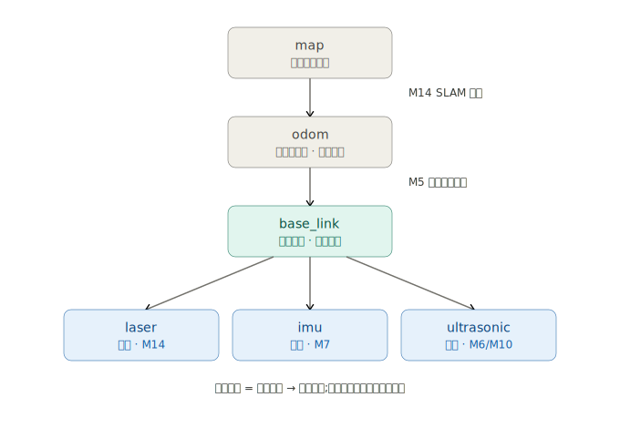

# 第三阶段：RaspBot 小车项目

> **硬件**：Raspberry Pi 5 + Yahboom Raspbot V2（麦轮 + 4×TT 电机、驱动板 I2C 0x2B、超声波、4 路循迹、2DOF 摄像头云台、OLED、RGB 灯条、蜂鸣器）。
> **环境**：Ubuntu 24.04 + ROS2 Jazzy
> **目标岗位**：机器人系统工程师（Pudu / ORION STAR / Yunjing / AgileX，长期 Unitree）
> **节奏**：按里程碑走，不锁日历。预计 14–16 周 @ ~4h/天。

---


# 项目概览


#### O、硬件边界

##### **0x2B 驱动板寄存器协议（从官方 Python 库逆出，这是你的"协议规格书"）**

总线：I2C bus 1，地址 `0x2B`。全部为寄存器读写。

**写（命令）**

| reg  | 功能         | 数据字节               | 备注                                               |
| ---- | ------------ | ---------------------- | -------------------------------------------------- |
| 0x01 | 电机         | [motor_id, dir, speed] | id 0=L1 1=L2 2=R1 3=R2；dir 0=前 1=后；speed 0–255 |
| 0x02 | 舵机         | [id, angle]            | 云台 id 1/2；angle 0–180；id2 上限 110             |
| 0x03 | RGB 全部     | [state, color]         | state 0/1；color 0–6                               |
| 0x04 | RGB 单个     | [number, state, color] |                                                    |
| 0x08 | RGB 亮度全部 | [R, G, B]              | 0–255                                              |
| 0x09 | RGB 亮度单个 | [number, R, G, B]      |                                                    |
| 0x05 | 红外遥控开关 | [state]                | 读 0x0c 前先开                                     |
| 0x06 | 蜂鸣器       | [state]                | M12 FAULT 报警用                                   |
| 0x07 | 超声波开关   | [state]                | 读 0x1a/0x1b 前先开                                |

**读（传感器）**

| reg         | 功能           | 返回      | 解析                                          |
| ----------- | -------------- | --------- | --------------------------------------------- |
| 0x0a        | 四路循迹       | 1 字节    | x1=(v>>3)&1, x2=(v>>2)&1, x3=(v>>1)&1, x4=v&1 |
| 0x1a / 0x1b | 超声距离 低/高 | 各 1 字节 | dist_mm = (0x1b<<8) \| 0x1a（先开 0x07）      |
| 0x0c        | 红外遥控值     | 1 字节    | 先开 0x05                                     |


##### 真车 vs 仿真分工（已锁定）

**关键事实**：0x2B 板不读编码器，4×TT 电机无霍尔。**真车开环，无轮速反馈。** 麦轮本身打滑严重，即便有编码器轮式里程计也不可靠——所以专业麦轮平台都靠雷达/IMU 定位，你"没编码器"的损失远小于差速车。

| 能力           | 真车                                           | 仿真(Gazebo)                  |
| -------------- | ---------------------------------------------- | ----------------------------- |
| 电机控制       | ✅ 开环 PWM (0x01)                              | ✅ 理想关节                    |
| 速度闭环 PID   | ❌ 无反馈 → 前馈标定                            | ✅                             |
| 轮式里程计     | ⚠️ 只能指令式（积分下发 Twist，质量差，需标注） | ✅ 真轮速积分                  |
| ros2_control   | ⚠️ 薄开环写接口（state 仅回显 command）         | ✅ 完整（状态反馈 + 控制器链） |
| 超声避障       | ✅ (0x07 / 0x1a-1b)                             | ✅                             |
| 四路循迹       | ✅ (0x0a)                                       | ✅（可仿）                     |
| 视觉           | ✅ USB 相机 + 2DOF 云台 (0x02)                  | ✅ 仿真相机                    |
| IMU + EKF 融合 | 🛒 买 IMU 后 ✅                                  | ✅                             |
| SLAM + Nav2    | 🛒 买雷达后 ✅                                   | ✅                             |

**策略**：Gazebo 是"完整系统的家"——闭环控制、真里程计、EKF、SLAM、Nav2 整套在仿真跑（传感器全理想）；真车跑硬件支持的子集 + 买来的雷达/IMU。这就是工业界 sim-first 开发，本身是个能讲的工程判断。


##### 采购清单

1. **2D 激光雷达（必买，第一优先）**：LD19 / LDROBOT D300（~¥300–500）或 RPLIDAR A1（~¥500–700），均有现成 ROS2 驱动。**唯一能让真车跑 SLAM + Nav2** 的件，也是补"无编码器→无里程计"定位缺口的正解。对 Pudu/Yunjing 是 25k 硬通货。
2. **IMU 模块（建议买，第二）**：Yahboom 9 轴（I2C/UART，支持 ROS2）~¥100–200。解锁真车 EKF 融合，至少把航向 yaw 做稳，补偿无轮速。你的 I2C/串口驱动正好都能接。
3. **编码器改装（不建议）**：0x2B 板不读编码器，要做得换带霍尔电机 + 换驱动板，改动大；麦轮打滑让轮式里程计本就不可靠。雷达才是定位正解。想体验正交解码可选"外置编码器 + Pi GPIO 中断"，接你 GPIO 底子，但优先级最低。

**不用换车。** Raspbot + 雷达 + IMU + "自己写驱动"的价值，比直接买带 odometry 的 ROSMASTER 更能讲故事。

---


#### 一、最终节点图

```
                      camera_node ┄/image┄┐    imu_node ──/imu──┐  [买IMU]
ultrasonic_node ─/range─┐                 ┊                      ↓
(I2C 0x2B)              ↓                  ┊            ekf_node (robot_localization)
tracking_node ─/line──→ behavior_manager  ┊                      │ map→odom→base_link
(I2C 0x2B)              (Lifecycle FSM)←监控┘                      ↓
                        │ /cmd_vel                          Nav2 stack   [买雷达]
                        ↓                              (slam_toolbox/amcl/planner/controller/BT)
                  chassis_driver ───→ health_monitor          │ /cmd_vel(导航)
                  (ros2_control, I2C HAL) (诊断/看门狗/soak)    ↓
                        │ /odom(指令式) + TF                [仲裁] → chassis
                        ↓
                  odom→base_link
```

**设计原则贯穿**：单一责任、硬件解耦、sim/real 一套代码、可靠性优先。

---


#### 二、项目大纲

| #    | 里程碑                               | 引入的新概念                                 | 估时    |
| ---- | ------------------------------------ | -------------------------------------------- | ------- |
| M0   | 工作空间 + 工程底盘                  | colcon / ament / rosdep / .repos / overlay   | 2–3 天  |
| M1   | 发布订阅 + 自定义消息                | topic / 回调 / .msg / 时间戳 / 日志          | 3 天    |
| M2   | QoS 与 DDS                           | QoS 策略 / Fast-DDS / 发现 / RMW             | 4 天    |
| M3   | Service + Action                     | srv / action / goal-feedback-result          | 4 天    |
| M4   | C++ HAL 移植 + chassis_driver        | I2C 协议移植 / Twist / 麦轮解算              | 5–6 天  |
| M5   | 里程计 + TF + 帧约定                 | tf2 / Odometry / REP-103/105                 | 4 天    |
| M6   | URDF + RViz + Foxglove               | URDF / robot_state_publisher / 观测          | 4 天    |
| M7   | IMU + EKF 融合 🛒                     | robot_localization / 多源融合                | 4 天    |
| M8   | Lifecycle 节点                       | 托管节点 / 启动顺序                          | 4 天    |
| M9   | ros2_control 重做底盘                | hardware_interface / controller_manager      | 6–7 天  |
| M10  | 传感器节点 + 时间同步                | sensor_msgs / message_filters / use_sim_time | 4 天    |
| M11  | behavior_manager 状态机              | 整机状态机 / 行为仲裁 / 急停                 | 5 天    |
| M12  | health_monitor + 故障注入 + soak     | diagnostics / 看门狗 / 长时稳定              | 5 天    |
| M13  | Gazebo 仿真（含仿真雷达/IMU/编码器） | gz sim / gz_ros2_control / 传感器插件        | 6–7 天  |
| M14  | SLAM + Nav2 导航 🛒                   | slam_toolbox / amcl / costmap / BT           | 8–10 天 |
| M15  | Launch 编排 + 系统管理               | launch.py / 参数 / lifecycle_manager         | 4 天    |
| M16  | Component + Executor + 实时性        | 零拷贝 / 回调组 / jitter / 亲和性            | 5 天    |
| M17  | 调试工具链 + bag                     | rqt / rosbag / Foxglove / 延迟测量           | 3 天    |
| M18  | 工程化 + 单测 + 集成测试 + CI        | gtest / launch_testing / Docker / Actions    | 5 天    |
| M19  | 收尾 + 面试包装                      | README / 演示视频 / 讲解演练                 | 4 天    |

🛒 = 真车依赖采购件（不买则仿真做 + 真车标"能讲"）。

---


#### 三、面试技术点 → 薪资杠杆映射

| 你做的                     | 面试能讲的                         | 撬动                        |
| -------------------------- | ---------------------------------- | --------------------------- |
| Python 库逆向 → C++ HAL    | 协议移植、I2C 寄存器实现、硬件抽象 | 你的差异化底座              |
| ros2_control 包 I2C HAL    | 工业级硬件抽象、read/write 循环    | 系统岗基本盘                |
| 无编码器下的定位权衡       | 传感器预算的系统级判断             | 资深思维信号                |
| IMU + EKF 融合             | 多传感器融合定位                   | 移动机器人核心，25k 门槛    |
| SLAM + Nav2（真车）        | 自主导航集成、costmap/BT 调参      | Pudu/Yunjing 命根子，最值钱 |
| 健康监控 + 故障注入 + soak | 可靠性设计、看门狗、长时稳定       | 你的协议背景差异化          |
| 实时性（jitter/亲和性）    | 确定性、执行模型深度               | 拉开与"只会 spin"的人       |
| sim/real 一套代码          | sim-first 工程实践                 | 研发效率                    |


#### 四、背景直接复用清单

- I2C 驱动（点亮 0x3C OLED）→ 0x2B 板 C++ HAL → ros2_control read/write
- termios 串口 → IMU/雷达模块（UART）
- 信号处理 + 优雅关闭 → lifecycle 的 configure/cleanup
- 工业协议逆向 → Python 库翻 C++ HAL（M4 主任务）
- 工业协议状态机 → behavior_manager 整机状态机
- 通信健康监控 + watchdog → health_monitor + 故障注入 + soak
- CommManager 线程模型 → executor + callback group + 实时性
- IEC104/Modbus → 行业知识里 EtherCAT/CANopen 迁移谈资（面试讲接口设计即可，不硬啃）


#### 五、范围纪律：故意不做的

SROS2 安全、多机集群、DDS 深度调优、SLAM 算法 / 高级控制理论（动力学/MPC/RL）——要么用不上，要么是算法赛道（跟控制/CS 硕士竞争，ROI 低）。守住"集成和调 Nav2/SLAM"，不越界去"写 SLAM"。

---


#### 附：薪资定位（参考）

- 这套做完 = **中级机器人系统/中间件工程师**：能在真实硬件上搭多节点 ROS2 系统、用 ros2_control 做硬件抽象、会 TF/里程计/lifecycle/EKF/Nav2 集成/诊断/仿真/实时性。配 3 年工业协议背景，画像是"协议 + 硬件接入 + 系统集成 + 可靠性"。
- 不是算法工程师（不写 SLAM/导航/运动控制算法）——这是有意的赛道选择。
- 深圳行情：嵌入式/机器人 C++ 20–25k 在中段，25k+ 靠差异化叙事 + 真车导航/融合 + 面试包装。你现在 12.5k@珠海低于深圳行情，20k 含相当一部分是地域迁移 + 纠偏，不算激进；25k+ 是这套计划要撬动的目标。


# M0 — 工作空间 + 工程底盘

**目标**：建 colcon 工作空间、第一个 ament_cmake 包、空节点；立工程发布纪律。

先记住这一关唯一要内化的新心智模型:**overlay/underlay**。`/opt/ros/jazzy` 是 underlay(ROS2 本体),你的工作空间 `install/` 是 overlay,叠在它上面。每开一个新终端都要 source,`ros2` 才找得到你的包——这就是为什么待会儿要 `source install/setup.bash`。


#### 工作空间 + 第一个包

```bash
mkdir -p ~/raspbot_ws/src
cd ~/raspbot_ws/src
ros2 pkg create raspbot_demo --build-type ament_cmake --license Apache-2.0 --dependencies rclcpp
```

这条命令生成的目录结构,对你来说类比很直接:`src/raspbot_demo/` 就是一个独立的 CMake 子工程,但多了两样 ROS2 特有的东西——`package.xml`(依赖清单,`rosdep` 读它装依赖)和一个 ament 风格的 `CMakeLists.txt`。`raspbot_demo` 是我们 M0/M1 的练习包;真正的项目包(`raspbot_interfaces`、`raspbot_chassis`…)会在对应里程碑才建,现在不预设。


#### 写最小节点(这里拆 spin)

删掉生成的示例,自己写 `src/raspbot_demo/src/hello_node.cpp`:

```cpp
#include "rclcpp/rclcpp.hpp"

class HelloNode : public rclcpp::Node
{
public:
    HelloNode() : Node("hello_node")
    {
        RCLCPP_INFO(this->get_logger(), "HelloNode 已启动，executor 即将接管本线程");
    }
};

int main(int argc, char **argv)
{
    rclcpp::init(argc,argv);    // 解析 ROS 参数、连上 DDS
    auto node = std::make_shared<HelloNode>();
    rclcpp::spin(node);         // 阻塞在 executor 事件循环
    rclcpp::shutdown();
    return 0;
}
```

`spin()`:跑一个 **executor**,阻塞着等 DDS 来消息,来了就派发给节点注册的回调。

**关键点:你这个节点现在一个回调都没注册**,所以 executor 进了循环就纯阻塞,啥也不派发。


#### 两个 ament 文件

```cmake
cmake_minimum_required(VERSION 3.8)
project(raspbot_demo)

add_compile_options(-Wall -Wextra -Wpedantic)

find_package(ament_cmake REQUIRED)
find_package(rclcpp REQUIRED)

add_executable(hello_node src/hello_node.cpp)
ament_target_dependencies(hello_node rclcpp)

install(TARGETS hello_node
  DESTINATION lib/${PROJECT_NAME})

ament_package()
```

四处 ROS2 特有、你裸 CMake 里没有的:

1. `find_package(ament_cmake)` + 末尾 `ament_package()` —— ament 的构建系统外壳,`ament_package()` 必须是最后一行。
2. `ament_target_dependencies(hello_node rclcpp)` —— 比手动 `target_link_libraries` 省事,它把 rclcpp 的 include/库/传递依赖一次性挂上。
3. `install(TARGETS ... DESTINATION lib/${PROJECT_NAME})` —— **必须装到 `lib/包名` 下,`ros2 run` 才找得到这个可执行文件**。漏了它编译能过但 `ros2 run` 报找不到,这是新手第一个坑。


`package.xml` 里把依赖声明对(`ros2 pkg create` 已经基本生成好,确认有这两行):

```xml
<buildtool_depend>ament_cmake</buildtool_depend>
<depend>rclcpp</depend>
```

`<depend>` 就是 `rosdep` 读来装系统依赖的地方。


#### 构建、source、运行

```bash
cd ~/raspbot_ws
colcon build --symlink-install
source install/setup.bash
ros2 run raspbot_demo hello_node
```

- `colcon build`:扫 `src/` 下所有包,产物进 `build/`(中间)和 `install/`(成品)。
- `--symlink-install`:用符号链接装,以后改 Python/config/launch 不用重 build(C++ 改了还是要 build)。
- `source install/setup.bash`:把你的 overlay 叠到 jazzy underlay 上——这一步做完 `ros2` 才认识 `raspbot_demo`。
- 跑起来你会看到那行 INFO,然后**卡住不动**(spin 在空转阻塞)。`Ctrl-C` 退出——这就对了,正是上面讲的"空 handler 表的接收循环"。
- 可以把这行加进 `~/.bashrc` 省得每次手动 source:`echo "source ~/raspbot_ws/install/setup.bash" >> ~/.bashrc`(注意它要在 source jazzy 那行之后)。


**工程纪律(顺手立好习惯)**

`~/raspbot_ws/.gitignore`:

```bash
build/
install/
log/
```

`~/raspbot_ws/README.md` 起个头(从今天起每个里程碑更新它,别堆到最后):

```markdown
# Raspbot ROS2 自主移动平台

Pi5 + Raspbot V2 上的项目驱动 ROS2 系统。Jazzy / Ubuntu 24.04。

## 包结构
- raspbot_demo —— M0/M1 学习包

## 构建
colcon build --symlink-install && source install/setup.bash
```


---


# M1 — 发布/订阅 /自定义Msg

**目标**：手写 pub/sub，定义 `.msg`，从一开始把时间戳和日志用对。


#### 发布者 + 订阅者(标准消息)

直接在 `raspbot_demo` 包里加两个节点。先写发布者 `src/raspbot_demo/src/wheel_pub.cpp`:

```cpp
#include "rclcpp/rclcpp.hpp"
#include "std_msgs/msg/string.hpp"

using namespace std::chrono_literals;

class WheelPub : public rclcpp::Node
{
public:
    WheelPub() 
        : Node("wheel_pub"), count_(0)
    {
        pub_ = this->create_publisher<std_msgs::msg::String>("wheel_chatter", 10);      // 建一个往话题 wheel_chatter 发的发布者。10 是 QoS 队列深度(发太快来不及发时缓冲多少条)
        timer_ = this->create_wall_timer(500ms, std::bind(&WheelPub::on_timer,this));   // 注册了一个周期性回调。executor 不再纯阻塞,每 500ms 派发一次 on_timer。
        RCLCPP_INFO(this->get_logger(), "wheel_pub启动, 每500ms 发一次");
    }

private:
    void on_timer()
    {
        auto msg = std_msgs::msg::String();
        msg.data = "wheel tick " + std::to_string(count_++);
        RCLCPP_INFO(this->get_logger(), "发布: %s", msg.data.c_str());
        pub_->publish(msg);                 // DDS 替你做序列化 + 分发给所有订阅者。你不用管有几个订阅者、它们在哪,这就是发布订阅解耦
    }

    rclcpp::TimerBase::SharedPtr timer_;
    rclcpp::Publisher<std_msgs::msg::String>::SharedPtr pub_;
    size_t count_;
};

int main(int argc, char** argv)
{   
    rclcpp::init(argc,argv);
    rclcpp::spin(std::make_shared<WheelPub>());
    rclcpp::shutdown();
    return 0;
}
```


再写订阅者 `src/raspbot_demo/src/wheel_sub.cpp`:

```cpp
#include "rclcpp/rclcpp.hpp"
#include "std_msgs/msg/string.hpp"

class WheelSub : public rclcpp::Node
{
public:
  WheelSub() : Node("wheel_sub")
  {
    sub_ = this->create_subscription<std_msgs::msg::String>(
        "wheel_chatter", 10,
        std::bind(&WheelSub::on_msg, this, std::placeholders::_1));
    RCLCPP_INFO(this->get_logger(), "wheel_sub 启动，等数据");
  }

private:
  void on_msg(const std_msgs::msg::String & msg)
  {
    RCLCPP_INFO(this->get_logger(), "收到: '%s'", msg.data.c_str());
  }

  rclcpp::Subscription<std_msgs::msg::String>::SharedPtr sub_;
};

int main(int argc, char ** argv)
{
  rclcpp::init(argc, argv);
  rclcpp::spin(std::make_shared<WheelSub>());
  rclcpp::shutdown();
  return 0;
}
```

订阅者更纯粹:`on_msg` **就是你的 observer 回调**——话题来数据,executor 派发给它。订阅者的话题名 `wheel_chatter` 和 QoS 深度 `10` 必须和发布者**对得上**,DDS 才会把它俩接起来(M2 你会看到 QoS 不匹配会导致连不上,现在先一致)。


**CMakeLists 加两个可执行文件**

在 `raspbot_demo/CMakeLists.txt` 里,`find_package(rclcpp REQUIRED)` 后面加一句 std_msgs,然后注册两个新目标:

```cmake
find_package(std_msgs REQUIRED)

add_executable(wheel_pub src/wheel_pub.cpp)
ament_target_dependencies(wheel_pub rclcpp std_msgs)

add_executable(wheel_sub src/wheel_sub.cpp)
ament_target_dependencies(wheel_sub rclcpp std_msgs)

install(TARGETS hello_node wheel_pub wheel_sub
  DESTINATION lib/${PROJECT_NAME})
```

(注意 `install(TARGETS ...)` 那行——把三个目标并到一起,别漏了新的两个,否则 `ros2 run` 找不到。)

`package.xml` 里加一行依赖:

```xml
<depend>std_msgs</depend>
```


**构建 + 跑(要两个终端)**

```bash
cd ~/raspbot_ws
colcon build --symlink-install
source install/setup.bash

# 终端 1
ros2 run raspbot_demo wheel_pub

# 终端 2(先 source)
source install/setup.bash
ros2 run raspbot_demo wheel_sub
```

**checkpoint**:跑起来后给我三样——

1. 两个终端的输出(pub 在"发布:"、sub 在"收到:",数字对得上)。
2. `ros2 topic list`(第三个终端,source 后):看到 `/wheel_chatter` 没。
3. `ros2 topic echo /wheel_chatter`:用命令行直接当订阅者,看你不写代码也能 echo 出消息——体会一下话题是"谁都能接的公共总线"。


#### 自定义消息

这一关的新东西全在"消息怎么从文本变成 C++ 类型"的构建流程上,代码改动反而很小。

**第 1 步:建独立的接口包**

```bash
cd ~/raspbot_ws/src
ros2 pkg create raspbot_interfaces \
    --build-type ament_cmake \
    --license Apache-2.0 \
    --dependencies std_msgs
```

注意依赖里加了 `std_msgs`——因为我们的消息要用它的 `Header`。

**第 2 步:写 .msg 文件**

```bash
mkdir -p raspbot_interfaces/msg
cat > raspbot_interfaces/msg/WheelSpeed.msg << 'EOF'
std_msgs/Header header
float64 front_left
float64 front_right
float64 rear_left
float64 rear_right
EOF
```

**第 3 步:让接口包生成代码(这是新东西)**

接口包的 `CMakeLists.txt`,在 `find_package(std_msgs REQUIRED)` 后面加:

```cmake
find_package(rosidl_default_generators REQUIRED)

rosidl_generate_interfaces(${PROJECT_NAME}
  "msg/WheelSpeed.msg"
  DEPENDENCIES std_msgs
)
```

`package.xml` 里加这三行(顺序无所谓,但都得有):

```xml
<buildtool_depend>rosidl_default_generators</buildtool_depend>
<depend>std_msgs</depend>
<member_of_group>rosidl_interface_packages</member_of_group>
```

`rosidl_generate_interfaces` 就是那个"把 `.msg` 文本编译成 C++/Python 类型"的魔法。build 之后,你会在 `install/raspbot_interfaces/include/...` 下看到生成的 `wheel_speed.hpp`——**这就是你的 `Frame` 结构体,只不过是工具生成的,还附带了 CDR 序列化代码。**

**第 4 步:先单独 build 接口包,验证生成**

```bash
cd ~/raspbot_ws
colcon build --packages-select raspbot_interfaces
source install/setup.bash
ros2 interface show raspbot_interfaces/msg/WheelSpeed
```

`ros2 interface show` 会把你的消息结构打印出来——这等于让 ROS2 系统确认"我认识这个新类型了"。

**第5步：去看生成的 C++ 头**

你刚写的是一个**文本文件** `WheelSpeed.msg`,5 行。rosidl 把它编译成了一个真正的 C++ 结构体。去看一眼:

```bash
find ~/raspbot_ws/install/raspbot_interfaces -name "wheel_speed.hpp"
```

会列出几个文件,看这个主结构定义:

```bash
cat ~/raspbot_ws/install/raspbot_interfaces/include/raspbot_interfaces/raspbot_interfaces/msg/detail/wheel_speed__struct.hpp
```

(路径里 `raspbot_interfaces/raspbot_interfaces` 双层是 ROS2 的 include 约定,M1 配 clangd 时你见过这个结构。)

翻到中间 `struct WheelSpeed_` 那段,你会看到你那 5 行文本变成了:

- 一个模板化的 C++ struct,成员就是 `header`、`front_left`…`rear_right`,类型一一对应(`float64`→`double`)。
- 构造函数里把数值成员**零初始化**。
- 一堆 `using` 类型别名、`==`/`!=` 运算符。

**这就是你手写的 `Frame`,只不过是工具生成的。** 你过去做协议:手写 struct 定义字节布局 → 手写 `serialize()`/`deserialize()` 做大小端和打包 → 手写 CRC。rosidl 把这整条链自动化了:你只声明字段,它生成 struct + CDR 序列化代码(在另几个 `__type_support` 文件里)+ 跨语言绑定(C/C++/Python 都生成)。**DDS 的 IDL/CDR = 你协议栈的工业标准版。** 你过去是这条链的手工匠人,现在你理解它底下在干什么,只是不用再手搓了。


#### 让节点发 WheelSpeed

现在把 `wheel_pub`/`wheel_sub` 从 `std_msgs::String` 换成你这个新类型。改动不大,但有**三个新东西**要落实:跨包依赖、填时间戳、填结构化字段。

1. 改 `wheel_pub.cpp`

```cpp
#include "rclcpp/rclcpp.hpp"
#include "raspbot_interfaces/msg/wheel_speed.hpp"

using namespace std::chrono_literals;

class WheelPub : public rclcpp::Node
{
public:
    WheelPub() 
        : Node("wheel_pub"), tick_(0)
    {
        pub_ = this->create_publisher<raspbot_interfaces::msg::WheelSpeed>("wheel_speed", 10);      // 建一个往话题 wheel_chatter 发的发布者。10 是 QoS 队列深度(发太快来不及发时缓冲多少条)
        timer_ = this->create_wall_timer(500ms, std::bind(&WheelPub::on_timer,this));   // 注册了一个周期性回调。executor 不再纯阻塞,每 500ms 派发一次 on_timer。
        RCLCPP_INFO(this->get_logger(), "wheel_pub启动, 每500ms 发一次");
    }

private:
    void on_timer()
    {
        auto msg = raspbot_interfaces::msg::WheelSpeed();
        msg.header.stamp = this->now();     // ← 时间戳纪律：发的瞬间盖时间章
        msg.header.frame_id = "base_link";  // ← 这数据属于车体坐标系
        double v = 0.1 * tick_++;                // 假数据，递增轮速
        msg.front_left  = v;
        msg.front_right = v;
        msg.rear_left   = v;
        msg.rear_right  = v;
        RCLCPP_INFO(this->get_logger(), "发布: FL=%.2f FR=%.2f RL=%.2f RR=%.2f",
                msg.front_left, msg.front_right, msg.rear_left, msg.rear_right);
        pub_->publish(msg);                 // DDS 替你做序列化 + 分发给所有订阅者。你不用管有几个订阅者、它们在哪,这就是发布订阅解耦
    }

    rclcpp::TimerBase::SharedPtr timer_;
    rclcpp::Publisher<raspbot_interfaces::msg::WheelSpeed>::SharedPtr pub_;
    size_t tick_;
};

int main(int argc, char** argv)
{   
    rclcpp::init(argc,argv);
    rclcpp::spin(std::make_shared<WheelPub>());
    rclcpp::shutdown();
    return 0;
}
```


2.  改 `wheel_sub.cpp`(回调里读结构化字段)

```cpp
#include "rclcpp/rclcpp.hpp"
#include "raspbot_interfaces/msg/wheel_speed.hpp"

class WheelSub : public rclcpp::Node
{
public:
    WheelSub() : Node("wheel_sub")
    {
        sub_ = this->create_subscription<raspbot_interfaces::msg::WheelSpeed>(
            "wheel_speed", 10,
            std::bind(&WheelSub::on_msg,this,std::placeholders::_1));
        RCLCPP_INFO(this->get_logger(), "wheel_sub 启动，等WheelSpeed");
    }

private:
    void on_msg(const raspbot_interfaces::msg::WheelSpeed & msg)
    {
        RCLCPP_INFO(this->get_logger(), "收到: FL=%.2f RR=%.2f @ stamp %d.%09u",
                msg.front_left, msg.rear_right,
                msg.header.stamp.sec, msg.header.stamp.nanosec);
    }

    rclcpp::Subscription<raspbot_interfaces::msg::WheelSpeed>::SharedPtr sub_;
};

int main(int argc, char** argv)
{
    rclcpp::init(argc,argv);
    rclcpp::spin(std::make_shared<WheelSub>());
    rclcpp::shutdown();
    return 0;
}
```


3. 关键:`raspbot_demo` 要声明对 `raspbot_interfaces` 的依赖

`raspbot_demo` 现在用了 `raspbot_interfaces` 的类型,必须声明依赖,否则编译时找不到头。

`raspbot_demo/package.xml` 加一行:

```xml
<depend>raspbot_interfaces</depend>
```

`raspbot_demo/CMakeLists.txt` 里,加 find_package 并把两个目标的依赖更新:

```cmake
find_package(raspbot_interfaces REQUIRED)

ament_target_dependencies(wheel_pub rclcpp raspbot_interfaces)
ament_target_dependencies(wheel_sub rclcpp raspbot_interfaces)
```

(注意 `std_msgs` 可以从这两行去掉了——Header 是通过 raspbot_interfaces 间接带进来的,不用直接依赖。`hello_node` 那行不动。)


4. **整体构建(这次 build 全部,因为有跨包依赖)**

```bash
cd ~/raspbot_ws
colcon build
source install/setup.bash
```

跨包依赖时 colcon 会**自动按依赖顺序**先编 `raspbot_interfaces` 再编 `raspbot_demo`——你不用管顺序,这也是 colcon 比裸 CMake 省心的地方。


**收官 checkpoint**:

1. 两个终端:`wheel_pub` 发四个轮速、`wheel_sub` 收到值 + 时间戳(数值递增、stamp 在变)。
2. `ros2 topic echo /wheel_speed`:看完整结构化输出(header + 四字段)。
3. `ros2 topic info /wheel_speed --verbose`(新东西,顺便认识):它会告诉你这个话题的**消息类型**是`raspbot_interfaces/msg/WheelSpeed`、有几个发布者几个订阅者、用什么 QoS

---


# M2 — QoS 与 DDS 深化

**目标**：吃透 QoS 策略组合，理解 DDS 发现，会测频率/延迟。


#### QoS 完整策略

使用`topic info --verbose`可以查看`QoS`的**完整策略集**

**Reliability:  ——可靠性**

**Durability —— 持久性**

**History (Depth） —— 历史策略**

**Lifespan —— 消息保质期**

**Deadline —— 超时告警**

**Liveliness —— 发布者活性检测**

这就是 QoS 的**完整策略集**——它不是一个开关,是一组**正交的策略**,每条独立配置,合起来定义"这条数据流的传输语义"。DDS 把它们标准化、可配置化了。


####  1.Reliability可靠性

**(RxO)兼容性**:

- **发布者 = 提供方(Offered)**:它声明"我能提供什么级别的服务"。
- **订阅者 = 请求方(Requested)**:它声明"我要求什么级别的服务"。
- **规则:发布者提供的,必须 ≥ 订阅者要求的,才兼容。**

套到 RELIABILITY 上(可靠性有高低:RELIABLE > BEST_EFFORT):

| 发布者提供  | 订阅者要求  | 通不通     | 为什么                                                    |
| ----------- | ----------- | ---------- | --------------------------------------------------------- |
| RELIABLE    | BEST_EFFORT | ✅ 通       | 我提供"保证送达",你只要求"尽力",绰绰有余                  |
| RELIABLE    | RELIABLE    | ✅ 通       | 供需一致                                                  |
| BEST_EFFORT | BEST_EFFORT | ✅ 通       | 供需一致                                                  |
| BEST_EFFORT | RELIABLE    | ❌ **不通** | 你**要求**"保证送达",我只**提供**"尽力"——满足不了你的要求 |


修改车速轮的发布者和订阅者的代码，把他们都改成`BEST_EFFORT`，理由如下：

- 轮速是**高频、连续、会过期**的量。这一帧丢了,50ms 后下一帧就来了,**重传一个 50ms 前的旧轮速毫无意义,反而增加延迟**。
- 你要的是"最新值、低延迟",不是"一条都不能丢"。RELIABLE 的重传机制对这种数据是负担。

```cpp
rclcpp::QoS qos(10);
qos.best_effort();
sub_ = this->create_subscription<raspbot_interfaces::msg::WheelSpeed>(
    "wheel_speed", qos,
    std::bind(&WheelSub::on_msg, this, std::placeholders::_1));
```


#### 2.Durability持久性

刚才 Reliability 解决的是"丢不丢包"。现在换个**正交**的策略:DURABILITY,解决的是"**晚来的订阅者,能不能补到它订阅之前就发过的数据**"。


VOLATILE ：发布者只管当下,**订阅者连上之前发的所有数据,一概收不到**。

RANSIENT_LOCAL：发布者**保留最后 N 条**,任何晚订阅的节点一连上,**立刻补发最新的那条**。


**设置 TRANSIENT_LOCAL**

```cpp
rclcpp::QoS qos(1);
qos.reliable();            // TRANSIENT_LOCAL 几乎总是配 RELIABLE 一起用,原因见下
qos.transient_local();
```

**三个 DDS 特有的坑**

1. **深度 N 由发布者的 HISTORY depth 决定**

```cpp
rclcpp::QoS qos(1);
qos.reliable();
qos.transient_local();
```

2. **为什么必须配 RELIABLE**

TRANSIENT_LOCAL + BEST_EFFORT 是个**几乎无意义的组合**:你想"保证晚来的人补到最新状态",却又用"尽力而为、丢了不管"去发——自相矛盾。所以状态类数据的标准组合是 `RELIABLE + TRANSIENT_LOCAL + KEEP_LAST(1)`。把这三件套当成一个固定搭配记。

3. **RxO 兼容性对 durability 同样是不对称的。**

跟 reliability 一个道理:**发布者 TRANSIENT_LOCAL(提供更强)能喂 VOLATILE 的订阅者;反过来发布者 VOLATILE、订阅者要 TRANSIENT_LOCAL 就不兼容、静默不连。**

ROS2 给"最新状态"这种场景预置了一个 QoS profile,叫 KeepLast + 你直接叠 durability,比逐个调方法更语义化:

```cpp
// 等价于上面那套三件套,更易读
auto qos = rclcpp::QoS(rclcpp::KeepLast(1)).reliable().transient_local();
```

链式调用,一行表达"保留最新1条、可靠、对晚订阅者持久"。这是状态发布的惯用写法


#### 3.DEADLINE超时检测

**语义**:在话题上声明一个承诺"**两次发布的间隔不会超过 X**"。如果发布者真的超了(或订阅者在 X 内没等到),DDS **自动触发一个回调**通知你违约了。

**接口：**

```cpp
rclcpp::QoS qos(10);
qos.deadline(rclcpp::Duration(0, 200'000'000));  // 200ms (sec, nanosec)
```

但光设 deadline 只是声明承诺,你得**注册违约回调**才能收到通知。这通过 publisher/subscription 的 options 挂:

```cpp
rclcpp::SubscriptionOptions opts;
opts.event_callbacks.deadline_callback =
  [this](rclcpp::QOSDeadlineRequestedInfo & event) {
    RCLCPP_WARN(this->get_logger(),
      "超声波 deadline 违约！累计 %d 次", event.total_count);
  };

sub_ = this->create_subscription<...>(
    "ultrasonic", qos, callback, opts);   // ← 把 opts 传进去
```

**为什么这对你 M12 是关键武器**:你大纲里 health_monitor 要做"传感器 >200ms 没数据 → 告警"。**没有 DEADLINE,你得自己**:存上一帧时间戳 → 起个定时器 → 每个 tick 比对 now - last_stamp > 200ms → 触发告警。一个传感器一套,十个传感器十套,还容易写错边界。**有了 DEADLINE,你只声明"这个话题承诺 200ms 一帧",违约 DDS 自动回调你**——超时检测从"你的业务逻辑"下沉成了"中间件的 QoS 保证"。这正是框架替你做脏活的地方。

**RxO 兼容性**(又是这条规则,你已经熟了):订阅者请求的 deadline period 必须 **≥** 发布者提供的。发布者承诺"≤200ms 一帧",订阅者要求"≤500ms 就行",兼容(发布者发得比你要求的还勤);反过来订阅者要求 100ms、发布者只承诺 200ms,不兼容。


#### 4.LIVELINESS — 发布者"活着吗"

**语义**:DEADLINE 管"数据来得够不够勤",LIVELINESS 管"**发布者这个实体还活着吗**"。区别很微妙但重要:

- DEADLINE 违约 = "这一路数据流断了/变慢了"(可能发布者还活着,只是这个话题没数据了)。
- LIVELINESS 丢失 = "**发布者这个节点本身假死/没心跳了**"(它所有话题可能一起没了)。

**接口**(了解即可,M12 才用):

```cpp
rclcpp::QoS qos(10);
qos.liveliness(rclcpp::LivelinessPolicy::Automatic);
qos.liveliness_lease_duration(rclcpp::Duration(1, 0));  // 1秒没心跳判定失活
```

`Automatic` 模式下,只要发布者进程在正常跑 DDS 协议栈,DDS 自动帮它"续租"心跳;进程崩了/卡死,租约到期,订阅端收到 liveliness 丢失回调。


#### 策略全景总结

你现在手里这套 QoS 策略,本质是**一组正交的传输契约**,每条独立配,合起来定义一条数据流的语义:

| 策略            | 管什么                | 你的典型选择                          |
| --------------- | --------------------- | ------------------------------------- |
| **Reliability** | 丢不丢包              | 传感器→BEST_EFFORT;控制/状态→RELIABLE |
| **Durability**  | 晚订阅者补不补历史    | 状态→TRANSIENT_LOCAL;流数据→VOLATILE  |
| **History**     | 缓存几条              | KEEP_LAST(N),状态常用 N=1             |
| **Deadline**    | 发布频率契约+违约告警 | M12 传感器掉线检测                    |
| **Liveliness**  | 发布者活性心跳        | M12 节点崩溃检测                      |

记住贯穿全部的那条**不对称兼容规则**:发布者"提供"的服务等级必须 **≥** 订阅者"请求"的,否则静默不连。这是 QoS 所有调试的总纲。


---


# M3 — Service + Action

**目标**：service 端/客户端 + 自定义 srv；完整 action。


#### Service

```
客户端 ──── Request ───▶ 服务端
client                  server
       ◀─── Response ──
```

Topic 是"广播,发了不管,多对多";Service 是"**点对点的一问一答,有去必有回**"。

你发一个请求,**阻塞等**一个应答。典型场景:查询(读机器人状态)、一次性命令(复位某个模块)、配置(改个参数)。

跟 Topic 的本质区别:Topic 没有"谁收到了""处理完没有"的概念;Service 是**确定的一对一事务**,你知道请求被谁处理了、拿到了它的应答。


##### **Step 1 — 定义 .srv 文件**

`.srv` 跟你 M1 写的 `.msg` 是同一套生成机制,只是它分**请求**和**应答**两部分,用 `---` 隔开。

建 `raspbot_interfaces/srv/GetStatus.srv`:

```bash
mkdir -p ~/raspbot_ws/src/raspbot_interfaces/srv
cat > ~/raspbot_ws/src/raspbot_interfaces/srv/GetStatus.srv << 'EOF'
# === 请求(Request)===  客户端发给服务端的
# (这里为空：查询当前状态不需要任何参数)
---
# === 应答(Response)=== 服务端返回给客户端的
string state
uint32 uptime_sec
EOF
```

读这个文件:`---` 上面是**请求字段**(这次为空,因为"查状态"不需要参数),下面是**应答字段**(返回状态字符串 + 运行了多少秒)。对比你 M1 的 `.msg` 只有字段没有 `---`——`.srv` 多了这条分割线,因为它要描述"一来一回"两个方向的数据。


##### Step 2 — 在 CMake 里注册它

`raspbot_interfaces/CMakeLists.txt`,把 srv 加进 `rosidl_generate_interfaces`(就是你 M1 加 WheelSpeed 那块):

```cmake
rosidl_generate_interfaces(${PROJECT_NAME}
  "msg/WheelSpeed.msg"
  "srv/GetStatus.srv"
  DEPENDENCIES std_msgs
)
```

(就多了 `"srv/GetStatus.srv"` 这一行。`package.xml` 不用改,Service 不需要额外依赖。)

build 接口包验证生成:

```bash
cd ~/raspbot_ws
colcon build --packages-select raspbot_interfaces
source install/setup.bash
ros2 interface show raspbot_interfaces/srv/GetStatus
```

`ros2 interface show` 这次会把请求和应答**用 `---` 分开**显示给你看——确认生成对了。


##### Step 3 — 写服务端节点

新建 `raspbot_demo/src/status_server.cpp`:

```cpp
#include "rclcpp/rclcpp.hpp"
#include "raspbot_interfaces/srv/get_status.hpp"   // snake_case,跟 msg 一样

class StatusServer : public rclcpp::Node
{
public:
  StatusServer() : Node("status_server")
  {
    start_time_ = this->now();
    // 创建服务：服务名 "get_status"，绑定处理回调
    srv_ = this->create_service<raspbot_interfaces::srv::GetStatus>(
        "get_status",
        std::bind(&StatusServer::handle, this,
                  std::placeholders::_1, std::placeholders::_2));
    RCLCPP_INFO(this->get_logger(), "status_server 就绪，等待查询");
  }

private:
  // 服务回调：两个参数 —— 请求进(req)、应答出(res)
  void handle(const std::shared_ptr<raspbot_interfaces::srv::GetStatus::Request> req,
              std::shared_ptr<raspbot_interfaces::srv::GetStatus::Response> res)
  {
    (void)req;   // 这次请求是空的，用不到，显式忽略避免编译警告
    res->state = "IDLE";
    res->uptime_sec = (this->now() - start_time_).seconds();
    RCLCPP_INFO(this->get_logger(), "收到查询，返回 state=%s uptime=%u",
                res->state.c_str(), res->uptime_sec);
    // 注意：没有 return 值。填好 res 就是应答，框架负责发回去
  }

  rclcpp::Service<raspbot_interfaces::srv::GetStatus>::SharedPtr srv_;
  rclcpp::Time start_time_;
};

int main(int argc, char ** argv)
{
  rclcpp::init(argc, argv);
  rclcpp::spin(std::make_shared<StatusServer>());
  rclcpp::shutdown();
  return 0;
}
```

服务端回调的核心,**对比你 M1 的订阅回调**:订阅回调是**单参数**(只有进来的消息);

服务回调是**双参数**——`req` 进、`res` 出,你**填 `res` 就等于回了应答**,不用 return。

这是 Service 和 Topic 在代码形态上最直观的区别。


##### Step 4 — 先用命令行测

服务端写好后,**先不写客户端代码**,用命令行当客户端测——这样能把"服务端通不通"和"客户端怎么写"两个问题隔离开(还是你熟的隔离变量思路)。

CMakeLists 注册服务端(加可执行文件 + 依赖 + install):

```cmake
add_executable(status_server src/status_server.cpp)
ament_target_dependencies(status_server rclcpp raspbot_interfaces)

# 把 status_server 加进原来的 install(TARGETS ...) 那行
install(TARGETS hello_node wheel_pub wheel_sub status_server
  DESTINATION lib/${PROJECT_NAME})
```

build + 跑:

```bash
cd ~/raspbot_ws
colcon build --packages-select raspbot_demo
source install/setup.bash

# 终端 1：起服务端
ros2 run raspbot_demo status_server

# 终端 2：用命令行当客户端调用它
source install/setup.bash
ros2 service list                                          # 看到 /get_status 没
ros2 service call /get_status raspbot_interfaces/srv/GetStatus   # 调用它
```


##### Step 5 — 写客户端节点

刚才你用的是命令行 `ros2 service call`,它替你把"异步等待"处理好了,所以没踩坑。但**当你要在一个节点的回调里去调用别的服务时**,坑就来了。这是 Service 最容易让人栽的地方,我让你先**亲眼见到死锁**,再给正确写法——踩一次,终身不忘。


**先讲清楚坑的机理:**

`spin()` 跑的 executor 是**单线程**的——它一次只能处理一个回调。

现在设想你在某个回调里这么写:"调用 get_status 服务 → **同步等**它返回"。

问题是:**等待这个动作本身正占着 executor 唯一的线程**,而服务的应答**也需要这个 executor 线程去接收处理**。

于是:你占着线程等应答,应答等着线程来处理——**自己等自己,死锁。**

ROS2 默认单线程 executor,**在回调里同步等服务 = 必死锁**。

所以 ROS2 的铁律:**客户端用 `async_send_request()`,拿一个 future,绝不在回调里 spin 等它。**

写 `raspbot_demo/src/status_client.cpp`:

```cpp
#include "rclcpp/rclcpp.hpp"
#include "raspbot_interfaces/srv/get_status.hpp"
#include <chrono>

using namespace std::chrono_literals;

class StatusClient : public rclcpp::Node
{
public:
  StatusClient() : Node("status_client")
  {
    client_ = this->create_client<raspbot_interfaces::srv::GetStatus>("get_status");
  }

  void send_query()
  {
    // 1. 先等服务端上线（最多等 5 秒）
    while (!client_->wait_for_service(1s)) {
      if (!rclcpp::ok()) return;
      RCLCPP_INFO(this->get_logger(), "等待 get_status 服务上线...");
    }

    // 2. 构造请求（这次为空），异步发送
    auto req = std::make_shared<raspbot_interfaces::srv::GetStatus::Request>();
    auto future = client_->async_send_request(req);

    // 3. 关键：在 main 里用 spin_until_future_complete 等结果
    //    注意这是在【节点外部】等，不是在回调里等——所以不死锁
    if (rclcpp::spin_until_future_complete(this->get_node_base_interface(), future)
        == rclcpp::FutureReturnCode::SUCCESS)
    {
      auto res = future.get();
      RCLCPP_INFO(this->get_logger(), "查询结果: state=%s uptime=%u",
                  res->state.c_str(), res->uptime_sec);
    } else {
      RCLCPP_ERROR(this->get_logger(), "服务调用失败");
    }
  }

private:
  rclcpp::Client<raspbot_interfaces::srv::GetStatus>::SharedPtr client_;
};

int main(int argc, char ** argv)
{
  rclcpp::init(argc, argv);
  auto node = std::make_shared<StatusClient>();
  node->send_query();        // 调一次就退出（一次性查询客户端）
  rclcpp::shutdown();
  return 0;
}
```

**注意这个写法绕开死锁的关键**:我没有在某个订阅/定时器回调里调服务,而是在 `main` 里调 `send_query()`,用 `spin_until_future_complete` 在**节点外层**驱动 executor 去等 future——这时 executor 是空闲的、能去处理应答,所以不锁。

**那"在回调里调服务"到底怎么办?**(这是真实场景:比如状态机回调里要查个服务)——正解是 `async_send_request` 时**挂一个回调**处理结果,发完立刻返回、不等,结果到了让 executor 回调你。这个进阶写法 M11 状态机真用到时我再给你,现在先把"为什么不能同步等 + 一次性查询怎么写"立住。

CMakeLists 注册客户端:

```cmake
add_executable(status_client src/status_client.cpp)
ament_target_dependencies(status_client rclcpp raspbot_interfaces)

# 加进 install
install(TARGETS hello_node wheel_pub wheel_sub status_server status_client
  DESTINATION lib/${PROJECT_NAME})
```

build + 跑(服务端要开着):

```bash
cd ~/raspbot_ws
colcon build --packages-select raspbot_demo
source install/setup.bash

# 终端 1：服务端
ros2 run raspbot_demo status_server

# 终端 2：客户端(跑一次就退出)
source install/setup.bash
ros2 run raspbot_demo status_client
```


**为什么这样写不会死锁？**

|                                    | 你的代码(安全)                  | 死锁写法                        |
| ---------------------------------- | ------------------------------- | ------------------------------- |
| 谁调的`spin_until_future_complete` | `send_query`(main 里的普通函数) | 某个回调里(比如订阅回调)        |
| 调用时 executor 状态               | **空闲**(没跑任何回调)          | **正忙**(正在跑那个回调)        |
| 结果                               | executor 自由转圈,收到应答      | executor 被回调占着,转不动,卡死 |

**核心区别就一个:调 `spin_until_future_complete` 的那一刻,executor 是不是正被某个回调占用。**

你的代码里,调用它的是 main 里的普通函数 `send_query`,那一刻没有任何回调在跑 → executor 空闲 → 安全。
 死锁写法里,调用它的是一个**正在被 executor 执行的回调** → executor 被这个回调占着 → 它没法再去转圈 → 死锁。

- **普通函数(send_query)里** 调 `spin_until_future_complete` → 此刻 executor 空闲 → ✅
- **回调里** 调 `spin_until_future_complete` → 此刻 executor 正忙(在跑这个回调)→ ❌ 死锁


#### Action

**Action 的执行模型:为什么它比 Service 复杂**

先把 Action 要解决的矛盾摆出来,你就懂它为什么"麻烦"了:

转 90 度要执行几秒。如果你像 Service 那样,在一个回调里"转完才返回"——那就**长时间占着 executor 唯一的线程几秒钟**,这几秒里这个节点的其他回调(订阅传感器、响应取消)全饿死。这正是你刚理解的反模式。

所以 Action **必须**把"长任务的执行"从 executor 主循环里挪出去。ROS2 的标准做法:**execute 在一个单独的线程里跑**。这就引出 Action 的整个结构。


**Action 服务端的三个回调 + 一个执行体**

```
客户端发 goal
     │
     ▼
① handle_goal      ← executor 调:决定接受还是拒绝这个目标
     │ (接受)
     ▼
② handle_accepted  ← executor 调:目标被接受了,该启动执行了
     │              这里【另起一个线程】跑 execute,立刻返回,不占 executor
     ▼
   execute (独立线程) ← 真正干活:循环转动、每步 publish_feedback、检查取消、最后 set result
     ▲
     │
③ handle_cancel    ← executor 调:客户端要取消,你同意不同意
```

三个回调(①②③)都是 executor 在主线程上调的,**必须秒回**——它们只做决策(接受/拒绝/启动/同意取消),不干重活。真正的重活在 `execute`,跑在**自己的线程**上,所以不堵 executor。这就是 Action 比 Service 多出来的核心结构。


##### Step 1 — 建`.action`文件

```bash
mkdir -p ~/raspbot_ws/src/raspbot_interfaces/action
cat > ~/raspbot_ws/src/raspbot_interfaces/action/Rotate.action << 'EOF'
# === Goal === 发起任务时给的目标
float64 target_angle_deg
---
# === Result === 任务结束返回一次
float64 actual_angle_deg
bool success
---
# === Feedback === 执行中持续推送
float64 current_angle_deg
EOF
```

三段、两条 `---`:Goal(目标角度)/ Result(最终角度+成功否)/ Feedback(实时角度)。对比你 M3 刚写的 `.srv` 只有一条 `---`——多出来的第三段 Feedback,就是 Action 比 Service 强的地方:执行中能持续推进度。


 **在接口包注册它**

`raspbot_interfaces/CMakeLists.txt`,把 action 加进 `rosidl_generate_interfaces`(就是 M1 加 WheelSpeed、M3 加 GetStatus 的那块):

```cmake
rosidl_generate_interfaces(${PROJECT_NAME}
  "msg/WheelSpeed.msg"
  "srv/GetStatus.srv"
  "action/Rotate.action"
  DEPENDENCIES std_msgs
)
```

`raspbot_interfaces/package.xml` 加一行(action 需要 `action_msgs` 提供底层的 goal-status 机制):

```xml
<depend>action_msgs</depend>
```


**build 接口包,验证生成**

```bash
cd ~/raspbot_ws
colcon build --packages-select raspbot_interfaces
source install/setup.bash

# 现在这个头才真正被生成出来,验证它存在:
find ~/raspbot_ws/install/raspbot_interfaces -name "rotate.hpp"

# 让 ROS2 确认认识这个 action 类型:
ros2 interface show raspbot_interfaces/action/Rotate
```


##### Step 2 — Action服务端代码

**完整服务端代码**

`raspbot_demo/src/rotate_server.cpp`：

```cpp
#include "rclcpp/rclcpp.hpp"
#include "rclcpp_action/rclcpp_action.hpp"
#include "raspbot_interfaces/action/rotate.hpp"
#include <thread>

class RotateServer : public rclcpp::Node
{
public:
  using Rotate = raspbot_interfaces::action::Rotate;
  using GoalHandle = rclcpp_action::ServerGoalHandle<Rotate>;

  RotateServer() : Node("rotate_server")
  {
    // 创建 action 服务端：动作名 "rotate"，绑定三个回调
    server_ = rclcpp_action::create_server<Rotate>(
        this, "rotate",
        std::bind(&RotateServer::handle_goal, this, std::placeholders::_1, std::placeholders::_2),
        std::bind(&RotateServer::handle_cancel, this, std::placeholders::_1),
        std::bind(&RotateServer::handle_accepted, this, std::placeholders::_1));
    RCLCPP_INFO(this->get_logger(), "rotate_server 就绪");
  }

private:
  // ① 收到 goal：决定接受/拒绝。executor 调，必须秒回
  rclcpp_action::GoalResponse handle_goal(
      const rclcpp_action::GoalUUID & /*uuid*/,
      std::shared_ptr<const Rotate::Goal> goal)
  {
    RCLCPP_INFO(this->get_logger(), "收到目标：转 %.1f 度", goal->target_angle_deg);
    if (std::abs(goal->target_angle_deg) > 360.0) {
      RCLCPP_WARN(this->get_logger(), "角度过大，拒绝");
      return rclcpp_action::GoalResponse::REJECT;
    }
    return rclcpp_action::GoalResponse::ACCEPT_AND_EXECUTE;
  }

  // ③ 收到取消请求：同意/拒绝。executor 调，秒回
  rclcpp_action::CancelResponse handle_cancel(
      const std::shared_ptr<GoalHandle> /*gh*/)
  {
    RCLCPP_INFO(this->get_logger(), "收到取消请求，同意");
    return rclcpp_action::CancelResponse::ACCEPT;
  }

  // ② 目标已接受：启动执行。关键——另起线程跑 execute，立刻返回
  void handle_accepted(const std::shared_ptr<GoalHandle> gh)
  {
    std::thread{std::bind(&RotateServer::execute, this, gh)}.detach();
  }

  // 真正干活，跑在独立线程，不占 executor
  void execute(const std::shared_ptr<GoalHandle> gh)
  {
    const auto goal = gh->get_goal();
    auto feedback = std::make_shared<Rotate::Feedback>();
    auto result = std::make_shared<Rotate::Result>();

    rclcpp::Rate rate(10);          // 10Hz，每 100ms 一步
    double current = 0.0;
    const double step = goal->target_angle_deg / 20.0;   // 假装 2 秒转完(20 步)

    while (std::abs(current) < std::abs(goal->target_angle_deg) && rclcpp::ok()) {
      // 每一步先检查：客户端要取消吗？
      if (gh->is_canceling()) {
        result->actual_angle_deg = current;
        result->success = false;
        gh->canceled(result);                      // 标记为已取消
        RCLCPP_INFO(this->get_logger(), "已取消，停在 %.1f 度", current);
        return;
      }
      current += step;                             // 假装转动(M4 换成读真实角度)
      feedback->current_angle_deg = current;
      gh->publish_feedback(feedback);              // 推送进度
      RCLCPP_INFO(this->get_logger(), "转动中... %.1f 度", current);
      rate.sleep();
    }

    result->actual_angle_deg = current;
    result->success = true;
    gh->succeed(result);                           // 标记成功 + 返回结果
    RCLCPP_INFO(this->get_logger(), "完成，最终 %.1f 度", current);
  }

  rclcpp_action::Server<Rotate>::SharedPtr server_;
};

int main(int argc, char ** argv)
{
  rclcpp::init(argc, argv);
  rclcpp::spin(std::make_shared<RotateServer>());
  rclcpp::shutdown();
  return 0;
}
```

`handle_goal`/`handle_cancel`/`handle_accepted` 三个回调都极短,只做决策——它们由 executor 调,不能堵。

`handle_accepted` 里 `std::thread{...}.detach()` 把 `execute` 甩到独立线程,**立刻返回**,executor 主循环立刻空出来

`execute` 在独立线程跑那个 while 循环(转动 + feedback + 检查取消),它占的是**自己的线程**,跟 executor 无关。`gh->is_canceling()` 每步检查取消——这就是 Action 比 Service 多的"可中途取消"能力。


**CMake 配置(Action 需要新依赖)**

`raspbot_demo/package.xml` 加:

```xml
<depend>rclcpp_action</depend>
```

`raspbot_demo/CMakeLists.txt`:

```cmake
find_package(rclcpp_action REQUIRED)

add_executable(rotate_server src/rotate_server.cpp)
ament_target_dependencies(rotate_server rclcpp rclcpp_action raspbot_interfaces)

install(TARGETS hello_node wheel_pub wheel_sub status_server status_client rotate_server
  DESTINATION lib/${PROJECT_NAME})
```

**build+测试：**

```bash
cd ~/raspbot_ws
colcon build
source install/setup.bash

# 终端 1：起 action 服务端
ros2 run raspbot_demo rotate_server

# 终端 2：命令行发一个 goal,带 --feedback 看实时反馈

# 1. 正常执行，等待执行结束
source install/setup.bash
ros2 action send_goal /rotate raspbot_interfaces/action/Rotate "{target_angle_deg: 90}" --feedback

# 2. 接受/拒绝门 —— 发个超界的目标,看 handle_goal 拒绝它:
ros2 action send_goal /rotate raspbot_interfaces/action/Rotate "{target_angle_deg: 9999}"

# 3. 中途取消 —— 发个正常目标,执行中 Ctrl-C 掐掉:
ros2 action send_goal /rotate raspbot_interfaces/action/Rotate "{target_angle_deg: 180}" --feedback
# 看到转到一半(比如 90 度左右),立刻按 Ctrl-C
```


**总结**

**Action**:长任务的标准范式——三回调(接受/取消/启动)秒回 + execute 甩独立线程 + feedback/result/cancel 三段语义。这套 M14 Nav2 直接复用(导航就是个大 action)。


---


# M4 — Raspbot驱动库移植


##### **Step 0 准备 — 先在命令行确认 I2C 能通**

写代码前,先用现成工具确认硬件链路是通的,省得待会儿代码报错时分不清是代码问题还是接线问题。

```bash
# 装 i2c 工具(如果没有)
sudo apt install i2c-tools libi2c-dev -y

# 扫 bus 1,看 0x2B 在不在
i2cdetect -y 1
```

`i2cdetect` 会打出一张表,**如果 0x2B 这个地址那格显示 `2b`(而不是 `--`),说明驱动板在线、I2C 链路通**。


##### Step 1 — 代码测试0x2B 协议

这一步**纯 C++,不碰 ROS2**。隔离变量测试：

**先对着 Python 库把协议读一遍**

**写电机**(`Ctrl_Car`):reg `0x01`,3 字节 `[motor_id, dir, speed]`

- motor_id: 0=L1, 1=L2, 2=R1, 3=R2
- dir: 0=前, 1=后
- speed: 0~255


**读超声**(先 `Ctrl_Ulatist_Switch` 开,再读):

- 开关:写 reg `0x07`,1 字节 `[1]`(开)/`[0]`(关)
- 读距离:reg `0x1a` 读低字节、`0x1b` 读高字节,`dist_mm = (hi<<8)|lo`


**读循迹**:reg `0x0a` 读 1 字节,`x1=(v>>3)&1, x2=(v>>2)&1, x3=(v>>1)&1, x4=v&1`


**C++ HAL 设计**

建一个**独立测试目录**(先不进 ROS 包):

```bash
mkdir -p ~/hal_test && cd ~/hal_test
```

`raspbot_board.hpp`:

```cpp
#pragma once
#include <cstdint>
#include <string>

class RaspbotBoard{
public:
    explicit RaspbotBoard(const std::string& dev = "/dev/i2c-1", uint8_t addr = 0x2B);
    ~RaspbotBoard();

    // 禁止拷贝
    RaspbotBoard(const RaspbotBoard &) = delete;
    RaspbotBoard & operator=(const RaspbotBoard &) = delete;

    // 电机：id 0~3, dir 0前/1后, speed 0~255
    void set_motor(uint8_t id, uint8_t dir, uint8_t speed);
    // 便捷：带符号速度 -255~255，自动拆方向
    void set_motor_signed(uint8_t id, int16_t speed);
    void stop_all();

    // 传感器
    void ultrasonic_switch(bool on);
    uint16_t read_distance_mm();
    uint8_t read_tracking();    // 返回原始字节，bit3..0 = x1..x4

private:
    void write_reg_bytes(uint8_t reg, const uint8_t* data, uint8_t len);
    uint8_t read_reg_byte(uint8_t reg);

    int fd_{-1};
    uint8_t addr_;
};
```

`raspbot_board.cpp`:

```cpp
#include "raspbot_board.hpp"
#include <cstdint>
#include <fcntl.h>
#include <unistd.h>
#include <sys/ioctl.h>

#include <linux/i2c-dev.h>
extern "C" {
#include <i2c/smbus.h>
}

#include <stdexcept>
#include <cstring>

RaspbotBoard::RaspbotBoard(const std::string& dev, uint8_t addr)
    : addr_(addr)
{
    fd_ = ::open(dev.c_str(), O_RDWR);
    if(fd_ < 0) 
        throw std::runtime_error("打开 " + dev + " 失败: " + std::strerror(errno));
    if(::ioctl(fd_, I2C_SLAVE, addr_) < 0)
    {
        ::close(fd_);
        throw std::runtime_error("设置从机地址失败");
    }
}

RaspbotBoard::~RaspbotBoard()
{
    if(fd_ >= 0)
    {
        stop_all(); // 析构时确保电机停 —— 安全！
        ::close(fd_);
    }
}

void RaspbotBoard::write_reg_bytes(uint8_t reg, const uint8_t* data, uint8_t len){
    if(i2c_smbus_write_i2c_block_data(fd_, reg, len, data) < 0)
        throw std::runtime_error("I2C 写失败 reg=" + std::to_string(reg));
}

uint8_t RaspbotBoard::read_reg_byte(uint8_t reg){
    int v = i2c_smbus_read_byte_data(fd_,reg);
    if(v < 0) throw std::runtime_error("I2C 读失败 reg=" + std::to_string(reg));
    return static_cast<uint8_t>(v);
}

void RaspbotBoard::set_motor(uint8_t id, uint8_t dir, uint8_t speed){
    uint8_t buf[3] = {id, dir, speed};
    write_reg_bytes(0x01, buf, 3);
}

void RaspbotBoard::set_motor_signed(uint8_t id, int16_t speed){
    if(speed > 255) speed = 255;
    if(speed < -255) speed = -255;
    uint8_t dir = (speed < 0) ? 1 : 0;
    set_motor(id, dir, static_cast<uint8_t>(std::abs(speed)));
}

void RaspbotBoard::stop_all(){
    for(uint8_t id = 0; id < 4; ++id) set_motor(id, 0, 0);
}

void RaspbotBoard::ultrasonic_switch(bool on){
    uint8_t v = on ? 1 : 0;
    write_reg_bytes(0x07, &v, 1);
}

uint16_t RaspbotBoard::read_distance_mm(){
    uint8_t lo = read_reg_byte(0x1a);
    uint8_t hi = read_reg_byte(0x1b);
    return static_cast<uint16_t>((hi << 8) | lo);
}

uint8_t RaspbotBoard::read_tracking(){
    return read_reg_byte(0x0a);
}


```

`main.cpp`(测试程序,**安全设计**:小速度、短时间、结束停):

```cpp
#include "raspbot_board.hpp"
#include <cstdint>
#include <cstdio>
#include <thread>
#include <chrono>

int main(){
    try{
        RaspbotBoard board; // 默认 /dev/i2c-1, 0x2B
        printf("HAL 初始化成功\n");

        // 1. 读超声(车架空也能读,先验证读链路)
        board.ultrasonic_switch(true);
        std::this_thread::sleep_for(std::chrono::milliseconds(100));
        printf("超声距离: %u mm\n", board.read_distance_mm());

        // 2. 读循迹
        printf("循迹原始值: 0x%02x\n", board.read_tracking());

        // 3. 电机：每个轮子单独转 1 秒(小速度 60),依次验证 4 个轮子
        for(uint8_t id = 0; id < 4; ++id){
            printf("电机 %u 前进...\n", id);
            board.set_motor(id, 0, 60);
            std::this_thread::sleep_for(std::chrono::seconds(1));
            board.set_motor(id, 0, 0);
            std::this_thread::sleep_for(std::chrono::milliseconds(300));
        }

        board.stop_all();   // 显式停(析构也会停,双保险)
        printf("测试完成,电机已停\n");

    } catch (const std::exception & e){
        printf("错误: %s\n", e.what());
        return 1;
    }
    return 0;
}
```

编译运行：

```bash
cd ~/hal_test
g++ -std=c++17 main.cpp raspbot_board.cpp -o hal_test -li2c
./hal_test
```


##### Step 2 — 麦轮解算验证

麦轮的神奇之处:辊子是斜 45° 的,所以每个轮子转动时,除了产生前后的力,还产生一个**侧向分力**。

车的运动用三个量描述(车体坐标系):

- **vx**:前后速度(前为正)
- **vy**:左右速度(左为正)—— 这就是麦轮特有的"横移"
- **ω** (wz):旋转角速度(逆时针为正)

逆运动学就是把 `(vx, vy, ω)` 解算成四个轮速。标准麦轮公式(轮子按 你的 L1/L2/R1/R2 布局):

```
v_L1 = vx - vy - ωk     前左
v_L2 = vx + vy - ωk     后左
v_R1 = vx + vy + ωk     前右
v_R2 = vx - vy + ωk     后右
```


**1. 前进/后退最简单——四轮同向。** 全绿=前进,全红=后退。四个轮子的侧向分力互相抵消,只剩前后合力。

**2. 左移/右移是麦轮的招牌——对角线同向。** 看"左移":**L1 和 R2(一条对角线)反转,L2 和 R1(另一条对角线)正转**。

**3. 左转/右转——左右两侧反向。** 看"左转":左边两轮(L1/L2)全红、右边两轮(R1/R2)全绿 → 左侧后退、右侧前进 → 整车原地逆时针转。

公式代码：

```cpp
// === 麦轮解算验证(车架空)===
    // 简易解算 lambda：输入车体速度,输出并下发四轮
    auto drive = [&](double vx, double vy, double wz, const char* name) {
      printf(">>> %s (vx=%.1f vy=%.1f wz=%.1f)\n", name, vx, vy, wz);
      double k = 1.0;                       // 先用 1，M5 再标定真实值
      double scale = 60.0;                  // 把归一化速度放大到 PWM 量级
      int16_t l1 = (vx - vy - wz*k) * scale;
      int16_t l2 = (vx + vy - wz*k) * scale;
      int16_t r1 = (vx + vy + wz*k) * scale;
      int16_t r2 = (vx - vy + wz*k) * scale;
      board.set_motor_signed(0, l1);
      board.set_motor_signed(1, l2);
      board.set_motor_signed(2, r1);
      board.set_motor_signed(3, r2);
      std::this_thread::sleep_for(std::chrono::seconds(2));
      board.stop_all();
      std::this_thread::sleep_for(std::chrono::milliseconds(500));
    };

    drive(1, 0, 0, "前进");
    drive(0, 1, 0, "左移");      // 麦轮招牌：横着走
    drive(0, 0, 1, "左转");      // 原地逆时针
    drive(-1, 0, 0, "后退");
```


##### Step 3 — 加入ROS2节点

先把刚才那两个 HAL 文件搬进 ROS 包(它们之前在 `~/hal_test`,现在进正式工程)。在 `raspbot_demo` 里建个 include 放头:

```bash
# HAL 头进 include,实现 + 节点进 src
cp ~/hal_test/raspbot_board.hpp ~/raspbot_ws/src/raspbot_demo/include/raspbot_demo/
cp ~/hal_test/raspbot_board.cpp ~/raspbot_ws/src/raspbot_demo/src/
```

然后写节点 `raspbot_demo/src/chassis_driver.cpp`:

```cpp
#include "rclcpp/rclcpp.hpp"
#include "geometry_msgs/msg/twist.hpp"
#include "raspbot_demo/raspbot_board.hpp"
#include <algorithm>
#include <cmath>

class ChassisDriver : public rclcpp::Node
{
public:
  ChassisDriver() : Node("chassis_driver"), board_("/dev/i2c-1", 0x2B)
  {
    // 订阅 /cmd_vel —— 控制指令必须 RELIABLE(呼应 M2!)
    sub_ = this->create_subscription<geometry_msgs::msg::Twist>(
        "cmd_vel", rclcpp::QoS(10).reliable(),
        std::bind(&ChassisDriver::on_cmd_vel, this, std::placeholders::_1));

    // 安全看门狗:超过 0.5s 没收到 cmd_vel 就停车
    watchdog_ = this->create_wall_timer(
        std::chrono::milliseconds(100),
        std::bind(&ChassisDriver::check_watchdog, this));
    last_cmd_time_ = this->now();

    RCLCPP_INFO(this->get_logger(), "chassis_driver 就绪,等待 /cmd_vel");
  }

private:
  void on_cmd_vel(const geometry_msgs::msg::Twist & msg)
  {
    last_cmd_time_ = this->now();           // 喂狗

    double vx = msg.linear.x;               // 前后
    double vy = msg.linear.y;               // 左右(麦轮特有)
    double wz = msg.angular.z;              // 旋转

    // 麦轮逆运动学(你验证过的公式)
    const double k = 1.0;                   // M5 标定真实值
    const double scale = 200.0;             // m/s 等 → PWM 量级,先粗调
    int l1 = std::lround((vx - vy - wz*k) * scale);
    int l2 = std::lround((vx + vy - wz*k) * scale);
    int r1 = std::lround((vx + vy + wz*k) * scale);
    int r2 = std::lround((vx - vy + wz*k) * scale);

    auto clamp255 = [](int v){ return std::clamp(v, -255, 255); };
    board_.set_motor_signed(0, clamp255(l1));
    board_.set_motor_signed(1, clamp255(l2));
    board_.set_motor_signed(2, clamp255(r1));
    board_.set_motor_signed(3, clamp255(r2));
  }

  void check_watchdog()
  {
    // 0.5s 没新指令 → 停车(防止遥控断了车一直冲)
    if ((this->now() - last_cmd_time_).seconds() > 0.5) {
      board_.stop_all();
    }
  }

  RaspbotBoard board_;
  rclcpp::Subscription<geometry_msgs::msg::Twist>::SharedPtr sub_;
  rclcpp::TimerBase::SharedPtr watchdog_;
  rclcpp::Time last_cmd_time_;
};

int main(int argc, char ** argv)
{
  rclcpp::init(argc, argv);
  rclcpp::spin(std::make_shared<ChassisDriver>());
  rclcpp::shutdown();   // 节点退出,board_ 析构 → stop_all() 自动停车
  return 0;
}
```

**几个设计点,都串起了你前面学的东西:**

- **`cmd_vel` 用 `RELIABLE`**——这是 M2 的留存落地。控制指令不能丢,跟 `/wheel_speed`(BEST_EFFORT)**故意相反**。你现在写这行时是有意识地选语义,不再是无脑裸 `10`。
- **看门狗**:0.5 秒没收到新 `/cmd_vel` 就停车。这是真实机器人的安全标配——遥控断连、上游节点崩了,车不能带着最后一条"前进"指令一直冲。这正好用上你 M3 学的 timer + 你 Linux 阶段的 watchdog 直觉。
- **析构停车**:`board_` 是成员,节点销毁时它的析构函数自动 `stop_all()`。Ctrl-C 退出 → 车停。RAII 安全。
- **`Twist` 的字段**:`linear.x/y` + `angular.z` 就是麦轮的 `vx/vy/ω`,标准 ROS2 速度消息。`/cmd_vel` 是全 ROS2 通用的"我要这么动"话题,M14 的 Nav2 也是往这个话题发。


**CMake 配置**

`package.xml` 加:

```cmake
<depend>geometry_msgs</depend>
```

`CMakeLists.txt`(注意 HAL 要链接 i2c,这是新东西):

```cmake
find_package(geometry_msgs REQUIRED)

add_executable(chassis_driver src/chassis_driver.cpp src/raspbot_board.cpp)
ament_target_dependencies(chassis_driver rclcpp geometry_msgs)
target_include_directories(chassis_driver PRIVATE include)
target_link_libraries(chassis_driver i2c)        # ← 链接 libi2c(C 库)

install(TARGETS hello_node wheel_pub wheel_sub status_server status_client rotate_server chassis_driver
  DESTINATION lib/${PROJECT_NAME})
```


**测试 — 还是先架空,键盘开车**

```bash
cd ~/raspbot_ws
colcon build --packages-select raspbot_demo
source install/setup.bash

# 终端 1:底盘驱动节点(车架空!底盘电池开!)
ros2 run raspbot_demo chassis_driver

# 终端 2:键盘遥控(ROS2 自带工具,先装)
sudo apt install ros-jazzy-teleop-twist-keyboard -y
source install/setup.bash
ros2 run teleop_twist_keyboard teleop_twist_keyboard
```

`teleop_twist_keyboard` 会往 `/cmd_vel` 发 Twist。它的按键:`i`=前进、`,`=后退、`j`/`l`=旋转、`u`/`o`等=组合。**注意它默认的 `k` 是停止**。麦轮的横移它默认按键可能不直接给 vy,但前进/后退/旋转一定能测。


---


# M5 — 里程计 + TF + 帧约定

#### 为什么需要"坐标系"和 TF

你做协议时,数据就是数据,没有"在哪个参考系里"的概念。但机器人不行——**一个位置,必须说清楚"相对谁"才有意义**。举例:

- 超声波说"前方 50cm 有障碍"——这是相对**传感器自己**(传感器坐标系)。
- 但你要避障,得知道"障碍在**车体**的什么方位"(车体坐标系)。
- 而你要导航到房间某点,得知道车"在**地图**里的什么位置"(地图坐标系)。

同一个障碍物,在三个坐标系里坐标完全不同。**TF 就是那个实时维护"这些坐标系之间怎么换算"的系统**——你问它"传感器坐标系里的这个点,在地图坐标系里是哪",它能算给你。

ROS2 标准的坐标系层级(REP-105 规定,从上到下):

```
map(地图,全局固定)
 └─ odom(里程计原点,车启动处)
     └─ base_link(车体中心,跟车一起动)
         ├─ laser(雷达)
         ├─ imu(IMU)
         └─ ultrasonic(超声波)
```

这是一棵**树**:每个坐标系有唯一父节点,变换沿着树边定义。**M5 只做中间那段:`odom → base_link`**(车相对里程计原点的位姿)。map 是 M14 SLAM 给的,传感器那些是 M6/M7 加的。

画张图看清这棵树和各段谁负责——



看这棵树,M5 的活就是中间那一段 `odom → base_link`(图里标了"M5 发布")。其余的灰色 map 段是 M14 给的,蓝色传感器段是 M6/M7 加的——现在不用管,但你知道你正在搭的是整棵树的地基那一节。

理解了框架,开始动手。M5 分三步,**先做标定**(顺便落地实跑),它给后面里程计和 TF 提供真实物理量。


#### Step 1 — 标定

量出真实尺寸 + 标定 scale

现在 chassis_driver 里有两个占位值要换成真实值:`k`(转向系数)和 `scale`(指令值→PWM)。先量物理尺寸,再实跑标定 scale。

**1a. 用尺子量这三个量**(单位用米),记下来:

- **轮子半径 r**:量一个轮子的半径(从轴心到轮子外缘),单位米。比如 ¥3cm → 0.03m。
- **轮距 L**(左右两轮中心的横向距离):量左轮中心到右轮中心,单位米。
- **轴距 W**(前后两轮中心的纵向距离):量前轮中心到后轮中心,单位米。


**1b. 标定 scale(实跑)**:

`scale` 是"把 cmd_vel 里的速度值,放大成 0-255 的 PWM"的系数。因为你没编码器,只能用**实测反推**:

1. 写个最简单的测试——让车**以固定 vx 前进固定时间**(比如 vx=0.2 持续 3 秒),看它**实际走了多远**。
2. 理论上走的距离 = vx × 时间 = 0.2 × 3 = 0.6m。
3. 实际量它走了多少(地上做记号,尺子量)。
4. 如果实际走了 0.5m 但理论要 0.6m,说明你的 scale 偏小,按比例调:`新scale = 旧scale × (0.6 / 0.5)`。
5. 反复几次,调到"理论距离 ≈ 实际距离"。

这步的目的:让 `vx=0.2` 真的对应"0.2 m/s"的实际速度,里程计才准。


物理测量后的尺寸(测量工具-普通尺子，可能不准)：

```
r = 0.03 m      (轮子半径)
L = 0.135 m     (轮距,左右)
W = 0.12 m      (轴距,前后)
k = (L + W) / 2 = (0.135 + 0.12) / 2 = 0.1275 m   (麦轮转向系数)
```

关于 k:不同教材对麦轮 k 的定义略有差异(有的用 `(L+W)/2`,有的用别的组合),但**对你这个没编码器、要实跑标定的车,k 的精确值不关键**——因为旋转那部分最后也是靠实跑标定 ω 的 scale 校正的。先用 0.1275 占位,标定时一起校。


#### Step 2 — 标定节点代码

新建 `raspbot_demo/src/calib_drive.cpp`。它不订阅 cmd_vel,直接驱动 HAL,目的单一:**用一个固定 PWM 直行 N 秒,然后停**。

```cpp
#include "rclcpp/rclcpp.hpp"
#include "raspbot_demo/raspbot_board.hpp"
#include <thread>
#include <chrono>

int main(int argc, char ** argv)
{
  rclcpp::init(argc, argv);

  // 可调参数：PWM 值 和 行驶时间（秒）
  int pwm = 100;          // 固定给四个电机的 PWM（直行：四轮同向同速）
  double duration = 3.0;  // 行驶时间

  if (argc >= 2) pwm = std::atoi(argv[1]);
  if (argc >= 3) duration = std::atof(argv[2]);

  RaspbotBoard board("/dev/i2c-1", 0x2B);
  printf(">>> 标定直行: PWM=%d, 时间=%.1fs\n", pwm, duration);
  printf(">>> 3 秒后启动，请准备好计时和起点标记...\n");
  std::this_thread::sleep_for(std::chrono::seconds(3));

  // 直行：四轮同向同速（你验证过 dir=0 四轮 = 整车前进）
  printf(">>> 启动！\n");
  for (uint8_t id = 0; id < 4; ++id) board.set_motor(id, 0, pwm);

  std::this_thread::sleep_for(
      std::chrono::milliseconds((int)(duration * 1000)));

  board.stop_all();
  printf(">>> 停止。请测量实际行驶距离。\n");

  rclcpp::shutdown();
  return 0;
}
```

CMake 加一个目标(它只用 HAL,不用 ROS2 通信,但放 ROS 包里方便):

```cmake
add_executable(calib_drive src/calib_drive.cpp src/raspbot_board.cpp)
ament_target_dependencies(calib_drive rclcpp)
target_include_directories(calib_drive PRIVATE include)
target_link_libraries(calib_drive i2c)

# 加进 install
install(TARGETS hello_node wheel_pub wheel_sub status_server status_client rotate_server chassis_driver calib_drive
  DESTINATION lib/${PROJECT_NAME})
```

**标定流程(车落地!)**

```bash
cd ~/raspbot_ws
colcon build --packages-select raspbot_demo
source install/setup.bash

# 用法: ros2 run raspbot_demo calib_drive <PWM> <秒数>
ros2 run raspbot_demo calib_drive 100 3
```

**操作步骤**:

1. 把车放地上,**车头前方留出 1.5 米空间**,地面平整。
2. 在车的某个固定点(比如车头正中)对应的地面**做个起点标记**(贴胶带/放个小物)。
3. 跑 `ros2 run raspbot_demo calib_drive 100 3`——它会**倒数 3 秒**给你准备,然后直行 3 秒停下。
4. 在车停下后,同一个固定点对应地面**做终点标记**。
5. **用尺子量起点到终点的直线距离**(米)。

记三个数给我:

- **PWM 值**(这次用 100)
- **行驶时间**(3 秒)
- **实测距离**(米,你量的)


**安全 + 注意**

- **第一次用 PWM=100,别太大**——车在地上会真的窜出去,100 是中等速度,可控。如果你觉得太快,降到 80 或 60 重跑(参数随便调)。
- **跑直线**:理论上四轮同速车应该走直线,但实际可能因为四个电机性能略有差异**轻微跑偏**。轻微跑偏正常,你量"起点到终点的直线距离"即可(不用管它有没有走得绝对直)。如果**严重跑偏甚至画圈**,那是某个电机有问题或 PWM 太低带不动,跟我说。
- **量距离量"车移动的距离",不是轮子转的距离**——所以用车上固定一点对地面投影来量最准。


跑完把 **PWM / 时间 / 实测距离** 三个数给我。我用它算出你的车在 PWM=100 时的真实速度(m/s),然后反推 scale,让 `vx` 这个数真的对应 m/s。**这个 scale 定了,里程计才有意义**——否则里程计积分出来的位移全是错的。

标定准了,我们就进 M5 的核心:**里程计正运动学**(轮速→车的位移积分)+ **发布 /odom 和 TF**。那才是这关真正的新东西。


---


# M6 — URDF + robot_state_publisher + RViz + Foxglove

**目标**：写 Raspbot URDF（base_link、四轮、超声波/相机/IMU/雷达 frame），robot_state_publisher 发 TF，RViz + Foxglove 显示。

**新概念**

- URDF：link/joint/几何/惯性/材质。
- robot_state_publisher 从 URDF + joint_states 发 TF。
- RViz 配置；**Foxglove Studio** 远程观测（业界标准）。

**产出物**：RViz/Foxglove 里会动的 Raspbot 模型 + 完整 TF 树。强面试演示物。
**估时**：4 天

---


# M7 — IMU + robot_localization EKF 融合 🛒[需 IMU]

**目标**：接 IMU，发 `sensor_msgs/Imu`，用 `robot_localization` 的 EKF 融合指令式里程计 + IMU。

**新概念**

- IMU 节点（I2C/UART 读 Yahboom 模块，复用你的 I2C/串口驱动）、坐标系对齐、标定。
- `robot_localization` EKF：多源融合、配置 yaml、`odom→base_link` 由 EKF 产出。
- 在无轮速的现实下，IMU 把航向稳住的价值。

**复用你的**：IMU 走 I2C 或 UART——你的 I2C 驱动 / SerialPort 都用得上。

**为什么重要**：移动机器人标配，集成（配置包）非造算法，面试高频。

**产出物**："纯指令式 vs 融合后"航向漂移对比图。
**不买退路**：Gazebo 仿真 IMU 做这关，真车标"能讲"。
**估时**：4 天

---


# M8 — Lifecycle 节点（排在 ros2_control 之前）

**目标**：把 chassis_driver 和传感器节点包成 lifecycle 托管节点。

**新概念**

- 状态机：Unconfigured → Inactive → Active → Finalized。
- on_configure / on_activate / on_deactivate / on_cleanup。
- 为什么：可控初始化顺序、系统级状态管理。

**复用你的**：configure 开 I2C 总线、activate 收发、deactivate 停、cleanup 关——对应你 Linux 阶段资源管理 + 信号处理优雅关闭。

**为什么排在前**：ros2_control 的 hardware component 本身就是 lifecycle，先懂这个 M9 会顺很多。

**产出物**：可受控启停节点，`ros2 lifecycle set` 切状态。
**估时**：4 天

---


# M9 — ros2_control 重做底盘（工业级，最大谈资）

**目标**：把 M4 的 C++ HAL 包成 `hardware_interface::SystemInterface`，用 controller 驱动。

**新概念**

- 架构：controller_manager / resource manager / hardware_interface / controller。
- 写 SystemInterface：on_init/on_configure/read()/write()，command vs state interface。
- 麦轮 controller：优先现成 `mecanum_drive_controller`；没有则懂 diff_drive 后处理麦轮解算。
- URDF `<ros2_control>` 标签、controller yaml、spawner。

**复用你的**：read()/write() 里就是你 M4 的 I2C HAL 收发；on_configure/on_cleanup 对应总线开关。

**真车 vs 仿真（重要）**：真车无编码器 → hardware_interface 退化成**薄开环写接口**（state interface 仅回显 command），ros2_control 的反馈/闭环价值在此残缺。**完整 ros2_control 体验（状态反馈 + 控制器链）在 Gazebo 跑**（gz 给真实关节反馈）。面试要讲清这个权衡。

**资深提醒**：别自造麦轮 controller。先把 read/write 闭环跑通（架构 > 解算）。

**产出物**：ros2_control 驱动（真车开环 / 仿真闭环），与 M4 手写版对照，能讲清取舍。
**估时**：6–7 天

---


# M10 — 传感器节点 + 时间同步

**目标**：ultrasonic_node（0x07/0x1a-1b 发 Range）、tracking_node（0x0a 发 4 路状态）、camera_node（USB 发 Image）；处理多传感器时间对齐。

**新概念**

- 标准消息：Range / Image / CameraInfo，header/时间戳/frame_id。
- 传感器用 BEST_EFFORT QoS。
- **message_filters**（ApproximateTime/ExactTime 同步）、**use_sim_time** 全系统一致。

**为什么强化**：多传感器时间对齐是真实系统 bug 高发区、面试常问。

**复用你的**：超声波/循迹都经 0x2B 板读，复用 M4 的 HAL。

**产出物**：RViz/Foxglove 看到 range 圆弧 + 相机画面 + 循迹状态，时间戳一致。
**估时**：4 天

---


# M11 — behavior_manager 状态机

**目标**：IDLE/TELEOP/AVOID/LINE_FOLLOW/NAV/ESTOP/FAULT 状态机（lifecycle），超声触发避障，4 路循迹巡线，发/仲裁 `/cmd_vel`。

**新概念**

- 整机状态管理、状态转换、急停优先级。
- 行为仲裁：teleop vs 自主 vs 导航 vs 急停谁说了算。

**复用你的**：工业协议状态机直觉升级成整机行为层。

**产出物**：车能自主避障 + 巡线。系统第一次"有行为"。
**估时**：5 天

---


# M12 — health_monitor + 故障注入 + 长时稳定性

**目标**：订阅全部话题，监频率/超时，发 `DiagnosticArray`，异常反馈 behavior 进 FAULT；故障注入 + soak。

**新概念**

- diagnostic_msgs / diagnostic_updater / aggregator。
- 心跳/超时/看门狗、故障恢复策略。
- **故障注入**：kill 节点、拔传感器、断 I2C，看系统反应。
- **soak 测试**：整系统连续跑 30 分钟，抓内存泄漏/时间漂移/断连重连。

**复用你的**：直接是你工业协议通信健康监控 + Linux watchdog 的主场——最强差异化。

**产出物**：**拔超声波 → 系统进 FAULT + 蜂鸣器(0x06)报警 + 安全停车**；30 分钟 soak 报告。面试金句级演示。
**估时**：5 天

---


# M13 — Gazebo 仿真（完整系统的家）

**目标**：URDF→SDF，gz sim 加载 Raspbot，gz_ros2_control 让 M9 接口在仿真跑闭环，加**仿真编码器/IMU/雷达**。

**新概念**

- URDF/SDF、gz sim 世界与模型。
- gz_ros2_control：同一套 controller 配置 sim/real 切换。
- 仿真传感器插件：超声波、相机、IMU、**2D 雷达**。

**为什么是枢纽**：仿真传感器全理想，是 SLAM/Nav2 的运行平台，也让真车缺的编码器/雷达不挡路——闭环 PID、真轮速里程计在这里补齐。

**产出物**：同一套节点在 Gazebo 跑避障 + 巡线 + 闭环速度跟踪曲线 + 雷达点云。
**估时**：6–7 天（Gazebo 坑多，别赶）

---


# M14 — SLAM + Nav2 自主导航 🛒[真车需雷达]（核心增量）

**目标**：slam_toolbox 建图，Nav2 点到点自主导航。先仿真（仿真雷达），有真雷达则上真车。

**新概念**

- **slam_toolbox**：2D 激光建图、保存地图。
- **AMCL**：已知地图定位，提供 map→odom（补无编码器的定位缺口）。
- **Nav2 栈**：global/local costmap、planner（NavFn/Smac）、controller（DWB/RPP/MPPI）、recovery、**behavior tree**。
- `nav2_bringup`、lifecycle_manager 管 Nav2 节点。

**资深定位**：你是**集成和调** Nav2，不是写 SLAM。会配 costmap、调 controller 参数、看懂 BT、排查定位失败——这就是移动机器人系统岗要的。

**产出物**：仿真建图 + RViz 点目标自主导航避障；有雷达则真车复现。对 Pudu/Yunjing 是**最值钱的简历线**。
**不买退路**：仿真做全套，真车标"能讲"；或用深度相机走 RTAB-Map 视觉 SLAM（成本更高的另一条路）。
**估时**：8–10 天（最大一块）

---


# M15 — Launch 编排 + 系统管理

**目标**：一条命令起整个系统；参数全外部化；lifecycle_manager 控启动顺序。

**新概念**

- launch.py：多节点、传参、条件启动、namespace、event handler。
- 参数：declare/get/回调、参数校验（on_set_parameters_callback）、yaml。
- **lifecycle_manager**：编排托管节点有序 bringup（Nav2 同款机制）。
- sim vs real 经 launch 参数切换。

**产出物**：`ros2 launch raspbot_bringup system.launch.py sim:=true/false` 一键切真机/仿真。
**估时**：4 天

---


# M16 — Component + Executor + 实时性

**目标**：关键节点合进程零拷贝；理解 executor 并发；建立实时性认知。

**新概念**

- Composable node：编译成库，进程内零拷贝降延迟。
- SingleThreaded vs MultiThreaded executor、CallbackGroup、并发控制。
- **实时性**：PREEMPT_DYNAMIC vs PREEMPT_RT、控制环为什么要确定性、CPU 亲和性、测 jitter、SCHED_FIFO 概念。

**复用你的**：executor + callback group ≈ CommManager 线程模型，你能从框架层理解它；实时性接你"知道 spin 底下是 epoll/线程/队列"的深度。

**产出物**：底盘+里程计合进程，测延迟改善；一份 jitter 测量。
**估时**：5 天

---


# M17 — 调试工具链 + bag

**目标**：掌握全套观测和回放调试。

**新概念**

- rqt_graph/rqt_plot/rviz2、**Foxglove** 回放。
- ros2 bag 录制回放、bag 分析。
- ros2 doctor、延迟/频率测量、常见排查。

**产出物**：录一段真实运行数据，离线回放调状态机/导航（不依赖真车）。
**估时**：3 天

---


# M18 — 工程化 + 单测 + 集成测试 + CI

**目标**：达到可投递的工程标准。

**新概念**

- gtest 单测（麦轮解算、状态机转换、HAL 寄存器打包）。
- **launch_testing 集成测试**：起节点、断言话题行为——会写机器人系统测试。
- ament_lint、命名规范、注释。
- Docker 化、GitHub Actions CI（colcon build + test）。

**产出物**：有单测 + 集成测试、能 CI、绿 badge 的仓库。
**估时**：5 天

---


# M19 — 收尾 + 面试包装

**目标**：把项目变成能讲的故事。

**清单**

- README：架构图 + 功能 + 运行方法 + rqt/Foxglove 截图。
- 演示视频：真车避障/巡线 + 仿真闭环导航(Nav2) + 故障注入安全停车 + soak。
- 简历描述、面试技术点清单。
- 模拟面试：从头讲一遍，计时 15 分钟内。

**产出物**：可投递项目 + 一套能讲满 15 分钟的技术叙事。
**估时**：4 天

---


